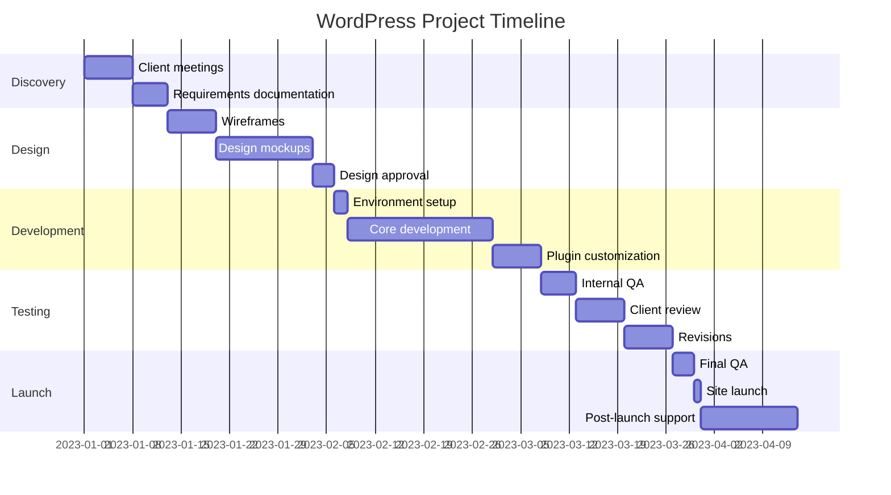

# WordPress Project Planning

Building successful WordPress websites requires more than just technical skills. Proper planning is the foundation of any successful WordPress project, whether you're building a simple blog or a complex e-commerce platform. In this guide, we'll explore the essential steps and methodologies for planning WordPress projects that delight clients and avoid common pitfalls.

## Why Project Planning Matters

Before diving into WordPress development, taking time to plan your project thoroughly can:

- Reduce scope creep and unexpected changes
- Set clear expectations with clients
- Create realistic timelines and budgets
- Identify potential challenges early
- Ensure all requirements are addressed

Poor planning often leads to missed deadlines, budget overruns, and unhappy clients.

## The WordPress Project Planning Process

### 1. Initial Discovery Phase

Every successful WordPress project begins with understanding the client's needs, goals, and vision.

#### Key discovery questions:

- What is the primary purpose of the website?
- Who is the target audience?
- What are the main business goals for the website?
- What specific functionality is required?
- What is the client's budget and timeline?
- Who will manage content after launch?

**Pro Tip:** Create a standardized discovery questionnaire to ensure you gather all necessary information consistently.

```jsx
// Example Discovery Document Structure (in React component form)
function DiscoveryTemplate() {
  return (
    <div className="discovery-doc">
      <h2>Client Discovery Document</h2>
      
      <section>
        <h3>Business Information</h3>
        <ul>
          <li>Company name</li>
          <li>Industry/sector</li>
          <li>Key stakeholders</li>
          <li>Current website URL (if applicable)</li>
        </ul>
      </section>
      
      <section>
        <h3>Project Goals</h3>
        <ul>
          <li>Primary website purpose</li>
          <li>Business objectives</li>
          <li>Success metrics</li>
        </ul>
      </section>
      
      {/* Additional sections would follow */}
    </div>
  );
}
```

### 2. Requirements Gathering & Documentation

After the initial discovery, document detailed requirements for the project. This serves as a reference point throughout development and helps prevent scope creep.

#### Components to document:

- **Site Structure:** Pages, navigation, content hierarchy
- **Design Requirements:** Brand guidelines, mood boards, design preferences
- **Functional Requirements:** Forms, e-commerce features, membership areas, etc.
- **Technical Requirements:** Hosting environment, integrations, performance needs
- **Content Requirements:** Content creation responsibilities, migration needs

**Sample Requirements Document Structure:**

```jsx
// This represents a structured requirements document approach
const projectRequirements = {
  siteStructure: {
    pages: ['Home', 'About', 'Services', 'Blog', 'Contact'],
    navigation: {
      primary: ['Home', 'Services', 'About', 'Contact'],
      footer: ['Privacy Policy', 'Terms of Service', 'Sitemap']
    },
    contentHierarchy: {
      /* Content structure details */
    }
  },
  functionalRequirements: [
    {
      feature: 'Contact Form',
      description: 'Multi-step form with validation and email notifications',
      priority: 'High',
      notes: 'Integration with CRM required'
    },
    // More features...
  ],
  // Additional requirement categories...
};
```

### 3. Project Scoping & Timeline Creation

With requirements documented, create a detailed project scope and timeline:

#### Scope Definition:

- Clearly define what is included in the project
- Explicitly state what is NOT included
- Document assumptions made during planning
- Outline the change request process

#### Timeline Creation:

Break the project into phases with specific milestones:



### 4. Technology Stack Planning

WordPress projects require careful selection of themes, plugins, and hosting solutions:

#### Theme Selection Options:

1. **Pre-built theme:** Fastest approach but less customization
2. **Custom theme:** Complete control but higher cost
3. **Starter theme:** Middle ground with frameworks like Underscores or GeneratePress

#### Plugin Considerations:

- Research plugin reliability and support
- Consider performance impact
- Evaluate licensing costs
- Check compatibility with other selected plugins

```jsx
// Example plugin evaluation scorecard approach
function evaluatePlugin(pluginName, criteria) {
  const scorecard = {
    name: pluginName,
    activeInstalls: criteria.activeInstalls || 0,
    lastUpdated: criteria.lastUpdated || '2023-01-01',
    ratings: criteria.ratings || 0,
    performance: criteria.performance || 'unknown',
    compatibility: criteria.compatibility || [],
    cost: criteria.cost || 0,
    
    // Calculate overall score based on weighted factors
    getOverallScore() {
      // Implementation would calculate a weighted score
      return (this.ratings * 0.3) + (/* other weighted factors */);
    }
  };
  
  return scorecard;
}
```

### 5. Content Planning

Content is often the most overlooked aspect of WordPress projects but crucial for success:

- Create a content inventory for existing sites
- Develop a content creation schedule
- Define content migration strategy
- Establish content governance policies
- Plan for SEO optimization

**Content Planning Matrix Example:**

| Page | Content Type | Word Count | Images | Responsibility | Deadline | Status |
|------|-------------|------------|--------|----------------|----------|--------|
| Home | Copy + Media | ~500 words | 5 | Client | Jan 15 | In Progress |
| About | Copy + Team | ~800 words | 10 | Agency | Jan 20 | Not Started |
| Services | Service Details | ~1200 words | 6 | Client | Jan 25 | Not Started |

### 6. Budget Planning

Break down costs to provide transparency and avoid surprises:

- Discovery and planning costs
- Design costs
- Development costs
- Content creation costs
- Testing and QA costs
- Hosting and maintenance costs
- Contingency budget (typically 10-20%)

## Project Planning Tools for WordPress Projects

Effective WordPress project planning leverages tools to streamline processes:

### 1. Project Management Tools

- **Asana or Trello:** For task management and team collaboration
- **Jira:** For more complex projects with detailed workflows
- **ClickUp:** For comprehensive project management with time tracking

### 2. Documentation & Communication Tools

- **Google Workspace:** For collaborative documents and spreadsheets
- **Notion:** For centralized project wikis and knowledge bases
- **Slack:** For team communication

### 3. WordPress-Specific Planning Tools

- **Local:** For local WordPress development environments
- **WP Staging:** For creating staging sites
- **WP Migrate DB Pro:** For database migrations between environments

## Real-World WordPress Project Planning Example

Let's walk through a simplified example of planning a WordPress e-commerce site:

### Initial Client Brief

A small boutique wants to sell handmade products online with 50-100 products. They need a user-friendly backend for managing inventory and orders.

### Project Plan Development

**1. Discovery Findings:**
- Target audience: craft enthusiasts aged 25-45
- Need for custom product categories and attributes
- Desire for integration with their existing email marketing platform
- Budget constraint of $5,000
- Timeline requirement of 8 weeks

**2. Proposed Solution:**
- WordPress with WooCommerce
- Custom product templates for showcasing handmade items
- Integration with Mailchimp for email marketing
- Mobile-responsive design with focus on product photography

**3. Project Timeline:**

```jsx
// Sample timeline approach in structured format
const projectTimeline = [
  {
    phase: 'Discovery',
    tasks: ['Client interviews', 'Requirements documentation', 'Platform research'],
    duration: '1 week',
    deliverables: ['Project requirements doc', 'Initial site architecture']
  },
  {
    phase: 'Design',
    tasks: ['Wireframes', 'Style guides', 'Homepage mockup', 'Product page mockup'],
    duration: '2 weeks',
    deliverables: ['Approved design mockups', 'Style guide']
  },
  {
    phase: 'Development',
    tasks: ['WooCommerce setup', 'Theme development', 'Plugin configuration'],
    duration: '3 weeks',
    deliverables: ['Functional store on staging site']
  },
  // More phases would follow...
];
```

**4. Risk Mitigation Plan:**

- Weekly client check-ins to ensure alignment
- Staged approval process for design and development
- Detailed testing plan for e-commerce functionality
- Training documentation for client team

## Common WordPress Project Planning Pitfalls

Avoid these common mistakes in your WordPress project planning:

1. **Underestimating content migration time:** Content migration always takes longer than expected
2. **Ignoring mobile responsiveness:** Plan for mobile-first design
3. **Plugin overload:** More plugins means more potential conflicts and security issues
4. **Neglecting post-launch considerations:** Maintenance, updates, and security need planning
5. **Insufficient client training:** Plan time for properly training clients on their new site

## Implementing a Project Planning System

For agencies or freelancers working on multiple WordPress projects, create standardized planning processes:

```jsx
// Example project planning workflow
function WordPressProjectWorkflow() {
  return (
    <ol className="project-workflow">
      <li>
        <h3>Discovery Meeting</h3>
        <ul>
          <li>Send pre-meeting questionnaire</li>
          <li>Conduct initial requirements gathering</li>
          <li>Document client goals and constraints</li>
        </ul>
      </li>
      <li>
        <h3>Proposal & Contract</h3>
        <ul>
          <li>Develop detailed scope document</li>
          <li>Create timeline with milestones</li>
          <li>Draft and send contract</li>
        </ul>
      </li>
      <li>
        <h3>Project Setup</h3>
        <ul>
          <li>Create project in project management tool</li>
          <li>Set up development environment</li>
          <li>Schedule kickoff meeting</li>
        </ul>
      </li>
      {/* Additional steps would follow */}
    </ol>
  );
}
```

## Summary

Effective WordPress project planning sets the foundation for successful website implementations. By following a structured approach that covers discovery, requirements gathering, technology selection, content planning, and proper budgeting, you can significantly increase your project success rates.

Remember that planning is not a one-time activity but an ongoing process throughout the project lifecycle. Regular check-ins against your plan help identify issues early and keep projects on track.

## Additional Resources

To further enhance your WordPress project planning skills:

1. **Templates to create:**
   - Client discovery questionnaire
   - WordPress project scope document
   - Content inventory spreadsheet
   - Plugin evaluation matrix

2. **Exercises:**
   - Create a complete project plan for a fictional WordPress website
   - Develop a risk mitigation strategy for common WordPress project challenges
   - Build a timeline template you can adapt for different types of WordPress projects

3. **Project Planning Practice:**
   - Take an existing WordPress website and reverse-engineer a project plan
   - Role-play a discovery meeting with a colleague
   - Create a template for WordPress project proposals

By mastering WordPress project planning, you'll deliver more successful projects, build stronger client relationships, and create more profitable WordPress businesses.