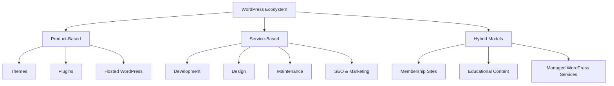

# WordPress Business Models

## Introduction

WordPress powers over 40% of all websites on the internet, creating an enormous ecosystem of businesses and opportunities. As a beginner in the WordPress space, understanding the various business models can help you identify where to focus your skills and how to monetize your WordPress knowledge.

In this guide, we'll explore the most common and profitable WordPress business models, examining how each works, what skills they require, their potential profitability, and how to get started.

## WordPress Business Ecosystem Overview

WordPress's open-source nature has created a diverse ecosystem of complementary businesses:



Let's dive into each of these business models in detail.

## Product-Based WordPress Business Models

### 1. WordPress Theme Development

Themes are the visual foundation of WordPress websites, controlling how content looks and is displayed to visitors.

#### Business Model:

- **Revenue Streams**: One-time sales, annual subscriptions, lifetime access
- **Target Market**: Website owners, designers, developers, agencies
- **Pricing Range**: $39-$249 per theme or $99-$299 for theme collections/yearly access
- **Distribution**: Your own website, ThemeForest, WordPress.org (free themes with upsell)

#### Getting Started:

1. Learn theme development fundamentals
2. Study successful theme businesses (Elegant Themes, StudioPress, Astra)
3. Identify a niche or unique selling proposition
4. Create a high-quality theme with comprehensive documentation
5. Set up marketing and distribution channels

#### Code Example: Basic Theme Structure

```php
// Theme's functions.php file
function mytheme_setup() {
    // Add theme support
    add_theme_support('post-thumbnails');
    add_theme_support('title-tag');
    add_theme_support('custom-logo', array(
        'height'      => 100,
        'width'       => 400,
        'flex-width'  => true,
        'flex-height' => true,
    ));
    
    // Register navigation menus
    register_nav_menus(array(
        'primary' => __('Primary Menu', 'mytheme'),
        'footer'  => __('Footer Menu', 'mytheme'),
    ));
}
add_action('after_setup_theme', 'mytheme_setup');

// Enqueue styles and scripts
function mytheme_scripts() {
    wp_enqueue_style('mytheme-style', get_stylesheet_uri());
    wp_enqueue_script('mytheme-navigation', get_template_directory_uri() . '/js/navigation.js', array(), '1.0', true);
}
add_action('wp_enqueue_scripts', 'mytheme_scripts');
```

### 2. WordPress Plugin Development

Plugins extend the functionality of WordPress, allowing users to add features without modifying core code.

#### Business Model:

- **Revenue Streams**: Freemium (free + paid upgrades), premium only, annual subscriptions
- **Target Market**: Website owners, businesses, agencies, developers
- **Pricing Range**: $29-$299 per year, depending on complexity and value
- **Distribution**: WordPress.org (free/freemium), your own website, marketplaces like CodeCanyon

#### Getting Started:

1. Identify a problem to solve or functionality to add
2. Learn plugin development basics
3. Build an MVP (minimum viable product)
4. Set up support, documentation, and marketing infrastructure
5. Launch and iterate based on user feedback

#### Code Example: Basic Plugin Structure

```php
<?php
/**
 * Plugin Name: My Example Plugin
 * Plugin URI: https://example.com
 * Description: A simple plugin demonstrating plugin structure
 * Version: 1.0
 * Author: Your Name
 * Author URI: https://yourwebsite.com
 * Text Domain: my-example-plugin
 */

// If this file is called directly, abort.
if (!defined('WPINC')) {
    die;
}

// Define plugin constants
define('MY_PLUGIN_VERSION', '1.0.0');
define('MY_PLUGIN_PATH', plugin_dir_path(__FILE__));
define('MY_PLUGIN_URL', plugin_dir_url(__FILE__));

// Include core plugin class
require_once MY_PLUGIN_PATH . 'includes/class-my-plugin.php';

// Activation and deactivation hooks
function activate_my_plugin() {
    // Code to run on plugin activation
}

function deactivate_my_plugin() {
    // Code to run on plugin deactivation
}

register_activation_hook(__FILE__, 'activate_my_plugin');
register_deactivation_hook(__FILE__, 'deactivate_my_plugin');

// Initialize the plugin
function run_my_plugin() {
    $plugin = new My_Plugin();
    $plugin->run();
}
run_my_plugin();
```

### 3. WordPress Hosting

Offering specialized WordPress hosting services can be a lucrative business model, particularly for those with server management experience.

#### Business Model:

- **Revenue Streams**: Monthly or annual subscriptions
- **Target Market**: WordPress site owners, businesses, agencies
- **Pricing Range**: $5-$500+ monthly depending on service level
- **Unique Selling Points**: WordPress optimization, security, speed, managed updates

#### Getting Started:

1. Gain server management and WordPress technical expertise
2. Choose between reseller hosting or building your own infrastructure
3. Develop value-added services (backups, staging, security)
4. Create clear service tiers and pricing
5. Set up a support system and knowledge base

## Service-Based WordPress Business Models

### 1. WordPress Development Services

Building custom WordPress websites or implementing specific features for clients.

#### Business Model:

- **Revenue Streams**: Project-based fees, hourly rates, retainers
- **Target Market**: Small businesses, agencies, enterprise clients
- **Pricing Range**: $1,000-$100,000+ per project or $50-$200+ per hour
- **Services**: Custom theme development, plugin customization, website builds, e-commerce implementation

#### Getting Started:

1. Build a portfolio showcasing your WordPress development skills
2. Define your service offerings and pricing structure
3. Create case studies of successful projects
4. Set up a client onboarding and project management process
5. Develop a network for referrals or explore freelance platforms

#### Code Example: Custom Client Function

```php
/**
 * Add custom functionality for a specific client project
 */
function client_custom_post_type() {
    $args = array(
        'labels' => array(
            'name'               => __('Products', 'client-textdomain'),
            'singular_name'      => __('Product', 'client-textdomain'),
            'add_new'            => __('Add New', 'client-textdomain'),
            'add_new_item'       => __('Add New Product', 'client-textdomain'),
            'edit_item'          => __('Edit Product', 'client-textdomain'),
            'new_item'           => __('New Product', 'client-textdomain'),
            'view_item'          => __('View Product', 'client-textdomain'),
            'search_items'       => __('Search Products', 'client-textdomain'),
            'not_found'          => __('No products found', 'client-textdomain'),
            'not_found_in_trash' => __('No products found in Trash', 'client-textdomain')
        ),
        'public'      => true,
        'has_archive' => true,
        'menu_icon'   => 'dashicons-cart',
        'rewrite'     => array('slug' => 'products'),
        'supports'    => array('title', 'editor', 'thumbnail', 'excerpt')
    );
    
    register_post_type('product', $args);
}
add_action('init', 'client_custom_post_type');
```

### 2. WordPress Maintenance Services

Ongoing maintenance and support for WordPress websites.

#### Business Model:

- **Revenue Streams**: Monthly or annual subscriptions
- **Target Market**: Business website owners, bloggers, small agencies
- **Pricing Range**: $50-$500+ per month per site
- **Services**: Updates, backups, security monitoring, performance optimization, content updates

#### Getting Started:

1. Define your maintenance packages and service levels
2. Set up systems for monitoring and managing multiple sites
3. Create educational resources about the importance of maintenance
4. Consider using tools like ManageWP, MainWP, or InfiniteWP
5. Develop a recurring billing system

#### Code Example: Site Monitoring Function

```php
/**
 * Basic site health monitoring function
 * Note: In a real maintenance business, you'd likely use more sophisticated tools
 */
function check_site_health() {
    $health_issues = array();
    
    // Check WordPress version
    $wp_version = get_bloginfo('version');
    if (version_compare($wp_version, '5.8', '<')) {
        $health_issues[] = "WordPress is outdated (version $wp_version)";
    }
    
    // Check PHP version
    if (version_compare(PHP_VERSION, '7.4', '<')) {
        $health_issues[] = "PHP is outdated (version " . PHP_VERSION . ")";
    }
    
    // Check plugins for updates
    $plugins_need_update = get_plugin_updates();
    if (!empty($plugins_need_update)) {
        $health_issues[] = count($plugins_need_update) . " plugins need updates";
    }
    
    // Check themes for updates
    $themes_need_update = get_theme_updates();
    if (!empty($themes_need_update)) {
        $health_issues[] = count($themes_need_update) . " themes need updates";
    }
    
    return $health_issues;
}
```

### 3. WordPress SEO and Marketing Services

Helping WordPress website owners improve their search engine rankings and digital marketing.

#### Business Model:

- **Revenue Streams**: Monthly retainers, project-based fees, performance-based
- **Target Market**: Small to medium businesses, e-commerce sites
- **Pricing Range**: $500-$5,000+ per month
- **Services**: SEO audits, content optimization, technical SEO, digital marketing strategy

#### Getting Started:

1. Develop expertise in WordPress SEO (Yoast, Rank Math, etc.)
2. Create case studies showing measurable results
3. Define your service packages and deliverables
4. Set up tracking and reporting systems
5. Build a network of referral partners

## Hybrid WordPress Business Models

### 1. Membership Sites

Creating premium content or services available through a subscription model.

#### Business Model:

- **Revenue Streams**: Monthly or annual subscriptions
- **Target Market**: Specific niche audiences (developers, designers, business owners)
- **Pricing Range**: $10-$100+ per month
- **Content Types**: Tutorials, themes, plugins, resources, community access

#### Getting Started:

1. Identify your niche and target audience
2. Choose a WordPress membership plugin (MemberPress, Restrict Content Pro, etc.)
3. Create valuable content or resources that warrant a subscription
4. Set up a content creation calendar and delivery system
5. Develop a marketing strategy to attract subscribers

#### Code Example: Basic Membership Content Restriction

```php
/**
 * Basic example of content restriction for members only
 * Note: In practice, you'd use a membership plugin like MemberPress
 */
function restrict_premium_content($content) {
    global $post;
    
    // Check if this post should be restricted
    $restrict_content = get_post_meta($post->ID, 'restrict_to_members', true);
    
    if ($restrict_content && !is_user_logged_in()) {
        $content = '<div class="restricted-content">
            <h3>This content is for members only</h3>
            <p>Please <a href="' . wp_login_url(get_permalink()) . '">login</a> or 
            <a href="/membership-signup/">sign up</a> to access this content.</p>
        </div>';
    }
    
    return $content;
}
add_filter('the_content', 'restrict_premium_content');
```

### 2. WordPress Education Business

Teaching WordPress through online courses, workshops, or coaching.

#### Business Model:

- **Revenue Streams**: Course sales, coaching fees, books, speaking engagements
- **Target Market**: WordPress beginners, aspiring developers, business owners
- **Pricing Range**: $19-$997+ for courses, $75-$250+ per hour for coaching
- **Delivery Methods**: Online courses, webinars, in-person workshops, books

#### Getting Started:

1. Identify your teaching specialty and target audience
2. Create a curriculum and learning materials
3. Choose a course platform (LearnDash, LifterLMS, Teachable)
4. Develop marketing materials and testimonials
5. Build an email list and content marketing strategy

## Real-World Case Studies

### Theme Business: Elegant Themes

Elegant Themes started as a single developer creating WordPress themes and evolved into a major player in the WordPress ecosystem with their Divi theme and page builder.

**Key Success Factors:**
- Focus on user experience and visual design
- Evolution from individual themes to a comprehensive platform
- Subscription model with lifetime access option
- Strong support and community building
- Continuous innovation and feature updates

### Plugin Business: WPForms

WPForms began as a user-friendly form builder plugin and grew into a multimillion-dollar business.

**Key Success Factors:**
- Identified pain point (complex form builders)
- Freemium model with clear upgrade path
- Focus on user experience over technical complexity
- Strategic marketing partnerships
- Excellent documentation and support

### Service Business: WP Buffs

WP Buffs provides white-label WordPress maintenance services for agencies and website owners.

**Key Success Factors:**
- Clear service packages with transparent pricing
- White-label options for agencies to resell
- 24/7 support as a key differentiator
- Educational content marketing
- Strategic partnerships with WordPress hosts and product companies

## Selecting the Right WordPress Business Model

When choosing your WordPress business model, consider:

1. **Your Skills**: Which areas of WordPress are you most proficient in?
2. **Time Investment**: Product businesses require upfront work with passive income later; service businesses provide immediate income but require ongoing time investment
3. **Capital Requirements**: Some models require more upfront investment than others
4. **Scalability Goals**: Some models (like products) scale better than others
5. **Market Demand**: Research current and future demand for your offering
6. **Competition**: Assess the competitive landscape and your unique value proposition
7. **Passion and Interest**: Choose a model you'll remain motivated to work on

## Common Challenges and Solutions

### Challenge: Competition in a Saturated Market

**Solution:**
- Find a specific niche or underserved market segment
- Differentiate through superior quality, support, or unique features
- Build strategic partnerships to reach new audiences
- Focus on a specific industry vertical with specialized needs

### Challenge: Keeping Up with WordPress Changes

**Solution:**
- Allocate regular time for learning and staying current
- Participate in WordPress communities and events
- Follow WordPress development blogs and news sites
- Join beta testing programs for early access to changes

### Challenge: Pricing and Value Communication

**Solution:**
- Research competitor pricing for benchmarks
- Focus marketing on outcomes and value, not features
- Use tiered pricing to serve different market segments
- Collect and showcase testimonials and case studies
- Test different price points to find optimal conversion

## Summary

The WordPress ecosystem offers numerous viable business models, each with its own advantages, challenges, and requirements. Whether you choose to create WordPress products like themes and plugins, offer services such as development and maintenance, or pursue hybrid models like education and memberships, success depends on delivering value, understanding your market, and executing effectively.

As you begin your WordPress business journey, remember that many successful entrepreneurs have combined multiple models or evolved from one model to another as their skills, resources, and market understanding grew.

## Additional Resources

- **Books**:
  - "WordPress for Business" by Lisa Sabin-Wilson
  - "The Personal MBA" by Josh Kaufman (general business fundamentals)

- **Online Learning**:
  - WordPress Developer Documentation
  - WP Sessions (WordPress development training)
  - Post Status (industry news and community)

- **Communities**:
  - WordPress.org Forums
  - Post Status Club (professional WordPress community)
  - Local WordPress meetups and WordCamps

## Exercises to Get Started

1. **Market Research**: Identify 3-5 successful WordPress businesses in your area of interest. Analyze their offerings, pricing, and unique selling propositions.

2. **Skills Assessment**: Create a list of your current WordPress-related skills and the skills you would need to develop for your chosen business model.

3. **MVP Planning**: Outline the minimum viable product or service you could launch within 60 days to test your business concept.

4. **Unique Value Proposition**: Write a clear statement explaining why customers should choose your WordPress business over alternatives.

5. **Financial Projection**: Create a simple spreadsheet calculating potential revenue, expenses, and profit for your chosen business model over the first year.

By understanding these various business models and carefully selecting the right approach for your skills and goals, you can build a sustainable and profitable WordPress business in this growing ecosystem.