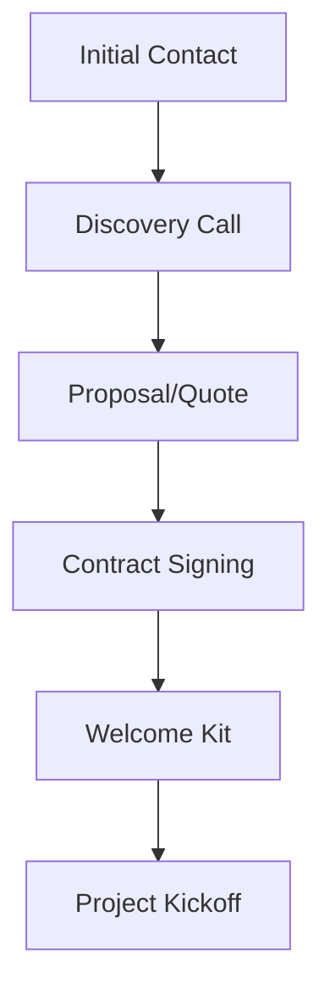
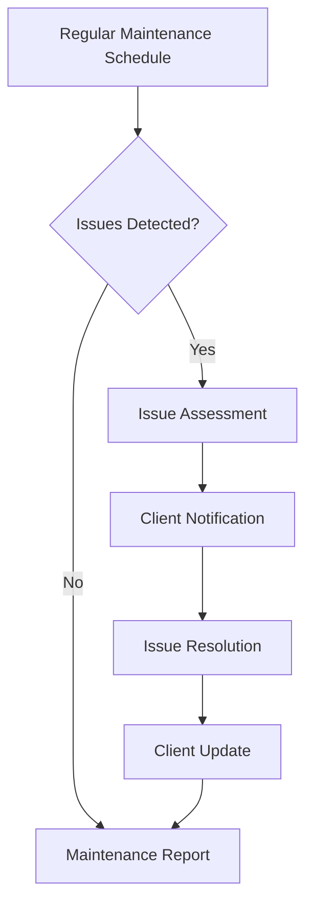

# WordPress Agency Workflows

Running a WordPress agency requires more than just technical knowledge. To succeed and scale, you need well-defined workflows that allow your team to deliver consistent results efficiently. In this guide, we'll explore how to build effective workflows for your WordPress agency business.

## Introduction to Agency Workflows

A workflow is a repeatable sequence of steps that takes a task from initiation to completion. For WordPress agencies, workflows provide structure to client projects, ensure quality, and allow for scalability.

Effective workflows help you:

- Reduce mistakes and inconsistencies
- Optimize resource allocation
- Improve client communication
- Track progress and identify bottlenecks
- Onboard new team members faster

## Core WordPress Agency Workflows

### 1. Client Onboarding

The client onboarding process sets the tone for your relationship. A systematic approach ensures you gather all necessary information and set clear expectations.



#### Key Components:

1. **Client Questionnaire**: Create a standardized form to collect project requirements.

```jsx
// Example React component for a client questionnaire form
function ClientQuestionnaire() {
  return (
    <form>
      <h2>Website Project Questionnaire</h2>
      
      <div className="form-group">
        <label htmlFor="businessGoals">What are your business goals for this website?</label>
        <textarea id="businessGoals" rows="4"></textarea>
      </div>
      
      <div className="form-group">
        <label htmlFor="targetAudience">Describe your target audience:</label>
        <textarea id="targetAudience" rows="4"></textarea>
      </div>
      
      <div className="form-group">
        <label>What functionality do you need?</label>
        <div className="checkbox-group">
          <input type="checkbox" id="ecommerce" /> <label htmlFor="ecommerce">E-commerce</label><br />
          <input type="checkbox" id="blog" /> <label htmlFor="blog">Blog</label><br />
          <input type="checkbox" id="membership" /> <label htmlFor="membership">Membership area</label><br />
          <input type="checkbox" id="booking" /> <label htmlFor="booking">Booking system</label>
        </div>
      </div>
      
      <button type="submit">Submit</button>
    </form>
  );
}
```

2. **Welcome Package**: Create a standardized welcome email or kit that includes:
   - Introduction to your team members
   - Communication channels and availability
   - Project timeline and milestones
   - Next steps

3. **Client Education**: Brief introduction to your workflow, tools, and how clients can provide feedback.

### 2. Website Development Workflow

Having a standardized development process ensures consistency across projects and team members.


#### Step-by-Step Process:

1. **Planning & Requirements Gathering**
   - Define project scope
   - Create sitemap
   - Identify functionality requirements

2. **Design Phase**
   - Wireframing
   - Mockups for key pages
   - Client approval checkpoint

3. **Development Environment Setup**

```bash
# Example for setting up a local development environment
# Create a new project with Local by Flywheel (command line interface)
$ local-lightning create --name "ClientName" --blueprint "custom"

# Or with WP-CLI
$ wp core download
$ wp config create --dbname=client_site --dbuser=root --dbpass=root
$ wp core install --url=localhost:8000 --title="Client Site" --admin_user=admin --admin_password=password --admin_email=your@email.com
```

4. **Theme Development or Customization**
   - Start with a base theme or framework
   - Implement design as per approved mockups
   - Add custom functionality

5. **Plugin Selection and Configuration**
   
```bash
# Example of plugin installation with WP-CLI
$ wp plugin install wordpress-seo --activate
$ wp plugin install advanced-custom-fields --activate
$ wp plugin install wordfence --activate
```

6. **Content Integration**
   - Import client content
   - Optimize images and media
   - SEO implementation

7. **Quality Assurance Testing**
   - Cross-browser testing
   - Mobile responsiveness
   - Functionality testing
   - Performance optimization

8. **Client Review and Revisions**
   - Structured feedback collection
   - Revision tracking system

### 3. Website Launch Workflow

A methodical launch process reduces the risk of issues going live.

#### Pre-Launch Checklist:

```jsx
// Example React component for a launch checklist
function LaunchChecklist() {
  return (
    <div className="launch-checklist">
      <h3>Pre-Launch Checklist</h3>
      <ul>
        <li>
          <input type="checkbox" id="favicon" />
          <label htmlFor="favicon">Favicon uploaded and displaying correctly</label>
        </li>
        <li>
          <input type="checkbox" id="forms" />
          <label htmlFor="forms">All forms tested and working</label>
        </li>
        <li>
          <input type="checkbox" id="links" />
          <label htmlFor="links">All internal and external links verified</label>
        </li>
        <li>
          <input type="checkbox" id="seo" />
          <label htmlFor="seo">SEO meta tags in place</label>
        </li>
        <li>
          <input type="checkbox" id="analytics" />
          <label htmlFor="analytics">Analytics tracking installed</label>
        </li>
        <li>
          <input type="checkbox" id="security" />
          <label htmlFor="security">Security plugins configured</label>
        </li>
        <li>
          <input type="checkbox" id="backup" />
          <label htmlFor="backup">Backup system in place</label>
        </li>
        <li>
          <input type="checkbox" id="performance" />
          <label htmlFor="performance">Performance optimization completed</label>
        </li>
        <li>
          <input type="checkbox" id="browser" />
          <label htmlFor="browser">Cross-browser compatibility verified</label>
        </li>
        <li>
          <input type="checkbox" id="mobile" />
          <label htmlFor="mobile">Mobile responsiveness confirmed</label>
        </li>
      </ul>
    </div>
  );
}
```

#### Launch Procedure:

1. **Final Backup**: Create full backup of development site
2. **DNS Update**: Change or update DNS records
3. **SSL Certificate**: Ensure SSL is properly installed
4. **Verify Site**: Check live site functionality
5. **Post-Launch Monitoring**: Monitor for 24-48 hours for any issues

### 4. Client Handover and Training

A smooth handover ensures clients can effectively manage their website.

#### Components:

1. **Documentation**: Create custom documentation for the client's specific site setup

```jsx
// Example documentation structure (could be compiled as PDF or online resource)
const ClientDocumentation = {
  sections: [
    {
      title: "Logging In",
      content: "Access your WordPress dashboard at yourdomain.com/wp-admin using the credentials provided separately."
    },
    {
      title: "Managing Pages",
      content: "To edit existing pages, navigate to Pages > All Pages in your dashboard sidebar...",
      screenshots: ["login-screen.jpg", "pages-section.jpg"]
    },
    {
      title: "Blog Management",
      content: "Creating new blog posts is simple. Go to Posts > Add New...",
      screenshots: ["add-new-post.jpg"]
    },
    {
      title: "Media Library",
      content: "Add and manage images, PDFs and other media through the Media Library...",
      screenshots: ["media-library.jpg"]
    }
  ]
};
```

2. **Training Session**: Schedule a live training call covering:
   - Dashboard overview
   - Content editing
   - Media management
   - Basic SEO practices
   - Specific functionality for their site

3. **Video Tutorials**: Create screen recordings for common tasks

4. **Support Plan**: Outline post-launch support options

### 5. Maintenance and Support Workflow

Ongoing maintenance creates recurring revenue and ensures site longevity.



#### Maintenance Tasks:

```jsx
// Example maintenance tracking system
const MaintenanceTasks = {
  weekly: [
    { task: "Backup website files and database", priority: "High" },
    { task: "Check for plugin updates", priority: "Medium" },
    { task: "Scan for malware", priority: "High" }
  ],
  monthly: [
    { task: "Apply WordPress core updates", priority: "High" },
    { task: "Update plugins and themes", priority: "Medium" },
    { task: "Performance optimization check", priority: "Medium" },
    { task: "Broken link check", priority: "Low" }
  ],
  quarterly: [
    { task: "Database optimization", priority: "Medium" },
    { task: "Review security settings", priority: "High" },
    { task: "SEO performance review", priority: "Medium" },
    { task: "Analytics review with client", priority: "Low" }
  ]
};
```

## Workflow Management Tools

Implementing your workflows requires the right tools:

1. **Project Management Systems**:
   - Asana
   - Trello
   - ClickUp
   - Monday.com

2. **Client Communication**:
   - Slack
   - Basecamp
   - Email management systems

3. **Development Tools**:
   - Git repositories (GitHub, Bitbucket)
   - Local development environments (Local, DevKinsta)
   - Staging environments

4. **Documentation Systems**:
   - Google Docs
   - Notion
   - Process Street

## Implementing Agency Workflows in Real-World Scenarios

### Case Study: Agency X - Website Redesign Project

Agency X applied their streamlined workflow to a website redesign project for a local restaurant:

1. **Client Onboarding**:
   - Initial discovery call identified key business goals: online ordering, reservation system, showcase for new menu items
   - Detailed questionnaire gathered brand assets, preferences, and technical requirements
   - Welcome kit provided a clear timeline and communication structure

2. **Development Workflow**:
   - Planning phase created a content-first approach with sitemap and wireframes
   - Design mockups for home, menu, and reservation pages were approved before development
   - Development used a component-based approach with Gutenberg blocks for easy client editing
   - QA testing identified and fixed issues with mobile menu display

3. **Launch Process**:
   - Pre-launch checklist verified all functionality
   - Launch was scheduled during off-peak hours
   - DNS propagation was monitored and verified
   - Post-launch testing ensured reservation system and online ordering worked properly

4. **Client Training**:
   - Custom documentation was created for the restaurant staff
   - Training session showed how to update menu items and manage reservations
   - Video tutorials were provided for reference
   - Support system was configured with priority response for ordering system issues

### Implementation Tips for Your Agency

1. **Start Small**: Begin with documenting your most critical processes.
2. **Get Team Buy-In**: Involve your team in workflow creation to ensure adoption.
3. **Use Templates**: Create reusable assets for common project components.
4. **Track Metrics**: Monitor key performance indicators like project completion time.
5. **Iterative Improvement**: Regularly review and optimize your workflows based on results.

## Automating Your Agency Workflows

As your agency matures, look for automation opportunities:

```jsx
// Example of an automation script for site setup
// This could be part of a Node.js application that interacts with WP-CLI

const { exec } = require('child_process');

function setupNewClientSite(clientName, domain) {
  // Create new WordPress installation
  exec(`wp core download --path=${clientName}`, (error, stdout, stderr) => {
    if (error) {
      console.error(`Error downloading WordPress: ${error}`);
      return;
    }
    
    // Configure database
    exec(`wp config create --dbname=${clientName} --dbuser=root --dbpass=root --path=${clientName}`, 
      (error, stdout, stderr) => {
        if (error) {
          console.error(`Error creating config: ${error}`);
          return;
        }
        
        // Install WordPress
        exec(`wp core install --url=${domain} --title="${clientName}" --admin_user=admin --admin_password=temppass --admin_email=your@email.com --path=${clientName}`,
          (error, stdout, stderr) => {
            if (error) {
              console.error(`Error installing WordPress: ${error}`);
              return;
            }
            
            // Install agency standard plugins
            exec(`wp plugin install wordpress-seo wordfence advanced-custom-fields --activate --path=${clientName}`, 
              (error, stdout, stderr) => {
                if (error) {
                  console.error(`Error installing plugins: ${error}`);
                  return;
                }
                
                console.log(`Client site for ${clientName} set up successfully!`);
              }
            );
          }
        );
      }
    );
  });
}

// Usage
setupNewClientSite('RestaurantClient', 'restaurant-client.local');
```

## Summary

Effective WordPress agency workflows are the backbone of a profitable and sustainable business. By systematically documenting and optimizing your processes for client onboarding, website development, launch, handover, and maintenance, you'll deliver consistent results and create room for your agency to grow.

Remember that workflows should evolve as your agency gains experience and as technologies change. Regular reviews and refinements will keep your processes efficient and effective.

## Additional Resources

- Implement version control in your workflow with [Git for WordPress Developers](https://example.com)
- Learn more about WordPress project estimation in our [Pricing Strategies for WordPress Projects](https://example.com) guide
- Improve your client communication with our [Client Management for WordPress Agencies](https://example.com) article

## Exercises

1. Document your current workflow for a typical WordPress project from start to finish. Identify any gaps or bottlenecks.

2. Create a client questionnaire template that gathers all necessary information for a WordPress project.

3. Develop a pre-launch checklist tailored to your agency's typical projects.

4. Outline a basic maintenance plan with different tiers of service that you could offer clients.

5. Map out an ideal workflow for a specific type of project (e-commerce site, membership site, etc.) and identify tools that would streamline that process.