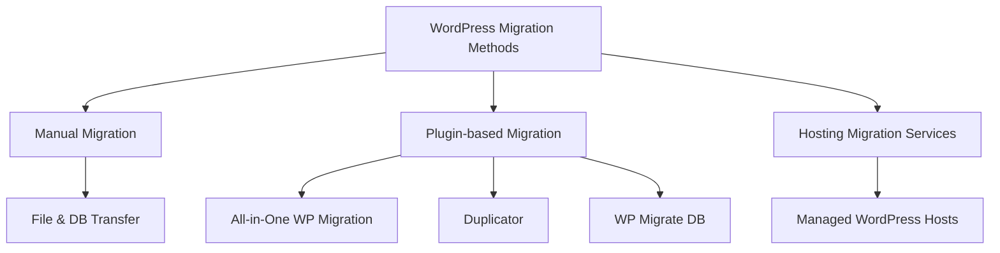

# WordPress Site Migration

## Introduction

Site migration is a critical skill for WordPress professionals. Whether you're moving to a better hosting provider, transferring a local development site to production, or helping a client relocate their online presence, knowing how to properly migrate a WordPress site ensures continuity in your business operations.

In this guide, we'll walk through the entire WordPress site migration process, from preparation to post-migration checks. By the end, you'll have the confidence to move WordPress sites without fear of downtime, data loss, or SEO penalties.

## Why Migrate a WordPress Site?

Before diving into the technical aspects, let's understand common reasons for migrating:

- **Better hosting performance**: Upgrading to faster, more reliable hosting
- **Cost reduction**: Moving to a more affordable hosting solution
- **Scaling needs**: Transitioning from shared hosting to VPS or dedicated servers
- **Development workflow**: Moving from local development to staging or production
- **Domain changes**: Changing the site's primary domain
- **Security concerns**: Moving away from compromised or vulnerable hosting

## Prerequisites

Before starting a migration, ensure you have:

- Access to both source and destination hosting accounts
- FTP/SFTP credentials for both servers
- WordPress admin access
- Database access credentials
- A backup solution in place
- Sufficient disk space on the destination server

## Migration Methods

There are several approaches to WordPress migration:



We'll focus on both manual and plugin-based approaches as they give you the most control and apply to most situations.

## Method 1: Manual Migration

### Step 1: Back Up Your WordPress Site

Always create a complete backup before migration.

```bash
# If you have SSH access, you can tar your WordPress directory
tar -czf wordpress-backup.tar.gz /path/to/wordpress/

# Export your database using mysqldump
mysqldump -u username -p database_name > database-backup.sql
```

### Step 2: Create a Database on the New Host

1. Access your new hosting control panel (cPanel, Plesk, etc.)
2. Find the MySQL/MariaDB database section
3. Create a new database
4. Create a database user
5. Assign the user to the database with all privileges

Example SQL commands if you have direct MySQL access:

```sql
CREATE DATABASE new_wordpress_db;
CREATE USER 'new_wp_user'@'localhost' IDENTIFIED BY 'strong_password';
GRANT ALL PRIVILEGES ON new_wordpress_db.* TO 'new_wp_user'@'localhost';
FLUSH PRIVILEGES;
```

### Step 3: Transfer WordPress Files

Using FTP/SFTP:

1. Download all files from your current host
2. Upload all files to your new host

```bash
# Using scp if you have SSH access
scp -r /path/to/local/wordpress user@new-server:/path/to/destination
```

### Step 4: Import the Database

1. Open phpMyAdmin on your new host
2. Select the new database you created
3. Click the "Import" tab
4. Select your database backup file and import it

Alternatively, use the command line:

```bash
mysql -u new_wp_user -p new_wordpress_db < database-backup.sql
```

### Step 5: Update the wp-config.php File

Edit the `wp-config.php` file on your new host to match the new database details:

```php
// Database settings
define('DB_NAME', 'new_wordpress_db');
define('DB_USER', 'new_wp_user');
define('DB_PASSWORD', 'strong_password');
define('DB_HOST', 'localhost');
```

### Step 6: Update Site URLs in the Database

If you're changing domains, you need to update URLs in the database. You can do this via SQL:

```sql
UPDATE wp_options SET option_value = 'https://newdomain.com' 
WHERE option_name = 'home' OR option_name = 'siteurl';
```

Or by adding these lines temporarily to your wp-config.php:

```php
define('WP_HOME', 'https://newdomain.com');
define('WP_SITEURL', 'https://newdomain.com');
```

### Step 7: Update DNS Settings

If you're moving to a new hosting provider but keeping the same domain:

1. Find the DNS records section in your domain registrar
2. Update the A records to point to your new server's IP address
3. Wait for DNS propagation (can take up to 48 hours)

## Method 2: Using Migration Plugins

### Using Duplicator Plugin

Duplicator is a powerful migration tool that packages your entire WordPress site into a zip file and installer.

1. **Install Duplicator on your source site**:
   Navigate to Plugins → Add New → Search for "Duplicator" → Install and Activate

2. **Create a package**:
   
   - Go to Duplicator → Packages → Create New
   - Follow the wizard, which includes system scan and package build
   - Download both the installer.php file and the archive.zip file

3. **Upload to new host**:
   
   - Upload both files to the root directory of your new host
   - Navigate to `https://newdomain.com/installer.php` in your browser

4. **Follow the installation wizard**:
   
   - The wizard will guide you through database connection setup
   - It will automatically update URLs and paths
   - It will perform a final cleanup

### Using All-in-One WP Migration

This plugin is particularly user-friendly for smaller sites.

1. **Install the plugin** on your source site and destination site

2. **Export your site**:
   
   - Go to All-in-One WP Migration → Export
   - Choose your export method (file, FTP, etc.)
   - Download the export file

3. **Import on new site**:
   
   - Go to All-in-One WP Migration → Import on the new WordPress installation
   - Upload the export file
   - Wait for the import to complete and follow prompts

## Post-Migration Tasks

### 1. Test Your Website Thoroughly

After migration, test all critical functionality:

- Check the frontend for visual issues
- Test all forms and interactive elements
- Verify e-commerce functionality if applicable
- Test login and user registration
- Check media uploads and display

### 2. Update Permalinks

Refresh your permalink structure:

1. Go to Settings → Permalinks
2. Without changing anything, click "Save Changes"

### 3. Clear Cache

Clear all caches to ensure you're seeing the most current version of your site:

- Clear browser cache
- Clear any WordPress caching plugins
- Clear server-level caches (if applicable)
- Clear CDN cache (if applicable)

### 4. Update SSL Settings

If your new site uses HTTPS:

1. Install and configure an SSL certificate on your new host
2. Update your WordPress Address and Site Address to use https://
3. Install a plugin like "Really Simple SSL" to fix mixed content issues

### 5. Configure Email Functionality

Test that emails are being sent correctly:

1. Use a plugin like "Check Email" or "WP Mail SMTP" to test email delivery
2. Configure SMTP settings if necessary

### 6. Update Search Console and Analytics

If you've changed domains:

1. Add the new domain to Google Search Console
2. Update the property settings in Google Analytics
3. Submit a change of address in Search Console

## Special Considerations

### Large Sites

For sites with large databases or file structures:

1. Consider splitting the migration into manageable chunks
2. Use tools like BigDump for importing large SQL files
3. Use rsync for efficient file transfers

```bash
# Example of using rsync for efficient file transfer
rsync -avz --progress /path/to/local/wordpress/ user@new-server:/path/to/destination/
```

### E-commerce Sites

When migrating online stores:

1. Schedule migration during low-traffic periods
2. Test payment gateways thoroughly after migration
3. Verify product inventory synchronization
4. Check order processing end-to-end

### Multisite Networks

When migrating WordPress Multisite:

1. Export each subsite separately if possible
2. Update domain mappings in the wp_blogs and wp_site tables
3. Update any references in wp_sitemeta

## Troubleshooting Common Issues

### White Screen of Death

If you encounter a blank white screen:

1. Enable WP_DEBUG in wp-config.php:

```php
define('WP_DEBUG', true);
define('WP_DEBUG_LOG', true);
define('WP_DEBUG_DISPLAY', false);
```

2. Check the debug.log file for errors

### Database Connection Errors

If you see "Error establishing a database connection":

1. Verify DB_USER, DB_PASSWORD, DB_HOST, and DB_NAME in wp-config.php
2. Check that the database user has the correct permissions
3. Ensure the MySQL server is running

### Mixed Content Warnings

If your browser shows mixed content warnings:

1. Install and activate "Really Simple SSL" or "Better Search Replace"
2. Use Better Search Replace to replace all http:// URLs with https://
3. Check your theme and plugin files for hardcoded http:// URLs

### Broken Images or Links

If images are broken or links don't work:

1. Check file permissions (755 for directories, 644 for files)
2. Verify the file paths in your database aren't hardcoded to the old server
3. Use a plugin like "Better Search Replace" to update file paths

## Best Practices for Smooth Migrations

1. **Always backup first**: Never start a migration without a complete backup
2. **Schedule downtime**: Plan migrations during low-traffic periods
3. **Use a staging site**: Test the migration on a staging site before going live
4. **Document everything**: Keep detailed notes of all changes made during migration
5. **Monitor after migration**: Watch for issues for at least 24-48 hours post-migration

## Summary

WordPress site migration involves careful preparation, methodical execution, and thorough testing. By following the steps in this guide, you can minimize downtime and ensure a smooth transition to your new hosting environment.

Remember that each WordPress site is unique, with its own set of plugins, themes, and customizations. Take the time to understand the specific requirements of your site before beginning the migration process.

## Additional Resources

- [WordPress Codex on Moving WordPress](https://wordpress.org/support/article/moving-wordpress/)
- [Database Search and Replace Script](https://github.com/interconnectit/Search-Replace-DB)
- [WordPress Backups: A Definitive Guide](https://wordpress.org/support/article/wordpress-backups/)

## Practice Exercise

To practice WordPress migration in a safe environment:

1. Set up a local WordPress installation using LocalWP, XAMPP, or Docker
2. Create a simple test site with sample content
3. Set up a second local environment or a staging server
4. Migrate your test site using both manual and plugin methods
5. Document the challenges you encounter and how you resolve them

This hands-on experience will prepare you for real-world migrations with client sites or your own business websites.