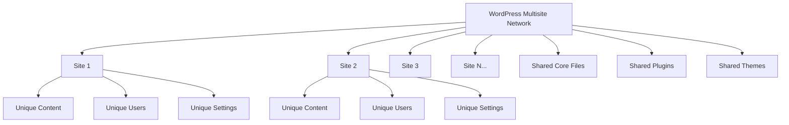

# WordPress Multisite Networks

## Introduction

WordPress Multisite is a powerful feature that allows you to create and manage multiple WordPress websites from a single WordPress installation. Instead of maintaining separate databases and WordPress cores for each site, Multisite lets you control everything from one dashboard while keeping content and user experiences separate.

This feature is particularly valuable for businesses, organizations, and developers who manage multiple websites and want to streamline their workflow, reduce maintenance overhead, and create consistent experiences across their web properties.

## What is WordPress Multisite?

WordPress Multisite is a built-in WordPress feature that transforms a regular WordPress installation into a network of sites. Each site in the network shares the same WordPress core files, plugins, and themes, but has its own content, users, and settings.



### Key Benefits of WordPress Multisite

- **Centralized Management**: Manage all websites from a single dashboard
- **Simplified Updates**: Update WordPress core, plugins, and themes once for all sites
- **Resource Efficiency**: Share server resources across sites
- **Consistent Branding**: Easily maintain brand consistency across multiple properties
- **User Management**: Allow users to access multiple sites with a single account

## When to Use WordPress Multisite

Multisite is ideal for:

1. **Businesses with multiple branches** - Create sites for different locations or departments
2. **Educational institutions** - Provide individual sites for departments, faculty, or student organizations
3. **Web development agencies** - Manage all client sites from one dashboard
4. **Franchises** - Maintain consistent branding across franchisee sites
5. **Multilingual websites** - Create separate sites for different languages

## Setting Up WordPress Multisite

### Prerequisites

Before enabling Multisite, ensure:

- You have a fresh WordPress installation (recommended)
- You have access to modify your site's files (wp-config.php and .htaccess)
- Your host supports WordPress Multisite (most do)
- You're using a compatible permalink structure (not plain)

### Step 1: Enable Multisite in wp-config.php

First, you'll need to add a line to your `wp-config.php` file to enable the Multisite feature:

```php
/* Enable Multisite */
define('WP_ALLOW_MULTISITE', true);
```

Add this line above the `/* That's all, stop editing! Happy publishing. */` comment in your wp-config.php file.

### Step 2: Install the Network

1. After adding the code, log in to your WordPress admin dashboard
2. Go to Tools → Network Setup
3. Choose between subdomains (site1.example.com) or subdirectories (example.com/site1)
4. Enter the network details and click "Install"

You'll receive additional code to add to your `wp-config.php` and `.htaccess` files.

### Step 3: Update Configuration Files

Add the provided code to your `wp-config.php` file, which will look similar to:

```php
define('MULTISITE', true);
define('SUBDOMAIN_INSTALL', false);
define('DOMAIN_CURRENT_SITE', 'example.com');
define('PATH_CURRENT_SITE', '/');
define('SITE_ID_CURRENT_SITE', 1);
define('BLOG_ID_CURRENT_SITE', 1);
```

Then update your `.htaccess` file with the provided rules:

```apache
RewriteEngine On
RewriteBase /
RewriteRule ^index\.php$ - [L]

# add a trailing slash to /wp-admin
RewriteRule ^wp-admin$ wp-admin/ [R=301,L]

RewriteCond %{REQUEST_FILENAME} -f [OR]
RewriteCond %{REQUEST_FILENAME} -d
RewriteRule ^ - [L]
RewriteRule ^(wp-(content|admin|includes).*) $1 [L]
RewriteRule ^(.*\.php)$ $1 [L]
RewriteRule . index.php [L]
```

### Step 4: Log Back In

After making these changes, you'll be logged out. Log back in to access your new network dashboard.

## Managing Your Multisite Network

### Network Admin Dashboard

As a network administrator, you'll now have access to a new "Network Admin" section in your WordPress dashboard. This is where you'll manage network-wide settings, sites, users, themes, and plugins.

To access the Network Admin dashboard, click on "My Sites" in the top admin bar, then select "Network Admin".

### Creating New Sites

To add a new site to your network:

1. Go to Network Admin → Sites → Add New
2. Enter the site's address, title, and admin email
3. Click "Add Site"

```php
// Programmatically create a new site
$blog_id = wpmu_create_blog(
    'site2.example.com',   // Domain
    '/',                   // Path
    'Site Title',          // Title
    get_current_user_id(), // User ID
    array(                 // Meta
        'public' => 1
    ),
    1                      // Network ID
);
```

### Managing Users

Users can be added network-wide or to specific sites:

1. Network-wide users: Network Admin → Users → Add New
2. Site-specific users: Go to individual site dashboard → Users → Add New

```php
// Add an existing user to a site
add_user_to_blog(
    $blog_id,        // Blog/Site ID
    $user_id,        // User ID
    'administrator'  // Role
);
```

### Managing Themes

In Multisite, themes can be:

- **Network Activated**: Available to all sites
- **Available**: Sites can choose to activate them
- **Not Available**: Hidden from site administrators

To manage themes:

1. Go to Network Admin → Themes
2. Click "Network Enable" for themes you want to make available
3. Themes can be individually activated on per-site basis

### Managing Plugins

Plugins in Multisite can be:

- **Network Activated**: Active on all sites (can't be deactivated by site admins)
- **Not Network Activated**: Site admins can choose to activate them
- **Network Only**: Only visible to network admins (useful for multisite-specific plugins)

To network activate a plugin:

1. Go to Network Admin → Plugins
2. Click "Network Activate" for the desired plugin

## Advanced Multisite Management

### Domain Mapping

Domain mapping allows sites in your network to use custom domains instead of subdomains or subdirectories. For example, site1.example.com can be mapped to customdomain.com.

There are several plugins that can help with domain mapping:

- WordPress MU Domain Mapping (legacy)
- Mercator (modern alternative)
- WP Multi Network

### Shared Content Across Sites

While sites in a multisite network are independent, you may want to share content between them. Here are some methods:

1. **RSS Feeds**: Display content from other sites using RSS widgets
2. **REST API**: Query content from other sites programmatically
3. **Multisite Content Copier**: Use plugins to copy content between sites

Example of using REST API to get posts from another site in the network:

```php
function get_posts_from_network_site($site_id = 2) {
    // Switch to the target site
    switch_to_blog($site_id);
    
    // Get the 5 most recent posts
    $posts = get_posts(array(
        'numberposts' => 5,
        'post_status' => 'publish'
    ));
    
    // Restore to the current site
    restore_current_blog();
    
    return $posts;
}

// Display posts from site ID 2
$network_posts = get_posts_from_network_site(2);
foreach ($network_posts as $post) {
    echo '<h3>' . $post->post_title . '</h3>';
    echo '<div>' . wp_trim_words($post->post_content, 30) . '</div>';
}
```

### Network-wide Settings

Some settings should be consistent across all sites. You can enforce network-wide settings using the `wp-config.php` file or by creating a custom plugin.

Example of enforcing a specific theme across all sites:

```php
function enforce_network_theme() {
    // Only run on site dashboards, not network admin
    if (is_network_admin()) {
        return;
    }
    
    $allowed_themes = array('twentytwentytwo');
    $current_theme = get_option('stylesheet');
    
    if (!in_array($current_theme, $allowed_themes)) {
        switch_theme('twentytwentytwo');
    }
}
add_action('admin_init', 'enforce_network_theme');
```

## Real-World Examples

### Example 1: University Website Network

A university might use WordPress Multisite to create:

- Main university website (example.edu)
- Department websites (science.example.edu, arts.example.edu)
- Faculty websites (faculty.example.edu/professor-name)
- Student organization websites (clubs.example.edu/organization-name)

This structure allows for consistent branding while giving departments and organizations autonomy over their content. The university's web team can:

- Enforce security policies network-wide
- Update core WordPress and critical plugins in one place
- Provide a limited set of pre-approved themes
- Establish user roles and permissions across the network

### Example 2: Web Development Agency

A web development agency can use Multisite to:

- Host client websites on a single infrastructure
- Implement centralized monitoring and backups
- Offer tiered hosting packages with different capabilities
- Quickly deploy new sites for clients

The agency could create a custom plugin that adds agency branding to all client dashboards and simplifies common client tasks.

### Example 3: Franchise Business

A franchise operation could use Multisite to:

- Create individual websites for each location
- Share product information and branding materials
- Allow location-specific content like store hours and specials
- Provide franchisees limited control while maintaining brand standards

## Multisite Performance Optimization

Multisite networks require special attention to performance as they grow:

1. **Caching Strategy**: Implement object caching and page caching
2. **Database Optimization**: Regularly clean up database tables
3. **Media Management**: Consider using a CDN for media files
4. **Plugin Discipline**: Limit the number of active plugins
5. **Resource Allocation**: Ensure your hosting can handle the load

Example of implementing object caching:

```php
// Add this to wp-config.php
define('WP_CACHE', true);

// Then install a caching plugin like Redis or Memcached
// or use a managed WordPress host with built-in caching
```

## Security Considerations for Multisite

Security is especially important for multisite networks because a vulnerability on one site could potentially affect all sites:

1. **User Permissions**: Be careful about assigning Super Admin roles
2. **Plugin Restrictions**: Limit which plugins site administrators can activate
3. **Regular Updates**: Keep WordPress core, plugins, and themes updated
4. **Backups**: Maintain regular backups of all network sites
5. **Security Plugins**: Use security plugins designed for multisite networks

## Summary

WordPress Multisite Networks provide a powerful way to manage multiple websites from a single WordPress installation. This approach offers numerous benefits, including centralized management, resource efficiency, and consistent user experiences.

When properly set up and maintained, a multisite network can dramatically reduce the time and effort required to manage multiple WordPress sites, while still providing the flexibility for each site to have its unique content and appearance.

Whether you're a business with multiple brands, an educational institution with various departments, or a web developer managing client sites, WordPress Multisite can streamline your workflow and help you create a more cohesive web presence.

## Additional Resources

To continue learning about WordPress Multisite, check out these resources:

- [WordPress Codex: Create a Network](https://wordpress.org/support/article/create-a-network/)
- [WordPress Developer Documentation: Multisite Network Administration](https://developer.wordpress.org/multisite/)
- [WP Engine's Ultimate Guide to WordPress Multisite](https://wpengine.com/resources/wordpress-multisite-guide/)

## Exercises

1. Set up a local WordPress Multisite installation using subdirectories
2. Create three different sites in your network with unique content
3. Create a custom plugin that adds a shared footer across all network sites
4. Implement a system for sharing specific categories of content between sites
5. Create a custom dashboard widget that displays network-wide statistics