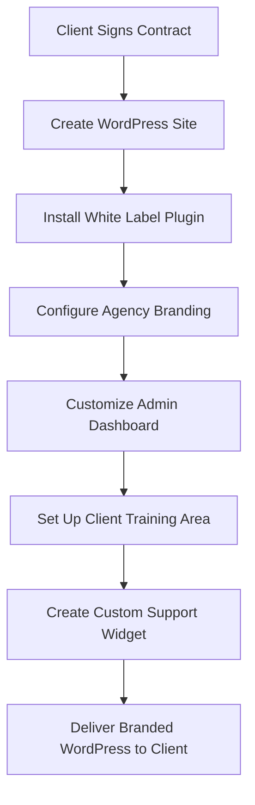

# WordPress White Labeling

## Introduction

White labeling in WordPress refers to the practice of removing WordPress branding and replacing it with your own or your client's brand identity. It's a professional approach used by web developers and agencies to create a cohesive branded experience for clients who use the WordPress admin dashboard. 

When you white label WordPress, you're essentially customizing the backend interface to reflect a specific brand rather than showing the default WordPress logos, colors, and messaging. This creates a more professional, tailored experience for your clients and helps strengthen your own brand identity.

## Why White Label WordPress?

Before diving into how to white label WordPress, let's understand why you might want to do this:

1. **Professional Branding**: Establishes your agency or freelance business as professional and detail-oriented
2. **Client Experience**: Creates a seamless branded experience for clients
3. **Reduces Confusion**: Simplifies the admin interface for clients who may not need to know it's WordPress
4. **Value-Added Service**: Allows you to offer a premium, customized solution
5. **Brand Consistency**: Maintains consistent branding throughout the entire website experience

## White Labeling Methods

There are several approaches to white labeling WordPress, from simple code-based customizations to comprehensive plugin solutions. Let's explore these methods from basic to advanced.

### Method 1: Basic CSS Customizations

One of the simplest ways to start white labeling is through CSS customizations. This approach allows you to modify colors, hide elements, or replace logos in the WordPress admin dashboard.

#### Example: Custom Admin CSS

Create a simple plugin or add this to your theme's `functions.php` file:

```php
// Add custom admin CSS
function custom_admin_css() {
    echo '<style>
        /* Change the login logo */
        .login h1 a {
            background-image: url("your-logo-url.png") !important;
            background-size: contain !important;
            width: 320px !important;
        }
        
        /* Modify admin bar colors */
        #wpadminbar {
            background: #your-brand-color !important;
        }
        
        /* Change footer text color */
        #wpfooter {
            color: #your-brand-color !important;
        }
    </style>';
}
add_action('admin_head', 'custom_admin_css');
add_action('login_head', 'custom_admin_css');
```

This code adds custom CSS to both the WordPress admin area and the login page, allowing you to change the logo and colors to match your brand.

### Method 2: Login Page Customization

The login page is often the first interaction clients have with their WordPress backend, making it an important area to white label.

```php
// Replace WordPress logo with custom logo
function custom_login_logo() {
    ?>
    <style>
        .login h1 a {
            background-image: url(<?php echo get_stylesheet_directory_uri(); ?>/images/your-logo.png);
            background-size: 260px 60px;
            width: 260px;
            height: 60px;
        }
    </style>
    <?php
}
add_action('login_enqueue_scripts', 'custom_login_logo');

// Change login logo URL to point to your site
function custom_login_logo_url() {
    return home_url();
}
add_filter('login_headerurl', 'custom_login_logo_url');

// Change login logo title text
function custom_login_logo_title() {
    return get_bloginfo('name');
}
add_filter('login_headertext', 'custom_login_logo_title');

// Customize login page styles
function custom_login_styles() {
    ?>
    <style>
        body.login {
            background-color: #f5f5f5;
        }
        .login form {
            background-color: #ffffff;
            border-color: #your-brand-color;
        }
        .wp-core-ui .button-primary {
            background: #your-brand-color;
            border-color: #your-brand-color;
        }
    </style>
    <?php
}
add_action('login_enqueue_scripts', 'custom_login_styles');
```

This code completely transforms the WordPress login page with your own branding elements.

### Method 3: Customizing Admin Footer Text

The footer text in the WordPress admin area can easily be changed to display your company information:

```php
// Change admin footer text
function custom_admin_footer_text() {
    echo 'Website developed and maintained by <a href="https://yourwebsite.com" target="_blank">Your Company Name</a>';
}
add_filter('admin_footer_text', 'custom_admin_footer_text');

// Remove WordPress version info from footer
function remove_footer_version() {
    return '';
}
add_filter('update_footer', 'remove_footer_version', 11);
```

### Method 4: Using White Label Plugins

For a more comprehensive white labeling solution without writing code, there are several plugins available:

1. **White Label CMS**: Allows you to rebrand the WordPress admin area
2. **WP White Label**: Offers extensive branding options for the admin interface
3. **Branda (formerly Ultimate Branding)**: Provides comprehensive white labeling features

Let's look at a typical implementation process using a white label plugin:

1. **Install and activate** the white label plugin of your choice
2. **Configure branding settings**:
   - Upload your logo for the login page
   - Set custom colors for the admin interface
   - Customize the admin footer text
   - Modify or remove WordPress references
3. **Set up client roles and permissions** if applicable
4. **Save and test** your white labeled WordPress installation

## Advanced White Labeling Techniques

### Custom Admin Dashboard Widgets

Replace the default WordPress dashboard widgets with your own branded widgets:

```php
// Remove default dashboard widgets
function remove_default_dashboard_widgets() {
    remove_meta_box('dashboard_right_now', 'dashboard', 'normal');
    remove_meta_box('dashboard_activity', 'dashboard', 'normal');
    remove_meta_box('dashboard_quick_press', 'dashboard', 'side');
    remove_meta_box('dashboard_primary', 'dashboard', 'side');
}
add_action('admin_menu', 'remove_default_dashboard_widgets');

// Add custom dashboard widget
function add_custom_dashboard_widget() {
    wp_add_dashboard_widget(
        'custom_help_widget',
        'Your Company Support',
        'custom_dashboard_help'
    );
}
add_action('wp_dashboard_setup', 'add_custom_dashboard_widget');

function custom_dashboard_help() {
    echo '
    <div class="custom-support-widget">
        
        <h3>Need Help with Your Website?</h3>
        <p>Contact our support team:</p>
        <ul>
            <li>Email: <a href="mailto:support@yourcompany.com">support@yourcompany.com</a></li>
            <li>Phone: (555) 123-4567</li>
            <li><a href="https://yourcompany.com/help" target="_blank">Visit Help Center</a></li>
        </ul>
    </div>
    ';
}
```

### Customizing Admin Menu

Customize or simplify the WordPress admin menu for your clients:

```php
// Customize admin menu
function customize_admin_menu() {
    // Remove menu items
    remove_menu_page('tools.php'); // Tools
    remove_menu_page('edit-comments.php'); // Comments
    
    // Rename menu items
    global $menu;
    $menu[5][0] = 'Articles'; // Change "Posts" to "Articles"
    
    // Add custom menu item
    add_menu_page(
        'Client Resources',
        'Client Resources',
        'read',
        'client-resources',
        'client_resources_page',
        'dashicons-book-alt',
        3
    );
}
add_action('admin_menu', 'customize_admin_menu');

function client_resources_page() {
    echo '
    <div class="wrap">
        <h1>Client Resources</h1>
        <p>Welcome to your custom resource center. Here you\'ll find helpful information about managing your website.</p>
        <!-- Add your custom content here -->
    </div>
    ';
}
```

### Creating a Custom Admin Theme

For complete white labeling, you can create a custom admin theme:

```php
// Enqueue custom admin stylesheet
function custom_admin_theme() {
    wp_enqueue_style('custom-admin', get_stylesheet_directory_uri() . '/admin-style.css');
}
add_action('admin_enqueue_scripts', 'custom_admin_theme');
```

Then create an `admin-style.css` file in your theme directory with comprehensive styling for the admin area.

## Real-World Implementation: Agency Branding Package

Here's how a full white labeling setup might look for a web design agency:



### Step 1: Initial Setup

Create a white label settings file or plugin for consistent branding across all client sites:

```php
// Create a plugin called "Agency Branding Package"
/*
Plugin Name: Agency Branding Package
Description: Complete white labeling solution for client websites
Version: 1.0
Author: Your Agency Name
*/

// Define branding constants
define('AGENCY_NAME', 'Your Agency Name');
define('AGENCY_URL', 'https://youragency.com');
define('AGENCY_LOGO', plugin_dir_url(__FILE__) . 'assets/images/agency-logo.png');
define('AGENCY_COLOR', '#3a7bd5');
define('AGENCY_SUPPORT_EMAIL', 'support@youragency.com');

// Include white label functions
include('includes/login-customizer.php');
include('includes/admin-customizer.php');
include('includes/dashboard-widgets.php');
include('includes/help-content.php');
```

### Step 2: Client Onboarding Process

With your white labeling in place, create a client onboarding process:

1. Set up WordPress with your white label plugin
2. Configure client-specific settings (if needed)
3. Create client user account with appropriate permissions
4. Provide login details to client with branded welcome email
5. Schedule training session using your branded materials

### Step 3: Client-Specific Customizations (Example Functions)

```php
// Function to set client-specific branding
function set_client_branding($client_name, $client_logo, $client_color = '') {
    update_option('client_name', $client_name);
    update_option('client_logo', $client_logo);
    if (!empty($client_color)) {
        update_option('client_accent_color', $client_color);
    }
}

// Function to create client help content
function create_client_help_page($client_name, $client_details) {
    // Create a new page for client help content
    $page_content = '
    <h1>Welcome to Your Website Admin Area</h1>
    <p>This page contains helpful information about managing your website.</p>
    <div class="contact-info">
        <h3>Need Help?</h3>
        <p>Contact ' . AGENCY_NAME . ' support:</p>
        <ul>
            <li>Email: ' . AGENCY_SUPPORT_EMAIL . '</li>
            <li>Phone: ' . $client_details['support_phone'] . '</li>
        </ul>
    </div>
    ';
    
    $help_page = array(
        'post_title'    => $client_name . ' Help Center',
        'post_content'  => $page_content,
        'post_status'   => 'publish',
        'post_type'     => 'page',
    );
    
    wp_insert_post($help_page);
}
```

## Best Practices for White Labeling

1. **Be consistent** with branding elements across all touchpoints
2. **Simplify the interface** for clients when possible
3. **Document your customizations** for maintenance purposes
4. **Test thoroughly** before delivering to clients
5. **Include helpful resources** as part of your white labeled solution
6. **Consider legal aspects** when removing WordPress credits and trademark elements
7. **Don't break core functionality** with your customizations

## Common Challenges and Solutions

### Challenge: Updates Breaking Customizations

**Solution**: Create a custom plugin for your white labeling rather than editing core files or using the functions.php file directly.

### Challenge: Maintaining White Label Changes Across Multiple Sites

**Solution**: Use a network-wide solution if using multisite, or create a standardized white label plugin package you can install on all client sites.

### Challenge: Balancing Simplification vs. Functionality

**Solution**: Create different client user roles with varying levels of access and customization based on their technical capabilities.

## Summary

White labeling WordPress is a powerful way to enhance your WordPress business offering and provide clients with a professional, branded experience. By leveraging the techniques covered in this guide—from basic CSS customizations to comprehensive plugin solutions—you can transform the standard WordPress interface into a tailored platform that reflects your brand or your client's brand.

Remember that effective white labeling involves more than just changing logos and colors; it's about creating an intuitive, branded experience that adds value to your client relationships and differentiates your business in the WordPress marketplace.

## Additional Resources

Here are some additional resources to help you master WordPress white labeling:

- WordPress Plugin Directory: Search for "white label" plugins
- Learn more about WordPress hooks and filters to customize admin features
- Stay updated on WordPress admin interface changes in each major release

## Practice Exercise

Create a simple white labeling plan for a fictional client:

1. Define the branding elements you would need (colors, logo, etc.)
2. List the specific WordPress areas you would customize
3. Outline the code or plugins you would use to implement each change
4. Create a simple style guide for consistent implementation

By mastering WordPress white labeling, you can elevate your WordPress business and create more professional, cohesive experiences for your clients.