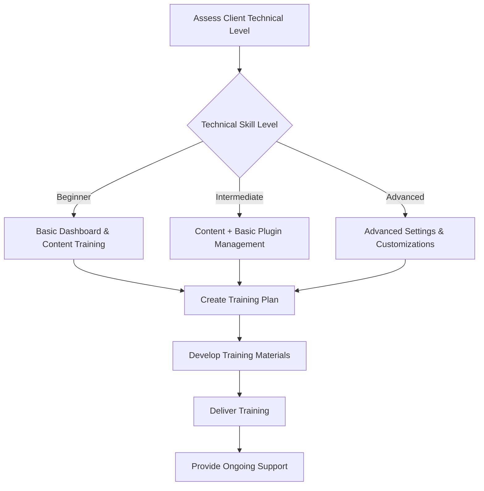

# WordPress Client Training

## Introduction

When you build WordPress websites for clients as part of your business, the handover process is just as important as the development itself. Effective client training ensures your clients can confidently manage their websites after launch, reducing support requests and increasing client satisfaction. This guide explores strategies for creating comprehensive WordPress client training programs that set both you and your clients up for success.

## Why Client Training Matters

Client training is a critical component of any WordPress business for several reasons:

1. **Empowers clients** to make basic updates without developer intervention
2. **Reduces simple support tickets** that drain your resources
3. **Builds client confidence** and strengthens relationships
4. **Creates additional revenue streams** through training packages
5. **Establishes you as an expert** and trusted advisor

## Planning Your Client Training Strategy

Before diving into training materials, establish a clear strategy that addresses your clients' specific needs.

### Assessing Client Needs

Different clients require different levels of training based on:

- Their technical comfort level
- The complexity of their WordPress site
- How often they'll update their website
- Specific features they'll manage regularly



### Creating a Training Scope Document

Develop a training scope document that outlines:

```jsx
// Example training scope document structure
const trainingScope = {
  basicTraining: [
    "WordPress dashboard orientation",
    "Adding/editing pages and posts",
    "Media library management",
    "User management"
  ],
  intermediateTraining: [
    "Working with site menus",
    "Widget management",
    "Basic plugin settings",
    "Contact form management"
  ],
  advancedTraining: [
    "Custom post type management",
    "SEO optimization",
    "Performance settings",
    "Security best practices"
  ]
};
```

## Creating Effective Training Materials

### Documentation Types

Develop a mix of training materials to accommodate different learning styles:

1. **Written Documentation**
   - Step-by-step guides
   - Quick reference sheets
   - FAQ documents

2. **Video Tutorials**
   - Screen recordings with narration
   - Short, focused videos (3-5 minutes)
   - Feature-specific walkthroughs

3. **Interactive Materials**
   - Checklists for common tasks
   - Decision trees for troubleshooting
   - Practice exercises

### Sample Written Documentation Template

For written documentation, use clear headings, numbered steps, and screenshots:

```markdown
# How to Add a New Blog Post

## Overview
This guide explains how to add a new blog post to your WordPress website.

## Steps
1. Log in to your WordPress dashboard at yourdomain.com/wp-admin
2. Navigate to Posts → Add New from the left sidebar
3. Enter your post title in the title field
4. Add your content using the block editor
5. Add categories and tags in the right sidebar
6. Set a featured image by clicking "Set featured image"
7. Preview your post by clicking the "Preview" button
8. When ready, click "Publish" to make your post live

## Tips
- Use headings to structure your content
- Add alt text to all images for accessibility
- Keep paragraphs short for readability
```

### Creating Video Tutorials

Video tutorials should be concise and focused on specific tasks:

1. Plan your script before recording
2. Use screen recording software like Loom, Screencast-O-Matic, or OBS
3. Keep videos under 5 minutes when possible
4. Include an introduction explaining what you'll cover
5. Consider adding captions for accessibility

## Conducting Training Sessions

### Training Session Structure

For live training sessions, follow this structure:

1. **Overview** (5-10 minutes)
   - Explain WordPress basics and site architecture
   - Review the admin dashboard layout
   - Set expectations for the session

2. **Demonstration** (20-30 minutes)
   - Show how to perform key tasks
   - Follow a logical workflow
   - Pause for questions

3. **Guided Practice** (20-30 minutes)
   - Let clients perform tasks themselves
   - Provide assistance as needed
   - Validate successful completion

4. **Q&A** (10-15 minutes)
   - Address specific questions
   - Clarify confusing points
   - Note topics for follow-up

### Remote vs. In-Person Training

Compare the pros and cons of each training format:

| Remote Training | In-Person Training |
|-----------------|-------------------|
| Easier to schedule | Better for building rapport |
| Can be recorded for reference | Easier to gauge understanding |
| No travel time required | Hands-on assistance possible |
| May have technical challenges | Limited by geography |
| Often more cost-effective | Can be more engaging |

## Setting Up Self-Service Resources

### Creating a Client Portal

Develop a password-protected client portal where clients can access:

- Training materials
- Video library
- Documentation
- FAQs
- Support ticket system

You can create this using:

```jsx
// Example code for a simple password-protected page using the Password Protected plugin
// Add this to your functions.php file to create a custom client resources page template

function create_client_resources_page() {
    $page_title = 'Client Resources';
    $page_content = '
    <h2>Welcome to Your Client Resources</h2>
    <p>Access your training materials and resources below:</p>
    
    <div class="resource-grid">
        <div class="resource-card">
            <h3>WordPress Basics</h3>
            <ul>
                <li><a href="#">Dashboard Overview</a></li>
                <li><a href="#">Managing Content</a></li>
                <li><a href="#">Media Library</a></li>
            </ul>
        </div>
        
        <div class="resource-card">
            <h3>Video Tutorials</h3>
            <ul>
                <li><a href="#">Adding a New Post</a></li>
                <li><a href="#">Working with Images</a></li>
                <li><a href="#">Managing Menus</a></li>
            </ul>
        </div>
        
        <div class="resource-card">
            <h3>Support</h3>
            <ul>
                <li><a href="#">Submit a Support Ticket</a></li>
                <li><a href="#">FAQs</a></li>
                <li><a href="#">Schedule a Training Session</a></li>
            </ul>
        </div>
    </div>
    ';
    
    // Check if page exists
    $page_check = get_page_by_title($page_title);
    
    // Add the page if it doesn't exist
    if(!isset($page_check->ID)){
        $page = array(
            'post_type' => 'page',
            'post_title' => $page_title,
            'post_content' => $page_content,
            'post_status' => 'publish',
            'post_author' => 1,
        );
        wp_insert_post($page);
    }
}

add_action('init', 'create_client_resources_page');
```

### Knowledge Base Development

Create a searchable knowledge base with:

1. **Categorized Articles**
   - WordPress Basics
   - Content Management
   - Media Management
   - Plugin-specific guides
   - Troubleshooting common issues

2. **Search Functionality**
   - Implement a search feature
   - Tag articles for better discoverability

3. **Update Regular Content**
   - Set a schedule to review and update content
   - Add new articles as questions arise

## Monetizing Client Training

### Training Package Options

Consider these training package structures:

1. **Basic Package** (included with website)
   - 1-hour training session
   - Basic written documentation
   - 30 days of email support

2. **Standard Package** ($XXX)
   - 3 hours of training (in 1-hour sessions)
   - Comprehensive documentation
   - Custom video tutorials for key features
   - 60 days of email and phone support

3. **Premium Package** ($XXX)
   - 5 hours of training (in 1-hour sessions)
   - Comprehensive documentation
   - Complete video library
   - 6 months of priority support
   - Monthly check-in calls

### Ongoing Support Retainers

Offer maintenance packages that include ongoing training:

```jsx
// Example support retainer structure
const supportPlans = {
  basic: {
    price: "$XX/month",
    features: [
      "WordPress & plugin updates",
      "Weekly backups",
      "Monthly security scans",
      "1 hour of training or support per month"
    ]
  },
  professional: {
    price: "$XXX/month",
    features: [
      "WordPress & plugin updates",
      "Daily backups",
      "Weekly security scans",
      "Performance optimization",
      "3 hours of training or support per month"
    ]
  },
  enterprise: {
    price: "$XXX/month",
    features: [
      "WordPress & plugin updates",
      "Daily backups",
      "Daily security monitoring",
      "Performance optimization",
      "5 hours of training or support per month",
      "Priority response time"
    ]
  }
};
```

## Measuring Training Effectiveness

Track the success of your training programs with:

1. **Client Feedback Surveys**
   - Post-training satisfaction surveys
   - 30-day follow-up surveys
   - Annual client reviews

2. **Support Request Analysis**
   - Track volume and type of support requests
   - Identify common questions or issues
   - Use data to improve training materials

3. **Client Competency Assessment**
   - Create simple tasks for clients to complete
   - Measure success rate and confidence level
   - Identify areas needing additional training

## Common Challenges and Solutions

| Challenge | Solution |
|-----------|----------|
| Technical intimidation | Start with absolute basics and build confidence gradually |
| Information overload | Break training into multiple sessions focused on specific tasks |
| Forgetting procedures | Provide reference materials and short refresher videos |
| Staff turnover | Offer training for new team members as part of maintenance package |
| Varying learning styles | Provide multiple training formats (written, video, hands-on) |

## Building Your Training Workflow

Systematize your training process with this workflow:


## Case Study: Successful Client Training

**Client:** Local Real Estate Agency  
**Challenge:** Staff needed to update property listings daily but had minimal technical experience  
**Solution:** 

1. Created a custom post type for properties with intuitive fields
2. Developed step-by-step documentation with screenshots
3. Created 5 short video tutorials for common tasks
4. Conducted two 1-hour training sessions
5. Set up a WhatsApp group for quick questions
6. Scheduled a 30-day follow-up session

**Outcome:** Within 60 days, support requests decreased by 75%, and the client successfully managed over 100 property listings without developer assistance.

## Summary

Effective client training is a win-win strategy that empowers your clients while reducing your support burden. By creating systematic training processes, developing high-quality materials, and offering ongoing support options, you'll build stronger client relationships and create additional revenue streams for your WordPress business.

Remember these key principles:

1. Assess each client's specific needs and technical abilities
2. Create diverse training materials for different learning styles
3. Break training into manageable, focused sessions
4. Provide self-service resources for ongoing reference
5. Offer tiered training and support packages
6. Continuously refine your training based on feedback and results

## Additional Resources

- **Practice Exercise 1:** Create a client needs assessment questionnaire for your WordPress business
- **Practice Exercise 2:** Develop a basic training template for common WordPress tasks
- **Practice Exercise 3:** Record a 3-5 minute tutorial video showing how to create and publish a blog post

With an effective client training strategy, you'll transform clients from dependent customers into confident website managers, allowing you to focus on growing your WordPress business rather than handling routine support requests.