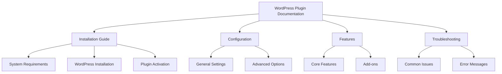
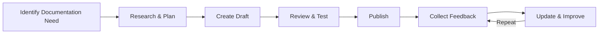

# WordPress Documentation

## Introduction

Documentation is the unsung hero of successful WordPress businesses. Whether you're a developer, designer, agency owner, or theme/plugin creator, well-crafted documentation serves as the bridge between your WordPress products and your users. Good documentation reduces support tickets, improves user experience, and demonstrates professionalism.

In this guide, we'll explore how to create effective WordPress documentation, the tools available, and best practices to implement for your WordPress business. By the end, you'll understand how proper documentation can save time, improve customer satisfaction, and ultimately boost your bottom line.

## Why WordPress Documentation Matters

Documentation provides several key benefits for WordPress businesses:

1. **Reduced Support Queries**: Comprehensive documentation allows users to find answers themselves
2. **Improved User Experience**: Clear instructions help users succeed with your products
3. **Enhanced Professional Image**: Well-documented products appear more trustworthy
4. **Better Onboarding**: New team members can get up to speed faster
5. **Valuable SEO Content**: Documentation pages often rank well for specific queries

## Types of WordPress Documentation

Depending on your WordPress business, you may need different types of documentation:

### 1. User Documentation

This is aimed at end-users who interact with your WordPress products:

- Installation guides
- Configuration instructions
- Feature explanations
- Troubleshooting guides
- FAQs

### 2. Developer Documentation

For developers who will work with your code:

- API references
- Hook documentation
- Code examples
- Development guidelines
- Integration instructions

### 3. Internal Documentation

For your team's internal processes:

- Coding standards
- Project workflows
- Business processes
- Client onboarding procedures

## Documentation Tools for WordPress

Several tools can help you create and maintain WordPress documentation:

### WordPress Itself

You can create a documentation section directly in WordPress:

```php
// Register custom post type for documentation
function register_documentation_post_type() {
    $args = array(
        'public' => true,
        'label'  => 'Documentation',
        'menu_icon' => 'dashicons-book',
        'supports' => array('title', 'editor', 'thumbnail', 'excerpt', 'revisions'),
        'has_archive' => true,
        'rewrite' => array('slug' => 'docs'),
    );
    register_post_type('documentation', $args);
}
add_action('init', 'register_documentation_post_type');
```

This creates a dedicated section in your WordPress site for documentation entries.

### Knowledge Base Plugins

Several WordPress plugins help create documentation:

1. **Knowledge Base for Documents and FAQs**: Creates a searchable repository of articles
2. **BetterDocs**: Documentation plugin with templates and analytics
3. **Heroic Knowledge Base**: Premium solution with extensive features
4. **WeDocs**: Open-source documentation plugin

### External Documentation Tools

Some businesses prefer external documentation systems:

- **Docusaurus**: React-based documentation site generator
- **GitBook**: Modern documentation platform
- **ReadTheDocs**: Documentation hosting platform
- **Notion**: All-in-one workspace with documentation features

## Creating Effective WordPress Documentation

### Step 1: Plan Your Documentation Structure

Before writing, create an outline of topics and subtopics:



### Step 2: Write Clear Content

When writing documentation:

1. **Use Plain Language**: Avoid jargon unless necessary
2. **Be Concise**: Get to the point without unnecessary text
3. **Use Headings**: Break content into scannable sections
4. **Include Step-by-Step Instructions**: Number steps for processes
5. **Add Visual Elements**: Screenshots and diagrams enhance understanding

### Step 3: Include Code Examples

For developer documentation, include working code examples:

```php
/**
 * Example: Hooking into our plugin
 *
 * This example demonstrates how to modify the output of the 
 * [display_product] shortcode
 */
function my_custom_product_output_filter($output, $product_id) {
    // Get the original output
    $modified_output = $output;
    
    // Add custom content
    $modified_output .= '<div class="custom-product-note">';
    $modified_output .= 'This product is featured!';
    $modified_output .= '</div>';
    
    return $modified_output;
}
add_filter('my_plugin_product_output', 'my_custom_product_output_filter', 10, 2);
```

Output:
```html
<div class="product-box">
    <h3>Sample Product</h3>
    <div class="product-description">This is a product description</div>
    <div class="product-price">$19.99</div>
    <div class="custom-product-note">This product is featured!</div>
</div>
```

### Step 4: Organize Content Logically

Order your documentation from basic to advanced topics:

1. **Getting Started**: Installation, requirements, basic setup
2. **Core Concepts**: Main features and how they work
3. **Advanced Usage**: Complex features for experienced users
4. **Customization**: Ways to modify or extend functionality
5. **Troubleshooting**: Common issues and solutions
6. **Reference**: APIs, hooks, shortcodes, etc.

### Step 5: Maintain and Update

Documentation requires regular maintenance:

- Review content after major releases
- Update screenshots when interfaces change
- Add new sections for new features
- Correct errors when discovered
- Consider versioning for different product releases

## Real-World Documentation Examples

### Example 1: Plugin Documentation

For a WordPress form plugin, documentation might include:

```php
// Shortcode usage
[contact_form id="contact-1"]

// PHP implementation
<?php echo do_shortcode('[contact_form id="contact-1"]'); ?>

// Hook into form submission
function my_form_submission_handler($form_data, $form_id) {
    // Custom logic here
    if ($form_id === 'contact-1') {
        // Send data to CRM
        my_custom_crm_integration($form_data);
    }
}
add_action('my_form_plugin_submission', 'my_form_submission_handler', 10, 2);
```

With accompanying explanations:

> The plugin supports both shortcode implementation for pages/posts and PHP implementation for theme templates. You can hook into form submissions to extend functionality, such as sending data to external systems.

### Example 2: Theme Documentation

For a WordPress theme:

```php
// Add theme support for the custom logo feature
function my_theme_setup() {
    add_theme_support('custom-logo', array(
        'height'      => 100,
        'width'       => 400,
        'flex-height' => true,
        'flex-width'  => true,
    ));
}
add_action('after_setup_theme', 'my_theme_setup');

// Using the logo in a template
<?php
if (has_custom_logo()) {
    the_custom_logo();
} else {
    echo '<h1>' . get_bloginfo('name') . '</h1>';
}
?>
```

With explanations:

> Our theme supports custom logos through WordPress's native functionality. The logo will display at the dimensions specified, but can be flexible if needed. If no logo is uploaded, the site title will display as a heading.

### Example 3: Agency Client Documentation

For clients using WordPress sites you've built:

```php
// Custom shortcode to display team members
[display_team department="sales"]

// Adding a new product
1. Navigate to Products → Add New
2. Enter product title and description
3. Set product price in the "Product Data" box
4. Add product image
5. Assign product categories
6. Click "Publish"
```

With instructions:

> To add team members to your site, ask your administrator to create them as "Team Member" post types. You can then display specific departments using the shortcode shown above. For adding products, follow the step-by-step instructions to ensure all necessary information is included.

## Best Practices for WordPress Documentation

1. **Start with User Stories**: Consider what users need to accomplish
2. **Use Consistent Formatting**: Maintain visual consistency
3. **Include a Search Function**: Make information discoverable
4. **Add a Table of Contents**: Help users navigate longer documents
5. **Test Documentation**: Have someone follow your instructions exactly
6. **Add Contextual Help**: Place documentation where users need it
7. **Collect Feedback**: Add ways for users to rate helpfulness

## Creating a Documentation Workflow

Establish a process for creating and maintaining documentation:



1. **Identify Documentation Need**: Based on support requests or feature releases
2. **Research & Plan**: Gather information and plan structure
3. **Create Draft**: Write initial documentation
4. **Review & Test**: Have someone follow instructions to verify accuracy
5. **Publish**: Make documentation available
6. **Collect Feedback**: Gather user responses
7. **Update & Improve**: Continually refine based on feedback

## Summary

Effective WordPress documentation is a critical component of any successful WordPress business. It reduces support costs, improves user experience, and demonstrates professionalism. By understanding different documentation types, choosing the right tools, and following best practices, you can create documentation that truly serves your users and your business.

Remember that documentation is never "finished" - it's an ongoing process of improvement based on user feedback, product changes, and evolving best practices. The time invested in quality documentation will pay dividends through increased customer satisfaction and decreased support requirements.

## Additional Resources

To further enhance your WordPress documentation skills:

1. **Practice Exercises**:
   - Audit your existing documentation for gaps
   - Create a user journey map to identify documentation needs
   - Set up a documentation feedback system

2. **Advanced Learning**:
   - Learn Markdown for easier documentation formatting
   - Explore version control for documentation
   - Study information architecture principles

By implementing these strategies, you'll create documentation that serves as a valuable asset for your WordPress business, enhancing user experience and operational efficiency.