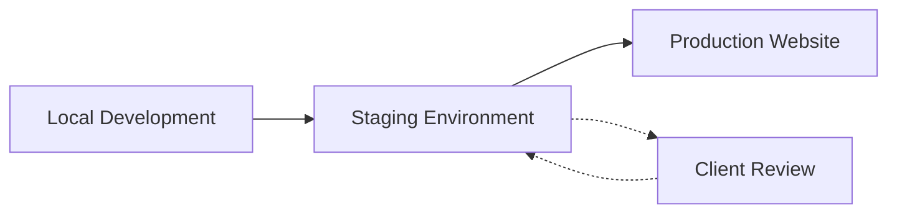
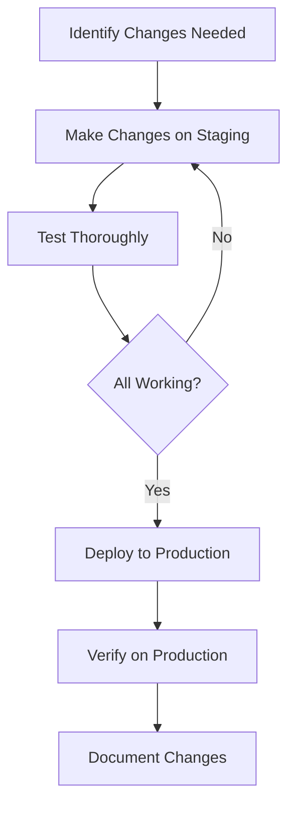

# WordPress Staging Environments

## Introduction

A staging environment is a replica of your live WordPress site where you can safely test changes, updates, and new features without affecting your actual production website. Think of it as a rehearsal space for your website—a place where you can make mistakes, experiment, and perfect your changes before showing them to the world.

For WordPress business owners and developers, staging environments are an essential part of a professional workflow. They help prevent downtime, avoid broken functionality, and ensure smooth user experience on your live site.

In this guide, you'll learn why staging environments are crucial, how to set them up, and best practices for incorporating them into your WordPress development workflow.

## Why You Need a WordPress Staging Environment

Before diving into the technical aspects, let's understand why staging environments are essential for WordPress businesses:

1. **Risk Mitigation**: Test plugin updates, theme changes, and WordPress core updates without risking your live site's functionality.
2. **Client Presentations**: Show clients proposed changes on a real working site before implementing them.
3. **Collaboration**: Allow your team to work together and review changes in a real environment.
4. **Performance Testing**: Measure the impact of changes on site performance before they affect your users.
5. **Training**: Train team members or clients on how to use WordPress without fear of breaking the live site.



## Methods to Create a WordPress Staging Environment

### Method 1: Using Your Web Host's Staging Feature

Many quality WordPress hosting providers offer built-in staging functionality.

#### Popular hosts with one-click staging:

- WP Engine
- SiteGround
- Kinsta
- Flywheel
- Bluehost (on some plans)

#### Steps to create a staging site with a host-provided tool:

1. Log in to your hosting dashboard
2. Find the staging or development environment option
3. Click "Create Staging Site" or similar
4. Wait for the process to complete (usually takes a few minutes)

Here's an example of using WP Engine's staging feature:

```php
// No actual code needed - this is done through the hosting interface
// Example process flow:
// 1. Access WP Engine User Portal
// 2. Select your site
// 3. Click "Staging" tab
// 4. Click "Create staging environment"
// 5. Wait for completion
```

After creation, you'll typically get a URL like `staging-yoursite.wpengine.com` where you can access your staging site.

### Method 2: Using a Plugin

If your host doesn't offer staging functionality, you can use WordPress plugins to create staging environments.

#### Popular staging plugins:

- WP Staging
- Duplicator
- All-in-One WP Migration
- UpdraftPlus

Let's see how to use WP Staging (free version):

1. Install and activate the WP Staging plugin
2. Go to WP Staging > Create New Staging Site
3. Enter a name for your staging site (e.g., "staging")
4. Click "Start Cloning"
5. Wait for the process to complete

After completion, you'll typically access your staging site at `yoursite.com/staging`.

### Method 3: Manual Staging Environment Creation

For those comfortable with technical processes, you can create a staging environment manually:

1. Create a subdomain (e.g., `staging.yoursite.com`) or a subdirectory (e.g., `yoursite.com/staging`)
2. Create a new database for your staging site
3. Copy all files from your live site to the staging location
4. Export your live site database and import it to the staging database
5. Update the `wp-config.php` file with new database credentials
6. Update site URLs in the database

Here's an example of updating site URLs in the database after migration:

```sql
UPDATE wp_options SET option_value = replace(option_value, 'https://www.yoursite.com', 'https://staging.yoursite.com') WHERE option_name = 'home' OR option_name = 'siteurl';

UPDATE wp_posts SET guid = replace(guid, 'https://www.yoursite.com', 'https://staging.yoursite.com');

UPDATE wp_posts SET post_content = replace(post_content, 'https://www.yoursite.com', 'https://staging.yoursite.com');
```

## Best Practices for Using WordPress Staging Environments

### 1. Secure Your Staging Environment

Your staging site may contain sensitive information, so security is crucial:

```php
// Add password protection to your staging site
// Place this in your staging site's .htaccess file

AuthType Basic
AuthName "Restricted Area"
AuthUserFile /path/to/.htpasswd
require valid-user
```

Additionally, you can:

- Block search engines from indexing your staging site by enabling the "Discourage search engines" option in Settings > Reading
- Use robots.txt to prevent crawling
- Implement IP restrictions to limit access

### 2. Establish a Clear Workflow

A typical WordPress staging workflow looks like this:



### 3. Keep Staging and Production in Sync

After making changes to your live site, remember to sync your staging environment:

- Update the staging site with new content from production
- Keep plugins, themes, and WordPress core versions identical
- Document differences if you choose to maintain them differently

### 4. Testing on Staging

When using your staging environment, test thoroughly:

- Check functionality on different devices and browsers
- Test user roles and permissions
- Verify form submissions and e-commerce functionality
- Check site speed and performance
- Validate accessibility standards

## Deploying from Staging to Production

### Method 1: Using Host-Provided Tools

If your host provides staging functionality, they typically offer a one-click "push to production" feature:

1. Verify all changes on staging
2. Back up your production site
3. Use your host's "Deploy to production" or "Push to live" button
4. Verify changes on the live site

### Method 2: Using Plugins

Plugins like WP Staging Pro, Duplicator Pro, or All-in-One WP Migration allow pushing changes from staging to live:

```php
// Example workflow with WP Staging Pro:
// 1. Make and test changes on staging
// 2. In WP Staging Pro dashboard, select your staging site
// 3. Click "Push to Live"
// 4. Select which tables and files to update
// 5. Start the process
```

### Method 3: Manual Deployment

For those comfortable with technical processes:

1. Back up your production site
2. Identify what changes need to be deployed (database changes, file changes, or both)
3. For file changes: copy modified files from staging to production
4. For database changes: export affected tables from staging and import to production

#### Example: Deploying Theme Changes Manually

```bash
# Copy theme changes from staging to production
cp -R /path/to/staging/wp-content/themes/your-theme/ /path/to/production/wp-content/themes/your-theme/

# If using Git for your theme
cd /path/to/production/wp-content/themes/your-theme/
git pull origin main
```

## Common Challenges and Solutions

### Database Synchronization Issues

**Challenge**: Content created on the live site while you're working on staging can be lost when pushing from staging to production.

**Solution**: Use a plugin like WP Merge or manually merge database changes instead of overwriting the entire database.

### Plugin and Theme Conflicts

**Challenge**: Changes work on staging but break on production.

**Solution**: Ensure identical environments by using the same versions of WordPress, plugins, and themes on both staging and production.

### Performance Differences

**Challenge**: Staging environment performs differently than production.

**Solution**: Try to match your production server configuration as closely as possible in your staging environment.

## Real-World WordPress Staging Scenario

Let's walk through a complete real-world example:

### Scenario: Updating a WooCommerce Store

**Task**: You need to update WooCommerce and several extensions while also implementing a new checkout flow.

#### Step 1: Create the staging environment

Using your host's staging feature or a plugin as described earlier.

#### Step 2: Perform updates on staging

1. Update WooCommerce and extensions
2. Implement new checkout flow customizations in your theme:

```php
// In your theme's functions.php or a custom plugin

// Add a new checkout field
add_filter('woocommerce_checkout_fields', 'add_custom_checkout_field');

function add_custom_checkout_field($fields) {
    $fields['billing']['billing_business_name'] = array(
        'label'       => 'Business Name',
        'placeholder' => 'Your Business Name',
        'required'    => false,
        'class'       => array('form-row-wide'),
        'clear'       => true
    );
    return $fields;
}

// Save the custom field value
add_action('woocommerce_checkout_update_order_meta', 'save_custom_checkout_field');

function save_custom_checkout_field($order_id) {
    if (!empty($_POST['billing_business_name'])) {
        update_post_meta($order_id, '_billing_business_name', sanitize_text_field($_POST['billing_business_name']));
    }
}
```

#### Step 3: Testing on staging

1. Place test orders to verify the new checkout flow
2. Check for compatibility issues with other plugins
3. Test on multiple devices and browsers
4. Verify email notifications are working correctly

#### Step 4: Client review

Share the staging URL with your client for approval before going live.

#### Step 5: Deployment to production

1. Back up your production site
2. Use your hosting provider's "push to live" feature or manually deploy the changes
3. Verify all functionality on the live site
4. Monitor for any issues in the first 24 hours

## Summary

WordPress staging environments are essential tools for any serious WordPress business or developer. They provide a safe space to test changes, experiment with new features, and ensure a smooth experience for your users.

In this guide, we covered:

- Why staging environments are crucial for WordPress sites
- Different methods to create staging environments
- Best practices for using and securing your staging site
- How to deploy changes from staging to production
- Common challenges and their solutions
- A real-world example of using a staging environment

By implementing a proper staging workflow, you'll reduce downtime, prevent errors on your live site, and deliver a more professional service to your clients or users.

## Additional Resources

For further learning, consider exploring:

- Your hosting provider's documentation on staging environments
- Documentation for staging plugins like WP Staging, Duplicator, or All-in-One WP Migration
- Version control systems like Git to better manage code changes
- Automated testing frameworks for WordPress to enhance your testing process

## Practice Exercises

1. Create a staging environment for your WordPress site using your preferred method
2. Make a minor change to your theme's CSS and test it on staging before deploying
3. Create a documented workflow for your team that outlines your staging to production process
4. Set up security measures to protect your staging environment
5. Try updating a major plugin on staging and document the process of testing and deployment

By mastering WordPress staging environments, you'll join the ranks of professional WordPress developers who prioritize stability, testing, and methodical workflows—ultimately leading to more reliable WordPress sites and happier clients.