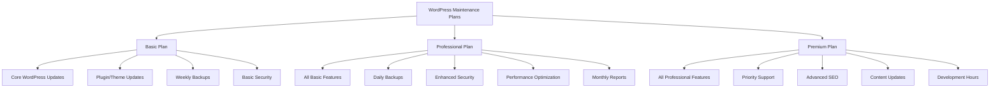

# WordPress Maintenance Plans

## Introduction

WordPress maintenance plans represent one of the most valuable revenue streams for WordPress professionals. While designing and developing websites can provide significant one-time payments, maintenance plans offer the holy grail of business models: predictable, recurring revenue. In this guide, we'll explore how to create, price, and deliver WordPress maintenance plans that provide ongoing value to your clients while establishing financial stability for your business.

## What Are WordPress Maintenance Plans?

WordPress maintenance plans are service packages where you provide ongoing care, updates, and support for client websites in exchange for a regular fee (typically monthly or annual). These plans ensure websites remain secure, functional, and up-to-date while providing website owners peace of mind.

Think of website maintenance like car maintenance—regular oil changes and tune-ups prevent expensive breakdowns. Similarly, regular WordPress maintenance prevents costly website crashes or security breaches.

## Why Maintenance Plans Matter

### For Your Clients:

- **Security**: WordPress sites need regular updates to patch security vulnerabilities
- **Performance**: Regular optimization keeps sites running smoothly
- **Peace of mind**: Knowing an expert is monitoring their website
- **Focus**: Allows them to focus on their business, not website technicalities

### For Your Business:

- **Recurring revenue**: Predictable monthly income
- **Deeper client relationships**: Regular engagement with clients
- **Upselling opportunities**: More chances to offer additional services
- **Business valuation**: Businesses with recurring revenue have higher valuations

## Components of Effective WordPress Maintenance Plans

Let's break down the essential services you might include in your maintenance plans:

### 1. Core Updates

WordPress regularly releases updates to its core software. Keeping client sites updated is crucial for security and functionality.

```js
// Example scheduled function to check for WordPress updates
function checkWordPressUpdates() {
  // Check core updates
  const coreUpdateStatus = wp_get_update_data();
  
  if (coreUpdateStatus.counts.total > 0) {
    // Send notification or perform update based on your maintenance plan
    sendUpdateNotification('WordPress core update available');
  }
}
```

### 2. Plugin and Theme Updates

Plugins and themes need regular updates to patch security vulnerabilities and add new features.

```js
// Example code to check plugin updates
function checkPluginUpdates() {
  require_once(ABSPATH . 'wp-admin/includes/plugin.php');
  $update_plugins = get_site_transient('update_plugins');
  
  if (!empty($update_plugins->response)) {
    // There are plugin updates available
    foreach ($update_plugins->response as $plugin_file => $plugin_data) {
      // Log or perform update based on maintenance plan level
      logUpdateNeeded('Plugin update available for: ' + $plugin_file);
    }
  }
}
```

### 3. Security Monitoring and Hardening

Security is paramount for WordPress sites. Your plans should include:

- Malware scanning
- Security hardening
- Brute force protection
- Activity logging

### 4. Backups

Regular backups are essential in case something goes wrong.

```js
// Example backup schedule configuration
function setupBackupSchedule() {
  // Daily database backups
  if (!wp_next_scheduled('daily_database_backup')) {
    wp_schedule_event(time(), 'daily', 'daily_database_backup');
  }
  
  // Weekly full-site backups
  if (!wp_next_scheduled('weekly_fullsite_backup')) {
    wp_schedule_event(time(), 'weekly', 'weekly_fullsite_backup');
  }
}
```

### 5. Performance Optimization

Slow websites lose visitors. Regular optimization helps maintain speed.

- Database optimization
- Image optimization
- Caching configuration
- Content Delivery Network (CDN) management

### 6. Analytics and Reporting

Clients value insights about their website performance.

- Traffic statistics
- Security scan reports
- Uptime monitoring
- Monthly/quarterly reports

## Creating Tiered Maintenance Plans

Most successful WordPress maintenance businesses offer multiple service tiers. Here's a common structure:



### Example Plan Structure

#### Basic Plan ($49/month)
- Weekly backups
- WordPress core updates
- Plugin and theme updates
- Uptime monitoring
- Security scanning
- Monthly report

#### Professional Plan ($99/month)
- Daily backups
- All Basic Plan features
- 30-minute response time during business hours
- Performance optimization
- Advanced security features
- Monthly consulting call

#### Premium Plan ($199/month)
- All Professional Plan features
- Priority support (24/7)
- 1 hour of content/development time each month
- Quarterly site review and strategy session
- SEO monitoring and basic optimization

## Tools for Delivering Maintenance Services

To efficiently deliver maintenance services, you'll need the right tools:

### 1. Management Dashboards

Solutions that allow you to manage multiple WordPress sites from one dashboard:

- [MainWP](https://mainwp.com)
- [ManageWP](https://managewp.com)
- [InfiniteWP](https://infinitewp.com)

These platforms allow you to update WordPress, plugins, and themes across multiple sites with a single click.

### 2. Backup Solutions

Reliable backup solutions are essential:

- [UpdraftPlus](https://updraftplus.com)
- [BackupBuddy](https://ithemes.com/backupbuddy)
- [VaultPress/Jetpack Backup](https://jetpack.com/upgrade/backup)

### 3. Security Tools

Security monitoring tools help protect client sites:

- [Wordfence](https://www.wordfence.com)
- [Sucuri](https://sucuri.net)
- [iThemes Security Pro](https://ithemes.com/security)

### 4. Performance Optimization

Tools for keeping sites fast:

- [WP Rocket](https://wp-rocket.me)
- [Imagify](https://imagify.io)
- [WP Optimize](https://getwpo.com)

## Setting Up Client Processes

Successful maintenance businesses have clear processes for:

### Onboarding New Maintenance Clients

Create a checklist for new clients:

1. Initial site audit
2. Security assessment
3. Performance benchmark
4. Backup verification
5. Documentation of current state
6. Access credentialing

### Example Onboarding Script

```js
// Example onboarding function
async function onboardNewMaintenanceClient(siteUrl, clientName) {
  // Step 1: Initial site audit
  const siteDetails = await performSiteAudit(siteUrl);
  
  // Step 2: Security assessment
  const securityIssues = await scanForSecurityIssues(siteUrl);
  
  // Step 3: Performance benchmark
  const performanceMetrics = await measureSitePerformance(siteUrl);
  
  // Step 4: Create client record
  createClientRecord({
    name: clientName,
    url: siteUrl,
    onboardingDate: new Date(),
    initialAudit: siteDetails,
    securityIssues: securityIssues,
    initialPerformance: performanceMetrics
  });
  
  // Step 5: Schedule recurring maintenance tasks
  scheduleRecurringTasks(siteUrl);
  
  // Step 6: Send welcome email with next steps
  sendWelcomeEmail(clientName, siteUrl);
}
```

### Regular Maintenance Schedule

Create a schedule of regular maintenance tasks:

- Daily: Security scans, uptime monitoring
- Weekly: Plugin/theme updates, database optimization
- Monthly: Performance reviews, client reports
- Quarterly: Full website review, strategy consultation

## Pricing Your Maintenance Plans

Pricing depends on several factors:

1. **Value delivered**: How much downtime/issues are you preventing?
2. **Time investment**: How many hours will you spend per site?
3. **Market positioning**: Are you a premium provider or cost-effective option?
4. **Target market**: Enterprise clients can pay more than small businesses
5. **Local market rates**: Prices may vary by geographic region

### Calculating Your Minimum Viable Price

Use this formula to calculate your minimum price:

```
Monthly Rate = ((Hours per month × Hourly rate) + Tool costs) ÷ (1 - Profit margin)
```

For example:
- 2 hours per month
- $75 hourly rate
- $15 in tools/software
- 30% profit margin

```
Monthly Rate = ((2 × $75) + $15) ÷ (1 - 0.3)
Monthly Rate = ($150 + $15) ÷ 0.7
Monthly Rate = $165 ÷ 0.7
Monthly Rate = $235.71
```

## Selling Maintenance Plans

### For New Website Clients

Always propose maintenance as part of your website project. Include it in your initial proposals, emphasizing:

1. The risks of unmaintained WordPress sites
2. The cost of emergency fixes vs. ongoing maintenance  
3. The value of peace of mind

### For Existing Website Owners

For website owners with existing sites:

1. Perform a free website audit showing vulnerabilities
2. Demonstrate how maintenance prevents expensive emergencies
3. Offer a first-month trial or discount

### Example Client Proposal Section

Here's how you might present maintenance plans in a proposal:

```
## Ongoing Website Maintenance

Your new website represents a significant investment in your business. Like any valuable asset, regular maintenance ensures optimal performance and longevity.

Our maintenance plans provide:

* Security monitoring to prevent hacking
* Regular updates to maintain functionality
* Backups to protect your content
* Performance optimization for better user experience
* Regular reports on your website's health

We recommend our Professional Plan at $99/month, which provides comprehensive protection while ensuring your site continues to serve your business goals.

Without proper maintenance, websites face increased security risks, functionality problems, and potential data loss. Our maintenance plan costs less than emergency recovery services that could range from $500-$3000 depending on the severity of the issue.
```

## Scaling Your Maintenance Business

Once you've established your maintenance service, consider these strategies to scale:

### Automation

The more you can automate, the more sites you can maintain:

- Use management dashboards to handle updates
- Set up automatic backups and security scans
- Create automated reporting systems

```js
// Example code for automating client reports
function generateClientReport(siteId) {
  const site = getSiteDetails(siteId);
  const reportData = {
    siteName: site.name,
    reportPeriod: `${getFirstDayLastMonth()} - ${getLastDayLastMonth()}`,
    metrics: {
      uptime: getUptimePercentage(siteId),
      securityScans: getSecurityScanResults(siteId),
      backupsPerformed: getBackupCount(siteId),
      updatesApplied: getUpdateLog(siteId),
      performanceScore: getSitePerformanceScore(siteId)
    }
  };
  
  const report = generateReportPDF(reportData);
  emailReportToClient(site.clientEmail, report);
  storePDFInClientPortal(siteId, report);
}
```

### Team Building

As you grow, build a team to handle different aspects:

- Junior developer for routine updates
- Security specialist for hardening and monitoring
- Client success manager for communication and reporting

### Client Management

Keep clients happy with:

- Regular communication
- Transparent reporting
- Quick response times
- Educational resources

## Common Challenges and Solutions

### Challenge: Updates Breaking Sites

**Solution**: Always test updates on staging sites first, and keep backups before any significant update.

```js
// Example staging update workflow
async function safelyUpdatePlugins(siteId) {
  try {
    // 1. Create staging site
    const stagingSite = await createStagingSite(siteId);
    
    // 2. Update plugins on staging
    const updateResults = await updateAllPlugins(stagingSite.id);
    
    // 3. Test critical functionality
    const testResults = await runAutomatedTests(stagingSite.id);
    
    // 4. If tests pass, update production
    if (testResults.pass) {
      // Create backup first
      await createBackup(siteId);
      
      // Apply updates to production
      await updateAllPlugins(siteId);
      
      return { success: true, message: "Updates applied successfully" };
    } else {
      return { 
        success: false, 
        message: "Updates caused issues in staging environment",
        details: testResults.failures
      };
    }
  } catch (error) {
    return { success: false, message: "Update process failed", error };
  }
}
```

### Challenge: Scope Creep

**Solution**: Clearly define what's included in each plan and what constitutes "development hours" versus maintenance.

### Challenge: Client Communication

**Solution**: Set up automated reporting and scheduled check-ins to keep clients informed without overwhelming them.

## Best Practices for Long-term Success

1. **Document everything**: Create thorough documentation for each client site
2. **Regular reviews**: Review and update your plans/pricing annually
3. **Continuous education**: Stay current with WordPress security and performance best practices
4. **Client education**: Help clients understand the value you provide
5. **Upsell strategically**: Identify opportunities to suggest additional services

## Real-World Example: Sarah's WordPress Agency

Sarah started her WordPress agency building custom sites for small businesses. After years of one-off projects, she was tired of the feast-or-famine cycle. She developed a three-tier maintenance plan:

- Basic Care: $59/month
- Business Care: $129/month
- Enterprise Care: $299/month

Within 12 months, she had:
- 15 clients on Basic Care
- 12 clients on Business Care
- 3 clients on Enterprise Care

Monthly recurring revenue: $3,582

This stable income allowed her to hire her first employee and focus on higher-value services rather than constantly chasing new projects.

## Summary

WordPress maintenance plans provide essential care for client websites while creating predictable recurring revenue for your business. By developing tiered plans that address various client needs, using the right tools, and establishing efficient processes, you can build a sustainable maintenance business that serves as your company's financial backbone.

Remember that maintenance plans are about relationships as much as technical service. Your clients are paying for peace of mind and the assurance that their digital business assets are protected and optimized.

## Additional Resources

- Consider creating contract templates for your maintenance plans
- Develop an emergency response plan for when issues occur
- Build a knowledge base for frequently asked client questions
- Create a standard operating procedure (SOP) for your maintenance tasks

## Exercise: Design Your Maintenance Plan

1. Define three tiers of maintenance plans appropriate for your target clients
2. Calculate your monthly service costs and set profitable pricing
3. List the specific tools you'll need for each service component
4. Create a sample monthly maintenance schedule
5. Draft a value proposition explaining the benefits of your service

By implementing what you've learned in this guide, you can transform your WordPress business from project-based to a more stable, recurring revenue model through effective maintenance plans.