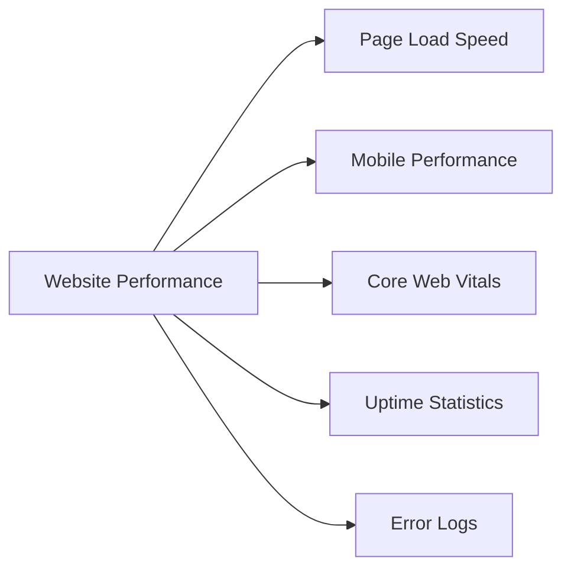

# WordPress Client Reporting

## Introduction

Client reporting is a fundamental aspect of running a successful WordPress business. Whether you're a freelancer, agency owner, or consultant, providing clear and insightful reports to your clients demonstrates professionalism, builds trust, and helps justify your value. 

Effective client reporting keeps your clients informed about their website's performance, the work you've completed, and the results achieved. This transparency not only helps clients understand what they're paying for but also positions you as a strategic partner rather than just a service provider.

In this comprehensive guide, we'll explore different aspects of WordPress client reporting, from choosing the right metrics to present, setting up automated reporting systems, and creating professional reports that impress your clients.

## Why Client Reporting Matters

Before diving into the "how," let's understand the "why" behind client reporting:

1. **Transparency**: Shows clients exactly what work has been completed and the value delivered
2. **Accountability**: Establishes clear metrics for measuring success
3. **Retention**: Clients who understand your value are more likely to continue working with you
4. **Upselling opportunities**: Reports can highlight areas for improvement or additional services
5. **Reduced communication overhead**: Regular reports can reduce ad-hoc client questions

## Essential Metrics to Include in Client Reports

Different clients may require different metrics, but here are some key categories to consider:

### Website Performance



### Traffic and Analytics

- Visitor count (new vs. returning)
- Traffic sources
- Popular pages
- Bounce rate
- Session duration
- Conversion rates

### SEO Performance

- Keyword rankings
- Organic traffic growth
- Backlink profile
- Technical SEO improvements

### Security and Maintenance

- Updates performed
- Security scans
- Backup status
- Resolved vulnerabilities
- Spam comments removed

### E-commerce Metrics (if applicable)

- Sales volume
- Cart abandonment rate
- Average order value
- Top-selling products
- Revenue growth

## Tools for WordPress Client Reporting

### 1. WordPress Plugins for Reporting

Several WordPress plugins can help streamline your reporting process:

#### ManageWP

ManageWP is a powerful WordPress management tool that includes client reporting features.

```jsx
// Example of using ManageWP's API to generate a custom report
const ManageWP = require('managewp-api');
const client = new ManageWP({
  apiKey: 'your-api-key'
});

// Generate a white-labeled performance report for a specific site
client.generateReport({
  siteId: 'site-id',
  reportType: 'performance',
  startDate: '2023-01-01',
  endDate: '2023-01-31',
  branding: {
    logo: 'https://yourcompany.com/logo.png',
    companyName: 'Your WordPress Agency'
  }
})
.then(report => {
  // Send the report to client
  console.log('Report generated successfully:', report.url);
})
.catch(err => {
  console.error('Error generating report:', err);
});
```

#### MainWP

MainWP offers white-labeled client reports with customizable metrics.

#### WP Client Reports

This plugin is specifically designed for client reporting needs.

### 2. Google Data Studio

Google Data Studio allows you to create beautiful, interactive reports that pull data from various sources.

```javascript
// Example of using Google Analytics API with Google Data Studio
const { google } = require('googleapis');
const analytics = google.analytics('v3');

async function generateAnalyticsReport() {
  const auth = new google.auth.OAuth2(
    'YOUR_CLIENT_ID',
    'YOUR_CLIENT_SECRET',
    'YOUR_REDIRECT_URL'
  );
  
  auth.setCredentials({
    access_token: 'YOUR_ACCESS_TOKEN'
  });
  
  const res = await analytics.data.ga.get({
    auth: auth,
    'ids': 'ga:XXXXXXXX',  // View (Profile) ID
    'start-date': '30daysAgo',
    'end-date': 'today',
    'metrics': 'ga:sessions,ga:users,ga:pageviews',
    'dimensions': 'ga:date'
  });
  
  // Use this data in your Data Studio report
  return res.data;
}
```

### 3. Analytical Tools

- **Google Analytics**: Essential for tracking website traffic and user behavior
- **Google Search Console**: For monitoring search performance and technical issues
- **Ahrefs/SEMrush**: For SEO and competitor analysis

## Creating a Client Reporting System

### Step 1: Determine Reporting Frequency

Decide with your client how often they want to receive reports. Common options include:
- Monthly (most common)
- Quarterly
- Weekly (for active campaigns or high-traffic sites)

### Step 2: Select Relevant Metrics

Every client and project is different. Work with your client to determine which metrics matter most to them.

### Step 3: Set Up Automated Data Collection

Configure your tools to automatically collect the data you need for reports.

```jsx
// Example of a WordPress hook to track custom events
function track_custom_client_events() {
  if (is_page('contact') && isset($_POST['submitted'])) {
    // Track form submission
    $event_data = array(
      'event_category' => 'Forms',
      'event_action' => 'Submit',
      'event_label' => 'Contact Form'
    );
    
    // Send event to your tracking system
    send_to_tracking_system($event_data);
  }
}
add_action('template_redirect', 'track_custom_client_events');

function send_to_tracking_system($data) {
  // Implementation depends on your tracking system
  // Example for Google Analytics
  ?>
  <script>
    gtag('event', '<?php echo $data['event_action']; ?>', {
      'event_category': '<?php echo $data['event_category']; ?>',
      'event_label': '<?php echo $data['event_label']; ?>'
    });
  </script>
  <?php
}
```

### Step 4: Design a Report Template

Create a professional template that includes:
- Your branding
- Client's branding
- Executive summary
- Detailed metrics with visualizations
- Accomplishments during the reporting period
- Recommendations for improvements
- Next steps or action items

### Step 5: Automate Report Generation

Once your template is ready, set up automated generation of reports.

```javascript
// Example cron job setup for monthly report generation
const cron = require('node-cron');
const ReportGenerator = require('./your-report-generator');

// Schedule task to run at midnight on the 1st of every month
cron.schedule('0 0 1 * *', async () => {
  console.log('Generating monthly client reports...');
  
  try {
    const clients = await getActiveClients();
    
    for (const client of clients) {
      await ReportGenerator.generateReport({
        clientId: client.id,
        period: 'monthly',
        date: new Date()
      });
      
      // Send notification or email with report
      await notifyClient(client.id);
    }
    
    console.log('All reports generated successfully');
  } catch (err) {
    console.error('Error generating reports:', err);
  }
});
```

### Step 6: Present and Discuss Reports

Don't just send reports—schedule time to discuss them with your clients.

## White-Labeling Your Reports

For agencies and freelancers who want to present a professional image, white-labeling your reports is essential.

### Using WordPress Plugins for White-Labeled Reports

Many WordPress management plugins offer white-labeling capabilities:

```php
// Example function to white-label WordPress admin reports
function custom_admin_report_branding() {
  if (is_admin() && isset($_GET['page']) && $_GET['page'] === 'client-reports') {
    ?>
    <style type="text/css">
      .report-header-logo {
        background-image: url('<?php echo get_option('company_logo_url'); ?>') !important;
      }
      .report-footer {
        color: <?php echo get_option('company_color'); ?>;
      }
      .report-wrapper .wp-logo {
        display: none !important;
      }
    </style>
    <?php
  }
}
add_action('admin_head', 'custom_admin_report_branding');
```

## Real-World Example: Creating a Monthly SEO Report

Let's walk through creating a monthly SEO performance report for a client:

### 1. Gather Data

Collect data from:
- Google Analytics
- Google Search Console
- WordPress backend (for content updates)
- SEO plugin (like Yoast or Rank Math)

### 2. Create the Report Structure

```jsx
// Example React component for an SEO Report section
import React from 'react';
import { LineChart, PieChart } from 'your-chart-library';

const SEOReport = ({ data, dateRange }) => {
  return (
    <div className="seo-report">
      <h2>SEO Performance Report: {dateRange}</h2>
      
      <div className="report-section">
        <h3>Organic Traffic Overview</h3>
        <div className="metrics-summary">
          <div className="metric">
            <span className="metric-value">{data.organicUsers}</span>
            <span className="metric-label">Organic Users</span>
            <span className={`metric-change ${data.organicUserChange > 0 ? 'positive' : 'negative'}`}>
              {data.organicUserChange > 0 ? '+' : ''}{data.organicUserChange}%
            </span>
          </div>
          {/* More metrics */}
        </div>
        
        <LineChart 
          data={data.organicTrafficTrend} 
          title="Organic Traffic Trend" 
        />
      </div>
      
      {/* More report sections */}
    </div>
  );
};

export default SEOReport;
```

### 3. Add Context and Recommendations

Rather than just presenting data, provide context and actionable recommendations:

```jsx
// Example recommendations component
const Recommendations = ({ data }) => {
  // Logic to generate recommendations based on data
  const generateSeoRecommendations = (data) => {
    let recommendations = [];
    
    if (data.avgPosition > 10) {
      recommendations.push({
        title: "Improve Content Depth",
        description: "Current average position is too low. Consider expanding content on key pages."
      });
    }
    
    if (data.bounceRate > 80) {
      recommendations.push({
        title: "Address High Bounce Rate",
        description: "Bounce rate is high for organic traffic. Consider improving page load speed and enhancing content relevance."
      });
    }
    
    // More recommendation logic
    
    return recommendations;
  };
  
  const recommendations = generateSeoRecommendations(data);
  
  return (
    <div className="recommendations-section">
      <h3>Recommendations</h3>
      {recommendations.length > 0 ? (
        <ul className="recommendations-list">
          {recommendations.map((rec, index) => (
            <li key={index}>
              <strong>{rec.title}:</strong> {rec.description}
            </li>
          ))}
        </ul>
      ) : (
        <p>All metrics are within optimal ranges. Continue with current strategy.</p>
      )}
    </div>
  );
};
```

## Best Practices for Client Reporting

1. **Be consistent**: Use the same format and metrics each time for easy comparison
2. **Prioritize clarity**: Use simple language and avoid technical jargon
3. **Visualize data**: Use charts and graphs to make information digestible
4. **Highlight wins**: Emphasize positive results and improvements
5. **Be honest**: Don't hide negative results; instead, provide context and solutions
6. **Make it actionable**: Include recommended next steps
7. **Personalize**: Tailor reports to each client's specific goals

## Common Client Reporting Mistakes to Avoid

1. **Information overload**: Overwhelming clients with too many metrics
2. **Missing context**: Presenting numbers without explaining their significance
3. **Lack of visualization**: Relying too heavily on text
4. **Technical jargon**: Using terminology clients don't understand
5. **Inconsistent delivery**: Not sending reports on schedule
6. **No recommendations**: Failing to provide actionable insights

## Creating a Client Reporting Dashboard

For clients who want real-time access to their site's performance, consider setting up a custom dashboard:

```jsx
// Example of a custom WordPress dashboard widget for clients
function add_client_dashboard_widget() {
  wp_add_dashboard_widget(
    'client_performance_summary',
    'Website Performance Summary',
    'display_client_performance_widget'
  );
}
add_action('wp_dashboard_setup', 'add_client_dashboard_widget');

function display_client_performance_widget() {
  // Get performance data
  $visitors = get_visitor_count_last_30_days();
  $avg_load_time = get_average_page_load_time();
  $uptime = get_website_uptime_percentage();
  
  // Display the widget content
  ?>
  <div class="performance-summary">
    <div class="metric-box">
      <h4>Visitors (30 days)</h4>
      <div class="metric-value"><?php echo number_format($visitors); ?></div>
      <?php 
      $change = calculate_percentage_change($visitors, get_visitor_count_previous_30_days());
      $class = $change >= 0 ? 'positive' : 'negative';
      ?>
      <div class="metric-change <?php echo $class; ?>">
        <?php echo $change >= 0 ? '+' : ''; echo $change; ?>%
      </div>
    </div>
    
    <!-- More metrics -->
    
    <div class="view-full-report">
      <a href="<?php echo admin_url('admin.php?page=client-full-report'); ?>" class="button">
        View Full Report
      </a>
    </div>
  </div>
  <?php
}
```

## Summary

Effective client reporting is a crucial element of a successful WordPress business. By providing clear, insightful, and actionable reports, you demonstrate your value, build trust with clients, and create opportunities for long-term relationships.

Remember these key points:
- Focus on metrics that matter to your specific client
- Provide context, not just raw data
- Make reports visually appealing and easy to understand
- Be consistent with your reporting frequency and format
- Use automation to streamline the reporting process
- Include recommendations and next steps

By implementing a robust client reporting system, you'll not only keep your clients informed but also position yourself as a strategic partner invested in their success.

## Additional Resources

- Books: "Measure What Matters" by John Doerr
- Online courses on data visualization and business analytics
- Communities: WordPress Business and Agency owner groups

## Practice Exercise

1. Create a sample client report template for a fictional WordPress client
2. Identify 5-7 key metrics that would be most relevant to this client
3. Design a visualization for each metric
4. Write an executive summary that provides context for the data
5. Include 3-5 actionable recommendations based on the fictional data

With practice and feedback, you can develop a client reporting system that sets you apart from competitors and adds significant value to your WordPress business services.