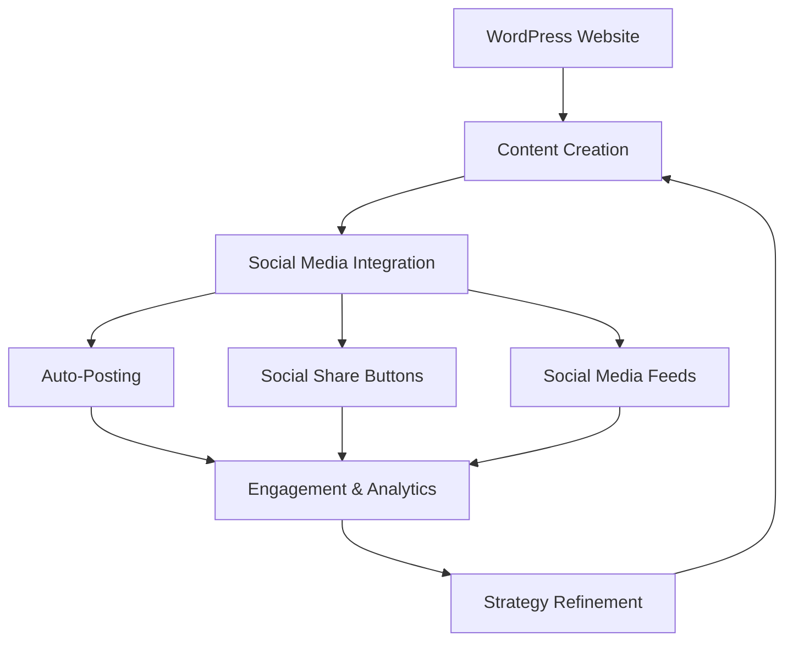

# WordPress Social Media Integration

In today's digital landscape, integrating social media with your WordPress website is essential for expanding your reach, engaging with your audience, and driving traffic. This guide will walk you through various methods to seamlessly connect your WordPress site with popular social media platforms.

## Why Integrate Social Media with WordPress?

Social media integration serves multiple purposes for your website:

1. **Increased visibility** - Helps content reach a wider audience
2. **Enhanced user engagement** - Allows visitors to interact with your content
3. **Brand consistency** - Maintains your online presence across platforms
4. **Traffic generation** - Drives users from social networks to your website
5. **Social proof** - Displays follower counts and engagement metrics

## Basic Social Media Integration Methods

### 1. Adding Social Media Links

The simplest form of integration is adding links to your social profiles. Most WordPress themes include built-in options for this.

#### Using Theme Customizer

1. Navigate to `Appearance > Customize` in your WordPress dashboard
2. Look for "Social Media" or "Social Links" options
3. Enter your profile URLs for each platform

#### Adding Links Manually in Widgets

```php
// Code for a simple social media links widget
<div class="social-links">
  <a href="https://facebook.com/youraccount" target="_blank" rel="noopener noreferrer">
    <i class="fa fa-facebook"></i>
  </a>
  <a href="https://twitter.com/youraccount" target="_blank" rel="noopener noreferrer">
    <i class="fa fa-twitter"></i>
  </a>
  <a href="https://instagram.com/youraccount" target="_blank" rel="noopener noreferrer">
    <i class="fa fa-instagram"></i>
  </a>
  <a href="https://linkedin.com/in/youraccount" target="_blank" rel="noopener noreferrer">
    <i class="fa fa-linkedin"></i>
  </a>
</div>
```

### 2. Implementing Social Share Buttons

Social share buttons allow visitors to share your content on their social media accounts.

#### Manual Implementation

Add this code to your single post template (`single.php`):

```php
<div class="social-sharing">
  <h4>Share this article:</h4>
  
  <!-- Facebook -->
  <a href="https://www.facebook.com/sharer/sharer.php?u=<?php echo urlencode(get_permalink()); ?>" 
     target="_blank" rel="noopener noreferrer">
    <i class="fa fa-facebook"></i> Facebook
  </a>
  
  <!-- Twitter -->
  <a href="https://twitter.com/intent/tweet?url=<?php echo urlencode(get_permalink()); ?>&text=<?php echo urlencode(get_the_title()); ?>" 
     target="_blank" rel="noopener noreferrer">
    <i class="fa fa-twitter"></i> Twitter
  </a>
  
  <!-- LinkedIn -->
  <a href="https://www.linkedin.com/shareArticle?mini=true&url=<?php echo urlencode(get_permalink()); ?>&title=<?php echo urlencode(get_the_title()); ?>" 
     target="_blank" rel="noopener noreferrer">
    <i class="fa fa-linkedin"></i> LinkedIn
  </a>
</div>
```

## Using Social Media Integration Plugins

For beginners, plugins offer a more user-friendly approach to social media integration.

### Top Social Media Integration Plugins

#### 1. Shared Counts

This plugin adds beautiful social share buttons to your posts and pages.

**Key features:**
- Clean, minimal design
- Multiple share button styles
- Share count display options
- Lightweight performance

**Installation steps:**
1. Go to `Plugins > Add New` in your WordPress dashboard
2. Search for "Shared Counts"
3. Click "Install Now" and then "Activate"
4. Navigate to `Settings > Shared Counts` to configure options

#### 2. Social Warfare

A premium plugin with extensive customization options.

**Key features:**
- Pinterest-specific features
- Click-to-tweet functionality
- Custom button positions
- Analytics integration

#### 3. Smash Balloon Social Photo Feed

For displaying your Instagram or Facebook feeds on your website.

**Example configuration:**

```php
// After installing the plugin, use this shortcode in your posts, pages, or widgets
[instagram-feed]

// Or for Facebook
[custom-facebook-feed]
```

## Advanced Social Media Integration

### Implementing Open Graph Tags

Open Graph tags help social platforms display rich previews when your content is shared.

Add this code to your theme's `functions.php` file:

```php
// Add Open Graph Meta Tags
function add_open_graph_tags() {
    if (is_single()) {
        global $post;
        if(get_the_post_thumbnail($post->ID, 'large')) {
            $img_src = wp_get_attachment_image_src(get_post_thumbnail_id($post->ID), 'large');
            $thumbnail = $img_src[0];
        } else {
            $thumbnail = get_site_icon_url();
        }
        ?>

        <meta property="og:title" content="<?php echo get_the_title(); ?>" />
        <meta property="og:description" content="<?php echo wp_trim_words(get_the_excerpt(), 30); ?>" />
        <meta property="og:type" content="article" />
        <meta property="og:url" content="<?php echo get_permalink(); ?>" />
        <meta property="og:image" content="<?php echo $thumbnail; ?>" />
        <meta property="og:site_name" content="<?php echo get_bloginfo('name'); ?>" />

        <meta name="twitter:card" content="summary_large_image" />
        <meta name="twitter:title" content="<?php echo get_the_title(); ?>" />
        <meta name="twitter:description" content="<?php echo wp_trim_words(get_the_excerpt(), 30); ?>" />
        <meta name="twitter:image" content="<?php echo $thumbnail; ?>" />
    <?php
    }
}
add_action('wp_head', 'add_open_graph_tags', 5);
```

### Auto-Posting to Social Media

Automatically share new content to your social media accounts.

#### Using Jetpack Publicize

Jetpack offers a feature called Publicize that connects your site to popular social media platforms.

**Setup steps:**
1. Install and activate Jetpack
2. Connect your WordPress.com account
3. Go to `Jetpack > Settings > Sharing`
4. Click "Connect" next to each social network
5. Authorize connections when prompted

## Creating a Social Media Content Strategy

Integrating the technical aspects is just one part of the equation. A strategic approach is also needed:



### Best Practices for WordPress Social Media Integration

1. **Don't overdo it** - Include only relevant social platforms
2. **Maintain consistent branding** - Use the same colors, logos, and voice
3. **Position share buttons strategically** - Top, bottom, or floating sidebar
4. **Mobile optimization** - Ensure social elements work well on all devices
5. **Monitor performance** - Track which content gets the most shares

## Building a Social Login System

Allow users to register and login using their social media accounts.

### Using OAuth and NextendSocial Plugin

```php
// After installing the plugin, this is how you would implement a social login button in PHP
function add_custom_social_login_button() {
    if (function_exists('nextend_social_login')) {
        echo do_shortcode('[nextend_social_login provider="facebook"]');
        echo do_shortcode('[nextend_social_login provider="google"]');
        echo do_shortcode('[nextend_social_login provider="twitter"]');
    }
}
```

## Real-World Case Study: E-commerce Integration

Let's look at how a WordPress e-commerce site might implement social media integration:

1. **Product pages** include social share buttons to encourage shoppers to share products
2. **Instagram feed** displays user-generated content showing products in use
3. **Facebook Pixel** tracks visitor behavior for targeted advertising
4. **Social proof** displays reviews from social platforms
5. **Automated sharing** announces new products and promotions

**Example implementation for WooCommerce:**

```php
// Add social sharing to product pages
add_action('woocommerce_share', 'woocommerce_social_sharing_buttons');

function woocommerce_social_sharing_buttons() {
    $product_title = get_the_title();
    $product_url = get_permalink();
    
    // Get product featured image
    $product_image = wp_get_attachment_image_src(get_post_thumbnail_id(), 'full');
    $pinterest_image = $product_image[0];
    
    // Social share URLs
    $facebook_url = 'https://www.facebook.com/sharer/sharer.php?u=' . $product_url;
    $twitter_url = 'https://twitter.com/intent/tweet?text=' . $product_title . '&url=' . $product_url;
    $pinterest_url = 'https://pinterest.com/pin/create/button/?url=' . $product_url . '&media=' . $pinterest_image . '&description=' . $product_title;
    
    echo '<div class="social-share-buttons">';
    echo '<a target="_blank" href="' . $facebook_url . '">Share on Facebook</a>';
    echo '<a target="_blank" href="' . $twitter_url . '">Tweet This</a>';
    echo '<a target="_blank" href="' . $pinterest_url . '">Pin This</a>';
    echo '</div>';
}
```

## Troubleshooting Common Issues

### Social Share Buttons Not Displaying Correctly

**Possible solutions:**
- Check for CSS conflicts in your theme
- Ensure JavaScript is loading properly
- Test in multiple browsers
- Disable other plugins temporarily to identify conflicts

### Social Feed Not Updating

**Common fixes:**
- Verify API keys and authentication
- Check caching settings on your website
- Ensure the social account is public
- Refresh connection permissions

## Summary

Social media integration with WordPress offers numerous benefits for website owners, from increased visibility to enhanced user engagement. This guide has covered:

- Basic integration with social links and share buttons
- Plugin-based solutions for various social media features
- Advanced implementations like Open Graph tags and auto-posting
- Best practices for creating an effective social media strategy
- Real-world implementation for e-commerce websites

By implementing these techniques, you can create a seamless connection between your WordPress website and social media platforms, helping to grow your audience and enhance your online presence.

## Additional Resources

- WordPress Developer Documentation: [Social Tools](https://developer.wordpress.org/themes/functionality/social-tools/)
- Facebook for Developers: [Open Graph Documentation](https://developers.facebook.com/docs/sharing/webmasters/)
- Twitter Developer: [Twitter Cards Documentation](https://developer.twitter.com/en/docs/twitter-for-websites/cards/overview/abouts-cards)

## Practice Exercises

1. Install and configure a social sharing plugin on your WordPress site
2. Implement Open Graph tags and test the appearance of shared links
3. Create a custom social media icon section in your site's footer
4. Set up an Instagram feed on your homepage using a plugin
5. Configure auto-posting for new blog content to at least two social platforms

By completing these exercises, you'll gain hands-on experience with WordPress social media integration that you can apply to future projects.