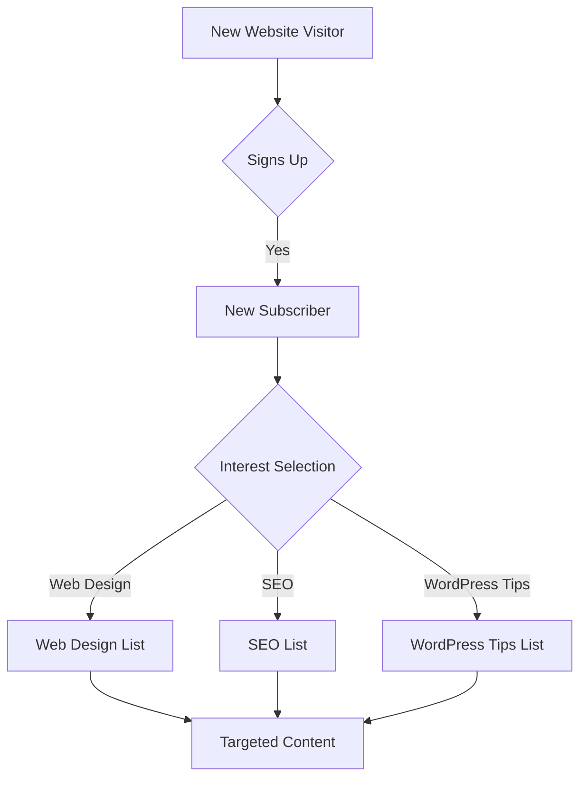

# WordPress Email Marketing

## Introduction

Email marketing remains one of the most effective channels for engaging with your audience, building relationships, and driving conversions. When combined with WordPress, the world's most popular content management system, you can create powerful marketing campaigns that help grow your online presence. This guide will walk you through the essentials of implementing email marketing in your WordPress site, from choosing the right tools to creating effective campaigns.

## Why Email Marketing for Your WordPress Site?

Email marketing offers several advantages for WordPress website owners:

- **Direct communication** with your audience
- **Higher engagement rates** compared to social media
- **Better ROI** than many other marketing channels
- **Full control** over your messaging and timing
- **Ability to segment** your audience for targeted campaigns

## Getting Started with WordPress Email Marketing

### Prerequisites

Before diving into email marketing with WordPress, ensure you have:

1. A functional WordPress website
2. A clear understanding of your target audience
3. Compliance with email regulations (like GDPR, CAN-SPAM)
4. Basic knowledge of WordPress plugins

### Choosing an Email Marketing Service Provider

While WordPress itself isn't designed to handle mass email sending, it can easily integrate with specialized email marketing services. Popular options include:

- MailChimp
- ConvertKit
- AWeber
- Constant Contact
- SendinBlue

Let's focus on setting up MailChimp as an example, as it's one of the most widely used services with a generous free plan.

## Integrating MailChimp with WordPress

### Step 1: Create a MailChimp Account

First, sign up for a MailChimp account if you don't already have one at [mailchimp.com](https://mailchimp.com).

### Step 2: Install and Activate the MailChimp for WordPress Plugin

1. In your WordPress dashboard, navigate to **Plugins > Add New**
2. Search for "MailChimp for WordPress" or "MC4WP"
3. Click **Install Now** and then **Activate**

### Step 3: Connect the Plugin to Your MailChimp Account

1. Go to **MailChimp for WP > Settings**
2. You'll need your MailChimp API key:
   - Log in to your MailChimp account
   - Click on your profile icon and select **Account & Billing**
   - Navigate to **Extras > API keys**
   - Generate a new API key if you don't have one
3. Copy your API key back to your WordPress site and click **Save Changes**

### Step 4: Create a Signup Form

```jsx
// Example of how to add a custom signup form to your theme
function add_mailchimp_form() {
  if (function_exists('mc4wp_show_form')) {
    echo mc4wp_show_form();
  }
}

// Add this code to your template where you want the form to appear
<?php add_mailchimp_form(); ?>
```

Alternatively, use the built-in form creation tool:

1. Go to **MailChimp for WP > Forms**
2. Configure your form settings and customize the fields
3. Use the shortcode `[mc4wp_form]` to display your form on any page or post

## Creating Effective Email Marketing Campaigns

### Building Your Email List

The first step to successful email marketing is building a quality email list:

1. **Create valuable lead magnets** (ebooks, checklists, templates)
2. **Place signup forms strategically** on your WordPress site:
   - Header or footer
   - Sidebar
   - After blog posts
   - Pop-ups (use sparingly)
   - Landing pages

### Example: Creating a Lead Magnet Download Form

```jsx
// Add this to your functions.php
function lead_magnet_download_form_shortcode() {
  ob_start();
  ?>
  <div class="lead-magnet-form">
    <h3>Get Your Free WordPress SEO Checklist</h3>
    <?php mc4wp_show_form(123); // Replace 123 with your form ID ?>
    <p class="small">*By subscribing, you agree to our privacy policy.</p>
  </div>
  <?php
  return ob_get_clean();
}
add_shortcode('lead_magnet_form', 'lead_magnet_download_form_shortcode');
```

Now you can use the shortcode `[lead_magnet_form]` anywhere on your site.

### Email Automation with WordPress

Automation is where email marketing truly shines. Here's how to set up basic automation:

#### Example: Welcome Series for New Subscribers

1. In MailChimp, create a new Automation campaign
2. Choose "Welcome new subscribers" as your trigger
3. Design a series of emails:
   - Email 1: Thank you + deliver lead magnet
   - Email 2: Introduce your best content (2 days later)
   - Email 3: Share your story (4 days later)
   - Email 4: Offer a small promotion (7 days later)

### Integrating with WooCommerce

If you run an e-commerce store with WooCommerce, here's how to integrate it with MailChimp:

1. Install the "WooCommerce MailChimp" plugin
2. Connect it to your MailChimp account
3. Enable e-commerce data sync
4. Set up abandoned cart emails and purchase follow-ups

```php
// Example code to customize WooCommerce MailChimp integration
add_filter('woocommerce_mailchimp_subscription_checkbox_label', 'custom_mailchimp_label');
function custom_mailchimp_label() {
    return 'Subscribe to our newsletter for exclusive deals and tips';
}

add_filter('woocommerce_mailchimp_subscription_checkbox_default_status', '__return_true');
```

## Advanced WordPress Email Marketing Techniques

### Creating Segmented Lists

Segmentation improves open rates and engagement by delivering more relevant content:



### Personalization and Dynamic Content

Personalization goes beyond using the subscriber's name:

```php
// Example of personalizing content based on user activity
function personalized_content_shortcode($atts) {
    $atts = shortcode_atts(array(
        'default' => 'Check out our latest articles',
        'returning' => 'Welcome back! Here\'s what you missed',
        'customer' => 'Thanks for your purchase! You might also like',
    ), $atts);
    
    if (isset($_COOKIE['returning_visitor'])) {
        return $atts['returning'];
    } elseif (is_user_logged_in() && wc_customer_bought_product('', get_current_user_id(), 'product-slug')) {
        return $atts['customer'];
    } else {
        return $atts['default'];
    }
}
add_shortcode('personalized_content', 'personalized_content_shortcode');
```

### A/B Testing in Email Marketing

Testing different approaches helps optimize your email campaigns:

1. **Subject line testing**: Which gets more opens?
2. **Call to action testing**: Which button color/text gets more clicks?
3. **Content format testing**: Long-form vs. short-form emails
4. **Send time testing**: Morning vs. evening delivery

## Analyzing Email Marketing Performance

To improve your campaigns, you need to track key metrics:

1. **Open rate**: Percentage of recipients who opened your email
2. **Click-through rate (CTR)**: Percentage who clicked a link
3. **Conversion rate**: Percentage who completed a desired action
4. **Bounce rate**: Emails that couldn't be delivered
5. **Unsubscribe rate**: People who opted out

### Integrating Google Analytics with Your Email Marketing

Adding UTM parameters to your email links helps track performance in Analytics:

```jsx
// Example URL with UTM parameters
https://yoursite.com/landing-page/?utm_source=newsletter&utm_medium=email&utm_campaign=spring_sale
```

## Best Practices for WordPress Email Marketing

1. **Focus on building a quality list** rather than a large one
2. **Create mobile-responsive email templates**
3. **Write compelling subject lines** (keep under 50 characters)
4. **Make emails scannable** with clear headings and bullet points
5. **Include one clear call-to-action** per email
6. **Test emails across different email clients** before sending
7. **Clean your list regularly** to remove inactive subscribers
8. **Always provide value** before asking for anything

## Troubleshooting Common Email Marketing Issues

### Problem: Low Open Rates

**Solutions:**
- Improve subject lines
- Clean your email list
- Check your sending reputation
- Test different sending times

### Problem: Emails Landing in Spam

**Solutions:**
- Use a reputable email service provider
- Avoid spam trigger words
- Maintain a good text-to-image ratio
- Authenticate your domain with SPF and DKIM

```php
// Adding a custom email header to improve deliverability
add_filter('wp_mail_from', 'custom_wp_mail_from');
function custom_wp_mail_from($original) {
    return 'newsletter@yourdomain.com';
}

add_filter('wp_mail_from_name', 'custom_wp_mail_from_name');
function custom_wp_mail_from_name($original) {
    return 'Your Brand Name';
}
```

## Summary

Email marketing is a powerful tool for WordPress website owners. By integrating the right email service provider, building a quality list, creating engaging campaigns, and analyzing your results, you can establish a direct line of communication with your audience that drives engagement and conversions.

Remember that successful email marketing is about providing value, not just promoting. Focus on solving problems for your subscribers, and the sales will follow naturally.

## Additional Resources

- [MailChimp's Email Marketing Guide](https://mailchimp.com/resources/email-marketing-guide/)
- [Email Marketing Best Practices by OptinMonster](https://optinmonster.com/email-marketing-best-practices/)
- WordPress Email Marketing plugins:
  - MailChimp for WordPress
  - OptinMonster
  - Thrive Leads
  - ConvertKit for WordPress
  - Newsletter

## Practice Exercises

1. Set up a basic newsletter signup form on your WordPress website
2. Create a lead magnet and configure an automated delivery system
3. Design a 3-part welcome email series for new subscribers
4. Segment your email list based on user behavior or interests
5. Create and run an A/B test on your next email campaign

By following these steps and continuously improving your approach, you'll be well on your way to email marketing success with your WordPress website.