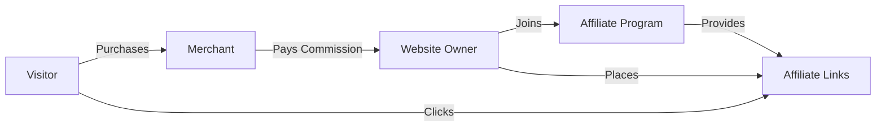

# WordPress Affiliate Systems

## Introduction

Affiliate marketing represents one of the most popular ways to monetize WordPress websites. In essence, affiliate systems allow you to earn commissions by promoting products or services from other companies. When visitors click on your affiliate links and make purchases, you receive a percentage of the sale value.

WordPress offers multiple ways to implement affiliate systems, from dedicated plugins to custom solutions. This guide will walk you through everything you need to know about setting up and managing affiliate systems in WordPress, whether you're looking to join affiliate programs or create your own affiliate network.

## Understanding Affiliate Marketing in WordPress

Before diving into implementation, let's clarify how affiliate marketing works in the WordPress ecosystem:



The basic process includes:

1. Signing up for affiliate programs relevant to your niche
2. Adding affiliate links to your WordPress content
3. Tracking clicks and conversions
4. Receiving commissions for successful referrals

## Popular Affiliate Systems for WordPress

### 1. WordPress Affiliate Plugin Solutions

Several plugins can help you implement affiliate systems in WordPress:

#### AffiliateWP

AffiliateWP is a comprehensive solution for creating your own affiliate program:

```jsx
// Example shortcode to display an affiliate registration form
[affiliate_registration]

// Example shortcode to display affiliate statistics
[affiliate_area]
```

Key features include:
- Affiliate dashboard
- Real-time reporting
- PayPal mass payments
- Commission management
- Referral tracking

#### Easy Affiliate

Easy Affiliate provides tools to run your own affiliate program:

```jsx
// Example shortcode to show affiliate login form
[affiliate_login_form]

// Example shortcode to display affiliate banners
[affiliate_creative_showcases]
```

#### ThirstyAffiliates

ThirstyAffiliates focuses on managing and cloaking affiliate links:

```jsx
// Example link cloaking in ThirstyAffiliates
// Original link: https://example.com/product/ref=youraffiliateID
// Cloaked link: https://yoursite.com/recommends/product-name
```

To implement ThirstyAffiliates:

1. Install and activate the plugin
2. Go to ThirstyAffiliates > Add New
3. Enter the link name and destination URL
4. Save your affiliate link
5. Copy the cloaked link and use it in your content

### 2. Creating Your Own Affiliate Program

If you sell products or services through WordPress, you might want to create your own affiliate program:

#### Using WooCommerce Affiliate System

For WooCommerce stores, you can add an affiliate system with WooCommerce Affiliates:

```jsx
// Example PHP code to check if user is an affiliate
<?php
function is_user_affiliate($user_id) {
    return get_user_meta($user_id, 'affiliate_status', true) === 'active';
}

// Example usage
if (is_user_affiliate(get_current_user_id())) {
    // Show affiliate dashboard
}
?>
```

#### Implementation Steps:

1. Install WooCommerce and the affiliate extension
2. Configure commission rates and payment methods
3. Set up affiliate registration forms
4. Create marketing materials for affiliates
5. Implement tracking and reporting

## Advanced Affiliate Tracking and Management

### Link Cloaking and Management

Link cloaking protects your affiliate links and makes them more user-friendly:

```jsx
// Without cloaking
<a href="https://product.com/ref=youraffiliateID12345">Check this product</a>

// With cloaking (what visitors see)
<a href="https://yoursite.com/go/product-name">Check this product</a>
```

### Implementing with a Custom Solution

For developers who want more control, you can create a simple link cloaking system:

```php
<?php
// functions.php or custom plugin

// Register rewrite rules
function custom_affiliate_rewrites() {
    add_rewrite_rule(
        'go/([^/]+)/?$',
        'index.php?affiliate_link=$matches[1]',
        'top'
    );
}
add_action('init', 'custom_affiliate_rewrites');

// Add query var
function custom_affiliate_query_vars($vars) {
    $vars[] = 'affiliate_link';
    return $vars;
}
add_filter('query_vars', 'custom_affiliate_query_vars');

// Handle the redirect
function custom_affiliate_template_redirect() {
    global $wp_query;
    
    if (isset($wp_query->query_vars['affiliate_link'])) {
        $link_slug = $wp_query->query_vars['affiliate_link'];
        
        // Get the real URL from database or options
        $affiliate_links = get_option('my_affiliate_links', array());
        
        if (isset($affiliate_links[$link_slug])) {
            // Optional: Track the click here
            
            // Redirect to the actual affiliate URL
            wp_redirect($affiliate_links[$link_slug]);
            exit;
        }
    }
}
add_action('template_redirect', 'custom_affiliate_template_redirect');
?>
```

### Tracking Affiliate Performance

For effective affiliate management, tracking performance is crucial:

```php
<?php
// Example of a simple click tracker
function track_affiliate_click($affiliate_id, $link_id) {
    global $wpdb;
    
    $table_name = $wpdb->prefix . 'affiliate_clicks';
    
    $wpdb->insert(
        $table_name,
        array(
            'affiliate_id' => $affiliate_id,
            'link_id' => $link_id,
            'ip_address' => $_SERVER['REMOTE_ADDR'],
            'timestamp' => current_time('mysql'),
            'referrer' => isset($_SERVER['HTTP_REFERER']) ? $_SERVER['HTTP_REFERER'] : '',
            'user_agent' => $_SERVER['HTTP_USER_AGENT']
        )
    );
    
    return $wpdb->insert_id;
}
?>
```

## Implementing Cookie-Based Tracking

Cookies are essential for tracking affiliate referrals over time:

```php
<?php
// Setting an affiliate cookie when someone clicks a link
function set_affiliate_cookie($affiliate_id) {
    // Set cookie for 30 days
    setcookie(
        'affiliate_id',
        $affiliate_id,
        time() + (86400 * 30), // 30 days
        '/',
        $_SERVER['HTTP_HOST'],
        isset($_SERVER['HTTPS']),
        true
    );
}

// Reading the cookie when a purchase is made
function get_referring_affiliate() {
    if (isset($_COOKIE['affiliate_id'])) {
        return $_COOKIE['affiliate_id'];
    }
    return false;
}

// Example usage during WooCommerce checkout
function add_affiliate_commission_on_order($order_id) {
    $affiliate_id = get_referring_affiliate();
    
    if ($affiliate_id) {
        // Calculate commission
        // Credit affiliate
        update_post_meta($order_id, 'referring_affiliate', $affiliate_id);
    }
}
add_action('woocommerce_checkout_order_processed', 'add_affiliate_commission_on_order');
?>
```

## Best Practices for WordPress Affiliate Systems

### 1. Compliance and Disclosure

Always disclose affiliate relationships to comply with FTC guidelines:

```jsx
// Example disclosure component
function AffiliateDisclosure() {
  return (
    <div className="affiliate-disclosure">
      <p>
        <em>Disclosure: This post contains affiliate links. If you purchase via our links, we may earn a commission at no additional cost to you.</em>
      </p>
    </div>
  );
}

// Usage in your MDX
<AffiliateDisclosure />
```

### 2. Performance Optimization

Affiliate links can slow down your site. Here's a solution using asynchronous loading:

```html
<script type="text/javascript">
document.addEventListener('DOMContentLoaded', function() {
    const affiliateLinks = document.querySelectorAll('.affiliate-link');
    
    affiliateLinks.forEach(link => {
        const originalHref = link.getAttribute('data-href');
        link.setAttribute('href', originalHref);
    });
});
</script>

<!-- Example usage -->
<a class="affiliate-link" href="#" data-href="https://actualaffiliatelink.com/ref=123">Product Link</a>
```

### 3. Mobile Optimization

Ensure your affiliate links work well on mobile devices:

```css
/* Example CSS for mobile-friendly affiliate buttons */
.affiliate-button {
    display: inline-block;
    padding: 12px 20px;
    background-color: #f8f9fa;
    border: 1px solid #dee2e6;
    border-radius: 4px;
    margin: 10px 0;
    text-align: center;
    width: 100%;
    max-width: 300px;
    transition: all 0.3s ease;
}

@media (max-width: 768px) {
    .affiliate-button {
        padding: 16px 20px;
        font-size: 16px;
    }
}
```

## Real-World Applications

### Example 1: Product Review Site with Affiliate Links

Below is an example of how to structure a product review that incorporates affiliate links:

```jsx
// ProductReview.js
import React from 'react';

export default function ProductReview() {
  return (
    <div className="product-review">
      <h2>Review: Latest WordPress Theme</h2>
      
      <div className="affiliate-disclosure">
        <em>This review contains affiliate links that support our site.</em>
      </div>
      
      <div className="review-content">
        <p>After testing this theme for two weeks, I found it to be...</p>
        
        <div className="pros-cons">
          <div className="pros">
            <h3>Pros</h3>
            <ul>
              <li>Fast loading speed</li>
              <li>Mobile responsive</li>
              <li>SEO optimized</li>
            </ul>
          </div>
          <div className="cons">
            <h3>Cons</h3>
            <ul>
              <li>Learning curve for beginners</li>
              <li>Limited color options</li>
            </ul>
          </div>
        </div>
        
        <a 
          href="/go/wordpress-theme" 
          className="affiliate-button"
          rel="sponsored nofollow"
        >
          Check Price & Availability
        </a>
      </div>
    </div>
  );
}
```

### Example 2: Implementing an Affiliate Dashboard for Your Own Program

If you're creating your own affiliate program, you'll need a dashboard for affiliates:

```php
<?php
// create-affiliate-dashboard.php

// Register a custom endpoint for the dashboard
function custom_affiliate_endpoints() {
    add_rewrite_endpoint('affiliate-dashboard', EP_ROOT | EP_PAGES);
}
add_action('init', 'custom_affiliate_endpoints');

// Add dashboard content
function affiliate_dashboard_content() {
    // Check if user is an affiliate
    if (!is_user_an_affiliate()) {
        echo '<p>You are not registered as an affiliate.</p>';
        echo '<a href="/affiliate-registration" class="button">Apply Now</a>';
        return;
    }
    
    $current_user = wp_get_current_user();
    $affiliate_id = get_user_meta($current_user->ID, 'affiliate_id', true);
    
    // Get affiliate stats
    $earnings = get_affiliate_earnings($affiliate_id);
    $clicks = get_affiliate_clicks($affiliate_id);
    $conversions = get_affiliate_conversions($affiliate_id);
    
    // Display dashboard
    ?>
    <div class="affiliate-dashboard">
        <h2>Your Affiliate Dashboard</h2>
        
        <div class="stats-container">
            <div class="stat-box">
                <h3>Total Earnings</h3>
                <p class="stat-value">$<?php echo number_format($earnings, 2); ?></p>
            </div>
            <div class="stat-box">
                <h3>Total Clicks</h3>
                <p class="stat-value"><?php echo number_format($clicks); ?></p>
            </div>
            <div class="stat-box">
                <h3>Conversions</h3>
                <p class="stat-value"><?php echo number_format($conversions); ?></p>
            </div>
            <div class="stat-box">
                <h3>Conversion Rate</h3>
                <p class="stat-value">
                    <?php 
                    echo $clicks > 0 ? number_format(($conversions / $clicks) * 100, 2) : '0'; 
                    ?>%
                </p>
            </div>
        </div>
        
        <h3>Your Affiliate Link</h3>
        <div class="affiliate-link-box">
            <input 
                type="text" 
                readonly 
                value="<?php echo site_url('?ref=' . $affiliate_id); ?>" 
                onclick="this.select()"
            />
            <button onclick="copyAffiliateLink()" class="copy-button">Copy</button>
        </div>
        
        <h3>Marketing Materials</h3>
        <div class="marketing-materials">
            <!-- Banners, text links, etc. -->
        </div>
    </div>
    
    <script>
    function copyAffiliateLink() {
        const linkInput = document.querySelector('.affiliate-link-box input');
        linkInput.select();
        document.execCommand('copy');
        alert('Affiliate link copied to clipboard!');
    }
    </script>
    <?php
}

// Hook the content to the endpoint
function affiliate_dashboard_endpoint_content() {
    ob_start();
    affiliate_dashboard_content();
    return ob_get_clean();
}
add_action('woocommerce_account_affiliate-dashboard_endpoint', 'affiliate_dashboard_endpoint_content');
?>
```

## Summary

WordPress affiliate systems offer a powerful way to monetize your website through partnership marketing. Whether you're joining affiliate programs or creating your own, WordPress provides the tools and flexibility to implement effective affiliate strategies.

In this guide, we've covered:

1. Understanding the basics of affiliate marketing in WordPress
2. Popular plugins like AffiliateWP, Easy Affiliate, and ThirstyAffiliates
3. Creating your own affiliate program with WooCommerce
4. Implementing advanced tracking and link management
5. Best practices for compliance, optimization, and mobile responsiveness
6. Real-world applications with practical code examples

By implementing these affiliate strategies, you can create new revenue streams for your WordPress website while providing value to your audience through relevant product recommendations.

## Additional Resources

To continue learning about WordPress affiliate systems:

- Explore the documentation for popular affiliate plugins
- Research affiliate programs in your niche
- Study successful affiliate websites for inspiration
- Keep up with FTC guidelines for affiliate marketing
- Test different affiliate link placements and styles to optimize conversions

## Exercises

1. Install ThirstyAffiliates and create three cloaked affiliate links for products you use
2. Implement a simple affiliate disclosure notice on your website
3. Create a product comparison table with affiliate links using WordPress blocks
4. Set up a basic tracking system to monitor which affiliate links get the most clicks
5. If you sell products, configure a basic affiliate program using WooCommerce Affiliates

By mastering WordPress affiliate systems, you'll unlock new monetization opportunities while building valuable relationships with merchants and brands in your industry.