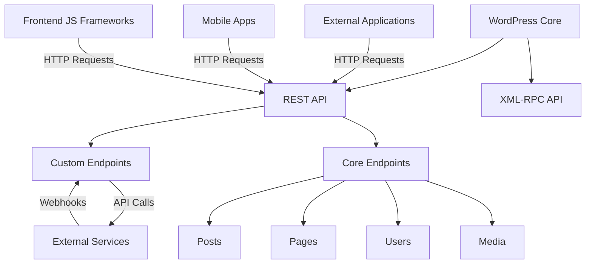

# WordPress API Integrations

## Introduction

WordPress powers over 40% of all websites on the internet, and one of the main reasons for its success is its extensibility. WordPress API integrations allow developers to connect WordPress with external services, build headless CMS configurations, create mobile apps, and develop custom features that extend beyond the core WordPress functionality.

In this guide, we'll explore various ways to work with WordPress APIs, focusing primarily on the WordPress REST API introduced in WordPress 4.7. By the end, you'll understand how to access WordPress data programmatically, authenticate with the API, and build custom integrations with external services.

## Understanding the WordPress REST API

The WordPress REST API is a powerful interface that allows developers to interact with WordPress data using HTTP requests. It follows REST (Representational State Transfer) principles and returns data in JSON format, making it easy to work with in any programming language.

### What is REST?

REST is an architectural style for designing networked applications. RESTful systems use standard HTTP methods:

- `GET` - Retrieve data
- `POST` - Create new data
- `PUT` - Update data
- `DELETE` - Remove data

### WordPress REST API Basics

The WordPress REST API exposes WordPress data through endpoints beginning with `/wp-json/`. The core endpoints use the namespace `wp/v2` and provide access to posts, pages, comments, users, and more.

Let's see a basic example of retrieving posts from a WordPress site:

```javascript
// Fetch the 5 most recent posts
fetch('https://example.com/wp-json/wp/v2/posts?per_page=5')
  .then(response => response.json())
  .then(posts => {
    console.log(posts);
    // Process the posts data
  })
  .catch(error => console.error('Error fetching posts:', error));
```

The response will be an array of post objects, each containing information like the title, content, author, and more:

```json
[
  {
    "id": 123,
    "date": "2023-05-15T12:00:00",
    "title": {
      "rendered": "Hello World"
    },
    "content": {
      "rendered": "<p>Welcome to my WordPress site!</p>"
    },
    "author": 1,
    "excerpt": {
      "rendered": "<p>Welcome to my WordPress site!</p>"
    },
    "_links": {
      // Various links for navigation
    }
  },
  // More posts...
]
```

## Core REST API Endpoints

WordPress provides several built-in endpoints that you can use to access different types of content:

| Content Type | Endpoint |
|-------------|----------|
| Posts | `/wp/v2/posts` |
| Pages | `/wp/v2/pages` |
| Media | `/wp/v2/media` |
| Users | `/wp/v2/users` |
| Categories | `/wp/v2/categories` |
| Tags | `/wp/v2/tags` |
| Comments | `/wp/v2/comments` |

### Working with Posts

To get a specific post, you can use the posts endpoint with the post ID:

```javascript
fetch('https://example.com/wp-json/wp/v2/posts/123')
  .then(response => response.json())
  .then(post => {
    document.getElementById('title').innerHTML = post.title.rendered;
    document.getElementById('content').innerHTML = post.content.rendered;
  });
```

### Filtering and Pagination

The WordPress REST API supports filtering results using query parameters:

```javascript
// Get posts from a specific category
fetch('https://example.com/wp-json/wp/v2/posts?categories=5&per_page=10&page=2')
  .then(response => response.json())
  .then(posts => {
    // Process the filtered posts
  });
```

## Authentication

Many REST API endpoints require authentication, especially for creating or updating content. WordPress supports several authentication methods:

### 1. Application Passwords (recommended)

Since WordPress 5.6, Application Passwords provide a secure way to authenticate API requests:

1. Go to your WordPress user profile
2. Scroll down to "Application Passwords"
3. Enter a name for your application
4. Click "Add New Application Password"
5. Copy the generated password

Now you can use this password for Basic Authentication:

```javascript
const username = 'your_username';
const appPassword = 'xxxx xxxx xxxx xxxx xxxx xxxx';

fetch('https://example.com/wp-json/wp/v2/posts', {
  method: 'POST',
  headers: {
    'Content-Type': 'application/json',
    'Authorization': 'Basic ' + btoa(username + ':' + appPassword)
  },
  body: JSON.stringify({
    title: 'New Post via API',
    content: 'This post was created using the WordPress REST API',
    status: 'publish'
  })
})
.then(response => response.json())
.then(newPost => console.log('Post created:', newPost));
```

### 2. OAuth 1.0a

For more secure applications, you can use OAuth 1.0a authentication with plugins like [WP REST API - OAuth 1.0a Server](https://wordpress.org/plugins/rest-api-oauth1/).

### 3. JWT Authentication

JSON Web Tokens provide a modern authentication method. You can use plugins like [JWT Authentication for WP REST API](https://wordpress.org/plugins/jwt-authentication-for-wp-rest-api/).

## Creating Custom REST API Endpoints

You can extend the WordPress REST API with your own custom endpoints using the `register_rest_route()` function:

```php
add_action('rest_api_init', function () {
  register_rest_route('my-plugin/v1', '/featured-products', [
    'methods' => 'GET',
    'callback' => 'get_featured_products',
    'permission_callback' => '__return_true'
  ]);
});

function get_featured_products() {
  // Query for featured products
  $args = [
    'post_type' => 'product',
    'meta_query' => [
      [
        'key' => 'featured',
        'value' => '1',
        'compare' => '='
      ]
    ],
    'posts_per_page' => 10
  ];
  
  $query = new WP_Query($args);
  $products = [];
  
  if ($query->have_posts()) {
    while ($query->have_posts()) {
      $query->the_post();
      $products[] = [
        'id' => get_the_ID(),
        'title' => get_the_title(),
        'excerpt' => get_the_excerpt(),
        'thumbnail' => get_the_post_thumbnail_url(),
        'price' => get_post_meta(get_the_ID(), 'price', true)
      ];
    }
    wp_reset_postdata();
  }
  
  return $products;
}
```

Now you can access your custom endpoint at `https://example.com/wp-json/my-plugin/v1/featured-products`.

## Integrating with External APIs

One of the most powerful applications of WordPress APIs is integrating with external services.

### Example: Sending Post Data to Mailchimp

Here's how you could automatically add subscribers to Mailchimp when they register on your WordPress site:

```php
// Hook into user registration
add_action('user_register', 'sync_user_to_mailchimp');

function sync_user_to_mailchimp($user_id) {
  // Get user data
  $user = get_userdata($user_id);
  $email = $user->user_email;
  $first_name = $user->first_name;
  $last_name = $user->last_name;
  
  // Mailchimp API details
  $api_key = 'your-mailchimp-api-key';
  $list_id = 'your-list-id';
  $data_center = substr($api_key, strpos($api_key, '-') + 1);
  
  // Prepare data for Mailchimp
  $data = [
    'email_address' => $email,
    'status' => 'subscribed',
    'merge_fields' => [
      'FNAME' => $first_name,
      'LNAME' => $last_name
    ]
  ];
  
  // Make API request
  $url = "https://{$data_center}.api.mailchimp.com/3.0/lists/{$list_id}/members/";
  
  $response = wp_remote_post($url, [
    'headers' => [
      'Authorization' => 'Basic ' . base64_encode('user:' . $api_key),
      'Content-Type' => 'application/json'
    ],
    'body' => json_encode($data)
  ]);
  
  // Log the result
  if (is_wp_error($response)) {
    error_log('Mailchimp API error: ' . $response->get_error_message());
  } else {
    $body = json_decode(wp_remote_retrieve_body($response), true);
    error_log('User added to Mailchimp: ' . $email);
  }
}
```

### Example: Displaying Weather Data

Here's how to integrate an external weather API into your WordPress site:

```php
// Create a shortcode to display weather
add_shortcode('display_weather', 'get_weather_data');

function get_weather_data($atts) {
  // Parse attributes
  $atts = shortcode_atts([
    'city' => 'New York',
    'country' => 'us'
  ], $atts);
  
  // OpenWeatherMap API key
  $api_key = 'your-openweathermap-api-key';
  $city = urlencode($atts['city']);
  $country = $atts['country'];
  
  // Cache key
  $cache_key = 'weather_data_' . md5($city . $country);
  
  // Check for cached data
  $cached_data = get_transient($cache_key);
  if ($cached_data !== false) {
    return $cached_data;
  }
  
  // Make API request
  $url = "https://api.openweathermap.org/data/2.5/weather?q={$city},{$country}&units=metric&appid={$api_key}";
  $response = wp_remote_get($url);
  
  if (is_wp_error($response)) {
    return 'Weather data unavailable';
  }
  
  $data = json_decode(wp_remote_retrieve_body($response), true);
  
  if (!isset($data['main']) || !isset($data['weather'][0])) {
    return 'Weather data unavailable';
  }
  
  // Format the weather display
  $temperature = $data['main']['temp'];
  $description = $data['weather'][0]['description'];
  $icon = $data['weather'][0]['icon'];
  $icon_url = "https://openweathermap.org/img/wn/{$icon}@2x.png";
  
  $output = "<div class='weather-widget'>";
  $output .= "<h3>Weather in {$atts['city']}</h3>";
  $output .= "";
  $output .= "<p>{$temperature}°C, {$description}</p>";
  $output .= "</div>";
  
  // Cache the result for 1 hour
  set_transient($cache_key, $output, 3600);
  
  return $output;
}
```

You can now use the shortcode `[display_weather city="London" country="uk"]` in your posts or pages.

## Building a Headless WordPress Setup

WordPress can function as a headless CMS, where the frontend is decoupled from WordPress and built using frameworks like React, Vue, or Next.js.

Here's a basic example of fetching WordPress content in a React application:

```jsx
import React, { useState, useEffect } from 'react';

function WordPressBlog() {
  const [posts, setPosts] = useState([]);
  const [isLoading, setIsLoading] = useState(true);
  
  useEffect(() => {
    async function fetchPosts() {
      try {
        const response = await fetch('https://example.com/wp-json/wp/v2/posts?_embed');
        const data = await response.json();
        setPosts(data);
        setIsLoading(false);
      } catch (error) {
        console.error('Error fetching posts:', error);
        setIsLoading(false);
      }
    }
    
    fetchPosts();
  }, []);
  
  if (isLoading) {
    return <div>Loading posts...</div>;
  }
  
  return (
    <div className="blog">
      <h1>Latest Posts</h1>
      {posts.map(post => (
        <article key={post.id}>
          <h2 dangerouslySetInnerHTML={{ __html: post.title.rendered }} />
          {post._embedded && post._embedded['wp:featuredmedia'] && (
            
          )}
          <div dangerouslySetInnerHTML={{ __html: post.excerpt.rendered }} />
          <a href={`/post/${post.slug}`}>Read more</a>
        </article>
      ))}
    </div>
  );
}

export default WordPressBlog;
```

## Advanced API Usage

### Batching Requests

To reduce the number of API calls, you can batch multiple requests:

```javascript
fetch('https://example.com/wp-json/wp/v2/posts?_embed&include=1,2,3,4,5')
  .then(response => response.json())
  .then(posts => {
    // Process multiple posts at once
  });
```

### WPGraphQL

For more complex data requirements, consider using [WPGraphQL](https://www.wpgraphql.com/), which provides a GraphQL API for WordPress:

```javascript
// Query multiple data types in a single request
const QUERY = `
  query SiteData {
    posts(first: 5) {
      nodes {
        id
        title
        excerpt
        author {
          node {
            name
            avatar {
              url
            }
          }
        }
      }
    }
    generalSettings {
      title
      description
    }
  }
`;

fetch('https://example.com/graphql', {
  method: 'POST',
  headers: { 'Content-Type': 'application/json' },
  body: JSON.stringify({ query: QUERY })
})
.then(response => response.json())
.then(data => {
  console.log(data.data); // Contains posts and general settings
});
```

### API Architecture Diagram

Here's a visual representation of how WordPress APIs interact with external systems:



## Common Challenges and Solutions

### CORS Issues

When accessing the WordPress API from a different domain, you might encounter CORS (Cross-Origin Resource Sharing) issues. Add this to your theme's functions.php:

```php
add_action('rest_api_init', function() {
  remove_filter('rest_pre_serve_request', 'rest_send_cors_headers');
  add_filter('rest_pre_serve_request', function($value) {
    header('Access-Control-Allow-Origin: *');
    header('Access-Control-Allow-Methods: GET, POST, OPTIONS, PUT, DELETE');
    header('Access-Control-Allow-Credentials: true');
    header('Access-Control-Expose-Headers: X-WP-Total, X-WP-TotalPages');
    return $value;
  });
}, 15);
```

### Rate Limiting

For high-traffic applications, you might need to implement rate limiting. Here's a simple example:

```php
add_action('rest_api_init', function() {
  add_filter('rest_pre_dispatch', 'api_rate_limit', 10, 3);
});

function api_rate_limit($result, $server, $request) {
  $ip = $_SERVER['REMOTE_ADDR'];
  $cache_key = 'api_rate_' . md5($ip);
  $requests = get_transient($cache_key) ?: 0;
  
  // Limit to 60 requests per minute
  if ($requests >= 60) {
    return new WP_Error('too_many_requests', 'Rate limit exceeded', ['status' => 429]);
  }
  
  set_transient($cache_key, $requests + 1, 60);
  return $result;
}
```

## Summary

WordPress APIs offer powerful tools for extending and integrating WordPress with other systems. In this guide, we've covered:

1. The WordPress REST API basics and core endpoints
2. Authentication methods for secure API interactions
3. Creating custom endpoints to expose your own data
4. Integrating WordPress with external APIs
5. Building headless WordPress configurations
6. Advanced usage patterns and common challenges

With these tools, you can transform WordPress from a simple CMS into a flexible application platform that powers websites, apps, and integrates with a wide range of services.

## Additional Resources

- [WordPress REST API Handbook](https://developer.wordpress.org/rest-api/)
- [WPGraphQL Documentation](https://www.wpgraphql.com/docs)
- [WordPress REST API Authentication Guide](https://developer.wordpress.org/rest-api/using-the-rest-api/authentication/)

## Exercises

1. Create a custom REST API endpoint that returns the 5 most recent posts from a specific category.
2. Build a simple JavaScript application that displays WordPress posts using the REST API.
3. Integrate your WordPress site with a third-party service like Slack to send notifications when new posts are published.
4. Implement authentication using Application Passwords and create a form that allows authenticated users to submit posts.
5. Create a React or Vue component that fetches and displays WordPress content in a custom format.