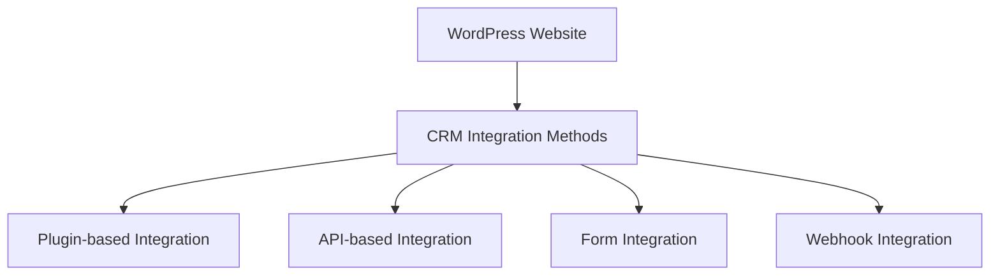

# WordPress CRM Integration

## Introduction

Customer Relationship Management (CRM) is a technology for managing all your company's relationships and interactions with customers and potential customers. When integrated with WordPress, a CRM system becomes a powerful tool that helps businesses capture leads, track user interactions, and personalize communication with visitors and customers.

In this guide, you'll learn how to integrate various CRM systems with your WordPress website, explore common use cases, and discover best practices to maximize the benefits of these integrations.

## Why Integrate a CRM with WordPress?

Before diving into the technical aspects, let's understand the benefits:

- **Centralized customer data**: Store all customer information in one place
- **Automated lead capture**: Convert website visitors into leads automatically
- **Enhanced user experience**: Deliver personalized content based on user data
- **Improved marketing efficiency**: Target specific user segments with relevant offers
- **Better business decisions**: Get insights through detailed analytics and reporting

## Common WordPress CRM Integration Methods

There are several ways to connect WordPress with CRM systems:



### 1. Plugin-based Integration

Many popular CRM platforms offer dedicated WordPress plugins for easy integration.

#### Example: HubSpot WordPress Integration

**Step 1**: Install the HubSpot plugin

```bash
# Via WP-CLI
wp plugin install leadin --activate
```

**Step 2**: Connect your HubSpot account

In your WordPress admin area, navigate to the HubSpot settings and click "Connect" to link your HubSpot account.

**Step 3**: Configure tracking options

```jsx
// The plugin will insert tracking code similar to this:
<script type="text/javascript" id="hs-script-loader" async defer src="//js.hs-scripts.com/YOUR_PORTAL_ID.js"></script>
```

### 2. API-based Integration

For more customized integrations, you can use the CRM's API directly.

#### Example: Salesforce API Integration

**Step 1**: Create a connected app in Salesforce

**Step 2**: Create a WordPress function to send data to Salesforce

```php
function send_lead_to_salesforce($lead_data) {
    $salesforce_url = 'https://login.salesforce.com/services/oauth2/token';
    
    // Authentication parameters
    $auth_params = array(
        'grant_type' => 'password',
        'client_id' => 'YOUR_CONSUMER_KEY',
        'client_secret' => 'YOUR_CONSUMER_SECRET',
        'username' => 'YOUR_SALESFORCE_USERNAME',
        'password' => 'YOUR_SALESFORCE_PASSWORD' . 'YOUR_SECURITY_TOKEN'
    );
    
    // Get access token
    $auth_response = wp_remote_post($salesforce_url, array(
        'body' => $auth_params,
        'method' => 'POST',
        'timeout' => 45,
        'headers' => array('Accept' => 'application/json')
    ));
    
    if (is_wp_error($auth_response)) {
        return false;
    }
    
    $auth_body = json_decode(wp_remote_retrieve_body($auth_response));
    $access_token = $auth_body->access_token;
    $instance_url = $auth_body->instance_url;
    
    // Create lead in Salesforce
    $lead_url = $instance_url . '/services/data/v52.0/sobjects/Lead';
    
    $lead_response = wp_remote_post($lead_url, array(
        'method' => 'POST',
        'timeout' => 45,
        'headers' => array(
            'Authorization' => 'Bearer ' . $access_token,
            'Content-Type' => 'application/json'
        ),
        'body' => json_encode($lead_data)
    ));
    
    return !is_wp_error($lead_response);
}
```

**Step 3**: Hook the function to form submissions or user registrations

```php
add_action('user_register', 'handle_new_user_registration');

function handle_new_user_registration($user_id) {
    $user = get_userdata($user_id);
    
    $lead_data = array(
        'FirstName' => $user->first_name,
        'LastName' => $user->last_name,
        'Email' => $user->user_email,
        'Company' => 'Website Registration',
        'LeadSource' => 'WordPress Website'
    );
    
    send_lead_to_salesforce($lead_data);
}
```

### 3. Form Integration

One of the most common ways to integrate CRM with WordPress is through form submissions.

#### Example: Contact Form 7 with ActiveCampaign

**Step 1**: Install Contact Form 7 and its ActiveCampaign add-on

**Step 2**: Create a contact form with the necessary fields

```html
<label> Your Name (required)
    [text* your-name] </label>

<label> Your Email (required)
    [email* your-email] </label>

<label> Your Phone
    [tel your-phone] </label>

<label> Your Message
    [textarea your-message] </label>

[submit "Send"]
```

**Step 3**: Configure ActiveCampaign integration settings to map form fields to CRM fields

```php
// This would typically be done through a plugin's settings interface,
// but the underlying code would set up a mapping like:

$field_mappings = array(
    'your-name' => 'FIRSTNAME',
    'your-email' => 'EMAIL',
    'your-phone' => 'PHONE'
);

// And define tags to apply:
$tags_to_apply = array('website-inquiry', 'contact-form');
```

## Creating a Custom CRM Integration Plugin

For more advanced users, creating a custom integration plugin can provide exactly the functionality you need.

### Basic Plugin Structure

```php
<?php
/**
 * Plugin Name: Custom CRM Integration
 * Description: Integrates WordPress with our CRM system
 * Version: 1.0
 * Author: Your Name
 */

// Prevent direct access
if (!defined('ABSPATH')) exit;

class Custom_CRM_Integration {
    
    public function __construct() {
        // Add hooks
        add_action('init', array($this, 'register_settings'));
        add_action('user_register', array($this, 'sync_new_user'));
        add_action('woocommerce_checkout_order_processed', array($this, 'sync_new_order'), 10, 1);
        
        // Add admin menu
        add_action('admin_menu', array($this, 'add_admin_menu'));
    }
    
    public function register_settings() {
        register_setting('custom_crm_settings', 'custom_crm_api_key');
        register_setting('custom_crm_settings', 'custom_crm_instance_url');
    }
    
    public function add_admin_menu() {
        add_options_page(
            'CRM Integration Settings',
            'CRM Integration',
            'manage_options',
            'crm-integration',
            array($this, 'settings_page')
        );
    }
    
    public function settings_page() {
        // Settings page HTML
        ?>
        <div class="wrap">
            <h1>CRM Integration Settings</h1>
            <form method="post" action="options.php">
                <?php
                settings_fields('custom_crm_settings');
                do_settings_sections('custom_crm_settings');
                ?>
                <table class="form-table">
                    <tr>
                        <th scope="row">API Key</th>
                        <td>
                            <input type="text" name="custom_crm_api_key" 
                                value="<?php echo esc_attr(get_option('custom_crm_api_key')); ?>" class="regular-text" />
                        </td>
                    </tr>
                    <tr>
                        <th scope="row">Instance URL</th>
                        <td>
                            <input type="url" name="custom_crm_instance_url" 
                                value="<?php echo esc_attr(get_option('custom_crm_instance_url')); ?>" class="regular-text" />
                        </td>
                    </tr>
                </table>
                <?php submit_button(); ?>
            </form>
        </div>
        <?php
    }
    
    public function sync_new_user($user_id) {
        $user = get_userdata($user_id);
        
        // Prepare data for CRM
        $data = array(
            'email' => $user->user_email,
            'name' => $user->display_name,
            'source' => 'WordPress Registration',
            'created_at' => date('Y-m-d H:i:s')
        );
        
        // Send to CRM
        $this->send_data_to_crm('contacts/create', $data);
    }
    
    public function sync_new_order($order_id) {
        $order = wc_get_order($order_id);
        
        // Prepare order data for CRM
        $data = array(
            'email' => $order->get_billing_email(),
            'name' => $order->get_billing_first_name() . ' ' . $order->get_billing_last_name(),
            'amount' => $order->get_total(),
            'products' => array()
        );
        
        // Get line items
        foreach ($order->get_items() as $item) {
            $data['products'][] = array(
                'id' => $item->get_product_id(),
                'name' => $item->get_name(),
                'quantity' => $item->get_quantity(),
                'price' => $item->get_total()
            );
        }
        
        // Send to CRM
        $this->send_data_to_crm('orders/create', $data);
    }
    
    private function send_data_to_crm($endpoint, $data) {
        $api_key = get_option('custom_crm_api_key');
        $instance_url = get_option('custom_crm_instance_url');
        
        if (!$api_key || !$instance_url) {
            error_log('CRM Integration: API credentials not configured');
            return false;
        }
        
        $url = trailingslashit($instance_url) . $endpoint;
        
        $response = wp_remote_post($url, array(
            'method' => 'POST',
            'timeout' => 45,
            'headers' => array(
                'Authorization' => 'Bearer ' . $api_key,
                'Content-Type' => 'application/json'
            ),
            'body' => json_encode($data)
        ));
        
        if (is_wp_error($response)) {
            error_log('CRM Integration Error: ' . $response->get_error_message());
            return false;
        }
        
        return true;
    }
}

// Initialize the plugin
new Custom_CRM_Integration();
```

## Popular WordPress CRM Integration Plugins

Several ready-made plugins make CRM integration simpler:

1. **HubSpot for WordPress**: Adds HubSpot's forms, popups, live chat, and CRM functionality
2. **WP Fusion**: Connect to 50+ CRMs and marketing automation platforms
3. **Jetpack CRM**: A fully-featured CRM built specifically for WordPress
4. **Groundhogg**: Self-hosted marketing automation and CRM solution
5. **FluentCRM**: Email marketing automation and CRM plugin

## Real-World Applications

### E-commerce Integration Example

For WooCommerce stores, integrating with a CRM can help track customer purchases and behavior:

```php
// Hook into WooCommerce order completion
add_action('woocommerce_order_status_completed', 'sync_completed_order_to_crm');

function sync_completed_order_to_crm($order_id) {
    $order = wc_get_order($order_id);
    
    // Get customer information
    $customer = array(
        'email' => $order->get_billing_email(),
        'first_name' => $order->get_billing_first_name(),
        'last_name' => $order->get_billing_last_name(),
        'phone' => $order->get_billing_phone(),
        'address' => array(
            'line1' => $order->get_billing_address_1(),
            'line2' => $order->get_billing_address_2(),
            'city' => $order->get_billing_city(),
            'state' => $order->get_billing_state(),
            'postal_code' => $order->get_billing_postcode(),
            'country' => $order->get_billing_country()
        )
    );
    
    // Get order items
    $items = array();
    foreach ($order->get_items() as $item_id => $item) {
        $product = $item->get_product();
        $items[] = array(
            'product_id' => $product->get_id(),
            'name' => $item->get_name(),
            'quantity' => $item->get_quantity(),
            'price' => $order->get_item_total($item, false, false),
            'total' => $item->get_total()
        );
    }
    
    // Order information
    $order_data = array(
        'id' => $order->get_id(),
        'total' => $order->get_total(),
        'currency' => $order->get_currency(),
        'payment_method' => $order->get_payment_method_title(),
        'items' => $items
    );
    
    // Send to CRM
    $crm_data = array(
        'customer' => $customer,
        'order' => $order_data,
        'source' => 'woocommerce'
    );
    
    your_crm_api_function($crm_data);
}
```

### Membership Site Integration

For membership sites, track sign-ups, course progress, and engagement:

```php
// Assuming you're using MemberPress
add_action('mepr-signup', 'track_membership_signup_in_crm');

function track_membership_signup_in_crm($event) {
    $user = $event->user;
    $membership = $event->product;
    
    $data = array(
        'user_id' => $user->ID,
        'email' => $user->user_email,
        'name' => $user->display_name,
        'membership_id' => $membership->ID,
        'membership_name' => $membership->post_title,
        'price' => $membership->price,
        'status' => 'active',
        'signup_date' => date('Y-m-d H:i:s')
    );
    
    your_crm_api_function($data);
}
```

## Best Practices for WordPress CRM Integration

1. **Respect user privacy**: Always obtain proper consent before collecting and storing user data
2. **Keep your integrations secure**: Use API keys safely, preferably through environment variables
3. **Only collect data you need**: Avoid collecting unnecessary personal information
4. **Test thoroughly**: Ensure data flows correctly in both directions
5. **Document your integration**: Keep track of what data is sent where and why
6. **Respect API rate limits**: Implement proper queueing and batching for large data transfers
7. **Handle errors gracefully**: Implement proper error handling and notifications

## Troubleshooting Common Issues

### API Connection Problems

If your CRM connection fails, check:

- API credentials are correct
- WordPress site can make outbound connections
- CRM API service is online
- Firewall or security settings aren't blocking requests

### Data Mapping Issues

If data isn't appearing correctly in your CRM:

```php
// Debug your data before sending to the CRM
function debug_crm_data($data) {
    // Log data for inspection
    error_log('CRM Data: ' . print_r($data, true));
    
    // Verify required fields
    $required_fields = array('email', 'name');
    foreach ($required_fields as $field) {
        if (empty($data[$field])) {
            error_log('Missing required field: ' . $field);
        }
    }
}
```

## Summary

Integrating a CRM system with WordPress helps businesses streamline customer management, enhance marketing efforts, and improve overall user experience. Whether you choose a plugin-based approach or a custom API integration, the connection between your website and CRM can provide valuable insights and automation capabilities.

By following best practices and understanding the various integration methods, you can create a powerful system that captures leads, tracks user interactions, and helps grow your business.

## Additional Resources

- Learn more about WordPress hooks and filters to enhance your CRM integrations
- Explore webhooks for real-time data synchronization
- Study data privacy regulations like GDPR and CCPA to ensure compliance
- Look into marketing automation tools that can work alongside your CRM

## Exercises

1. Install a CRM plugin (like HubSpot or Jetpack CRM) and configure it to track form submissions
2. Create a simple custom integration that sends WordPress user registrations to a CRM via API
3. Set up a webhook endpoint in WordPress that can receive data from a CRM system
4. Implement lead scoring based on WordPress user activity
5. Create a dashboard widget that shows recent CRM data directly in the WordPress admin area