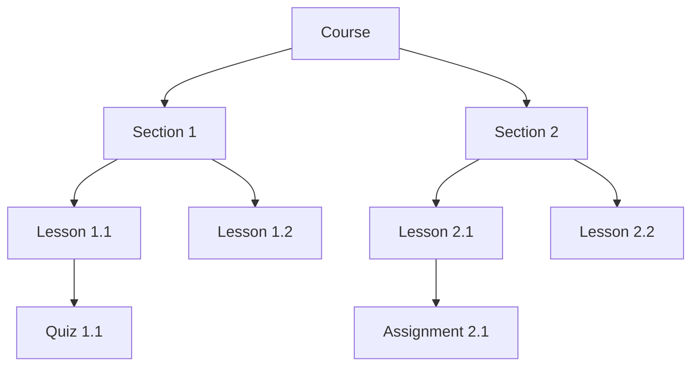
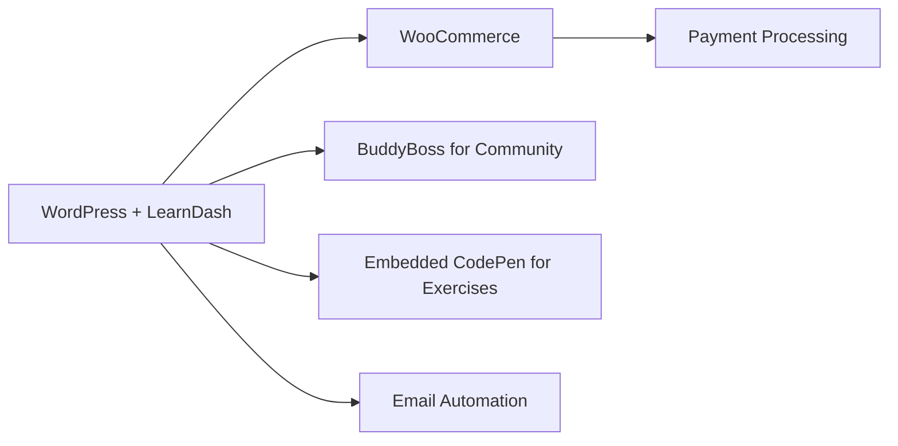

# WordPress LMS Integration

## Introduction

Learning Management Systems (LMS) are powerful tools that help you create, manage, and deliver educational content online. Integrating an LMS with WordPress transforms your website into a full-featured e-learning platform where you can offer courses, track student progress, manage assignments, and even monetize your educational content.

In this guide, we'll explore how to integrate LMS functionality into your WordPress website, covering:

- What an LMS integration is and why you might need it
- Popular WordPress LMS plugins
- Step-by-step integration methods
- Customization options and best practices
- Real-world examples and use cases

## What is an LMS Integration?

An LMS integration refers to adding learning management capabilities to your existing WordPress website. This allows you to:

- Create and organize courses and lessons
- Enroll and manage students
- Track progress and completion rates
- Issue certificates or badges
- Sell courses and manage payments
- Create quizzes and assessments
- Enable student discussions and interaction

## Popular WordPress LMS Plugins

Several excellent LMS plugins are available for WordPress. Here are some of the most widely used options:

1. **LearnDash** - A premium, feature-rich LMS plugin
2. **LifterLMS** - Offers both free and premium versions
3. **Tutor LMS** - Modern interface with free and premium options
4. **LearnPress** - A lightweight, free LMS plugin
5. **Sensei** - Created by WooCommerce/Automattic

## Basic LMS Integration: Step by Step

Let's walk through the process of integrating an LMS into your WordPress website using LifterLMS as our example.

### Step 1: Install and Activate the LMS Plugin

```php
// This is handled through the WordPress admin interface
// Navigate to Plugins > Add New > Search for "LifterLMS"
// Click "Install Now" and then "Activate"

// Alternatively, you can install via FTP or using WP-CLI:
// WP-CLI command to install and activate LifterLMS
wp plugin install lifterlms --activate
```

### Step 2: Run the Setup Wizard

Most LMS plugins include a setup wizard to help you configure the basic settings. For LifterLMS, you'll be prompted to:

1. Configure pages (Course Catalog, Student Dashboard, etc.)
2. Set up payment gateways
3. Create your first course

### Step 3: Create Your First Course

The core of any LMS is its course structure. Here's how a typical course hierarchy looks:



In the WordPress admin, you'll typically:

1. Go to Courses > Add New
2. Add a title, description, featured image, and pricing
3. Build your course structure with sections and lessons
4. Add quizzes, assignments, and other content types

## Advanced Integration: WordPress Hooks and APIs

For more custom integrations, you can use WordPress hooks to interact with your LMS plugin. Here's an example using LearnDash hooks:

```php
/**
 * Award a badge when a user completes a course
 */
function custom_award_badge_on_course_completion( $data ) {
    // Get user ID and course ID from the completion data
    $user_id = $data['user']->ID;
    $course_id = $data['course']->ID;
    
    // Award the badge (custom function)
    my_badge_system_award_badge( $user_id, 'course-completed', $course_id );
    
    // Log the achievement
    error_log( "User $user_id completed course $course_id and received a badge!" );
}
add_action( 'learndash_course_completed', 'custom_award_badge_on_course_completion' );
```

## Enhancing Your LMS with Additional Integrations

To create a complete learning ecosystem, you might want to integrate your WordPress LMS with other tools:

### WooCommerce Integration

Most LMS plugins offer WooCommerce integration for advanced e-commerce capabilities:

```php
/**
 * Example: Mark a course as complete when a WooCommerce subscription is canceled
 */
function mark_course_incomplete_on_subscription_cancellation( $subscription ) {
    $user_id = $subscription->get_user_id();
    $course_id = get_post_meta( $subscription->get_id(), 'linked_course_id', true );
    
    if ( $course_id && function_exists( 'learndash_mark_complete' ) ) {
        // Remove the course completion status
        learndash_course_remove_user_progress( $user_id, $course_id );
        
        // Log the action
        error_log( "Course progress reset for user $user_id on course $course_id due to subscription cancellation" );
    }
}
add_action( 'woocommerce_subscription_status_cancelled', 'mark_course_incomplete_on_subscription_cancellation' );
```

### User Registration and Membership Integration

You might want to automatically enroll users in courses based on their membership level:

```php
/**
 * Example: Automatically enroll users in a course when they register
 */
function auto_enroll_new_users( $user_id ) {
    // Course ID to enroll new users in
    $course_id = 123;
    
    // Check if the LMS function exists
    if ( function_exists( 'ld_update_course_access' ) ) {
        // Enroll the user
        ld_update_course_access( $user_id, $course_id );
        
        // Send welcome email
        wp_mail(
            get_userdata( $user_id )->user_email,
            'Welcome to your new course!',
            'You have been enrolled in the course automatically. Login to begin learning!'
        );
    }
}
add_action( 'user_register', 'auto_enroll_new_users' );
```

## Real-world Example: Building a Coding Bootcamp Website

Let's walk through a practical example of building a coding bootcamp website with WordPress and an LMS integration.

### Project Requirements:

1. Free introduction courses and paid advanced courses
2. Progress tracking and certifications
3. Code editor integrated into lessons
4. Community forum for students
5. Automated email course reminders

### Implementation Strategy:



### Key Integration Points:

1. **Course Structure Setup**:
   - Create a "Web Development Path" with multiple courses
   - Organize courses into beginner, intermediate, and advanced tracks

2. **Code Editor Integration**:
   - Embed CodePen examples in lessons using WordPress blocks or shortcodes:

```html
<!-- Example of embedding CodePen in a LearnDash lesson -->
<div class="coding-exercise">
  <h3>Try it yourself:</h3>
  <iframe 
    height="400" 
    style="width: 100%;" 
    scrolling="no" 
    title="JavaScript Exercise" 
    src="https://codepen.io/your-username/embed/your-pen-id?default-tab=js,result" 
    frameborder="no" 
    loading="lazy">
  </iframe>
  
  <div class="exercise-instructions">
    <p>Modify the code to create a function that calculates the area of a rectangle.</p>
  </div>
</div>
```

3. **Progress Tracking Implementation**:
   - Use the LMS built-in progress tracking
   - Add custom tracking for code exercises:

```php
/**
 * Track completion of coding exercises
 */
function track_coding_exercise_completion() {
    // Verify nonce for security
    check_ajax_referer( 'coding_exercise_nonce', 'security' );
    
    // Get data
    $user_id = get_current_user_id();
    $exercise_id = isset( $_POST['exercise_id'] ) ? intval( $_POST['exercise_id'] ) : 0;
    $lesson_id = isset( $_POST['lesson_id'] ) ? intval( $_POST['lesson_id'] ) : 0;
    
    // Record completion
    update_user_meta( 
        $user_id, 
        'completed_exercise_' . $exercise_id, 
        array(
            'completed_date' => current_time( 'mysql' ),
            'lesson_id' => $lesson_id
        )
    );
    
    // Return success
    wp_send_json_success( array( 'message' => 'Exercise completion recorded' ) );
}
add_action( 'wp_ajax_track_coding_exercise', 'track_coding_exercise_completion' );
```

4. **Certificate Generation**:
   - Create custom certificate templates for each course level
   - Add code to automatically generate certificates upon course completion

## Best Practices for WordPress LMS Integration

1. **Start with a performance-optimized WordPress setup**
   - Use a quality hosting provider with sufficient resources
   - Implement caching but configure it correctly for logged-in users

2. **Choose the right LMS plugin for your specific needs**
   - Consider feature requirements, budget, and long-term support

3. **Optimize your course structure**
   - Break content into manageable lessons
   - Use a mix of content types (video, text, quizzes, etc.)

4. **Plan your content protection strategy**
   - Decide how to protect premium content
   - Configure user roles and permissions appropriately

5. **Test the student experience thoroughly**
   - Check all functions from user registration to course completion
   - Test on different devices and browsers

## Common Issues and Solutions

### Issue: Slow Page Loading

The most common issue with WordPress LMS sites is slow performance due to the complexity of these plugins.

**Solution:**
```php
/**
 * Example: Optimize LearnDash settings for better performance
 */
function optimize_learndash_performance() {
    // Check if LearnDash is active
    if ( class_exists( 'SFWD_LMS' ) ) {
        // Disable LearnDash debug mode
        update_option( 'learndash_settings_debug_enabled', '' );
        
        // Reduce quiz data stored in browser local storage
        update_option( 'learndash_settings_quiz_builder', array(
            'enabled' => 'yes',
            'per_page' => 10 // Reduce from default
        ));
    }
}
add_action( 'admin_init', 'optimize_learndash_performance' );
```

### Issue: Course Content Not Showing for Enrolled Users

**Solution:** Check user enrollment status and role capabilities:

```php
/**
 * Troubleshooting function: Check if user is properly enrolled
 */
function check_user_course_access( $user_id, $course_id ) {
    // For LearnDash
    if ( function_exists( 'ld_course_access_from_update' ) ) {
        $access_from = ld_course_access_from_update( $user_id, $course_id );
        error_log( "User $user_id access to course $course_id: " . ( $access_from ? 'Yes' : 'No' ) );
        return $access_from;
    }
    
    // For LifterLMS
    if ( function_exists( 'llms_is_user_enrolled' ) ) {
        $is_enrolled = llms_is_user_enrolled( $user_id, $course_id );
        error_log( "User $user_id enrolled in course $course_id: " . ( $is_enrolled ? 'Yes' : 'No' ) );
        return $is_enrolled;
    }
    
    return false;
}
```

## Summary

WordPress LMS integration enables you to transform your WordPress website into a powerful e-learning platform. By selecting the right LMS plugin and following the integration steps outlined in this guide, you can create engaging online courses, manage students, track progress, and even monetize your educational content.

Remember that successful integration requires careful planning, thorough testing, and ongoing optimization. Pay attention to performance considerations, user experience, and content protection to ensure your e-learning platform delivers value to your students.

## Additional Resources

Here are some resources to help you continue learning about WordPress LMS integration:

1. Official documentation for popular LMS plugins:
   - [LearnDash Developer Documentation](https://developers.learndash.com/)
   - [LifterLMS Developer Resources](https://lifterlms.com/docs/development-resources/)

2. WordPress hooks and filters reference:
   - [WordPress Developer Hooks Reference](https://developer.wordpress.org/reference/hooks/)

3. Performance optimization guides:
   - [WordPress Performance Optimization Guide](https://wordpress.org/support/article/optimization/)

## Practice Exercises

1. **Basic Exercise:** Install a free LMS plugin like LearnPress and create a simple course with at least one lesson and quiz.

2. **Intermediate Exercise:** Create a custom dashboard widget that displays a student's progress across all enrolled courses.

3. **Advanced Exercise:** Develop a custom plugin that extends an existing LMS plugin with a new feature, such as a specialized quiz type for code challenges or a custom certificate generator.

Happy teaching and learning with WordPress LMS!