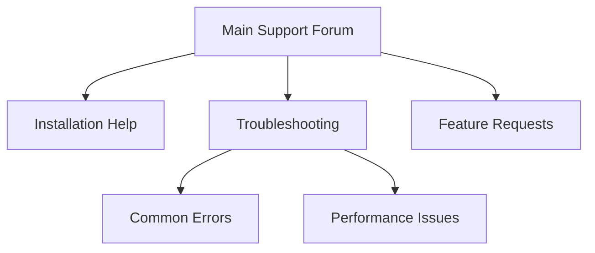

# WordPress Forum Integration

## Introduction

Forums provide a structured way for community members to engage in discussions, ask questions, and share knowledge. Integrating forum functionality into your WordPress site can transform a static website into a dynamic community hub where users interact with each other. This integration can increase user engagement, build community loyalty, and provide valuable feedback for site owners.

In this tutorial, we'll explore different options for integrating forums into your WordPress site, from using dedicated plugins to implementing custom solutions.

## Why Add Forums to WordPress?

Forums can benefit your WordPress site in several ways:

- **Community Building**: Create a space for users to connect and engage
- **Knowledge Sharing**: Allow users to ask questions and receive answers
- **Content Generation**: User-generated content can enhance your site's value
- **SEO Benefits**: Discussion threads can rank for long-tail keywords
- **Customer Support**: Provide a platform for addressing user inquiries

## Popular WordPress Forum Plugins

### bbPress

[bbPress](https://bbpress.org/) is the most popular and lightweight forum plugin for WordPress, developed by the same team behind WordPress itself.

#### Key Features
- Seamless WordPress integration
- Simple setup and configuration
- Compatible with most WordPress themes
- Extendable with add-ons and extensions
- User roles and permissions management

#### Installing bbPress

1. Log in to your WordPress dashboard
2. Go to Plugins > Add New
3. Search for "bbPress"
4. Click "Install Now" and then "Activate"

```php
// Example of registering a custom bbPress forum template
function my_custom_template_for_bbpress($templates) {
    $templates[] = 'my-forum-template.php';
    return $templates;
}
add_filter('bbp_get_theme_compat_templates', 'my_custom_template_for_bbpress');
```

#### Basic bbPress Setup

After installation, navigate to Forums in your WordPress dashboard to begin configuration:

1. Create a new forum by clicking "Add New" under Forums
2. Give your forum a title and description
3. Set visibility and publishing options
4. Create sub-forums if needed

Here's how to display a list of forums on your page:

```php
<?php if ( function_exists('bbp_list_forums') ) : ?>
    <div class="my-forum-list">
        <?php bbp_list_forums(); ?>
    </div>
<?php endif; ?>
```

### wpForo

[wpForo](https://wpforo.com/) is another popular forum plugin with more features and a modern interface than bbPress.

#### Key Features
- Multiple forum layouts
- Advanced user profiles
- Member reputation system
- Real-time notifications
- Built-in SEO tools

#### Setting Up wpForo

After installing and activating wpForo:

1. Visit wpForo > Settings to configure general settings
2. Go to wpForo > Forums to create your forum structure
3. Create categories and forums

Here's how to customize wpForo's forum display:

```php
// Customize wpForo forum item display
function custom_wpforo_forum_item($output, $forum) {
    // Add custom HTML or modify output
    $output .= '<div class="custom-forum-info">Posts: ' . $forum['posts'] . '</div>';
    return $output;
}
add_filter('wpforo_forum_item', 'custom_wpforo_forum_item', 10, 2);
```

### BuddyPress for Social Forums

[BuddyPress](https://buddypress.org/) is a comprehensive social networking solution that includes forum functionality.

#### Key Features
- User profiles
- Activity streams
- Private messaging
- Groups with discussion forums
- Friend connections

This is ideal if you want to build a full social community rather than just adding forums.

## Custom Forum Integration Techniques

### Using REST API with a JavaScript Forum

For developers wanting more control, you can integrate a JavaScript forum solution with WordPress using the REST API.

```javascript
// Example: Fetching WordPress user data for a JavaScript forum
async function getWordPressUserData() {
    try {
        const response = await fetch('/wp-json/wp/v2/users/me', {
            credentials: 'same-origin',
            headers: {
                'X-WP-Nonce': wpApiSettings.nonce
            }
        });
        
        const userData = await response.json();
        
        // Initialize forum with WordPress user data
        initForum({
            userId: userData.id,
            displayName: userData.name,
            avatarUrl: userData.avatar_urls['96']
        });
        
    } catch (error) {
        console.error('Error fetching WordPress user data:', error);
    }
}
```

### Embedding Discourse Forums

If you need advanced forum features, you might consider integrating [Discourse](https://www.discourse.org/) with WordPress:

1. Set up a Discourse forum on a subdomain (e.g., forum.yoursite.com)
2. Install the official [WP Discourse plugin](https://wordpress.org/plugins/wp-discourse/)
3. Configure the connection between WordPress and Discourse

```php
// Example configuration for WP Discourse in wp-config.php
define('DISCOURSE_URL', 'https://forum.yoursite.com');
define('DISCOURSE_API_KEY', 'your_api_key');
define('DISCOURSE_USERNAME', 'system_user');
```

## Styling Your WordPress Forum

### Using Theme Customizer

Most forum plugins work with your existing theme, but you may want to customize the appearance:

```css
/* Example CSS customizations for bbPress */
.bbp-forums {
    border: 1px solid #eee;
    border-radius: 5px;
    padding: 15px;
    background: #f9f9f9;
}

.bbp-forum-title {
    font-size: 18px;
    color: #2c3e50;
}

.bbp-topic-permalink {
    text-decoration: none;
    font-weight: bold;
}

.bbp-topic-permalink:hover {
    text-decoration: underline;
}
```

### Responsive Design Considerations

Ensure your forum is mobile-friendly:

```css
/* Responsive styling for forums */
@media screen and (max-width: 768px) {
    .bbp-body .bbp-forum-info {
        width: 100%;
        float: none;
    }
    
    .bbp-forums .bbp-body .bbp-forum-topic-count,
    .bbp-forums .bbp-body .bbp-forum-reply-count {
        display: none;
    }
    
    .bbp-forums .bbp-body .bbp-forum-freshness {
        width: 100%;
        float: none;
        margin-top: 10px;
    }
}
```

## Real-World Implementation Example

Let's look at how to create a support forum for a WordPress product:

### Step 1: Install and Configure bbPress

Install bbPress as described earlier in this guide.

### Step 2: Create Forum Structure



### Step 3: Customize Registration Process

```php
// Require users to agree to forum rules before registration
function custom_forum_registration_fields() {
    ?>
    <div class="form-field">
        <input type="checkbox" name="forum_rules_agreement" id="forum_rules_agreement" value="1" required />
        <label for="forum_rules_agreement">I have read and agree to the forum rules</label>
    </div>
    <?php
}
add_action('register_form', 'custom_forum_registration_fields');

function validate_forum_registration($errors, $sanitized_user_login, $user_email) {
    if (!isset($_POST['forum_rules_agreement'])) {
        $errors->add('forum_rules_error', '<strong>ERROR</strong>: You must agree to the forum rules.');
    }
    return $errors;
}
add_filter('registration_errors', 'validate_forum_registration', 10, 3);
```

### Step 4: Implement Topic Templates

Create structured topic templates to guide users in providing necessary information:

```php
// Add custom fields to new topic form
function add_custom_fields_to_topic() {
    if (bbp_is_topic_form()) {
        ?>
        <div class="bbp-form-field">
            <label for="product_version">Product Version:</label>
            <input type="text" id="product_version" name="product_version" required />
        </div>
        <div class="bbp-form-field">
            <label for="system_info">System Information:</label>
            <textarea id="system_info" name="system_info" rows="3" required></textarea>
        </div>
        <?php
    }
}
add_action('bbp_theme_before_topic_form_content', 'add_custom_fields_to_topic');

// Save custom fields
function save_custom_topic_fields($topic_id) {
    if (isset($_POST['product_version'])) {
        update_post_meta($topic_id, 'product_version', sanitize_text_field($_POST['product_version']));
    }
    
    if (isset($_POST['system_info'])) {
        update_post_meta($topic_id, 'system_info', sanitize_textarea_field($_POST['system_info']));
    }
}
add_action('bbp_new_topic_post_extras', 'save_custom_topic_fields');
```

### Step 5: Display Custom Fields in Topics

```php
// Display custom fields in topic view
function display_custom_topic_fields() {
    if (bbp_is_single_topic()) {
        $topic_id = bbp_get_topic_id();
        $product_version = get_post_meta($topic_id, 'product_version', true);
        $system_info = get_post_meta($topic_id, 'system_info', true);
        
        if ($product_version || $system_info) {
            echo '<div class="topic-extra-info">';
            
            if ($product_version) {
                echo '<div class="product-version"><strong>Product Version:</strong> ' . esc_html($product_version) . '</div>';
            }
            
            if ($system_info) {
                echo '<div class="system-info"><strong>System Information:</strong> <pre>' . esc_html($system_info) . '</pre></div>';
            }
            
            echo '</div>';
        }
    }
}
add_action('bbp_template_before_replies_loop', 'display_custom_topic_fields');
```

## Performance Considerations

Forums can generate significant database load. Here are some tips to optimize performance:

### Caching

```php
// Example: Using WordPress transients to cache forum listing
function get_cached_forum_listing() {
    $cached_forums = get_transient('my_cached_forums');
    
    if (false === $cached_forums) {
        // This is a simplified example - actual implementation depends on forum plugin
        $forums = bbp_get_forums();
        
        // Save forums to cache for 1 hour
        set_transient('my_cached_forums', $forums, HOUR_IN_SECONDS);
        
        return $forums;
    }
    
    return $cached_forums;
}
```

### Database Optimization

Regular database maintenance is important for forum performance:

```php
// Schedule weekly database optimization for forum tables
function schedule_forum_db_optimization() {
    if (!wp_next_scheduled('forum_db_optimization')) {
        wp_schedule_event(time(), 'weekly', 'forum_db_optimization');
    }
}
add_action('wp', 'schedule_forum_db_optimization');

function optimize_forum_database() {
    global $wpdb;
    
    // Get forum-specific tables
    $forum_tables = [
        $wpdb->prefix . 'bbp_forums',
        $wpdb->prefix . 'bbp_topics',
        $wpdb->prefix . 'bbp_replies'
    ];
    
    foreach ($forum_tables as $table) {
        if ($wpdb->get_var("SHOW TABLES LIKE '$table'") === $table) {
            $wpdb->query("OPTIMIZE TABLE $table");
        }
    }
}
add_action('forum_db_optimization', 'optimize_forum_database');
```

## Security Best Practices

Forums can be targets for spam and abuse. Implement these security measures:

### Anti-Spam Protection

```php
// Simple spam protection for forum posts
function check_forum_post_for_spam($post_data) {
    // Check if post contains spam trigger words
    $spam_words = array('buy viagra', 'cheap meds', 'free iphone');
    
    foreach ($spam_words as $word) {
        if (stripos($post_data['post_content'], $word) !== false) {
            // Mark as spam or reject
            add_filter('pre_bbp_new_topic_pre_insert', '__return_false');
            add_filter('pre_bbp_new_reply_pre_insert', '__return_false');
            bbp_add_error('spam_detected', 'Your post contains prohibited content.');
            break;
        }
    }
    
    return $post_data;
}
add_filter('bbp_new_topic_pre_insert', 'check_forum_post_for_spam');
add_filter('bbp_new_reply_pre_insert', 'check_forum_post_for_spam');
```

### User Role Management

```php
// Create custom forum moderator role
function create_forum_moderator_role() {
    add_role(
        'forum_moderator',
        'Forum Moderator',
        array(
            'read' => true,
            'moderate' => true,
            'spectate' => true,
            'participate' => true,
            'edit_topics' => true,
            'edit_others_topics' => true,
            'edit_replies' => true,
            'edit_others_replies' => true,
            'delete_topics' => true,
            'delete_replies' => true
        )
    );
}
register_activation_hook(__FILE__, 'create_forum_moderator_role');
```

## Summary

Integrating forums into WordPress enhances community engagement and provides a platform for discussions among users. We've explored different options for forum integration, from popular plugins like bbPress and wpForo to custom solutions using the REST API or external platforms like Discourse.

Key takeaways:
1. Choose the right forum solution based on your needs (bbPress for simplicity, wpForo for features, BuddyPress for social networking)
2. Customize the forum appearance to match your site's design
3. Implement structured topic templates for organized discussions
4. Optimize performance with caching and database maintenance
5. Implement security measures to prevent spam and abuse

By following these guidelines, you can create a thriving forum community on your WordPress site that engages users and adds value to your online presence.

## Additional Resources

- [Official bbPress Documentation](https://codex.bbpress.org/)
- [wpForo Documentation](https://wpforo.com/docs/)
- [BuddyPress Codex](https://codex.buddypress.org/)
- [WordPress Forum Hosting Optimization Guide](https://wordpress.org/support/article/optimization/)
- [WordPress Roles and Capabilities](https://wordpress.org/support/article/roles-and-capabilities/)

## Exercises

1. Install bbPress and create a basic forum structure with at least one category and two sub-forums.
2. Customize the appearance of your forum to match your WordPress theme.
3. Implement a custom "Featured Topics" widget that displays pinned topics from your forum.
4. Create a custom moderation system that allows trusted users to flag inappropriate content.
5. Integrate a simple reputation system that rewards users for helpful contributions.