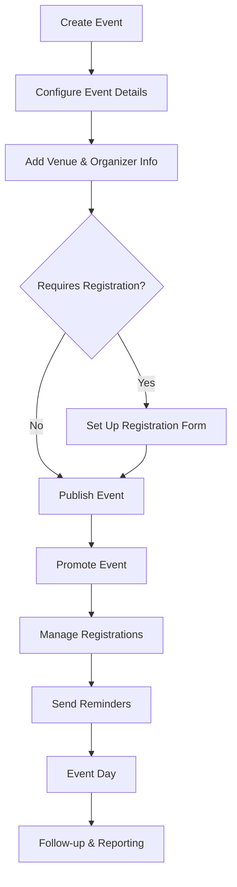

# WordPress Event Management

## Introduction

Event management is a crucial feature for many WordPress websites, whether you're running a business site, a community portal, or a personal blog. Adding event functionality allows you to showcase upcoming activities, enable registrations, sell tickets, and build community engagement. In this tutorial, we'll explore how to implement effective event management in WordPress, covering everything from choosing the right plugins to customizing your event displays.

WordPress itself doesn't come with built-in event management features, but the platform's extensibility allows us to add these capabilities through plugins and integrations. This guide focuses on practical implementation approaches that beginners can follow to add powerful event functionality to their WordPress sites.

## Getting Started with WordPress Event Management

Before diving into specific implementations, let's understand what event management typically includes:

1. **Event listings** - Displaying upcoming events in calendars or lists
2. **Event details** - Showing dates, times, locations, and descriptions
3. **Registration systems** - Allowing visitors to sign up for events
4. **Ticketing** - Selling paid tickets when applicable
5. **Reminders** - Sending notifications to registrants
6. **Management tools** - Administrative features to organize events

### Choosing the Right Event Plugin

Several plugins can add event functionality to WordPress. Here are some popular options:

- **The Events Calendar** - A highly customizable event management plugin
- **Event Organiser** - A lightweight but powerful event management solution
- **Modern Events Calendar** - Feature-rich with many display options
- **Events Manager** - Good for bookings and registrations
- **All-in-One Event Calendar** - Known for its interactive calendar views

For this tutorial, we'll focus primarily on **The Events Calendar** as it's beginner-friendly and has both free and premium options.

## Setting Up The Events Calendar Plugin

### Installation

1. Log in to your WordPress admin dashboard
2. Navigate to **Plugins > Add New**
3. Search for "The Events Calendar"
4. Click **Install Now** and then **Activate**

### Basic Configuration

Once installed, you'll find a new menu item called "Events" in your WordPress dashboard. Let's configure the basic settings:

1. Go to **Events > Settings**
2. Under the **General** tab:
   - Set your default location (country, city)
   - Configure date and time formats
   - Set your timezone
3. Click **Save Changes**

### Creating Your First Event

Let's create a simple event:

1. Navigate to **Events > Add New**
2. Add a title and description for your event
3. Set the event date, time, and duration
4. Add venue information
5. Include an event category and featured image
6. Publish your event

Here's what the code for displaying events on a custom page might look like:

```php
<?php
// Custom query to retrieve upcoming events
$events = tribe_get_events([
    'posts_per_page' => 5,
    'start_date' => date('Y-m-d H:i:s')
]);

if ($events) {
    echo '<ul class="upcoming-events">';
    foreach ($events as $event) {
        echo '<li>';
        echo '<h3><a href="' . get_permalink($event->ID) . '">' . $event->post_title . '</a></h3>';
        echo '<span class="event-date">' . tribe_get_start_date($event) . '</span>';
        echo '</li>';
    }
    echo '</ul>';
} else {
    echo '<p>No upcoming events.</p>';
}
?>
```

The output would display a simple list of upcoming events with their titles and dates, linking to the individual event pages.

## Enhancing Your Event Calendar

### Customizing Event Display

The Events Calendar provides shortcodes to display your events in various formats. Here are some examples:

#### Monthly Calendar View

```
[tribe_events view="month"]
```

#### List View

```
[tribe_events view="list" category="workshops"]
```

#### Day View

```
[tribe_events view="day" date="2023-10-15"]
```

You can also customize the appearance using the plugin's built-in options or with custom CSS. Here's an example of styling event entries:

```css
.tribe-events-calendar-list__event {
    border-left: 4px solid #5d5d9c;
    padding-left: 15px;
    margin-bottom: 30px;
    background: #f9f9f9;
    border-radius: 6px;
    padding: 20px;
    box-shadow: 0 2px 5px rgba(0,0,0,0.05);
    transition: all 0.3s ease;
}

.tribe-events-calendar-list__event:hover {
    transform: translateY(-3px);
    box-shadow: 0 5px 15px rgba(0,0,0,0.1);
}

.tribe-events-calendar-list__event-title {
    font-size: 1.4em;
    margin-bottom: 10px;
}
```

### Adding Event Registration

For basic event registration, you can use The Events Calendar's extension called **Event Tickets**:

1. Go to **Plugins > Add New**
2. Search for "Event Tickets"
3. Install and activate the plugin

Once activated, you can add RSVP functionality to any event:

1. Edit an existing event
2. Scroll down to the "Tickets" section
3. Click **Add RSVP**
4. Configure your RSVP settings:
   - Set capacity limits
   - Add a description
   - Configure start/end sale dates
5. Save the event

Here's how you can check RSVP counts programmatically:

```php
<?php
$event_id = get_the_ID();
$rsvps = tribe_tickets_get_attendees($event_id);

echo '<p>Total RSVPs: ' . count($rsvps) . '</p>';

// Get detailed RSVP information
echo '<ul class="attendee-list">';
foreach ($rsvps as $attendee) {
    echo '<li>' . $attendee['holder_name'] . ' - ' . $attendee['holder_email'] . '</li>';
}
echo '</ul>';
?>
```

## Advanced Event Management Features

### Creating Recurring Events

Recurring events are common for regular meetups, classes, or weekly gatherings. With the premium version of The Events Calendar (Events Calendar Pro), you can set up recurring events:

1. Create a new event
2. In the event editor, look for "Event Series"
3. Select "This is a recurring event"
4. Configure the recurrence pattern:
   - Daily, weekly, monthly, or yearly
   - Specific days of the week
   - Recurrence end date
5. Save your event

### Event Locations with Maps

To add map functionality to your events:

1. Make sure you've configured your Google Maps API key in Events > Settings > APIs
2. When creating an event, add the venue details
3. The map will automatically display on the event page

### Integrating with WooCommerce for Paid Events

If you want to sell tickets to your events, you can integrate with WooCommerce:

1. Install and activate WooCommerce
2. Install "Event Tickets Plus" (premium extension)
3. Configure the integration in Events > Settings > Tickets
4. When creating an event, you'll now see a "Tickets" option with commerce features

## Real-World Example: Building a Conference Website

Let's put everything together to build a small conference website:

### Step 1: Set up the basic conference structure

```php
<?php
// Register a custom post type for speakers
function register_conference_speakers() {
    $args = array(
        'public' => true,
        'label'  => 'Speakers',
        'supports' => array('title', 'editor', 'thumbnail'),
        'menu_icon' => 'dashicons-businessman'
    );
    register_post_type('conference_speaker', $args);
}
add_action('init', 'register_conference_speakers');

// Add a custom field to associate speakers with events
function add_speaker_event_connection() {
    add_meta_box(
        'speaker_events',
        'Associated Events',
        'speaker_events_callback',
        'conference_speaker',
        'side'
    );
}
add_action('add_meta_boxes', 'add_speaker_event_connection');

// Callback for the meta box
function speaker_events_callback($post) {
    $events = tribe_get_events(['posts_per_page' => -1]);
    $selected_events = get_post_meta($post->ID, '_speaker_events', true);
    
    if (!is_array($selected_events)) {
        $selected_events = [];
    }
    
    foreach ($events as $event) {
        echo '<label>';
        echo '<input type="checkbox" name="speaker_events[]" value="' . $event->ID . '" ';
        checked(in_array($event->ID, $selected_events));
        echo '> ' . $event->post_title;
        echo '</label><br />';
    }
}

// Save the associated events
function save_speaker_event_connection($post_id) {
    if (defined('DOING_AUTOSAVE') && DOING_AUTOSAVE) return;
    
    if (isset($_POST['speaker_events'])) {
        update_post_meta($post_id, '_speaker_events', $_POST['speaker_events']);
    } else {
        update_post_meta($post_id, '_speaker_events', []);
    }
}
add_action('save_post', 'save_speaker_event_connection');
?>
```

### Step 2: Create a custom template for displaying conference schedule

Create a file called `conference-schedule.php` in your theme:

```php
<?php
/*
Template Name: Conference Schedule
*/

get_header();

// Get all conference days
$events = tribe_get_events([
    'posts_per_page' => -1,
    'eventDisplay' => 'custom',
    'start_date' => '2023-10-01',
    'end_date' => '2023-10-03'
]);

// Group events by day
$days = [];
foreach ($events as $event) {
    $day = tribe_get_start_date($event, false, 'Y-m-d');
    if (!isset($days[$day])) {
        $days[$day] = [];
    }
    $days[$day][] = $event;
}

// Display schedule
echo '<div class="conference-schedule">';
foreach ($days as $day => $day_events) {
    echo '<div class="conference-day">';
    echo '<h2>' . date('l, F j', strtotime($day)) . '</h2>';
    
    echo '<div class="day-schedule">';
    foreach ($day_events as $event) {
        echo '<div class="schedule-event">';
        
        // Time
        echo '<div class="event-time">';
        echo tribe_get_start_date($event, false, 'g:i a') . ' - ';
        echo tribe_get_end_date($event, false, 'g:i a');
        echo '</div>';
        
        // Event details
        echo '<div class="event-details">';
        echo '<h3><a href="' . get_permalink($event->ID) . '">' . $event->post_title . '</a></h3>';
        
        // Get venue
        $venue_details = tribe_get_venue_details($event->ID);
        if ($venue_details['linked_name']) {
            echo '<div class="venue">' . $venue_details['linked_name'] . '</div>';
        }
        
        // Get associated speakers
        $args = array(
            'post_type' => 'conference_speaker',
            'meta_query' => array(
                array(
                    'key' => '_speaker_events',
                    'value' => $event->ID,
                    'compare' => 'LIKE'
                )
            )
        );
        $speakers = new WP_Query($args);
        
        if ($speakers->have_posts()) {
            echo '<div class="event-speakers">';
            while ($speakers->have_posts()) {
                $speakers->the_post();
                echo '<a href="' . get_permalink() . '">' . get_the_title() . '</a>';
                if ($speakers->current_post + 1 != $speakers->post_count) {
                    echo ', ';
                }
            }
            echo '</div>';
            wp_reset_postdata();
        }
        
        echo '</div>'; // .event-details
        echo '</div>'; // .schedule-event
    }
    echo '</div>'; // .day-schedule
    echo '</div>'; // .conference-day
}
echo '</div>'; // .conference-schedule

get_footer();
?>
```

### Step 3: Add some styling for the conference schedule

```css
.conference-schedule {
    max-width: 1000px;
    margin: 0 auto;
}

.conference-day {
    margin-bottom: 50px;
}

.conference-day h2 {
    border-bottom: 2px solid #e0e0e0;
    padding-bottom: 10px;
    margin-bottom: 20px;
    color: #333;
}

.schedule-event {
    display: flex;
    margin-bottom: 30px;
    border-left: 4px solid #5d5d9c;
    padding-left: 15px;
    background: #f9f9f9;
    border-radius: 6px;
    padding: 15px;
}

.event-time {
    min-width: 150px;
    font-weight: bold;
    color: #5d5d9c;
    padding-right: 15px;
}

.event-details h3 {
    margin-top: 0;
    margin-bottom: 5px;
}

.venue {
    font-size: 0.9em;
    color: #666;
    margin-bottom: 5px;
}

.event-speakers {
    font-size: 0.9em;
    color: #333;
    font-style: italic;
}
```

## Event Workflow Visualization

Here's a visualization of a typical event management workflow in WordPress:



## Best Practices for WordPress Event Management

1. **Keep your event information complete** - Always include dates, times, locations, and descriptions.

2. **Use featured images** - Visual elements make your events more attractive.

3. **Create event categories** - Organize events by type to help users find relevant events.

4. **Test registration process** - Make sure your registration forms work correctly.

5. **Mobile optimization** - Ensure your event pages look good on mobile devices.

6. **Add event schema markup** - This helps search engines understand your event data:

```php
<?php
function add_event_schema() {
    if (is_singular('tribe_events')) {
        global $post;
        $event_id = $post->ID;
        
        // Get event details
        $start_date = tribe_get_start_date($event_id, false, 'c');
        $end_date = tribe_get_end_date($event_id, false, 'c');
        $venue_name = tribe_get_venue($event_id);
        $venue_address = tribe_get_address($event_id);
        $venue_city = tribe_get_city($event_id);
        $venue_state = tribe_get_state($event_id);
        $venue_zip = tribe_get_zip($event_id);
        $venue_country = tribe_get_country($event_id);
        
        // Build schema
        $schema = [
            '@context' => 'https://schema.org',
            '@type' => 'Event',
            'name' => get_the_title($event_id),
            'startDate' => $start_date,
            'endDate' => $end_date,
            'description' => get_the_excerpt($event_id),
            'location' => [
                '@type' => 'Place',
                'name' => $venue_name,
                'address' => [
                    '@type' => 'PostalAddress',
                    'streetAddress' => $venue_address,
                    'addressLocality' => $venue_city,
                    'addressRegion' => $venue_state,
                    'postalCode' => $venue_zip,
                    'addressCountry' => $venue_country
                ]
            ]
        ];
        
        // Output schema
        echo '<script type="application/ld+json">' . json_encode($schema) . '</script>';
    }
}
add_action('wp_head', 'add_event_schema');
?>
```

7. **Set up automated emails** - Send confirmation emails and reminders automatically.

8. **Analyze your events** - Track registrations and attendance to improve future events.

## Troubleshooting Common Event Management Issues

### Events Not Showing in Calendar

If your events aren't appearing in calendar view:

1. Check that the events have future dates
2. Verify the events are published (not drafts)
3. Make sure there are no conflicting plugins
4. Try resetting the permalinks (Settings > Permalinks > Save Changes)

### Registration Form Issues

If registrations aren't working:

1. Test the form yourself to identify specific issues
2. Check for JavaScript errors in your browser console
3. Ensure email delivery is working on your site
4. Verify WooCommerce settings if using paid tickets

## Summary

WordPress event management is powerful and flexible when using the right plugins and configurations. In this tutorial, we've covered:

- Setting up The Events Calendar plugin
- Creating and managing events
- Implementing registration systems
- Building a comprehensive conference schedule
- Best practices for event management

With these techniques, you can build sophisticated event management systems for virtually any type of WordPress site, from small blogs to large corporate portals.

## Additional Resources

To continue learning about WordPress event management:

1. Explore the [official documentation for The Events Calendar](https://theeventscalendar.com/knowledgebase/)
2. Learn more about [WooCommerce integration with events](https://theeventscalendar.com/product/wordpress-event-tickets-plus/)
3. Study the [WordPress action and filter hooks for events](https://developer.wordpress.org/plugins/hooks/)

## Exercises for Practice

1. Create a weekly recurring event series for a fictional meetup group
2. Build a custom event archive page that displays events grouped by category
3. Implement a countdown timer for your next event using JavaScript
4. Create a custom email notification template for event reminders
5. Build a dashboard widget that shows upcoming events for administrators

By completing these exercises, you'll gain practical experience with WordPress event management and be ready to implement sophisticated event systems on real-world websites.