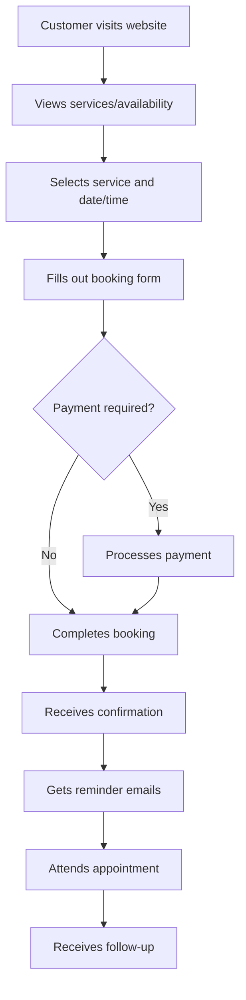

# WordPress Booking Systems

## Introduction

WordPress booking systems enable website owners to automate appointment scheduling, event registrations, and reservation management directly through their WordPress sites. These systems have become essential for businesses that rely on appointments, such as medical practices, salons, consultants, and event venues.

In this guide, you'll learn how to integrate booking functionality into WordPress sites using popular plugins, customize the booking experience, and implement best practices for different business needs. Whether you're building a website for a small business or developing solutions for clients, understanding WordPress booking systems is an invaluable skill.

## Types of WordPress Booking Systems

WordPress booking systems generally fall into several categories:

1. **Appointment booking** - For services like consultations, medical visits, or salon appointments
2. **Event registration** - For workshops, webinars, or conferences
3. **Accommodation booking** - For hotels, vacation rentals, or room reservations
4. **Resource scheduling** - For equipment rentals, venue bookings, etc.

## Popular WordPress Booking Plugins

Let's explore some widely-used booking plugins and their key features:

### 1. Booking Calendar

Booking Calendar is a free plugin with premium extensions that offers a straightforward interface for managing availability calendars and handling bookings.

### 2. Amelia

Amelia provides a comprehensive appointment booking system with employee scheduling, service management, and payment processing capabilities.

### 3. WooCommerce Bookings

This extends WooCommerce to add booking functionality, ideal for sites already using WooCommerce for other transactions.

### 4. Easy Appointments

As the name suggests, this is a user-friendly option focused specifically on appointment scheduling.

## Implementing a Basic Booking System

Let's walk through implementing a basic booking system with the Booking Calendar plugin.

### Step 1: Installation and Activation

```php
// This would typically be done through the WordPress admin panel
// Navigate to Plugins > Add New > Search for "Booking Calendar" > Install > Activate
// Alternatively, you can use WP-CLI:
wp plugin install booking --activate
```

### Step 2: Adding a Booking Calendar to a Page

After activating the plugin, you can add the booking calendar to any page or post using a shortcode:

```php
[booking]
```

This simple shortcode will display the default booking calendar. To customize it, you can add parameters:

```php
[booking type=1 nummonths=2 options='{calendar months_num_in_row=2}']
```

This shows booking calendar type 1, displaying 2 months at once, with 2 months per row.

### Step 3: Configuring Settings

Navigate to the Booking Calendar settings in your WordPress admin panel to configure:

- Available dates and times
- Form fields for customer information
- Email notifications
- Booking approval process (automatic or manual)
- Calendar appearance

## Creating a Custom Booking Form

For more control over your booking system, you might want to create a custom form. Here's an example using Amelia:

### Step 1: Define Services and Staff

First, set up your services and staff members in the Amelia dashboard:

1. Navigate to Amelia > Services
2. Create categories and services
3. Navigate to Amelia > Staff and add team members
4. Assign services to staff members

### Step 2: Create a Custom Booking Shortcode

Amelia provides numerous shortcode options for different booking scenarios:

```php
// Basic booking shortcode
[ameliabooking]

// Catalog view with services
[ameliabooking category=1]

// Specific employee calendar
[ameliabooking employee=3]

// Step-by-step booking wizard
[ameliabooking trigger="button" trigger_type="text" trigger_text="Book Now"]
```

### Step 3: Customize the Form with CSS

You can add custom CSS to style your booking form. Here's an example of customizing the Amelia booking form:

```css
/* Add this to your theme's style.css or through a custom CSS plugin */

/* Change the primary color */
.amelia-app-booking .am-select-date .am-select-date-inputs .el-form-item__content:after {
  background-color: #1a84ee;
}

/* Style the booking button */
.amelia-app-booking .am-button-booking {
  background-color: #1a84ee;
  border-radius: 8px;
  padding: 12px 24px;
  font-weight: 600;
}
```

## Integrating Payment Gateways

Most booking plugins support payment gateway integration. Here's how to set up payments with WooCommerce Bookings:

### Step 1: Configure WooCommerce Payments

First, ensure WooCommerce is properly set up with payment gateways:

1. Navigate to WooCommerce > Settings > Payments
2. Enable and configure desired payment methods (Stripe, PayPal, etc.)
3. Set up tax rates if applicable

### Step 2: Create a Bookable Product

```
1. Go to Products > Add New
2. Enter product name and description
3. In the Product Data dropdown, select "Bookable Product"
4. Configure booking settings:
   - Duration
   - Available days/times
   - Costs
   - Resources (optional)
5. Publish your product
```

### Step 3: Test the Booking Flow

Test the complete booking flow including:
- Calendar selection
- Form submission
- Payment processing
- Confirmation emails

## Advanced Customization with API Integration

For advanced needs, you might want to integrate with external calendars or systems. Here's an example of Google Calendar integration:

### Google Calendar Synchronization

```php
/**
 * Synchronizes WordPress bookings with Google Calendar
 * Note: This is a simplified example. You would need to set up OAuth 2.0 for Google API
 */
function sync_booking_to_google_calendar($booking_id, $booking_data) {
    // Google Calendar API client setup
    require_once 'vendor/autoload.php';
    $client = new Google_Client();
    $client->setAuthConfig('client_credentials.json');
    $client->addScope(Google_Service_Calendar::CALENDAR);
    
    // Get access token (implementation depends on your authentication flow)
    $access_token = get_stored_access_token();
    $client->setAccessToken($access_token);
    
    // Create Google Calendar service
    $service = new Google_Service_Calendar($client);
    
    // Prepare event data
    $event = new Google_Service_Calendar_Event(array(
        'summary' => $booking_data['service_name'],
        'description' => 'Booking #' . $booking_id . ': ' . $booking_data['customer_name'],
        'start' => array(
            'dateTime' => $booking_data['start_time'],
            'timeZone' => 'America/New_York',
        ),
        'end' => array(
            'dateTime' => $booking_data['end_time'],
            'timeZone' => 'America/New_York',
        ),
    ));
    
    // Insert event
    $calendarId = 'primary';
    $event = $service->events->insert($calendarId, $event);
    
    // Store Google event ID with WordPress booking
    update_post_meta($booking_id, 'google_event_id', $event->getId());
    
    return $event->getId();
}

// Hook into booking creation
add_action('booking_created', 'sync_booking_to_google_calendar', 10, 2);
```

## Creating a Custom Availability Widget

You can create a custom widget to display availability on your site:

```php
class Custom_Availability_Widget extends WP_Widget {
    public function __construct() {
        parent::__construct(
            'custom_availability_widget',
            'Custom Availability Widget',
            array('description' => 'Displays service availability for the current week')
        );
    }

    public function widget($args, $instance) {
        echo $args['before_widget'];
        echo $args['before_title'] . 'This Week\'s Availability' . $args['after_title'];
        
        // Get current week dates
        $today = new DateTime('today');
        $week_start = clone $today;
        $week_start->modify('this week');
        $week_end = clone $week_start;
        $week_end->modify('+6 days');
        
        // Query available slots
        $available_slots = $this->get_available_slots($week_start->format('Y-m-d'), $week_end->format('Y-m-d'));
        
        // Display available slots
        echo '<div class="availability-widget">';
        foreach ($available_slots as $date => $slots) {
            $date_obj = new DateTime($date);
            echo '<div class="day-availability">';
            echo '<h4>' . $date_obj->format('l, M j') . '</h4>';
            echo '<ul>';
            foreach ($slots as $slot) {
                echo '<li>' . $slot['time'] . ' - ' . $slot['service'] . '</li>';
            }
            echo '</ul>';
            echo '</div>';
        }
        echo '</div>';
        
        echo $args['after_widget'];
    }
    
    private function get_available_slots($start_date, $end_date) {
        // This is where you would query your booking system for available slots
        // Implementation depends on which booking plugin you're using
        
        // Example dummy data
        return array(
            '2023-08-15' => array(
                array('time' => '9:00 AM', 'service' => 'Consultation'),
                array('time' => '2:30 PM', 'service' => 'Workshop'),
            ),
            '2023-08-17' => array(
                array('time' => '11:00 AM', 'service' => 'Consultation'),
                array('time' => '3:00 PM', 'service' => 'Training'),
            )
        );
    }
}

// Register the widget
function register_custom_availability_widget() {
    register_widget('Custom_Availability_Widget');
}
add_action('widgets_init', 'register_custom_availability_widget');
```

## Best Practices for WordPress Booking Systems

To ensure your booking system runs smoothly and provides a good user experience:

1. **Keep it simple** - Only ask for information you truly need
2. **Mobile responsiveness** - Test your booking forms on all device sizes
3. **Clear availability** - Make it easy to see available slots
4. **Automated notifications** - Send confirmations and reminders
5. **Buffer times** - Build in buffer time between appointments
6. **Cancellation policies** - Clearly communicate policies and procedures
7. **Regular testing** - Test the booking flow regularly

## Common Booking System Workflows



## Troubleshooting Common Issues

### Calendar Not Displaying Correctly

```php
// Check if your theme is enqueueing jQuery properly
function check_jquery_enqueue() {
    if (!wp_script_is('jquery', 'enqueued')) {
        wp_enqueue_script('jquery');
    }
}
add_action('wp_enqueue_scripts', 'check_jquery_enqueue');

// Force plugin scripts to load in footer
function force_booking_scripts_to_footer() {
    // This is an example - actual implementation depends on the plugin
    wp_scripts()->add_data('booking-script-handle', 'group', 1);
}
add_action('wp_enqueue_scripts', 'force_booking_scripts_to_footer', 99);
```

### Time Zone Issues

```php
// Set WordPress timezone to match your local timezone
function set_wordpress_timezone() {
    update_option('timezone_string', 'America/New_York');
}
add_action('init', 'set_wordpress_timezone');
```

## Summary

WordPress booking systems provide powerful tools for managing appointments, events, and reservations. By selecting the right plugin for your needs and customizing it properly, you can create a seamless booking experience for your users while efficiently managing your schedule.

We've covered:
- Types of booking systems and their use cases
- Popular WordPress booking plugins
- Implementation and configuration steps
- Custom form creation and styling
- Payment gateway integration
- Advanced customization with API integrations
- Best practices and common workflows
- Troubleshooting tips

## Additional Resources

To continue learning about WordPress booking systems:

1. Explore plugin documentation for advanced features
2. Take online courses focused on WordPress e-commerce and booking systems
3. Join WordPress developer communities to share experiences and learn from others

## Practice Exercises

1. **Basic Implementation**: Install a booking plugin of your choice and create a simple appointment booking page.

2. **Customization Challenge**: Style a booking form to match a specific business theme (like a spa, consultant, or event venue).

3. **Integration Project**: Connect your booking system to Google Calendar and set up automated email notifications.

4. **Advanced Development**: Create a custom dashboard widget that shows upcoming bookings and daily statistics.