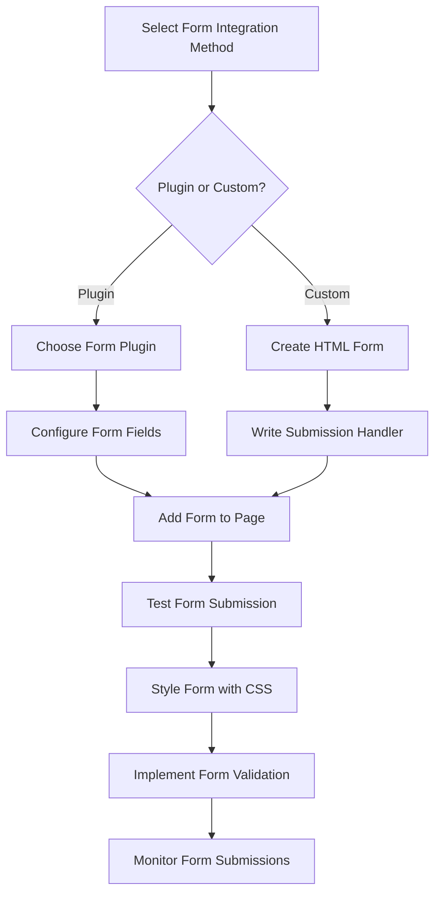

# WordPress Form Integration

## Introduction

Forms are essential components of interactive websites, enabling visitors to contact site owners, submit information, register for services, or provide feedback. In WordPress, you have multiple options for integrating forms, from using specialized plugins to creating custom forms with code.

This guide will walk you through different methods of WordPress form integration, helping you choose the right solution for your specific needs and skill level.

## Why Forms Are Important for Your WordPress Site

Forms serve as critical touchpoints between your website and its visitors. They allow for:

- User engagement and feedback collection
- Lead generation and customer inquiries
- Newsletter signups and membership registrations
- Data collection for surveys and research
- E-commerce functionalities like checkout forms

## Method 1: Using Form Plugins

### Popular Form Plugins

The easiest way to integrate forms is through dedicated plugins. Here are some popular options:

1. **Contact Form 7**
2. **WPForms**
3. **Gravity Forms**
4. **Formidable Forms**
5. **Ninja Forms**

### Implementing Contact Form 7

Let's walk through implementing a basic contact form using Contact Form 7:

#### Step 1: Install and Activate the Plugin

Navigate to **Plugins > Add New** in your WordPress dashboard. Search for "Contact Form 7" and click "Install Now" followed by "Activate."

#### Step 2: Create a Basic Contact Form

After activation, you'll see a "Contact" menu item in your WordPress dashboard. Click on it to see the default contact form.

The default form will look like this:

```html
<label> Your Name (required)
    [text* your-name] </label>

<label> Your Email (required)
    [email* your-email] </label>

<label> Subject
    [text your-subject] </label>

<label> Your Message
    [textarea your-message] </label>

[submit "Send"]
```

#### Step 3: Add the Form to a Page

When you save your form, Contact Form 7 generates a shortcode. Copy this shortcode (it looks like `[contact-form-7 id="123" title="Contact form 1"]`) and paste it into any page or post where you want the form to appear.

### WPForms - Drag and Drop Form Building

WPForms offers a more visual approach with its drag-and-drop builder:

#### Creating a Form with WPForms

1. Install and activate WPForms
2. Go to WPForms > Add New
3. Select a template or start from scratch
4. Drag fields from the left panel to your form
5. Configure field settings
6. Save your form and copy the shortcode
7. Paste the shortcode on your desired page

## Method 2: Integrating Forms with Block Editor (Gutenberg)

WordPress's built-in Gutenberg editor includes a Form block that allows you to create simple contact forms without additional plugins.

### Using the Form Block

1. Edit a page or post
2. Click the "+" button to add a new block
3. Search for "Form" and select the Form block
4. Customize your form fields
5. Configure the submission settings
6. Publish or update your page

```jsx
// The Gutenberg Form block generates code like this
wp.blocks.registerBlockType('core/form', {
    // Block configuration
    title: 'Form',
    icon: 'feedback',
    category: 'widgets',
    // ...other properties
});
```

## Method 3: Creating Custom Forms with HTML and PHP

For more advanced users, creating custom forms gives you complete control over form functionality.

### Basic HTML Form Example

```html
<form action="<?php echo esc_url(admin_url('admin-post.php')); ?>" method="post">
    <input type="hidden" name="action" value="custom_form_submission">
    
    <div class="form-field">
        <label for="name">Name:</label>
        <input type="text" id="name" name="visitor_name" required>
    </div>
    
    <div class="form-field">
        <label for="email">Email:</label>
        <input type="email" id="email" name="visitor_email" required>
    </div>
    
    <div class="form-field">
        <label for="message">Message:</label>
        <textarea id="message" name="visitor_message" rows="5" required></textarea>
    </div>
    
    <div class="form-field">
        <button type="submit">Send Message</button>
    </div>
</form>
```

### Handling Form Submission in functions.php

To process the form data, add this code to your theme's functions.php file:

```php
// Handle form submissions
function handle_custom_form_submission() {
    // Security check
    if (!isset($_POST['visitor_name']) || !isset($_POST['visitor_email']) || !isset($_POST['visitor_message'])) {
        wp_die('Form submission failed: Required fields are missing');
    }
    
    // Sanitize input data
    $name = sanitize_text_field($_POST['visitor_name']);
    $email = sanitize_email($_POST['visitor_email']);
    $message = sanitize_textarea_field($_POST['visitor_message']);
    
    // Process form data (e.g., send email)
    $to = get_option('admin_email');
    $subject = 'New message from your website';
    $body = "Name: $name\n";
    $body .= "Email: $email\n\n";
    $body .= "Message:\n$message";
    
    wp_mail($to, $subject, $body);
    
    // Redirect after submission
    wp_redirect(home_url('/thank-you'));
    exit;
}
add_action('admin_post_custom_form_submission', 'handle_custom_form_submission');
add_action('admin_post_nopriv_custom_form_submission', 'handle_custom_form_submission');
```

## Method 4: Using Form APIs and Third-Party Services

Many form services offer WordPress integrations, including:

- Mailchimp
- HubSpot
- Google Forms
- Typeform

### Example: Embedding Google Forms

```html
<iframe 
    src="https://docs.google.com/forms/d/e/YOUR_FORM_ID/viewform?embedded=true" 
    width="100%" 
    height="700" 
    frameborder="0" 
    marginheight="0" 
    marginwidth="0">
    Loading...
</iframe>
```

## Advanced Form Integration Techniques

### Form Validation

Client-side validation provides immediate feedback before submission:

```javascript
document.addEventListener('DOMContentLoaded', function() {
    const form = document.querySelector('#custom-form');
    
    form.addEventListener('submit', function(event) {
        const email = document.querySelector('#email').value;
        const emailRegex = /^[^\s@]+@[^\s@]+\.[^\s@]+$/;
        
        if (!emailRegex.test(email)) {
            event.preventDefault();
            alert('Please enter a valid email address');
        }
    });
});
```

### Form Styling with CSS

Customize your forms with CSS:

```css
.form-field {
    margin-bottom: 20px;
}

.form-field label {
    display: block;
    margin-bottom: 5px;
    font-weight: bold;
}

.form-field input[type="text"],
.form-field input[type="email"],
.form-field textarea {
    width: 100%;
    padding: 10px;
    border: 1px solid #ddd;
    border-radius: 4px;
}

.form-field button {
    background-color: #0073aa;
    color: white;
    padding: 10px 15px;
    border: none;
    border-radius: 4px;
    cursor: pointer;
}

.form-field button:hover {
    background-color: #005177;
}
```

### AJAX Form Submission

This allows forms to be submitted without page reload:

```javascript
jQuery(document).ready(function($) {
    $('#ajax-form').on('submit', function(e) {
        e.preventDefault();
        
        $.ajax({
            type: 'POST',
            url: ajax_object.ajax_url,
            data: {
                action: 'process_ajax_form',
                name: $('#name').val(),
                email: $('#email').val(),
                message: $('#message').val(),
                nonce: ajax_object.nonce
            },
            success: function(response) {
                $('#form-response').html('<p>Thank you for your message!</p>');
                $('#ajax-form').hide();
            },
            error: function() {
                $('#form-response').html('<p>An error occurred. Please try again.</p>');
            }
        });
    });
});
```

Add this to your functions.php:

```php
// Register AJAX handler
function setup_ajax_form() {
    wp_enqueue_script('ajax-form', get_template_directory_uri() . '/js/ajax-form.js', array('jquery'), '1.0', true);
    wp_localize_script('ajax-form', 'ajax_object', array(
        'ajax_url' => admin_url('admin-ajax.php'),
        'nonce' => wp_create_nonce('ajax_form_nonce')
    ));
}
add_action('wp_enqueue_scripts', 'setup_ajax_form');

// Process AJAX form submissions
function process_ajax_form() {
    // Check nonce for security
    check_ajax_referer('ajax_form_nonce', 'nonce');
    
    $name = sanitize_text_field($_POST['name']);
    $email = sanitize_email($_POST['email']);
    $message = sanitize_textarea_field($_POST['message']);
    
    // Process the form data here
    // ...
    
    wp_send_json_success('Form submitted successfully');
}
add_action('wp_ajax_process_ajax_form', 'process_ajax_form');
add_action('wp_ajax_nopriv_process_ajax_form', 'process_ajax_form');
```

## Form Integration Workflow

The following diagram illustrates the typical form integration workflow in WordPress:



## Best Practices for WordPress Form Integration

1. **Keep it simple** - Only request information you actually need
2. **Mobile optimization** - Ensure forms work well on all devices
3. **Clear labels** - Use descriptive field labels and placeholder text
4. **Error handling** - Provide clear error messages for invalid inputs
5. **Form security** - Implement CAPTCHA or honeypot to prevent spam
6. **Accessible forms** - Follow accessibility guidelines for all users
7. **Thank you messages** - Acknowledge submissions with confirmation messages
8. **Data privacy** - Include privacy notices for GDPR compliance
9. **Testing** - Thoroughly test forms before going live
10. **Analytics** - Track form conversion rates to improve performance

## Troubleshooting Common Form Issues

| Issue | Possible Solution |
|-------|-------------------|
| Form not sending emails | Check SMTP configuration or use a plugin like WP Mail SMTP |
| Form submissions marked as spam | Add reCAPTCHA or use anti-spam plugins |
| Validation errors | Review your validation code or plugin settings |
| Upload failures | Check file permissions and upload limits |
| Style inconsistencies | Inspect CSS conflicts with browser developer tools |

## Summary

WordPress form integration offers multiple approaches to suit different skill levels and requirements:

- **Plugin-based solutions** like Contact Form 7 or WPForms provide user-friendly interfaces with minimal coding
- **Built-in Gutenberg form blocks** offer simple form creation within the WordPress editor
- **Custom HTML/PHP forms** give you complete control over functionality and appearance
- **Third-party integrations** connect your site with external form services

By understanding these different methods, you can select the approach that best fits your project needs, technical comfort level, and desired form functionality.

## Additional Resources

- [WordPress Form Plugin Directory](https://wordpress.org/plugins/search/forms/)
- [WordPress Codex: Processing Form Data](https://codex.wordpress.org/Plugin_API/Action_Reference/admin_post_(action))
- [WPForms Blog](https://wpforms.com/blog/) - Tips and tutorials for form creation
- [Web Accessibility Initiative (WAI) Form Guidelines](https://www.w3.org/WAI/tutorials/forms/)

## Practice Exercises

1. Create a simple contact form using Contact Form 7 and customize its styling
2. Build a newsletter signup form using WPForms that integrates with an email service
3. Develop a custom form with HTML/PHP that saves submissions to the WordPress database
4. Create a multi-step form with conditional logic using an advanced form plugin
5. Implement AJAX form submission for a custom form without page reload

By mastering WordPress form integration, you'll gain a valuable skill that enhances user engagement and adds practical functionality to your WordPress websites.