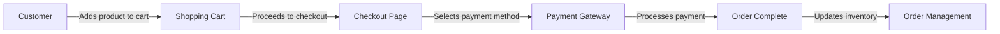

# WordPress Payment Systems

## Introduction

Payment systems are essential components for any WordPress website that needs to conduct financial transactions. Whether you're running an online store, accepting donations, or selling digital products, integrating a robust payment system is crucial for success.

In this guide, we'll explore various payment solutions for WordPress, how to implement them, and best practices to ensure secure transactions. We'll focus on beginner-friendly approaches while providing you with the knowledge to make informed decisions about your WordPress payment infrastructure.

## Why You Need Payment Systems in WordPress

Before diving into specific solutions, let's understand why payment systems are vital for many WordPress websites:

- **E-commerce functionality**: Sell physical or digital products directly from your website
- **Subscription services**: Offer recurring payment models for memberships or services
- **Donations**: Accept contributions for non-profit organizations or personal projects
- **Service payments**: Collect payments for consultations, bookings, or professional services
- **Affiliate marketing**: Process commissions and track sales

## Popular WordPress Payment Solutions

### 1. WooCommerce

WooCommerce is the most popular e-commerce platform for WordPress, powering approximately 30% of all online stores worldwide.

#### Setting Up WooCommerce

```bash
# Step 1: Install WooCommerce (via WordPress dashboard)
Plugins > Add New > search for "WooCommerce" > Install Now > Activate

# Step 2: Run the WooCommerce setup wizard
Follow the on-screen instructions to configure:
- Store location
- Industry
- Product types
- Business details
- Theme installation
```

After installation, you'll need to configure payment methods in WooCommerce:

```php
// Location: WooCommerce > Settings > Payments

// Available payment methods typically include:
- Direct bank transfer
- Check payments
- Cash on delivery
- PayPal
- Stripe (requires extension)
- Other payment gateways (via extensions)
```

Here's a simple diagram showing the WooCommerce payment flow:



### 2. PayPal Integration

PayPal is one of the most trusted payment systems globally and offers several integration options for WordPress.

#### Basic PayPal Button

For a simple donation button or single payment, you can use PayPal's button generator:

```html
<!-- Simple PayPal button code -->
<form action="https://www.paypal.com/cgi-bin/webscr" method="post" target="_top">
  <input type="hidden" name="cmd" value="_donations" />
  <input type="hidden" name="business" value="your-paypal-email@example.com" />
  <input type="hidden" name="currency_code" value="USD" />
  <input type="image" src="https://www.paypalobjects.com/en_US/i/btn/btn_donate_LG.gif" name="submit" title="PayPal - The safer, easier way to pay online!" alt="Donate with PayPal button" />
</form>
```

#### PayPal WordPress Plugin Integration

For more comprehensive PayPal integration, you can use the PayPal Checkout Plugin:

```bash
# Step 1: Install the PayPal Checkout Plugin
Plugins > Add New > search for "PayPal Checkout" > Install Now > Activate

# Step 2: Configure the plugin
Settings > PayPal Checkout > Connect with PayPal
```

Once configured, you can add PayPal payment options to your pages using shortcodes:

```
[paypal_button amount="19.99" description="Product Description"]
```

### 3. Stripe Integration

Stripe is popular for its developer-friendly approach and comprehensive API. It allows you to accept payments directly on your site without redirecting users to external pages.

#### Using Stripe with WooCommerce

```bash
# Step 1: Install WooCommerce Stripe Payment Gateway
Plugins > Add New > search for "WooCommerce Stripe" > Install Now > Activate

# Step 2: Configure Stripe settings
WooCommerce > Settings > Payments > Stripe > Set up
```

You'll need to enter your Stripe API keys, which you can obtain from your Stripe dashboard:

```php
// Stripe API configuration
define('STRIPE_TEST_SECRET_KEY', 'sk_test_...');
define('STRIPE_TEST_PUBLISHABLE_KEY', 'pk_test_...');
define('STRIPE_LIVE_SECRET_KEY', 'sk_live_...');
define('STRIPE_LIVE_PUBLISHABLE_KEY', 'pk_live_...');
```

#### Custom Stripe Integration with WordPress

For advanced users, you can integrate Stripe directly using their PHP library:

```php
// Step 1: Install Stripe PHP library using Composer
// composer require stripe/stripe-php

// Step 2: Initialize Stripe in your functions.php
require_once get_template_directory() . '/vendor/autoload.php';
\Stripe\Stripe::setApiKey('sk_test_your_secret_key');

// Step 3: Create a payment intent
function create_payment_intent() {
    try {
        $payment_intent = \Stripe\PaymentIntent::create([
            'amount' => 1999, // Amount in cents
            'currency' => 'usd',
            'description' => 'Product purchase',
        ]);
        return $payment_intent;
    } catch (\Stripe\Exception\ApiErrorException $e) {
        return $e->getMessage();
    }
}
```

## 4. Easy Digital Downloads (EDD)

If you're selling digital products (e-books, software, music, etc.), Easy Digital Downloads is an excellent WordPress plugin solution.

```bash
# Step 1: Install Easy Digital Downloads
Plugins > Add New > search for "Easy Digital Downloads" > Install Now > Activate

# Step 2: Configure EDD
Downloads > Settings
```

EDD comes with PayPal Standard and Amazon Payments built-in. For Stripe integration:

```bash
# Add Stripe to EDD
Downloads > Settings > Payment Gateways > Stripe
```

Creating a download product with EDD:

```
# Step 1: Create a new download
Downloads > Add New

# Step 2: Set up product information
- Title
- Description
- Price (simple or variable pricing)
- Upload digital files
- Set download conditions
```

## Implementation Best Practices

### 1. Security Considerations

When implementing payment systems, security should be your top priority:

```php
// Always use HTTPS for payment pages
function force_https_on_checkout() {
    if (!is_ssl() && is_checkout()) {
        wp_redirect('https://' . $_SERVER['HTTP_HOST'] . $_SERVER['REQUEST_URI'], 301);
        exit;
    }
}
add_action('template_redirect', 'force_https_on_checkout');
```

Key security practices:
- Always use SSL (HTTPS)
- Keep WordPress and plugins updated
- Use strong admin passwords
- Implement two-factor authentication
- Regularly scan for malware
- Keep PCI compliance in mind

### 2. User Experience Optimization

A smooth checkout process is critical for reducing cart abandonment:

```php
// Example: Add a progress indicator to WooCommerce checkout
function add_checkout_progress_indicator() {
    if (is_checkout() && !is_wc_endpoint_url()) {
        ?>
        <div class="checkout-progress-wrapper">
            <div class="checkout-progress-step active">Shopping Cart</div>
            <div class="checkout-progress-step current">Checkout</div>
            <div class="checkout-progress-step">Confirmation</div>
        </div>
        <?php
    }
}
add_action('woocommerce_before_checkout_form', 'add_checkout_progress_indicator', 5);
```

### 3. Testing Payment Gateways

Before going live, thoroughly test your payment system:

1. **Sandbox/Test Mode**: Most payment gateways provide testing environments
   
```php
// Example: Enable test mode in WooCommerce Stripe
// WooCommerce > Settings > Payments > Stripe > Enable test mode
```

2. **Test Card Numbers**: Use test card numbers provided by payment processors

```
// Common test card numbers
Visa: 4242 4242 4242 4242
Mastercard: 5555 5555 5555 4444
Amex: 3782 822463 10005
```

## Advanced Payment Configurations

### Subscription-Based Payments

For recurring payments, you can implement subscription systems:

With WooCommerce:
```bash
# Step 1: Install WooCommerce Subscriptions extension
# Purchase from WooCommerce.com and install via Plugins > Add New > Upload Plugin

# Step 2: Create subscription products
Products > Add New > select "Simple subscription" or "Variable subscription"
```

### Payment Forms with Gravity Forms

Gravity Forms + payment add-ons allow for flexible payment forms:

```php
// Step 1: Install Gravity Forms and payment add-on (PayPal, Stripe, etc.)

// Step 2: Create a new form with payment fields
// Forms > New Form > Add payment fields > Configure payment gateway

// Step 3: Add the form to a page using shortcode
[gravityform id="1" title="false" description="false"]
```

### Currency Conversion and Multi-Currency Support

For international websites, multi-currency support is important:

```php
// Example: Add currency switcher to WooCommerce
// Requires plugin like "WooCommerce Currency Switcher"

// Example implementation with AJAX currency switching
function switch_currency() {
    if (isset($_POST['currency'])) {
        $currency = sanitize_text_field($_POST['currency']);
        session_start();
        $_SESSION['selected_currency'] = $currency;
        echo json_encode(['success' => true]);
        exit;
    }
}
add_action('wp_ajax_switch_currency', 'switch_currency');
add_action('wp_ajax_nopriv_switch_currency', 'switch_currency');
```

## Performance Optimization for Payment Pages

Slow checkout pages can significantly increase cart abandonment. Here's how to optimize:

```php
// Example: Optimize WooCommerce checkout loading
function optimize_checkout_scripts() {
    if (!is_checkout()) {
        // Remove WooCommerce scripts and styles from non-checkout pages
        wp_dequeue_style('woocommerce');
        wp_dequeue_script('woocommerce');
    }
}
add_action('wp_enqueue_scripts', 'optimize_checkout_scripts', 99);
```

Key optimization strategies:
1. Minimize HTTP requests
2. Enable caching (except for checkout pages)
3. Use a content delivery network (CDN)
4. Optimize images
5. Implement lazy loading

## Real-World Implementation Example

Let's walk through creating a simple product page with WooCommerce and Stripe:

### Step 1: Set up WooCommerce and Stripe

Follow the installation steps mentioned earlier for both WooCommerce and the Stripe extension.

### Step 2: Create a Product

```bash
# Navigate to Products > Add New
- Add product name
- Add description
- Set regular price: $29.99
- Upload product image
- Set inventory details
- Publish the product
```

### Step 3: Customize Checkout

```php
// Add custom text at checkout
function add_checkout_notice() {
    echo '<div class="woocommerce-info">Your payment will be processed securely through Stripe.</div>';
}
add_action('woocommerce_before_checkout_form', 'add_checkout_notice', 10);
```

### Step 4: Test the Purchase Flow

1. Add the product to cart
2. Proceed to checkout
3. Fill in billing/shipping details
4. Use Stripe test card: 4242 4242 4242 4242
5. Complete purchase
6. Verify order confirmation and receipt

## Troubleshooting Common Issues

### 1. Payment Gateway Errors

```php
// Example: Log payment gateway errors
function log_payment_errors($message, $level = 'error') {
    if (function_exists('wc_get_logger')) {
        $logger = wc_get_logger();
        $logger->log($level, $message, ['source' => 'payment-errors']);
    }
}

// Usage
try {
    // Payment processing code
} catch (Exception $e) {
    log_payment_errors('Payment error: ' . $e->getMessage());
    wc_add_notice('Payment error: ' . $e->getMessage(), 'error');
}
```

### 2. SSL Certificate Issues

If your site isn't properly configured for SSL, payments might fail:

```bash
# Check SSL configuration
- Verify SSL certificate is properly installed
- Ensure WordPress Address and Site Address in Settings use https://
- Check for mixed content warnings in browser console
```

### 3. Currency Compatibility

Ensure your payment gateway supports your chosen currency:

```php
// Example: Check if Stripe supports the current currency
function check_stripe_currency_support() {
    $supported_currencies = ['USD', 'EUR', 'GBP', 'AUD', 'CAD', 'JPY'];
    $current_currency = get_woocommerce_currency();
    
    if (!in_array($current_currency, $supported_currencies)) {
        wc_add_notice('Warning: The selected currency may not be supported by Stripe.', 'notice');
    }
}
add_action('woocommerce_before_checkout_form', 'check_stripe_currency_support');
```

## Summary

WordPress payment systems offer flexible solutions for accepting online payments. In this guide, we've covered:

1. **Popular payment solutions**: WooCommerce, PayPal, Stripe, and Easy Digital Downloads
2. **Implementation steps**: How to set up and configure each payment system
3. **Best practices**: Security, user experience, and testing considerations
4. **Advanced configurations**: Subscriptions, multi-currency support, and custom integrations
5. **Optimization**: Improving performance of payment pages
6. **Troubleshooting**: Common issues and their solutions

By carefully selecting and implementing the right payment system for your WordPress website, you can provide a secure and seamless checkout experience for your customers while efficiently managing your online transactions.

## Additional Resources

- [Official WooCommerce Documentation](https://docs.woocommerce.com/)
- [Stripe API Documentation](https://stripe.com/docs/api)
- [PayPal Developer Documentation](https://developer.paypal.com/docs/)
- [WordPress Codex](https://codex.wordpress.org/)

## Exercises

1. **Basic**: Install WooCommerce and configure PayPal Standard as a payment method.
2. **Intermediate**: Add Stripe as a payment gateway and customize the checkout field layout.
3. **Advanced**: Implement a subscription product with recurring payments using WooCommerce Subscriptions.
4. **Expert**: Create a custom payment gateway plugin that integrates with a payment processor of your choice.

By practicing these exercises, you'll gain hands-on experience with WordPress payment systems and be better prepared to implement them on your own websites.