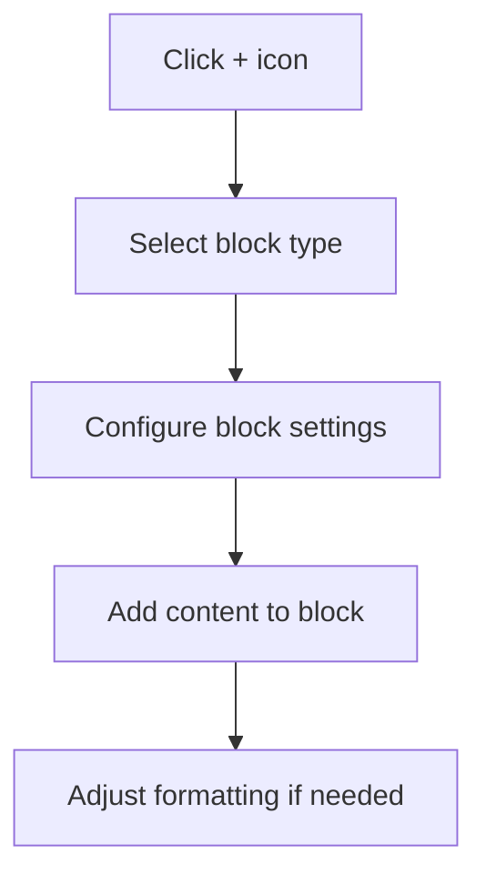

# WordPress Content Editor

WordPress offers powerful content editing capabilities that allow you to create engaging and well-formatted content for your website. In this guide, we'll explore the WordPress content editor, focusing on both the Classic Editor and the newer Gutenberg Block Editor, which has been the default editor since WordPress 5.0.

## Introduction to WordPress Editors

WordPress has evolved its content creation tools over the years. Understanding the available editors is crucial for effective content management:

1. **Classic Editor** - The traditional WYSIWYG (What You See Is What You Get) editor
2. **Gutenberg Block Editor** - The modern block-based editor that offers more flexibility and design options

Both editors serve the same purpose—creating and publishing content—but they differ significantly in their approach and capabilities.

## The Classic Editor

The Classic Editor is a traditional text editor similar to basic word processors. While no longer the default in WordPress, many users still prefer it for its simplicity.

### Key Features of the Classic Editor

The Classic Editor provides a single editing field with a toolbar at the top containing formatting options:

![Classic Editor Interface description would go here]

### Basic Formatting Options

The Classic Editor toolbar includes common formatting options:

- Bold and italic text
- Bulleted and numbered lists
- Blockquotes
- Alignment options (left, center, right)
- Insert/edit links
- Add media (images, videos)

### Working with HTML in Classic Editor

The Classic Editor allows you to switch between Visual and Text (HTML) modes:

- **Visual Mode**: WYSIWYG editing interface
- **Text Mode**: Direct HTML editing

To switch to HTML mode, click the "Text" tab above the editing area. This is useful when you need more control over your content's HTML structure:

```html
<h2>This is a heading</h2>
<p>This is a paragraph with <strong>bold text</strong> and <em>italicized text</em>.</p>
<ul>
  <li>List item one</li>
  <li>List item two</li>
</ul>
```

## The Gutenberg Block Editor

Gutenberg is WordPress's modern block-based editor that treats each element of your content (paragraph, image, list, etc.) as a separate "block."

### Understanding Blocks

Every piece of content in Gutenberg is a block. Each block is independent and can have its own settings and formatting options.

Common block types include:

- Paragraph
- Heading
- Image
- Gallery
- List
- Quote
- Code
- Custom HTML

### Adding Blocks

To add a new block in Gutenberg:

1. Click the "+" icon at the top left of the editor or where you want to insert a block
2. Select the desired block type from the block inserter
3. Start editing the content in the new block



### Block Navigation Example

Let's create a simple blog post structure using Gutenberg blocks:

1. **Add a heading block**:
   - Click the "+" icon
   - Select "Heading"
   - Type "My First Blog Post"
   - Select H1 from the toolbar

2. **Add a paragraph block**:
   - Press Enter after the heading or click the "+" icon
   - Type your introduction text

3. **Add an image block**:
   - Click the "+" icon after your paragraph
   - Select "Image"
   - Upload or select an image from the media library

4. **Add another paragraph block**:
   - Continue adding content as needed

### Block Settings and Options

Each block has its own settings that appear in the right sidebar when the block is selected. For example:

**Paragraph block settings**:
- Text size
- Color settings
- Drop cap option

**Image block settings**:
- Alt text
- Image size
- Alignment options
- Link settings

## Practical Examples

### Example 1: Creating a Call to Action Section

Let's create an attention-grabbing call to action using the Block Editor:

1. Add a Cover block (provides a background image with text overlay)
   - Upload a background image
   - Add overlay color if desired
   - Adjust opacity

2. Inside the Cover block, add a Heading block:
   ```
   Join Our Community Today!
   ```

3. Add a Paragraph block below:
   ```
   Get access to exclusive content, resources, and connect with like-minded individuals.
   ```

4. Insert a Button block:
   - Set text to "Sign Up Now"
   - Configure link to your signup page
   - Style button (color, size, etc.)

### Example 2: Creating a Product Feature Comparison

To create a comparison table:

1. Add a Table block
2. Configure for 4 columns and 4 rows
3. Add content:

```
| Feature | Basic Plan | Pro Plan | Premium Plan |
| ------- | ---------- | -------- | ------------ |
| Storage | 10GB | 50GB | Unlimited |
| Users | 1 | 5 | Unlimited |
| Support | Email | Email + Chat | 24/7 Priority |
```

When rendered, this creates a formatted table displaying your product comparison.

## Advanced Editing Features

### Reusable Blocks

Reusable blocks allow you to save a block or group of blocks for reuse across your site:

1. Select the block(s) you want to save
2. Click the three-dot menu in the block toolbar
3. Select "Add to Reusable Blocks"
4. Give your block a name
5. Access your saved blocks from the block inserter (+ icon)

### Block Patterns

Block patterns are predefined block layouts that you can insert and customize:

1. Click the "+" icon to open the block inserter
2. Select the "Patterns" tab
3. Browse available patterns by category
4. Click on a pattern to insert it into your content

### Keyboard Shortcuts

Efficiently work with the editor using these shortcuts:

| Action | Windows/Linux | macOS |
| ------ | ------------- | ----- |
| Save draft | Ctrl+S | Command+S |
| Undo | Ctrl+Z | Command+Z |
| Redo | Ctrl+Shift+Z | Command+Shift+Z |
| Create new block | Enter | Enter |
| Delete block | Shift+Alt+Z | Control+Option+Z |
| Show block navigation | Shift+Alt+O | Control+Option+O |

## Tips for Efficient Content Creation

1. **Use keyboard shortcuts** to speed up your workflow
2. **Create templates with reusable blocks** for consistent content structure
3. **Explore different block types** to find the best fit for your content needs
4. **Group related blocks together** using the Group block
5. **Save drafts regularly** to avoid losing your work
6. **Preview your content** before publishing to ensure it looks as expected

## Switching Between Editors

If you prefer the Classic Editor over Gutenberg, you can:

1. Install the "Classic Editor" plugin from the WordPress plugin repository
2. Activate the plugin
3. Configure plugin settings to use Classic Editor for all posts or allow choosing per post

## Summary

The WordPress content editor gives you the tools to create engaging, well-structured content for your website. The Gutenberg Block Editor offers flexibility and creative freedom through its block-based approach, while the Classic Editor provides a more traditional writing experience.

Understanding both editors allows you to choose the best tool for your content creation needs. As you become more comfortable with these editors, you'll be able to create more complex and visually appealing content for your WordPress website.

## Additional Resources

- [WordPress Block Editor Handbook](https://developer.wordpress.org/block-editor/)
- [WordPress Classic Editor Plugin](https://wordpress.org/plugins/classic-editor/)
- [Gutenberg Block Patterns Directory](https://wordpress.org/patterns/)

## Practice Exercises

1. Create a blog post with at least five different types of blocks
2. Build a reusable block for your post signature or call-to-action
3. Create a custom layout using columns and groups
4. Try recreating an existing page from your favorite website using blocks
5. Experiment with embedding external content (YouTube videos, social media posts)

By mastering the WordPress content editor, you'll be able to create professional, engaging content that enhances the user experience of your website.