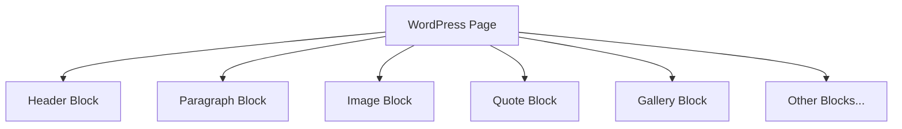

# WordPress Blocks

## Introduction

WordPress Blocks revolutionized content creation in WordPress when they were introduced with the Gutenberg editor in WordPress 5.0. Unlike the traditional editor that worked like a single text field, the block editor breaks content into discrete "blocks" of different types, allowing for more flexible and visually appealing layouts without needing to write code.

In this guide, we'll explore what WordPress blocks are, how to use them effectively, and even how to create custom blocks for specialized needs.

## What Are WordPress Blocks?

WordPress blocks are individual content elements that you can add, arrange, and customize on your posts and pages. Think of them as building blocks that stack together to create your content.



Each block has its own settings and can be moved, edited, or removed independently of other blocks. This modular approach gives you much more control over your layout than the classic editor allowed.

## Core Block Categories

WordPress comes with several categories of built-in blocks:

1. **Text Blocks**: Paragraph, Heading, List, Quote, etc.
2. **Media Blocks**: Image, Gallery, Audio, Video, etc.
3. **Design Blocks**: Columns, Group, Cover, etc.
4. **Widget Blocks**: Shortcode, Calendar, Latest Posts, etc.
5. **Embed Blocks**: YouTube, Twitter, Instagram, etc.

## Working with WordPress Blocks

### Adding a Block

To add a block to your post or page:

1. Click the "+" button in the editor
2. Select the block you want to add
3. Or type "/" followed by the block name to quickly insert it

### Block Example: Adding a Paragraph Block

```jsx
// This is what happens behind the scenes when you add a paragraph block
const { registerBlockType } = wp.blocks;

registerBlockType('core/paragraph', {
  title: 'Paragraph',
  icon: 'text',
  category: 'text',
  attributes: {
    content: {
      type: 'string',
      source: 'html',
      selector: 'p',
    },
  },
  // Block settings and edit/save functions
});
```

When you use this block, you simply type your content in the editor, and WordPress takes care of the underlying code.

### Manipulating Blocks

Once you've added blocks to your content, you can:

- **Move blocks**: Drag and drop or use the up/down arrows
- **Edit blocks**: Click on a block to select it and modify its content
- **Configure blocks**: Use the block settings sidebar to adjust options like font size, colors, etc.
- **Transform blocks**: Convert certain blocks to other types (e.g., paragraph to list)
- **Remove blocks**: Select a block and press Delete or Backspace

### Block Patterns

Block patterns are pre-designed layouts made up of multiple blocks that you can insert all at once. They're great for quickly creating common page sections like:

- Testimonials
- Pricing tables
- Call-to-action sections
- Hero sections
- Contact information

## Common Blocks and Their Uses

### Paragraph Block

The most basic block for text content.

**Example usage:**
```html
<!-- What WordPress generates for a paragraph block -->
<p class="has-text-align-left">This is a paragraph of text in WordPress.</p>
```

### Heading Block

Used for section titles with H1-H6 tags.

**Example usage:**
```html
<!-- What WordPress generates for a heading block -->
<h2 class="wp-block-heading">This is a Heading</h2>
```

### Image Block

For adding images with optional captions.

**Example usage:**
```html
<!-- What WordPress generates for an image block -->
<figure class="wp-block-image size-large">
  
  <figcaption class="wp-element-caption">This is an optional caption</figcaption>
</figure>
```

### Columns Block

Creates multi-column layouts.

**Example usage:**
```html
<!-- What WordPress generates for a two-column block -->
<div class="wp-block-columns">
  <div class="wp-block-column">
    <!-- Content of first column -->
    <p>Column 1 content goes here</p>
  </div>
  <div class="wp-block-column">
    <!-- Content of second column -->
    <p>Column 2 content goes here</p>
  </div>
</div>
```

## Creating Custom Blocks

While WordPress comes with many blocks built-in, developers can create custom blocks for specific needs. This requires knowledge of JavaScript and React.

### Basic Structure of a Custom Block

Here's a simplified example of how to register a custom block:

```jsx
// File: my-custom-block.js
import { registerBlockType } from '@wordpress/blocks';
import { useBlockProps } from '@wordpress/block-editor';

registerBlockType('my-plugin/my-custom-block', {
  title: 'My Custom Block',
  icon: 'smiley',
  category: 'text',
  attributes: {
    content: {
      type: 'string',
      source: 'html',
      selector: 'p',
    },
  },
  
  edit: function(props) {
    const blockProps = useBlockProps();
    const content = props.attributes.content;
    
    function onChangeContent(newContent) {
      props.setAttributes({ content: newContent });
    }
    
    return (
      <div {...blockProps}>
        <input
          type="text"
          value={content}
          onChange={(e) => onChangeContent(e.target.value)}
        />
      </div>
    );
  },
  
  save: function(props) {
    const blockProps = useBlockProps.save();
    return (
      <div {...blockProps}>
        <p>{props.attributes.content}</p>
      </div>
    );
  },
});
```

To use this custom block, you would need to build it with a tool like webpack and enqueue the script in WordPress.

## Real-World Examples

### Creating a Blog Post

For a typical blog post, you might use:

1. A **Heading** block for the title
2. A **Cover** block with a background image
3. Several **Paragraph** blocks for your content
4. **Image** blocks for illustrations
5. A **Quote** block for testimonials or important quotes
6. A **List** block for key points or steps
7. An **Embed** block to include a related YouTube video

### Building a Landing Page

For a product landing page:

1. A **Cover** block with a hero image and heading
2. A **Columns** block to create a features section
3. **Image** blocks with captions to showcase product images
4. A **Paragraph** block for product description
5. A **Button** block for the call-to-action
6. A **Gallery** block to display multiple product views
7. A **Latest Posts** block to show related content

## Advanced Block Techniques

### Reusable Blocks

Reusable blocks allow you to save a block or group of blocks to reuse across multiple pages. They're perfect for content that appears frequently, like:

- Contact information
- Call-to-action sections
- Disclaimers
- Author bios

To create a reusable block:
1. Select the block(s) you want to reuse
2. Click the "More options" (three dots) menu
3. Choose "Add to Reusable blocks"
4. Give it a name and save

### Block Styles

Many blocks come with built-in style variations. For example, the Quote block might have "Default" and "Large" styles. You can select these from the block toolbar or block settings.

### Block Extensions and Plugins

There are many plugins that add new blocks or extend existing ones:

- Kadence Blocks
- Ultimate Addons for Gutenberg
- CoBlocks
- Stackable

These can add features like advanced button designs, pricing tables, accordions, and more.

## Block Editor Tips and Tricks

### Keyboard Shortcuts

- `/` - Start typing to search for a block
- `Ctrl+Shift+Alt+M` - Switch between Visual and Code editor
- `Alt+Shift+Z` - Remove a block
- `Ctrl+Shift+D` - Duplicate a block
- `Escape` - Clear selection

### Grouping Blocks

Use the Group block to combine multiple blocks into a single unit, making them easier to move and style together.

### Block Navigation

Click the "List View" button in the toolbar to see an outline of all blocks in your content, making it easy to navigate complex layouts.

## Summary

WordPress Blocks have transformed content creation from a linear text experience to a flexible and visual process. They allow users of all technical levels to:

- Create complex layouts without coding
- Maintain consistent styling across a site
- Focus on content instead of HTML and CSS
- Build dynamic, interactive pages

As WordPress continues to evolve, blocks are becoming even more powerful with features like Full Site Editing, which extends the block concept to every part of a WordPress site.

## Additional Resources

- [WordPress Block Editor Handbook](https://developer.wordpress.org/block-editor/)
- [WordPress Gutenberg Block Patterns Directory](https://wordpress.org/patterns/)
- [Learn WordPress - Block Editor Tutorials](https://learn.wordpress.org/tutorials/?_focus_area=block-editor)

## Exercises

1. Create a blog post using at least five different types of blocks
2. Build a reusable block for your author bio that includes an image, text, and social links
3. Experiment with the Columns block to create a three-column pricing table
4. Try using the Cover block with a background image and overlaid text to create a hero section
5. Explore block patterns by inserting one and then customizing it to match your site's design