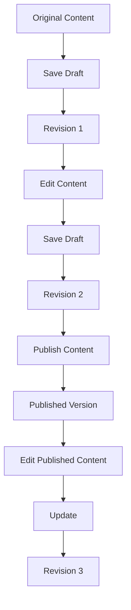

# WordPress Revisions

## Introduction

When creating content in WordPress, mistakes happen, edits are needed, and content evolves over time. WordPress revisions provide a robust system that automatically tracks changes to your posts and pages, maintaining a complete history of your content as it develops. This powerful feature gives content creators a safety net, allowing them to review previous versions, compare changes, and restore older content when necessary.

In this guide, we'll explore how WordPress revisions work, why they're valuable, and how to effectively manage them to optimize your content creation workflow.

## What Are WordPress Revisions?

WordPress revisions are sequential saved versions of your posts and pages. Each time you save a draft or update published content, WordPress creates a new revision—essentially a snapshot of your content at that specific moment in time.

### How Revisions Work

When you create or edit content in WordPress, the system:

1. Stores the original version of your content
2. Creates a new revision each time you save
3. Maintains a chronological history of all changes
4. Provides tools to compare and restore previous versions

Let's visualize the revision process:



## Benefits of WordPress Revisions

Revisions provide several important benefits for content creators:

- **Content Safety Net**: Accidentally deleted a paragraph? No problem—recover it from a previous revision.
- **Change Tracking**: See who made what changes and when (especially helpful for multi-author sites).
- **Content Evolution**: Track how your content developed over time.
- **Error Recovery**: Restore content if something goes wrong during editing.
- **Content Experimentation**: Make bold changes knowing you can always revert if needed.

## Accessing and Using Revisions

### Finding Your Revisions

When editing a post or page in WordPress, you can find revisions in two places:

1. In the Editor sidebar under "Document" → "Revisions"
2. In the Classic Editor, in the "Publish" meta box, there's a link showing the number of revisions

### Comparing Revisions

One of the most powerful features is the ability to compare different versions of your content:

1. Navigate to the revision screen from your post editor
2. Use the slider at the top to select which revisions to compare
3. Content differences will be highlighted: deletions in red, additions in green

The revision comparison screen looks like this:

![WordPress Revision Comparison Screen]

### Restoring a Previous Revision

To restore a previous version of your content:

1. Navigate to the revisions screen
2. Select the revision you want to restore using the slider
3. Click the "Restore This Revision" button
4. WordPress will replace your current content with the selected revision

## Managing WordPress Revisions

While revisions are incredibly useful, they can consume database space if left unchecked. Here's how to manage them effectively:

### Limiting the Number of Revisions

You can control how many revisions WordPress stores for each post by adding this code to your `wp-config.php` file:

```php
// Limit WordPress to storing 5 revisions per post
define('WP_POST_REVISIONS', 5);

// Or disable revisions completely (not recommended)
// define('WP_POST_REVISIONS', false);
```

### Setting the Autosave Interval

WordPress automatically saves your work while editing. You can adjust how frequently this happens:

```php
// Set autosave to occur every 120 seconds (2 minutes)
define('AUTOSAVE_INTERVAL', 120);
```

### Deleting Old Revisions

For database optimization, you might occasionally want to delete old revisions. While there are plugins for this, you can also use this SQL query (after backing up your database):

```sql
DELETE FROM wp_posts WHERE post_type = 'revision';
```

## Practical Applications

### Scenario 1: Recovering from a Major Edit Error

Imagine you've spent hours perfecting a long blog post. You decide to reorganize a section but accidentally delete several important paragraphs. Instead of panic, you can:

1. Navigate to the Revisions screen
2. Find the version before your mistake
3. Restore that revision or copy the missing content
4. Continue editing with your content intact

### Scenario 2: Content Collaboration

When multiple team members work on the same content:

1. Writer A creates the initial draft
2. Editor B makes significant changes
3. Writer A reviews and disagrees with some edits
4. Using revisions, they can compare versions, see exactly what changed, and selectively restore elements from previous versions

### Scenario 3: Content Evolution Documentation

For important cornerstone content that changes over time:

1. Create initial version
2. Make regular updates to keep content fresh
3. Use revisions to track how the content has evolved
4. Reference older versions when needed for historical context

## Best Practices for Working with Revisions

1. **Save strategically**: Create new revisions at logical points in your editing process
2. **Add revision notes**: In classic editor, use the "Update" box to add notes about what changed
3. **Set reasonable limits**: Configure your site to keep enough revisions without wasting resources
4. **Train your team**: Ensure everyone understands how to use revisions effectively

## Extending Revisions Functionality

WordPress offers hooks and filters to customize the revisions system. Here's an example of how developers can customize which post types support revisions:

```php
// Add revision support to a custom post type
function add_revisions_to_product_cpt() {
    add_post_type_support('product', 'revisions');
}
add_action('init', 'add_revisions_to_product_cpt');

// Filter which post types should NOT store revisions
function limit_revision_post_types($post_types) {
    // Remove 'page' from the list of post types that store revisions
    if (isset($post_types['page'])) {
        unset($post_types['page']);
    }
    return $post_types;
}
add_filter('wp_revisions_to_keep', 'limit_revision_post_types', 10, 1);
```

## Troubleshooting Revisions

Sometimes you might encounter issues with revisions. Here are solutions to common problems:

### Revisions Not Appearing

If revisions aren't being created:

1. Check if revisions are disabled in `wp-config.php`
2. Verify the post type supports revisions
3. Examine user permissions (users need appropriate editing rights)

### Too Many Revisions Slowing Down Site

If revisions are impacting performance:

1. Limit the number of revisions stored
2. Use a database optimization plugin
3. Periodically clean up old revisions

## Summary

WordPress revisions provide a powerful version control system for your content, creating a safety net that allows you to experiment, collaborate, and maintain content quality with confidence. By understanding how to access, compare, and restore revisions—as well as how to manage them efficiently—you can take full advantage of this essential WordPress feature.

The next time you make a mistake while editing, remember that WordPress has your back with a complete history of your content at your fingertips.

## Additional Resources

- WordPress Codex: [Revisions](https://wordpress.org/support/article/revisions/)
- WordPress Developer Documentation: [Revision Management](https://developer.wordpress.org/plugins/post-types/post-type-revisions/)
- [wp-config.php options](https://wordpress.org/support/article/editing-wp-config-php/)

## Practice Exercises

1. Create a test post and make at least five different revisions, then practice comparing and restoring previous versions.
2. Add a custom note to a revision in the classic editor to document what changed.
3. Locate where revisions are stored in your WordPress database and examine the structure.
4. Write a simple function that would display the total number of revisions for a specific post.
5. Configure your WordPress installation to store exactly 10 revisions per post.

By mastering WordPress revisions, you'll gain confidence in your content creation process and have a valuable tool for maintaining and improving your website's content over time.