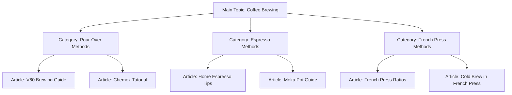

# WordPress SEO Content

## Introduction

Search Engine Optimization (SEO) is the process of improving your website's visibility in search engine results. When it comes to WordPress websites, creating SEO-friendly content is crucial for attracting organic traffic and growing your online presence. This guide will walk you through the fundamentals of WordPress SEO content creation, from basic optimization techniques to advanced strategies that can help your content rank higher in search results.

## Why SEO Content Matters for WordPress Sites

WordPress powers approximately 43% of all websites on the internet, making it a highly competitive platform. Creating SEO-optimized content helps:

- Increase your visibility in search results
- Drive targeted traffic to your website
- Improve user experience
- Establish your website as an authority in your niche
- Convert visitors into customers or loyal readers

## Essential WordPress SEO Content Elements

### 1. Keyword Research and Implementation

Before writing any content, you need to identify what keywords your target audience is searching for.

#### Finding the Right Keywords

Use tools like:
- Google Keyword Planner
- Ahrefs
- SEMrush
- Ubersuggest

#### Implementing Keywords Effectively

```jsx
// Example of a well-optimized WordPress post structure
<h1>Best Coffee Brewing Methods for Beginners</h1> // Main keyword in title
<p>Learning different coffee brewing methods can transform your morning routine...</p> // Natural keyword usage in intro

<h2>The Pour-Over Coffee Method</h2> // Related keyword as subheading
<p>The pour-over coffee method delivers exceptional flavor by...</p> // Content with semantic keywords

<h2>French Press Brewing Guide</h2> // Another related keyword
```

**Best practices:**
- Include your main keyword in the title, URL, first paragraph, and at least one subheading
- Use related keywords and synonyms throughout the content
- Maintain natural language flow – avoid keyword stuffing
- Aim for a keyword density of 1-2% (not too high or too low)

### 2. Creating SEO-Friendly URLs

WordPress lets you customize your post URLs (also called permalinks). An SEO-friendly URL is:
- Short and descriptive
- Contains your target keyword
- Uses hyphens to separate words
- Avoids unnecessary words like "the," "and," or "of"

Here's how to set up SEO-friendly permalinks in WordPress:

1. Go to Settings → Permalinks
2. Select "Post name" as your permalink structure
3. Save your changes

```
Example of a good SEO URL:
https://yoursite.com/coffee-brewing-methods

Example of a poor SEO URL:
https://yoursite.com/p=123 or https://yoursite.com/2023/05/15/coffee-brewing-methods-for-beginners-that-you-can-try-at-home-today
```

### 3. Optimizing Title Tags and Meta Descriptions

While WordPress automatically generates title tags based on your post title, you can customize them using SEO plugins.

#### Using Yoast SEO Plugin for Meta Optimization

1. Install and activate the Yoast SEO plugin
2. Edit your post or page
3. Scroll down to the Yoast SEO section
4. Click on the "Edit snippet" button
5. Customize your SEO title and meta description

```jsx
// Example of well-optimized title tag and meta description
Title tag: "10 Coffee Brewing Methods for Beginners | Coffee Guide"
Meta description: "Discover 10 easy coffee brewing methods perfect for beginners. Learn how to make delicious coffee at home with simple techniques and minimal equipment."
```

**Best practices:**
- Keep your title under 60 characters
- Include your main keyword near the beginning of the title
- Keep meta descriptions between 150-160 characters
- Include a call-to-action in your meta description

### 4. Creating High-Quality Content Structure

Search engines favor well-structured content that's easy to read and navigate.

#### Headings and Subheadings

Use the WordPress editor to create a clear hierarchy with headings:

```jsx
<h1>Main Title (Only one per page)</h1>
<h2>Major Sections</h2>
<h3>Subsections</h3>
<h4>Minor points</h4>
```

**Example structure:**

```jsx
<h1>Ultimate Guide to Home Coffee Brewing</h1>
<h2>Understanding Coffee Beans</h2>
  <h3>Arabica vs. Robusta</h3>
  <h3>The Importance of Freshness</h3>
<h2>Essential Brewing Equipment</h2>
  <h3>Grinders</h3>
  <h3>Brewing Devices</h3>
<h2>Step-by-Step Brewing Methods</h2>
  <h3>Pour-Over Technique</h3>
    <h4>Required Tools</h4>
    <h4>Brewing Instructions</h4>
```

#### Paragraph Structure

- Use short paragraphs (3-4 sentences max)
- Start with the most important information
- Include your target keyword in the first paragraph
- Use transitional phrases between paragraphs

### 5. Enhancing Content with Multimedia

Adding images, videos, and infographics improves user engagement and can boost SEO.

#### Image Optimization

```jsx
// Example of properly optimized image in WordPress

```

**Best practices:**
- Compress images before uploading
- Use descriptive file names (e.g., "pour-over-coffee-brewing.jpg")
- Always add alt text with keywords when relevant
- Specify image dimensions

### 6. Internal Linking Strategy

Internal linking helps search engines understand your site structure and keeps users engaged.

```jsx
// Example of effective internal linking
<p>
  The pour-over method requires a special <a href="/coffee-equipment/gooseneck-kettles">gooseneck kettle</a> for precise water flow control. You'll also need to understand the importance of <a href="/coffee-guides/grind-size">coffee grind size</a> for optimal extraction.
</p>
```

**Best practices:**
- Link to relevant content within your site
- Use descriptive anchor text containing keywords
- Avoid generic terms like "click here"
- Create a logical site structure with parent-child relationships

## Advanced WordPress SEO Content Techniques

### 1. Schema Markup for Rich Snippets

Schema markup helps search engines understand your content better and can result in rich snippets in search results.

Using plugins like Yoast SEO or Schema Pro, you can add schema markup for:
- Articles
- How-to guides
- FAQ pages
- Recipes
- Products
- Reviews

Example of what schema markup does behind the scenes:

```jsx
<script type="application/ld+json">
{
  "@context": "https://schema.org",
  "@type": "HowTo",
  "name": "How to Brew Pour-Over Coffee",
  "description": "A step-by-step guide to brewing perfect pour-over coffee at home.",
  "step": [
    {
      "@type": "HowToStep",
      "text": "Grind coffee beans to medium-fine consistency"
    },
    {
      "@type": "HowToStep",
      "text": "Heat water to 200°F (93°C)"
    }
    // Additional steps...
  ]
}
</script>
```

### 2. Content Silos for Topic Authority

Organizing your content in thematic clusters helps establish topic authority:



### 3. Using WordPress SEO Plugins Effectively

Popular WordPress SEO plugins include:
- Yoast SEO
- Rank Math
- All in One SEO Pack

#### Setting Up Yoast SEO for a Blog Post

1. Fill in the focus keyphrase
2. Optimize your title and meta description
3. Check the content analysis feedback
4. Adjust your content to improve SEO scores
5. Configure social sharing previews
6. Set up advanced settings like canonical URLs if needed

## Step-by-Step SEO Content Creation Process

### 1. Research Phase

1. Identify your target audience's search intent
2. Research primary and secondary keywords
3. Analyze competitor content for the same keywords
4. Outline your content with headings and subheadings

### 2. Content Creation Phase

1. Write a compelling title containing your main keyword
2. Craft an engaging introduction that includes your main keyword
3. Develop your content following your outline
4. Include relevant internal and external links
5. Add optimized images, videos, or infographics

### 3. Optimization Phase

1. Install and configure an SEO plugin like Yoast SEO
2. Optimize your title tag and meta description
3. Check keyword density and placement
4. Implement schema markup if applicable
5. Optimize images with alt text and compressed file sizes

### 4. Publishing and Promotion Phase

1. Set a custom SEO-friendly URL
2. Schedule your post for optimal publishing time
3. Share on social media platforms
4. Monitor performance in Google Search Console

## Practical Example: Creating an SEO-Optimized WordPress Post

Let's walk through creating an SEO-optimized blog post about "homemade pizza recipes":

### 1. Keyword Research Results

- Main keyword: "homemade pizza recipes"
- Related keywords: "easy pizza dough," "pizza toppings," "thin crust pizza recipe"

### 2. Content Structure

```jsx
<h1>10 Delicious Homemade Pizza Recipes You Can Make Tonight</h1>

<p>Looking for homemade pizza recipes that will rival your local pizzeria? These 10 tried-and-tested recipes will transform your kitchen into the best pizza place in town. From classic Margherita to gourmet combinations, there's something for everyone.</p>

<h2>Classic Homemade Pizza Dough Recipe</h2>
<p>The foundation of any great homemade pizza is the dough. This easy pizza dough recipe requires just 5 ingredients...</p>

<h3>Ingredients</h3>
<ul>
  <li>3 cups all-purpose flour</li>
  <li>2 1/4 tsp instant yeast</li>
  <li>1 1/2 tsp salt</li>
  <li>1 tbsp olive oil</li>
  <li>1 1/4 cups warm water</li>
</ul>

<h3>Step-by-Step Instructions</h3>
<ol>
  <li>Combine flour, yeast, and salt in a large bowl</li>
  <li>Add olive oil and warm water</li>
  <li>Mix until a dough forms</li>
  <li>Knead for 5-7 minutes until smooth</li>
  <li>Let rise for 1-2 hours</li>
</ol>

<h2>Thin-Crust Margherita Pizza</h2>
<p>This thin crust pizza recipe creates a delightfully crispy base for the classic Margherita toppings...</p>

<!-- Additional content sections... -->

<h2>Best Toppings for Homemade Pizza</h2>
<p>Get creative with these pizza toppings combinations that work perfectly with our homemade dough...</p>

<h2>Troubleshooting Common Homemade Pizza Problems</h2>
<p>Is your homemade pizza not turning out as expected? Here's how to fix the most common issues...</p>
```

### 3. SEO Elements to Add

```jsx
// SEO Title (via Yoast or similar plugin)
10 Delicious Homemade Pizza Recipes You Can Make Tonight

// Meta Description
Discover 10 easy homemade pizza recipes perfect for weeknight dinners. Includes our foolproof pizza dough recipe, topping ideas, and step-by-step instructions.

// URL Structure
yoursite.com/homemade-pizza-recipes

// Image Optimization


// Internal Linking
<p>For more Italian recipes, check out our guides to <a href="/recipes/homemade-pasta">fresh pasta</a> and <a href="/recipes/tomato-sauce">authentic tomato sauce</a>.</p>

// Schema Markup (added via plugin)
Recipe schema with ingredients, instructions, cooking time, calories, etc.
```

## Common WordPress SEO Content Mistakes to Avoid

1. **Keyword stuffing** – Using your keyword unnaturally throughout the content
2. **Duplicate content** – Publishing the same content on multiple pages
3. **Neglecting mobile optimization** – Not ensuring your content is mobile-friendly
4. **Poor internal linking** – Not connecting your content to other relevant pages
5. **Ignoring image optimization** – Uploading large images without alt text
6. **Thin content** – Publishing short articles with little value (aim for 1000+ words for most topics)
7. **Not updating old content** – Letting your evergreen posts become outdated

## Tools for WordPress SEO Content Creation

1. **Keyword Research Tools**
   - Google Keyword Planner
   - Ahrefs Keyword Explorer
   - SEMrush
   - Ubersuggest

2. **Content Optimization Tools**
   - Yoast SEO plugin
   - Rank Math plugin
   - Clearscope
   - Surfer SEO
   - Hemingway Editor

3. **Image Optimization Tools**
   - TinyPNG
   - ShortPixel
   - EWWW Image Optimizer plugin

4. **Analytics and Tracking**
   - Google Analytics
   - Google Search Console
   - MonsterInsights plugin

## Summary

Creating SEO-friendly content in WordPress involves multiple elements working together to improve your search engine visibility:

1. **Thorough keyword research** to understand what your audience is searching for
2. **Well-structured content** with proper headings, paragraphs, and formatting
3. **Technical SEO elements** like optimized URLs, meta descriptions, and schema markup
4. **Visual components** including properly optimized images and engaging multimedia
5. **Internal linking strategy** to connect related content and improve site structure

By implementing these WordPress SEO content strategies, you'll create content that not only ranks well in search engines but also provides real value to your visitors. Remember that SEO is a long-term strategy – focus on creating high-quality, user-focused content consistently, and your WordPress site will gradually climb the search rankings.

## Further Resources and Exercises

### Resources
- [WordPress.org SEO Documentation](https://wordpress.org/support/article/search-engine-optimization/)
- [Google's SEO Starter Guide](https://developers.google.com/search/docs/beginner/seo-starter-guide)
- [Moz's Beginner's Guide to SEO](https://moz.com/beginners-guide-to-seo)

### Practical Exercises

1. **Keyword Research Challenge**
   - Pick a topic for your next blog post
   - Find 1 main keyword and 5-7 related keywords
   - Analyze the top 3 ranking posts for your main keyword

2. **Content Audit Exercise**
   - Select an existing blog post on your WordPress site
   - Analyze its current SEO performance using Yoast SEO or similar plugin
   - Identify 3 areas for improvement and implement them

3. **Internal Linking Project**
   - Create a content map of your website's main topics
   - Identify opportunities for internal linking
   - Update 5 existing posts with relevant internal links

4. **Schema Markup Implementation**
   - Choose a post that could benefit from schema markup
   - Implement appropriate schema using a WordPress SEO plugin
   - Test the markup using Google's Structured Data Testing Tool

By consistently applying these WordPress SEO content principles, you'll be well on your way to improving your site's visibility and organic traffic.