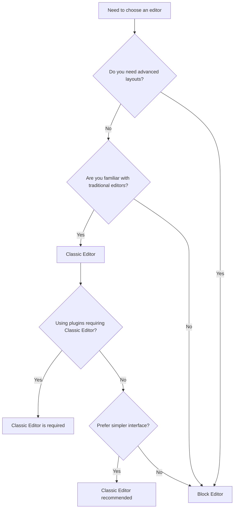

# WordPress Classic Editor

## Introduction

The WordPress Classic Editor is the traditional content editing interface that has been a staple of WordPress for many years. Before the introduction of Gutenberg (the block editor) in WordPress 5.0, the Classic Editor was the default content creation tool for all WordPress websites. Many users and developers still prefer the Classic Editor for its simplicity, familiarity, and compatibility with older plugins and themes.

In this guide, we'll explore the WordPress Classic Editor in detail, covering its features, how to use it effectively, and why some users might choose it over the newer block editor.

## Accessing the Classic Editor

By default, WordPress 5.0 and later versions use the Gutenberg block editor. However, you can install the Classic Editor in two ways:

### Method 1: Installing the Classic Editor Plugin

1. Navigate to **Plugins > Add New** in your WordPress dashboard
2. Search for "Classic Editor"
3. Click "Install Now" on the official Classic Editor plugin by WordPress Contributors
4. Activate the plugin after installation

### Method 2: Using the Classic Editor Block

If you prefer working with the block editor but need the Classic Editor for specific content, you can add a "Classic Editor" block within Gutenberg:

1. In the block editor, click the "+" icon to add a new block
2. Search for "Classic Editor" or "Classic"
3. Select the "Classic" block to add it to your content

## Key Features of the Classic Editor

### The Toolbar

The Classic Editor features a comprehensive toolbar with formatting options:

![WordPress Classic Editor Toolbar]

The main toolbar includes:

- **Text formatting**: Bold, italic, strikethrough
- **Lists**: Bulleted and numbered lists
- **Alignment**: Left, center, right, justified
- **Links**: Insert/edit links
- **Media**: Add images and other media
- **Toggle full-screen mode**
- **More formatting options** (second row toolbar)

### Visual and Text Editing Modes

One of the most powerful features of the Classic Editor is the ability to switch between two editing modes:

1. **Visual Editor** - WYSIWYG (What You See Is What You Get) interface for easy formatting
2. **Text Editor** - HTML view for direct code editing

You can toggle between these modes using the tabs at the top-right corner of the editor.

## How to Use the WordPress Classic Editor

### Creating a New Post or Page

1. From your WordPress dashboard, go to **Posts > Add New** or **Pages > Add New**
2. If you have the Classic Editor plugin activated, you'll see the familiar interface
3. Start by adding a title in the top field
4. Enter your content in the main editor area

### Basic Text Formatting

```
// This represents the actions, not actual code
1. Select the text you want to format
2. Click the appropriate button in the toolbar (B for bold, I for italic, etc.)
3. The formatting is applied instantly
```

For example, to make text bold:
- Highlight the text
- Click the **B** button or use the keyboard shortcut `Ctrl+B` (Windows) / `Cmd+B` (Mac)

### Adding Media

1. Position your cursor where you want to insert media
2. Click the "Add Media" button above the editor
3. Upload a new file or select from your Media Library
4. Configure settings such as alignment, size, and link options
5. Click "Insert into post"

### Creating Links

1. Select the text you want to turn into a link
2. Click the link button in the toolbar
3. Enter the URL in the popup dialog
4. Optionally, configure whether to open in a new tab
5. Click "Add Link"

Example:

```
// To create a link to WordPress.org:
1. Select "WordPress" text
2. Click link icon
3. Enter "https://wordpress.org" in URL field
4. Check "Open link in a new tab"
5. Click "Add Link"
```

### Working with HTML in Text Mode

When you need more precise control or want to add custom HTML:

1. Click the "Text" tab at the top of the editor
2. The content will display as HTML
3. Make your changes directly to the HTML code
4. Switch back to "Visual" mode to see the rendered results

Example of adding a custom HTML table in Text mode:

```html
<table border="1">
  <tr>
    <th>Feature</th>
    <th>Classic Editor</th>
    <th>Block Editor</th>
  </tr>
  <tr>
    <td>Interface</td>
    <td>Single content area</td>
    <td>Block-based</td>
  </tr>
  <tr>
    <td>Learning curve</td>
    <td>Lower</td>
    <td>Higher</td>
  </tr>
</table>
```

### Using Shortcodes

WordPress shortcodes work seamlessly in the Classic Editor:

```
[contact-form-7 id="123" title="Contact Form"]
```

Simply place the shortcode where you want the feature to appear, and it will be processed when the content is displayed.

### Adding Categories and Tags

In the right sidebar:

1. Find the "Categories" box
2. Check relevant categories or add a new one
3. In the "Tags" box below, enter tags separated by commas
4. Click "Add" to save your tags

### Setting Featured Images

1. Locate the "Featured Image" box in the right sidebar
2. Click "Set featured image"
3. Upload or select an image from the Media Library
4. Click "Set featured image" to confirm

## Advanced Classic Editor Features

### Custom Editor Styles

If your theme supports it, the Classic Editor can display content with styles that match how it will appear on the front end:

```css
/* Example of editor-style.css that your theme might include */
body.mce-content-body {
  font-family: 'Source Sans Pro', sans-serif;
  max-width: 720px;
  margin: 0 auto;
  padding: 0 20px;
}

.mce-content-body h1 {
  color: #2c3e50;
  border-bottom: 1px solid #eee;
}
```

### Adding Custom TinyMCE Buttons

For developers, the Classic Editor (which uses TinyMCE) can be extended with custom buttons:

```php
function add_custom_button( $buttons ) {
  array_push( $buttons, 'separator', 'my_custom_button' );
  return $buttons;
}
add_filter( 'mce_buttons', 'add_custom_button' );

function add_custom_button_script( $plugin_array ) {
  $plugin_array['my_custom_plugin'] = get_template_directory_uri() . '/js/custom-editor-plugin.js';
  return $plugin_array;
}
add_filter( 'mce_external_plugins', 'add_custom_button_script' );
```

### Using Keyboard Shortcuts

The Classic Editor supports several keyboard shortcuts for faster editing:

| Action | Windows/Linux | macOS |
|--------|---------------|-------|
| Bold | Ctrl+B | Cmd+B |
| Italic | Ctrl+I | Cmd+I |
| Link | Ctrl+K | Cmd+K |
| Save Draft | Ctrl+S | Cmd+S |
| Publish | Ctrl+P | Cmd+P |

## Classic Editor vs. Block Editor - When to Use Each



### When to Choose Classic Editor:

- You're familiar with traditional word processors
- You're mainly creating text-based content
- You need compatibility with older plugins
- Your workflow is optimized for the Classic Editor
- You prefer a distraction-free writing environment

### When to Choose Block Editor:

- You need complex layouts
- You want to build visually rich pages
- You're starting fresh with WordPress
- You need advanced content features like reusable blocks

## Troubleshooting Common Issues

### Issue: Editor Shows Raw HTML/Shortcodes

**Solution**: Check if you're in Text mode instead of Visual mode. Click the "Visual" tab at the top of the editor.

### Issue: Formatting Options Not Working

**Solution**:
1. Try clearing your browser cache
2. Disable conflicting plugins temporarily
3. Check if your theme has custom editor styles that might conflict

### Issue: Editor Keeps Switching to Block Editor

**Solution**: 
If you've installed the Classic Editor plugin, go to Settings > Writing and set your preference to "Classic Editor" for all posts and pages.

## Example: Creating a Blog Post with Classic Editor

Let's walk through creating a complete blog post using the Classic Editor:

1. Go to **Posts > Add New**

2. Add a title: "How to Master WordPress for Beginners"

3. Start with an introduction paragraph:
   ```
   WordPress powers over 40% of all websites on the internet. In this guide, I'll show you how to get started with this powerful platform even if you have zero technical experience.
   ```

4. Add a heading by selecting the text and choosing "Heading 2" from the format dropdown:
   ```
   ## Step 1: Understanding WordPress Basics
   ```

5. Add content under the heading:
   ```
   WordPress comes in two flavors: WordPress.com (hosted solution) and WordPress.org (self-hosted). For most serious websites, the self-hosted version offers more flexibility and control.
   ```

6. Insert an image:
   - Place cursor on a new line
   - Click "Add Media"
   - Upload or select an image
   - Set alignment to "Center"
   - Add alt text "WordPress dashboard screenshot"
   - Click "Insert into post"

7. Add another heading and content:
   ```
   ## Step 2: Customizing Your Site
   
   After installation, you'll want to personalize your site. This includes:
   ```

8. Create a bulleted list:
   - Click the bullet list button
   - Type: "Selecting a theme that matches your brand"
   - Press Enter
   - Type: "Installing essential plugins"
   - Press Enter
   - Type: "Setting up your main pages"
   - Press Enter and then press Tab to create a nested list
   - Type: "Home, About, Contact, Blog"
   - Press Enter twice to exit list mode

9. Add a call to action paragraph:
   ```
   Ready to start building your WordPress site? Sign up for my free 7-day WordPress email course!
   ```

10. Select categories, tags, and set a featured image

11. Preview your post before publishing

## Summary

The WordPress Classic Editor remains a powerful and efficient tool for content creation, especially for users who prefer a traditional word processor-like interface. While WordPress continues to develop the block editor as its primary content creation tool, the Classic Editor continues to be supported through plugins and offers a familiar environment for many users.

Key takeaways:
- The Classic Editor provides a streamlined interface for content creation
- It offers both visual and HTML editing modes
- It integrates well with shortcodes and plugins
- It's ideal for text-heavy content like blog posts and articles
- You can use it alongside the block editor depending on your needs

## Additional Resources

- [WordPress Classic Editor Plugin](https://wordpress.org/plugins/classic-editor/)
- [WordPress Editor Documentation](https://wordpress.org/support/article/wordpress-editors/)
- [TinyMCE Documentation](https://www.tiny.cloud/docs/)

## Practice Exercises

1. Install the Classic Editor plugin on a test WordPress site
2. Create a blog post that includes headings, lists, links, and at least one image
3. Try switching between Visual and Text modes to understand how the HTML works
4. Experiment with shortcodes if you have compatible plugins
5. Create a template post with your frequently used formatting that you can duplicate for future content

By mastering the Classic Editor, you'll have a valuable skill that applies to many WordPress sites and gives you flexibility in your content creation workflow.