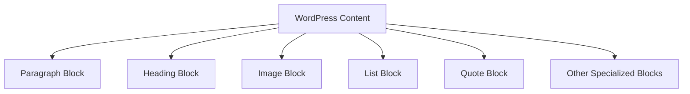

# WordPress Formatting

## Introduction

WordPress formatting tools help you create visually appealing and well-structured content without needing to know HTML or CSS. Whether you're writing blog posts, creating pages, or managing your website content, mastering WordPress formatting options will significantly improve your content's readability and professional appearance.

In this guide, we'll explore the WordPress Block Editor (Gutenberg) formatting options, learn how to style text, organize content with various blocks, and understand advanced formatting techniques that will make your content stand out.

## The WordPress Block Editor

The Block Editor (Gutenberg) is WordPress's content editor that uses blocks as the primary means of creating and formatting content.

### What Are Blocks?

Blocks are individual elements that make up your content. Each paragraph, image, heading, list, and other content elements are separate blocks that can be manipulated independently.



### Adding Blocks

To add a new block:

1. Click the '+' button in the editor
2. Select the block type from the block inserter menu
3. Start creating your content in the new block

![WordPress Block Inserter]

## Text Formatting Basics

### Paragraphs and Headings

The most basic blocks are Paragraph and Heading blocks.

**Paragraph Block**: For regular text content.

**Heading Block**: For section titles, with options from H1 (largest) to H6 (smallest).

Example - Creating and formatting a heading:

```jsx
// In the WordPress editor, this would be a Heading block
<h2>Getting Started with WordPress</h2>

// Followed by a Paragraph block
<p>WordPress makes it easy to create and manage content on your website.</p>
```

### Text Styling Options

Within paragraph and heading blocks, you can apply various text styling:

1. **Bold**: Select text and click the Bold button (B) or press `Ctrl/Cmd+B`
2. **Italic**: Select text and click the Italic button (I) or press `Ctrl/Cmd+I`
3. **Links**: Select text and click the Link button or press `Ctrl/Cmd+K`
4. **Strikethrough**: Select text and click the Strikethrough option
5. **Inline code**: Select text and click the Code option

Example - Applying text styling:

```html
<p>This is <strong>bold text</strong>, and this is <em>italicized text</em>. You can also create <a href="https://example.com">links</a> or use <s>strikethrough</s> for edits. For code snippets, use <code>inline code</code>.</p>
```

## Block Types for Enhanced Formatting

### Lists

WordPress offers both ordered (numbered) and unordered (bullet) list blocks.

To create a list:
1. Add a List block
2. Choose between ordered or unordered
3. Add your list items
4. Use tab to create nested levels

Example - Creating lists:

```html
<!-- Unordered list -->
<ul>
  <li>First item</li>
  <li>Second item
    <ul>
      <li>Nested item</li>
      <li>Another nested item</li>
    </ul>
  </li>
  <li>Third item</li>
</ul>

<!-- Ordered list -->
<ol>
  <li>Step one</li>
  <li>Step two</li>
  <li>Step three</li>
</ol>
```

### Quotes and Pullquotes

For emphasizing text or displaying quotations:

**Quote Block**: Used for standard quotations.
**Pullquote Block**: For creating highlighted, standout quotes.

Example - Adding a quote:

```html
<blockquote>
  <p>Content is king, but formatting is the kingdom that makes the king visible.</p>
  <cite>WordPress Content Creator</cite>
</blockquote>
```

### Tables

Tables help organize information in a structured format:

1. Add a Table block
2. Specify the number of rows and columns
3. Fill in your data
4. Use the table toolbar to add/delete rows and columns

Example - Creating a simple table:

```html
<table>
  <thead>
    <tr>
      <th>Feature</th>
      <th>Description</th>
    </tr>
  </thead>
  <tbody>
    <tr>
      <td>Blocks</td>
      <td>Content elements that can be added and arranged</td>
    </tr>
    <tr>
      <td>Formatting</td>
      <td>Tools to style and arrange content</td>
    </tr>
  </tbody>
</table>
```

## Advanced Formatting Techniques

### Columns

Columns allow you to create multi-column layouts:

1. Add a Columns block
2. Choose the desired layout (number of columns)
3. Add blocks within each column

Example - Creating a two-column layout:

```html
<div class="wp-block-columns">
  <div class="wp-block-column">
    <p>Content for the first column goes here.</p>
  </div>
  <div class="wp-block-column">
    <p>Content for the second column goes here.</p>
  </div>
</div>
```

### Media & Text

The Media & Text block combines an image with text side-by-side:

1. Add a Media & Text block
2. Upload or select your image
3. Add your text content in the text area
4. Adjust settings like text position (left/right)

### Custom HTML

For advanced users who know HTML:

1. Add a Custom HTML block
2. Write your HTML code
3. Preview to see the result

Example - Adding custom HTML:

```html
<!-- Using the Custom HTML block -->
<div style="border: 1px solid #ddd; padding: 15px; border-radius: 5px;">
  <h3>Custom Formatted Box</h3>
  <p>This content has custom styling applied through HTML.</p>
</div>
```

### Reusable Blocks

For content you use frequently:

1. Create and format your content
2. Select the block(s)
3. Click the three dots in the toolbar
4. Choose "Add to Reusable blocks"
5. Give it a name

Now you can reuse this content across your site!

## Block Formatting Options

Most blocks have specific formatting options accessible through:

1. **Block Toolbar**: Appears above the selected block
2. **Block Settings Panel**: Appears in the right sidebar when a block is selected

Common formatting options include:

- Text alignment (left, center, right)
- Text color and background color
- Font size
- Drop cap (enlarged first letter)
- Custom CSS classes

Example - Applying block formatting:

```html
<!-- A paragraph with custom formatting -->
<p class="has-text-align-center has-large-font-size has-blue-color">
  This text is centered, large-sized, and blue.
</p>
```

## Best Practices for WordPress Formatting

### Content Readability

1. **Use headings hierarchically**: Start with H2 (as H1 is usually your post title), then H3 for subsections, H4 for sub-subsections, etc.
2. **Break up long content**: Use shorter paragraphs, headings, and lists to make content scannable.
3. **Consistent styling**: Maintain consistent formatting throughout your content.

### Mobile Responsiveness

1. **Preview content on mobile**: Use WordPress's preview functionality to see how your formatting looks on different devices.
2. **Beware of wide elements**: Tables and images might need adjustments for mobile viewing.
3. **Consider column stacking**: Columns will stack vertically on mobile - plan your content accordingly.

### Advanced Formatting Examples

**Creating a Call-to-Action Box:**

```html
<div class="wp-block-group has-background" style="background-color:#f0f0f0;padding:20px">
  <h3>Ready to Get Started?</h3>
  <p>Join thousands of website owners who trust WordPress for their content management needs.</p>
  <div class="wp-block-buttons">
    <div class="wp-block-button">
      <a class="wp-block-button__link">Sign Up Today</a>
    </div>
  </div>
</div>
```

**Creating a Feature Comparison:**

```html
<table class="wp-block-table">
  <thead>
    <tr>
      <th>Feature</th>
      <th>Basic Plan</th>
      <th>Premium Plan</th>
    </tr>
  </thead>
  <tbody>
    <tr>
      <td>Number of Pages</td>
      <td>5</td>
      <td>Unlimited</td>
    </tr>
    <tr>
      <td>Custom Domain</td>
      <td>❌</td>
      <td>✅</td>
    </tr>
    <tr>
      <td>E-commerce</td>
      <td>❌</td>
      <td>✅</td>
    </tr>
  </tbody>
</table>
```

## Troubleshooting Common Formatting Issues

### Issue: Unexpected Spacing

**Solution**: Check for empty paragraph blocks between your content blocks. Delete any unnecessary blocks.

### Issue: Content Not Aligning Properly

**Solution**: Check block settings for alignment options. Some themes may override certain alignments.

### Issue: Formatting Lost After Updates

**Solution**: Always back up your content before major WordPress updates. Some block changes between versions may affect formatting.

## Summary

WordPress formatting offers powerful tools for creating visually appealing and well-structured content. By mastering blocks, understanding text formatting options, and leveraging advanced features like columns and reusable blocks, you can create professional content without needing to write code.

Remember these key points:

- Use blocks as the building blocks of your content
- Apply text formatting to enhance readability
- Structure content with headings, lists, and other specialized blocks
- Use advanced blocks for complex layouts
- Follow best practices for consistent, mobile-friendly content

## Practice Exercises

1. Create a blog post with at least three different heading levels
2. Build a two-column layout with an image in one column and text in another
3. Create a table comparing three products or services
4. Design a reusable call-to-action block that you can use across multiple posts
5. Format a recipe using appropriate blocks (lists for ingredients, numbered lists for steps)

## Additional Resources

- WordPress Block Editor Handbook
- WordPress Formatting Support Forums
- Advanced Gutenberg Block Tutorials
- WordPress Content Accessibility Guidelines

Master these formatting techniques, and you'll be creating beautiful, professional WordPress content in no time!