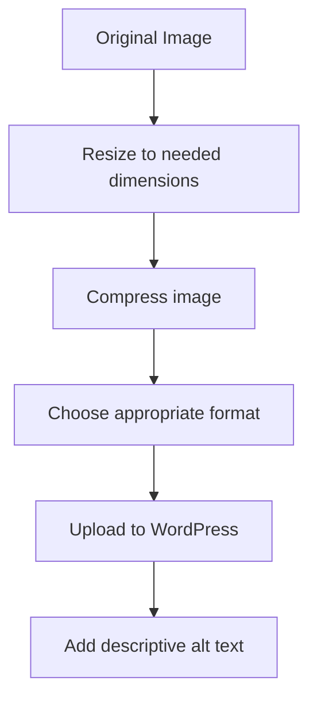

# WordPress Images

Images are powerful elements that enhance your website's visual appeal, break up text, and help convey your message more effectively. In this guide, you'll learn everything you need to know about working with images in WordPress, from uploading and inserting images to optimizing them for the web.

## Introduction to WordPress Images

WordPress offers a robust media management system that makes it easy to upload, organize, and insert images into your content. Whether you're creating blog posts, pages, or custom content types, understanding how to work with images is essential for creating engaging content.

## The WordPress Media Library

The Media Library is WordPress's central repository for all your uploaded media files, including images.

### Accessing the Media Library

There are two main ways to access the Media Library:

1. **From the WordPress Dashboard**: Navigate to **Media > Library** in the left sidebar.
2. **During content creation**: Click the "Add Media" button in the editor when creating or editing a post or page.


## Uploading Images to WordPress

### Method 1: Via the Media Library

1. Go to **Media > Add New** in your WordPress dashboard
2. Either drag and drop files onto the page or click "Select Files" to browse your computer
3. Wait for the upload to complete

### Method 2: While Editing Content

1. While editing a post or page, click the "+" icon to add a block
2. Select the "Image" block
3. Click "Upload" to select an image from your computer or "Media Library" to choose from previously uploaded images

## Adding Images to Your Content

### Using the Block Editor (Gutenberg)

#### Basic Image Block

```jsx
// Adding a simple image block

```

To add a basic image:

1. Click the "+" icon to add a new block
2. Search for "Image" and select the Image block
3. Upload a new image or select from the Media Library
4. Once added, you can adjust various settings in the right sidebar:
   - Alt Text (important for accessibility)
   - Image Size
   - Alignment options

#### Image Gallery Block

For multiple images:

1. Add a "Gallery" block
2. Upload or select multiple images
3. Arrange them as needed

### Image Alignment Options

The Block Editor offers several alignment options for images:

- Left align
- Center align
- Right align
- Wide width
- Full width

Example of setting alignment in HTML:

```html
<figure class="wp-block-image alignright">
  
</figure>
```

## Image Optimization Best Practices

Optimizing your images is crucial for website performance and user experience.

### Choosing the Right File Format

- **JPEG**: Best for photographs and complex images with many colors
- **PNG**: Best for images requiring transparency or with text/simple graphics
- **WebP**: Modern format with better compression (increasingly supported)
- **SVG**: Ideal for logos, icons, and simple graphics that need to scale

### Optimizing Image Size and Resolution

1. **Resize images before uploading**: Don't upload 4000×3000 pixel images if you only need 800×600
2. **Compress images**: Use tools like TinyPNG, ImageOptim, or WordPress plugins like Smush or ShortPixel
3. **Choose the right dimensions**: Match the image size to how it will be displayed

Example image optimization process:



## Advanced Image Features in WordPress

### Featured Images (Post Thumbnails)

Featured images represent your posts on archive pages, search results, and sometimes social media when shared.

To set a featured image:

1. While editing a post, look for the "Featured Image" panel on the right sidebar
2. Click "Set featured image"
3. Upload or select an image from the Media Library
4. Click "Set featured image"

### Image Captions and Alt Text

Always include descriptive alt text for accessibility and SEO. Captions are optional but can provide context.

```html
<figure class="wp-block-image">
  
  <figcaption>The WordPress dashboard provides access to all site management features</figcaption>
</figure>
```

### Responsive Images

WordPress automatically generates multiple sizes of each uploaded image and uses HTML5's `srcset` attribute to deliver the appropriate size based on the viewer's device.

Default image sizes generated:

- Thumbnail: 150×150 pixels
- Medium: Max 300 pixels width/height
- Large: Max 1024 pixels width/height
- Full: Original size

You can customize these in **Settings > Media**.

### Creating Image Links

You can make your images clickable links to:

- A larger version of the image
- Another page on your site
- An external website

In the Block Editor:

1. Select your image block
2. In the block settings sidebar, locate the "Link Settings"
3. Enter the URL or select from your existing content

## Common Image Issues and Solutions

### Issues with Image Uploads

If you can't upload images, check:

1. File size limits (often set by your hosting provider)
2. File permissions on your server
3. Available disk space

### Broken Images

If images appear broken:

1. Check if the image file still exists in the Media Library
2. Look for URL changes if you've migrated your site
3. Check if your image path is correct

### Slow-Loading Images

To address slow-loading images:

1. Optimize image file sizes
2. Implement lazy loading (built into WordPress 5.5+)
3. Consider a Content Delivery Network (CDN)
4. Use a caching plugin

## Working with Images Programmatically

For developers who need more control, WordPress provides functions to work with images in themes and plugins.

### Displaying the Featured Image in a Theme

```php
<?php if (has_post_thumbnail()) : ?>
    <div class="post-thumbnail">
        <?php the_post_thumbnail('large'); ?>
    </div>
<?php endif; ?>
```

### Registering Custom Image Sizes

Add this to your theme's `functions.php` file:

```php
// Register custom image sizes
add_action('after_setup_theme', 'my_custom_image_sizes');
function my_custom_image_sizes() {
    add_image_size('blog-header', 1200, 600, true);
    add_image_size('square-thumbnail', 400, 400, true);
}
```

## Best Practices for WordPress Images

1. **Always add alt text** for accessibility and SEO
2. **Optimize before uploading** to improve page load times
3. **Use descriptive filenames** (e.g., "blue-wordpress-logo.jpg" instead of "IMG_12345.jpg")
4. **Consider image aspect ratio** when designing layouts
5. **Be mindful of copyright** - only use images you have permission to use
6. **Create a consistent style** for your website's images
7. **Use image compression plugins** to automatically optimize uploads

## Summary

Working with images in WordPress is straightforward but requires attention to detail to ensure optimal performance and accessibility. By following best practices for uploading, inserting, and optimizing images, you can create visually appealing content that loads quickly and provides a good user experience.

Remember these key points:
- The Media Library is your central hub for managing images
- Always optimize images before uploading
- Use appropriate image formats for different types of content
- Add descriptive alt text for all images
- Set featured images for posts to improve their visibility

## Additional Resources

- [WordPress.org Media Documentation](https://wordpress.org/support/article/media-library-screen/)
- [Image SEO Best Practices](https://yoast.com/image-seo/)
- [Web Accessibility Guidelines for Images](https://www.w3.org/WAI/tutorials/images/)

## Practice Exercises

1. Upload and optimize five different images to your WordPress site
2. Create a blog post with properly aligned and captioned images
3. Set up a gallery showcasing different image formats and sizes
4. Test your site's load speed before and after optimizing images
5. Create a custom image size for your theme and display images using it

With these skills, you'll be able to effectively incorporate images into your WordPress site, enhancing both its visual appeal and functionality.