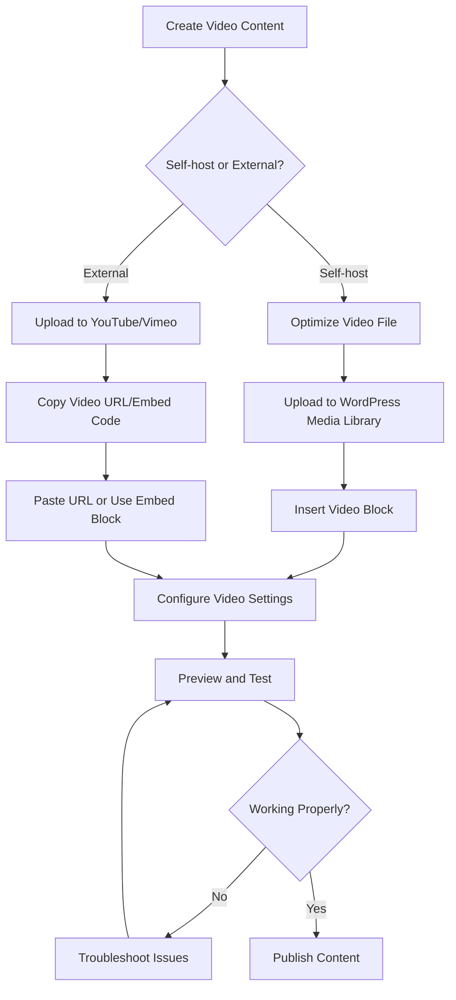

# WordPress Videos

## Introduction

Videos have become an essential part of online content, offering a dynamic way to engage visitors and communicate information. WordPress provides several options for incorporating videos into your website, whether you're creating tutorials, product demonstrations, testimonials, or entertainment content.

In this guide, we'll explore everything you need to know about working with videos in WordPress - from uploading and embedding videos to optimizing them for performance and implementing advanced features like video playlists and galleries.

## Why Use Videos in WordPress?

Before diving into the technical aspects, let's understand why videos are valuable for your WordPress site:

- **Enhanced Engagement**: Videos capture attention more effectively than text or images
- **Better Information Retention**: Users typically retain 95% of a message when watching a video compared to 10% when reading text
- **Improved SEO**: Sites with videos are 53 times more likely to reach the first page of Google
- **Increased Time on Page**: Videos keep visitors on your site longer, reducing bounce rates
- **Higher Conversion Rates**: Product videos can increase conversions by up to 80%

## Basic Methods for Adding Videos to WordPress

### 1. Using the WordPress Media Library

The most straightforward approach for self-hosted videos:

1. Navigate to your WordPress dashboard
2. Go to **Posts** > **Add New** (or edit an existing post)
3. Click on the **+** button in the block editor
4. Select **Video** block
5. Upload your video file or select one from the Media Library

```jsx
// WordPress Gutenberg block structure for video (for reference)
wp.blocks.registerBlockType('core/video', {
  title: 'Video',
  icon: 'format-video',
  category: 'media',
  attributes: {
    src: {
      type: 'string',
    },
    caption: {
      type: 'string',
    }
    // Other attributes...
  },
  // Block implementation
});
```

**Pros of Self-Hosting:**
- Complete control over your videos
- No third-party branding
- No redirection to external platforms

**Cons of Self-Hosting:**
- Consumes your server resources
- May affect site performance
- Limited analytics capabilities

### 2. Embedding Videos from External Platforms

WordPress makes it incredibly easy to embed videos from popular platforms:

1. Copy the URL of your video from YouTube, Vimeo, etc.
2. Create a new post or page in WordPress
3. Paste the URL directly into the editor on its own line
4. WordPress automatically converts it to an embedded player

**Example:**

```
https://www.youtube.com/watch?v=example123
```

This gets transformed into an embedded YouTube player automatically.

For more control, you can use the dedicated YouTube block:

1. Click the **+** button in the editor
2. Search for "YouTube" and select the YouTube block
3. Paste your video URL
4. Adjust settings like autoplay, muting, etc.

**Supported Video Platforms:**
- YouTube
- Vimeo
- Dailymotion
- VideoPress
- TED
- Facebook
- Instagram
- And many more

## Advanced Video Implementations

### Creating Video Galleries

To showcase multiple videos in an organized gallery:

1. Install a plugin like "Video Gallery" or "Envira Gallery"
2. Create a new gallery from your dashboard
3. Upload or link to your videos
4. Customize appearance settings
5. Insert the gallery into your page using a shortcode or block

**Sample gallery shortcode:**

```
[video_gallery id="123"]
```

### Adding Video Playlists

WordPress core supports audio playlists but not video playlists by default. However, you can:

1. Install a plugin like "WP Video Playlists" or use YouTube's playlist feature
2. Create your playlist through the plugin interface
3. Insert it into your content using the provided shortcode

### Autoplay, Loop, and Mute Settings

When using the standard WordPress Video block, you can control various playback settings:

1. Insert a Video block
2. Upload or select your video
3. Click on the block to reveal the toolbar and settings panel
4. Toggle options for:
   - Autoplay
   - Loop
   - Muting
   - Playback controls
   - Preloading behavior

```html
<!-- Example of video HTML with attributes -->
<video 
  src="your-video.mp4" 
  autoplay 
  loop 
  muted 
  controls 
  width="640" 
  height="360">
  Your browser does not support the video tag.
</video>
```

:::caution
Autoplay with sound is often blocked by browsers to prevent annoying user experiences. If you need autoplay functionality, it's best to combine it with the muted attribute.
:::

## Best Practices for WordPress Videos

### 1. Optimizing Video Performance

Large video files can significantly slow down your website. Follow these optimization tips:

- **Compress your videos** before uploading using tools like HandBrake or Adobe Media Encoder
- **Choose the right format**: MP4 with H.264 encoding offers good compression and compatibility
- **Set appropriate dimensions**: Don't use 4K videos when 720p or 1080p will suffice
- **Consider lazy loading**: Only load videos when the user scrolls to them
- **Use thumbnails**: Display a static image until the user plays the video

### 2. Making Videos Responsive

Ensure your videos look good on all devices:

```css
/* CSS for responsive videos */
.video-container {
  position: relative;
  padding-bottom: 56.25%; /* 16:9 aspect ratio */
  height: 0;
  overflow: hidden;
  max-width: 100%;
}

.video-container iframe,
.video-container object,
.video-container embed,
.video-container video {
  position: absolute;
  top: 0;
  left: 0;
  width: 100%;
  height: 100%;
}
```

Many modern WordPress themes include responsive video support, but you may need to add custom CSS or use a plugin if your theme doesn't handle it well.

### 3. Video SEO Considerations

Improve your video's visibility in search engines:

- **Add descriptive titles and captions**
- **Include video transcripts** for accessibility and SEO benefits
- **Use schema markup** to provide search engines with video metadata
- **Create a video sitemap** using plugins like Yoast SEO

Example video schema markup:

```html
<script type="application/ld+json">
{
  "@context": "https://schema.org",
  "@type": "VideoObject",
  "name": "How to Create a WordPress Website",
  "description": "A step-by-step tutorial for beginners on building a WordPress website.",
  "thumbnailUrl": "https://example.com/thumbnail.jpg",
  "uploadDate": "2023-01-15T08:00:00+08:00",
  "duration": "PT5M30S",
  "contentUrl": "https://example.com/videos/wordpress-tutorial.mp4"
}
</script>
```

## WordPress Video Plugins

Enhance your video capabilities with these popular plugins:

### 1. Video Player Plugins

- **VideoJS**: A customizable HTML5 video player
- **FV Player**: Feature-rich video player with analytics
- **JW Player**: Professional video hosting and player solution

### 2. Video Gallery Plugins

- **Video Gallery by Huge-IT**: Create responsive video galleries
- **Envira Gallery**: Powerful gallery plugin with video support
- **FooGallery**: Lightweight gallery plugin with video capabilities

### 3. Video Optimization Plugins

- **WP Rocket**: Caching plugin with lazy load video support
- **Smush**: Image and video optimization
- **ShortPixel**: Compresses videos for faster loading

## Creating Custom Video Solutions with Code

For developers who want more control, here's how to programmatically add videos:

### Custom Video Block

Create a custom Gutenberg block for specialized video functionality:

```jsx
// Basic structure of a custom video block (for educational purposes)
import { registerBlockType } from '@wordpress/blocks';
import { MediaUpload, MediaUploadCheck } from '@wordpress/block-editor';
import { Button } from '@wordpress/components';

registerBlockType('my-plugin/custom-video', {
    title: 'Custom Video Player',
    icon: 'video-alt3',
    category: 'media',
    attributes: {
        videoId: {
            type: 'number',
        },
        videoUrl: {
            type: 'string',
        }
    },
    
    edit: function(props) {
        const { attributes, setAttributes } = props;
        
        return (
            <div className="custom-video-block">
                <MediaUploadCheck>
                    <MediaUpload
                        onSelect={ media => {
                            setAttributes({
                                videoId: media.id,
                                videoUrl: media.url
                            });
                        }}
                        allowedTypes={ ['video'] }
                        value={ attributes.videoId }
                        render={ ({ open }) => (
                            <div>
                                { !attributes.videoUrl ? (
                                    <Button onClick={ open } isPrimary>
                                        Select Video
                                    </Button>
                                ) : (
                                    <div>
                                        <video
                                            controls
                                            src={ attributes.videoUrl }
                                        />
                                        <Button onClick={ open } isSecondary>
                                            Replace Video
                                        </Button>
                                    </div>
                                )}
                            </div>
                        )}
                    />
                </MediaUploadCheck>
            </div>
        );
    },
    
    save: function(props) {
        const { attributes } = props;
        
        return attributes.videoUrl ? (
            <div className="custom-video-player">
                <video
                    controls
                    src={ attributes.videoUrl }
                    width="100%"
                />
            </div>
        ) : null;
    }
});
```

### Custom Video Shortcode

Create a shortcode for specific video functionality:

```php
// Add this to your theme's functions.php or plugin file
function custom_video_shortcode($atts) {
    // Extract shortcode attributes with defaults
    $atts = shortcode_atts(array(
        'src' => '',
        'width' => '640',
        'height' => '360',
        'autoplay' => 'false',
        'loop' => 'false',
        'muted' => 'false',
        'controls' => 'true',
        'poster' => '',
        'class' => ''
    ), $atts);
    
    // Convert string attributes to proper HTML attributes
    $autoplay = ($atts['autoplay'] === 'true') ? ' autoplay' : '';
    $loop = ($atts['loop'] === 'true') ? ' loop' : '';
    $muted = ($atts['muted'] === 'true') ? ' muted' : '';
    $controls = ($atts['controls'] === 'true') ? ' controls' : '';
    $poster = ($atts['poster']) ? ' poster="' . esc_url($atts['poster']) . '"' : '';
    $class = ($atts['class']) ? ' class="' . esc_attr($atts['class']) . '"' : '';
    
    // Return HTML for video
    return '<video width="' . esc_attr($atts['width']) . '" height="' . esc_attr($atts['height']) . '"' . 
           $autoplay . $loop . $muted . $controls . $poster . $class . '>' .
           '<source src="' . esc_url($atts['src']) . '" type="video/mp4">' .
           'Your browser does not support the video tag.' .
           '</video>';
}
add_shortcode('custom_video', 'custom_video_shortcode');
```

Usage example:

```
[custom_video src="https://example.com/video.mp4" width="720" height="480" autoplay="true" muted="true" poster="https://example.com/poster.jpg"]
```

## Troubleshooting Common Video Issues

### Video Not Playing

If your videos aren't playing correctly:

1. **Check file format compatibility**: Ensure you're using widely supported formats (MP4 with H.264)
2. **Verify file permissions**: Make sure your video files are readable
3. **Inspect browser console**: Look for JavaScript errors
4. **Test in another browser**: Rule out browser-specific issues

### Poor Performance

If videos are slowing down your site:

1. **Compress your videos** using optimization tools
2. **Consider a CDN** for video delivery
3. **Use external hosting** like YouTube or Vimeo for bandwidth-intensive videos
4. **Implement lazy loading** to delay video loading until needed

## Accessibility Considerations

Make your videos accessible to all users:

1. **Add captions and subtitles**: Essential for hearing-impaired users
2. **Provide transcripts**: Text alternatives for video content
3. **Ensure keyboard controls work**: Users should be able to play/pause with keyboard
4. **Avoid autoplay with sound**: This can be disruptive, especially for screen reader users
5. **Add descriptive audio**: For visually impaired users

## WordPress Video Workflow

Here's a recommended workflow for adding videos to your WordPress site:



## Summary

WordPress offers numerous options for incorporating videos into your website, from simple embeds to complex custom solutions. By following best practices for optimization, responsiveness, and accessibility, you can create engaging video content that enhances user experience without compromising performance.

Remember these key points:
- Choose between self-hosting or external platforms based on your needs
- Optimize videos for web delivery to maintain site performance
- Make videos responsive and accessible
- Consider using plugins for advanced functionality
- Implement proper SEO practices for better visibility

## Additional Resources

To continue learning about WordPress videos, check out these resources:

- [WordPress Codex: Embeds](https://codex.wordpress.org/Embeds)
- [Web Video Best Practices](https://web.dev/media/)
- [Video SEO Guide](https://yoast.com/video-seo/)

## Exercises

1. **Basic Exercise**: Embed a YouTube video in a WordPress post and customize its appearance.
2. **Intermediate Exercise**: Create a responsive video gallery using a WordPress plugin.
3. **Advanced Exercise**: Implement a custom video player with JavaScript that tracks viewing statistics.
4. **Accessibility Challenge**: Add captions to a video and ensure it meets WCAG accessibility guidelines.
5. **Performance Exercise**: Optimize a large video file for web delivery without significant quality loss.

Happy video creating!