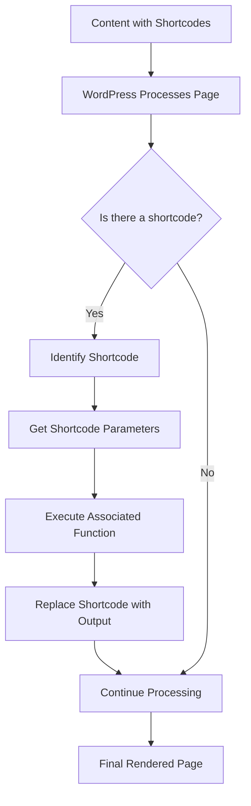

# WordPress Shortcodes

## Introduction

WordPress shortcodes are special macros that allow you to create complex and dynamic content in your posts and pages without writing custom HTML or PHP code. They act as shortcuts (hence the name) to execute specific functions that would otherwise require programming knowledge. Shortcodes are enclosed in square brackets and can include parameters to customize their behavior.

For instance, rather than writing complex HTML to embed a gallery of images, you can simply use the `[gallery]` shortcode, and WordPress will handle the heavy lifting for you.

## Why Use Shortcodes?

Shortcodes provide several benefits for WordPress content creators:

1. **Simplicity**: Execute complex functionality with minimal code
2. **Consistency**: Ensure uniform presentation across your website
3. **Dynamic content**: Insert content that updates automatically
4. **Non-technical usage**: Allow users without coding skills to add advanced features

## Built-in WordPress Shortcodes

WordPress comes with several useful shortcodes right out of the box. Let's explore some of the most common ones:

### Gallery Shortcode

The gallery shortcode allows you to insert an image gallery anywhere in your content.

```
[gallery ids="123,124,125"]
```

**Output:** A grid of images with IDs 123, 124, and 125 from your media library.

### Caption Shortcode

Add captions to images easily:

```
[caption id="attachment_6" align="alignright" width="300"] This is the caption text[/caption]
```

**Output:** An image with a properly formatted caption underneath.

### Audio Shortcode

Embed audio files:

```
[audio src="audiofile.mp3"]
```

**Output:** An audio player with controls for the specified audio file.

### Video Shortcode

Similarly, embed video files:

```
[video width="640" height="360" mp4="video.mp4"]
```

**Output:** A video player with the specified dimensions and source file.

### Embed Shortcode

Embed content from external sources:

```
[embed width="600" height="400"]https://www.youtube.com/watch?v=dQw4w9WgXcQ[/embed]
```

**Output:** An embedded YouTube video player with the specified dimensions.

## Advanced Shortcode Parameters

Most shortcodes accept parameters to customize their behavior. Parameters are specified as `name="value"` pairs within the shortcode brackets.

For example, the gallery shortcode accepts numerous parameters:

```
[gallery ids="123,124,125" columns="3" size="medium" link="file" orderby="rand"]
```

This shortcode:
- Shows images with IDs 123, 124, and 125
- Displays them in 3 columns
- Uses medium-sized images
- Links directly to the image files
- Arranges images in random order

## Creating Custom Shortcodes

One of the most powerful features of WordPress is the ability to create your own custom shortcodes. This involves registering a PHP function and mapping it to a shortcode tag.

### Basic Custom Shortcode

Here's how to create a simple shortcode that displays the current year:

```php
function current_year_shortcode() {
    return date('Y');
}
add_shortcode('year', 'current_year_shortcode');
```

Once registered, you can use this shortcode in any post or page:

```
Copyright © [year] My Website
```

**Output:** Copyright © 2023 My Website (with the year automatically updating each year)

### Shortcode with Parameters

Let's create a more advanced shortcode that accepts parameters:

```php
function highlight_text_shortcode($atts, $content = null) {
    $atts = shortcode_atts(
        array(
            'color' => 'yellow',
            'style' => 'bold'
        ), 
        $atts
    );
    
    $style_attr = 'background-color:' . $atts['color'] . ';';
    if ($atts['style'] == 'bold') {
        $style_attr .= 'font-weight:bold;';
    }
    
    return '<span style="' . $style_attr . '">' . $content . '</span>';
}
add_shortcode('highlight', 'highlight_text_shortcode');
```

Usage:

```
[highlight color="pink" style="bold"]This text will be highlighted![/highlight]
```

**Output:** <span style={{"background-color": "pink", "font-weight":"bold"}}>This text will be highlighted!</span>

[//]: # ("background-color:pink;font-weight:bold;")

### Where to Add Custom Shortcode Code

You can add custom shortcode functions to your theme's `functions.php` file or create a custom plugin. For beginners, using a functionality plugin like "Code Snippets" is often recommended as it separates functionality from your theme.

## Nesting Shortcodes

WordPress supports nesting shortcodes within other shortcodes. This allows for creating complex layouts and functionality combinations.

Example:

```
[column width="half"]
    [highlight color="blue"]Important information[/highlight]
    Regular text here
[/column]
```

## Common Shortcode Plugins

Many plugins extend WordPress with useful shortcodes:

1. **Shortcodes Ultimate**: Provides 50+ shortcodes for creating tabs, buttons, boxes, sliders, and more
2. **TablePress**: Allows you to create and manage tables using the `[table]` shortcode
3. **Contact Form 7**: Uses the `[contact-form-7]` shortcode to embed forms
4. **WooCommerce Shortcodes**: Display products and other shop elements with shortcodes

## Best Practices for Using Shortcodes

To make the most of shortcodes in your WordPress content:

1. **Document your custom shortcodes**: Create a reference guide for content creators
2. **Use descriptive names**: Make shortcode names intuitive
3. **Be consistent with parameters**: Use similar parameter names across different shortcodes
4. **Consider performance**: Complex shortcodes might slow down page loading
5. **Provide fallback content**: For shortcodes that might fail under certain conditions

## Troubleshooting Common Shortcode Issues

If your shortcodes aren't working as expected:

1. **Check for syntax errors**: Ensure brackets and quotes are properly paired
2. **Verify shortcode is registered**: Make sure the plugin providing the shortcode is active
3. **Look for conflicts**: Some plugins might filter or modify shortcode behavior
4. **Check for proper nesting**: Make sure nested shortcodes are properly ordered

## Visual Representation of How Shortcodes Work



## Summary

WordPress shortcodes are powerful tools that simplify the process of adding dynamic content to your website. By understanding how to use built-in shortcodes, customize them with parameters, and create your own custom shortcodes, you can enhance your WordPress content without the need for extensive coding knowledge.

Shortcodes bridge the gap between simple text editing and powerful functionality, making them an essential part of any WordPress content creator's toolkit.

## Additional Resources

- [WordPress Shortcode API Documentation](https://developer.wordpress.org/plugins/shortcodes/)
- [WordPress Codex: Gallery Shortcode](https://codex.wordpress.org/Gallery_Shortcode)
- [10 Useful WordPress Shortcode Examples](https://www.smashingmagazine.com/2012/05/wordpress-shortcodes-complete-guide/)

## Exercises

1. Use the built-in gallery shortcode to display three images from your media library in two columns.
2. Create a custom shortcode that displays a styled quote with optional attribution.
3. Experiment with nesting the caption shortcode inside a column shortcode.
4. Create a custom shortcode that displays different content for logged-in versus guest users.