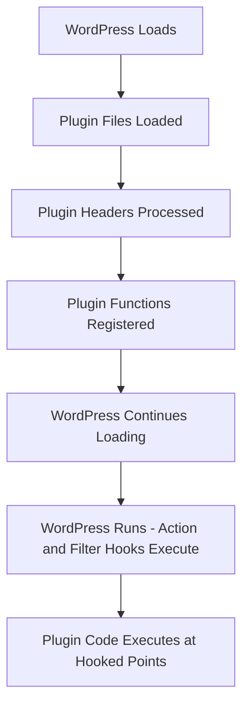

# WordPress Plugin Basics

## Introduction

WordPress plugins are tools that extend and expand the functionality of WordPress websites. They're written in PHP and integrate seamlessly with WordPress through a system of hooks and filters. Whether you want to add contact forms, improve SEO, enhance security, or create custom features, plugins make it possible without modifying WordPress core files.

In this guide, you'll learn the fundamental concepts of WordPress plugins, the structure required to create them, and how to build your first simple plugin. By the end, you'll understand how plugins work with WordPress and be ready to develop your own custom solutions.

## What Are WordPress Plugins?

Plugins are packages of code that "plug into" WordPress to add new features or modify existing ones. They allow you to:

- Add functionality without changing core WordPress files
- Customize your site's behavior
- Extend WordPress's capabilities
- Solve specific problems with modular solutions

WordPress plugins can be as simple as a few lines of code or complex applications with their own databases, settings pages, and extensive functionality.

## Plugin Architecture

### File Structure

A basic WordPress plugin requires at least one PHP file. However, most plugins include multiple files organized in a directory structure:

```
my-plugin/
  ├── my-plugin.php      # Main plugin file
  ├── includes/          # PHP classes and functions
  ├── admin/             # Admin-related functionality
  ├── assets/            # CSS, JS, and images
  │    ├── css/
  │    ├── js/
  │    └── images/
  ├── templates/         # Template files
  ├── languages/         # Translation files
  ├── readme.txt         # Plugin documentation
  └── uninstall.php      # Cleanup code when plugin is uninstalled
```

### Plugin Header

Every WordPress plugin must have a main PHP file with a special comment block at the top. This header provides WordPress with essential information about your plugin:

```php
<?php
/**
 * Plugin Name: My First Plugin
 * Plugin URI: https://example.com/plugins/my-first-plugin
 * Description: A simple plugin to demonstrate WordPress plugin basics.
 * Version: 1.0.0
 * Author: Your Name
 * Author URI: https://example.com
 * License: GPL-2.0+
 * License URI: http://www.gnu.org/licenses/gpl-2.0.txt
 * Text Domain: my-first-plugin
 * Domain Path: /languages
 */

// If this file is called directly, abort.
if (!defined('WPINC')) {
    die;
}

// Plugin code goes here
```

## How WordPress Plugins Work: Hooks System

WordPress plugins interact with WordPress through a system of **hooks**. Hooks are connection points that allow you to "hook into" the WordPress core to either:

1. **Execute your code** at specific points (action hooks)
2. **Modify data** before it's used by WordPress (filter hooks)

### Action Hooks

Action hooks let you execute your code at specific points in WordPress's execution.

```php
// This function will run when WordPress loads
function my_plugin_function() {
    // Your code here
    echo '<p>Hello from my plugin!</p>';
}

// Hook our function to the wp_footer action
add_action('wp_footer', 'my_plugin_function');
```

### Filter Hooks

Filter hooks let you modify data before WordPress uses it:

```php
// This function modifies the post title
function my_plugin_modify_title($title) {
    return '🌟 ' . $title . ' 🌟';
}

// Hook our function to the the_title filter
add_filter('the_title', 'my_plugin_modify_title');
```

## Creating Your First Plugin

Let's create a simple plugin that adds a copyright notice to the footer of your WordPress site.

### Step 1: Create the Plugin Directory and File

1. Navigate to the `wp-content/plugins/` directory in your WordPress installation
2. Create a new folder called `simple-copyright-notice`
3. Inside that folder, create a file named `simple-copyright-notice.php`

### Step 2: Add the Plugin Header

Open the PHP file and add the plugin header:

```php
<?php
/**
 * Plugin Name: Simple Copyright Notice
 * Description: Adds a customizable copyright notice to the footer.
 * Version: 1.0.0
 * Author: Your Name
 * Text Domain: simple-copyright-notice
 */

// If this file is called directly, abort.
if (!defined('WPINC')) {
    die;
}
```

### Step 3: Create the Core Functionality

Now let's add the copyright notice function:

```php
// Function to display the copyright notice
function scn_add_copyright_notice() {
    $site_name = get_bloginfo('name');
    $current_year = date('Y');
    
    $copyright_text = sprintf(
        '&copy; %d %s. All rights reserved.',
        $current_year,
        $site_name
    );
    
    echo '<div class="copyright-notice">' . $copyright_text . '</div>';
}

// Hook the function to the wp_footer action
add_action('wp_footer', 'scn_add_copyright_notice');
```

### Step 4: Add Some Styles

Let's add some CSS to style our copyright notice:

```php
// Function to add CSS for the copyright notice
function scn_add_styles() {
    echo '
    <style>
        .copyright-notice {
            text-align: center;
            padding: 10px;
            font-size: 14px;
            color: #666;
            margin-top: 20px;
        }
    </style>
    ';
}

// Hook the styles function to wp_head
add_action('wp_head', 'scn_add_styles');
```

### Step 5: Activate and Test

1. Log in to your WordPress admin dashboard
2. Navigate to Plugins > Installed Plugins
3. Find "Simple Copyright Notice" and click "Activate"
4. Visit your website to see the copyright notice in the footer

Congratulations! You've created a functioning WordPress plugin.

## Making Your Plugin Customizable

To make our plugin more useful, let's add an admin settings page to customize the copyright text:

```php
// Register settings page
function scn_register_settings_page() {
    add_options_page(
        'Copyright Notice Settings',
        'Copyright Notice',
        'manage_options',
        'copyright-notice-settings',
        'scn_settings_page_content'
    );
}
add_action('admin_menu', 'scn_register_settings_page');

// Register settings
function scn_register_settings() {
    register_setting('scn_settings_group', 'scn_copyright_text');
}
add_action('admin_init', 'scn_register_settings');

// Settings page content
function scn_settings_page_content() {
    ?>
    <div class="wrap">
        <h1>Copyright Notice Settings</h1>
        <form method="post" action="options.php">
            <?php settings_fields('scn_settings_group'); ?>
            <?php do_settings_sections('scn_settings_group'); ?>
            
            <table class="form-table">
                <tr>
                    <th scope="row">Copyright Text</th>
                    <td>
                        <textarea name="scn_copyright_text" rows="3" cols="50"><?php echo esc_textarea(get_option('scn_copyright_text', '&copy; %year% %site_name%. All rights reserved.')); ?></textarea>
                        <p class="description">
                            Use %year% for the current year and %site_name% for your site name.
                        </p>
                    </td>
                </tr>
            </table>
            
            <?php submit_button(); ?>
        </form>
    </div>
    <?php
}

// Updated function to display the copyright notice
function scn_add_copyright_notice() {
    $site_name = get_bloginfo('name');
    $current_year = date('Y');
    
    // Get the custom text or use default
    $copyright_text = get_option('scn_copyright_text', '&copy; %year% %site_name%. All rights reserved.');
    
    // Replace placeholders
    $copyright_text = str_replace('%year%', $current_year, $copyright_text);
    $copyright_text = str_replace('%site_name%', $site_name, $copyright_text);
    
    echo '<div class="copyright-notice">' . $copyright_text . '</div>';
}
```

Now your plugin has a settings page where users can customize the copyright message!

## Plugin Development Best Practices

When developing WordPress plugins, follow these best practices:

1. **Use prefixes** for function names, options, and database tables to avoid conflicts
2. **Sanitize user input** and validate data to prevent security issues
3. **Follow WordPress coding standards** for clean, maintainable code
4. **Use appropriate hooks** rather than modifying core files
5. **Implement uninstall functionality** to clean up when users remove your plugin
6. **Internationalize your plugin** to make it translatable
7. **Create proper documentation** to help users understand your plugin

## Plugin Hooks Workflow

The WordPress plugin system follows a specific flow of execution:



## Summary

In this guide, we've learned:

- What WordPress plugins are and how they extend WordPress functionality
- The basic structure of a WordPress plugin
- How the WordPress hooks system works with action and filter hooks
- How to create a simple plugin that adds a copyright notice
- How to make a plugin customizable with settings
- Plugin development best practices

WordPress plugins provide endless possibilities for extending and customizing WordPress. By understanding the basics covered in this guide, you now have the foundation to start building your own plugins to solve specific problems or add unique features to WordPress sites.

## Additional Resources

To continue learning about WordPress plugin development:

- [WordPress Plugin Developer Handbook](https://developer.wordpress.org/plugins/)
- [WordPress Codex on Writing a Plugin](https://codex.wordpress.org/Writing_a_Plugin)
- [WordPress Action Reference](https://codex.wordpress.org/Plugin_API/Action_Reference)
- [WordPress Filter Reference](https://codex.wordpress.org/Plugin_API/Filter_Reference)

## Practice Exercises

1. Modify the copyright plugin to include social media links beside the copyright text
2. Create a plugin that adds a custom widget to the WordPress dashboard
3. Build a simple plugin that adds a "Back to Top" button on your website
4. Create a plugin that registers a custom shortcode to display the current date

With practice and experimentation, you'll become more comfortable with the WordPress plugin architecture and be able to build increasingly complex and useful plugins.