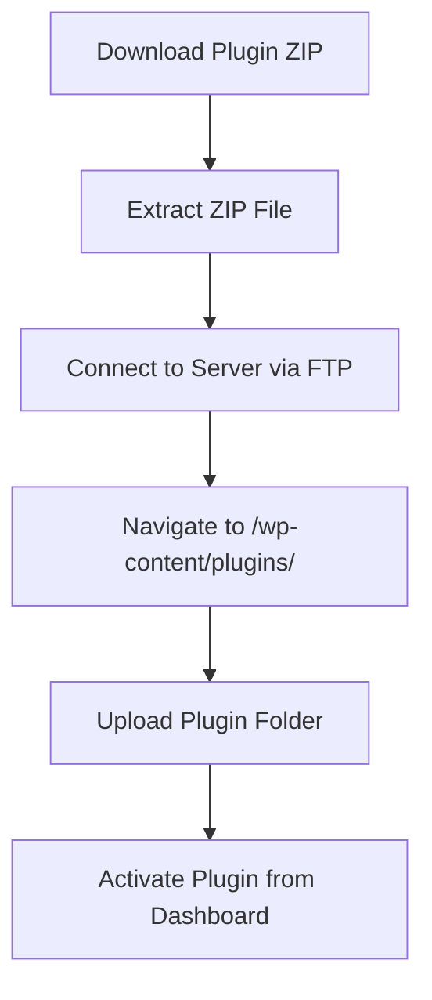

# WordPress Plugin Installation

## Introduction

WordPress plugins are essential tools that extend the functionality of your WordPress website. They allow you to add new features without writing code from scratch. Whether you want to add contact forms, improve SEO, enhance security, or create an online store, there's likely a plugin for that purpose.

In this guide, we'll cover everything you need to know about installing WordPress plugins, from the simple one-click method to manual installation via FTP. By the end, you'll be able to confidently install any plugin and troubleshoot common installation issues.

## Prerequisites

Before we begin, make sure you have:

- A working WordPress installation
- Administrative access to your WordPress dashboard
- Basic understanding of the WordPress admin interface
- (For manual installation) FTP access to your server

## Methods of Installing WordPress Plugins

There are two primary ways to install WordPress plugins:

1. **Automatic Installation**: Installing directly from the WordPress Plugin Directory through your admin dashboard
2. **Manual Installation**: Downloading plugin files and uploading them to your server

Let's explore both methods in detail.

## Automatic Plugin Installation

This is the easiest and most common method for installing plugins.

### Step-by-Step Guide for Automatic Installation

1. **Login to your WordPress admin area**
   
   Navigate to your WordPress dashboard by visiting `yourdomain.com/wp-admin` and logging in with your credentials.

2. **Navigate to the Plugins section**
   
   In the left sidebar of your WordPress dashboard, click on "Plugins" and then select "Add New".


3. **Search for your desired plugin**
   
   Use the search box in the upper right corner to find the plugin you want to install. Type the plugin name or functionality you're looking for.

4. **Install and activate the plugin**
   
   Once you've found the plugin you want, click the "Install Now" button next to it.

   After the installation completes, the "Install Now" button will change to "Activate". Click "Activate" to enable the plugin on your site.

Here's what the process looks like:

```
Dashboard > Plugins > Add New > Search > Install Now > Activate
```

### Example: Installing the Yoast SEO Plugin

Let's walk through installing one of the most popular WordPress plugins as an example:

1. Navigate to Plugins > Add New
2. In the search box, type "Yoast SEO"
3. Find "Yoast SEO" in the search results
4. Click the "Install Now" button
5. After installation completes, click "Activate"
6. You'll now see "SEO" added to your WordPress sidebar menu

## Manual Plugin Installation

Sometimes you may need to install a plugin that isn't available in the WordPress Plugin Directory or you've purchased a premium plugin that comes as a ZIP file.

### Step-by-Step Guide for Manual Installation

#### Method 1: Using the WordPress Dashboard

1. **Download the plugin ZIP file** from the source

2. **Login to your WordPress admin area**

3. **Navigate to Plugins > Add New**

4. **Click the "Upload Plugin" button** at the top of the page

5. **Choose the ZIP file** you downloaded and click "Install Now"

6. **Activate the plugin** after installation completes

#### Method 2: Using FTP

1. **Download and extract the plugin ZIP file** on your computer

2. **Connect to your website via FTP** using an FTP client like FileZilla

3. **Navigate to the WordPress plugins directory**
   ```
   /wp-content/plugins/
   ```

4. **Upload the plugin folder** to the plugins directory

5. **Login to your WordPress dashboard**

6. **Go to Plugins > Installed Plugins**

7. **Find your uploaded plugin and click "Activate"**

Here's a visual representation of the FTP installation process:



### Example: Installing a Premium Plugin

Let's say you purchased "Gravity Forms," a premium form builder plugin:

1. Download the ZIP file from your Gravity Forms account
2. Go to your WordPress dashboard > Plugins > Add New
3. Click "Upload Plugin" and select the ZIP file
4. Click "Install Now"
5. After installation completes, click "Activate"
6. Enter your license key in the plugin settings to receive updates

## Plugin Configuration After Installation

Most plugins require some configuration after installation:

1. **Look for the plugin in your dashboard sidebar** - Many plugins add their own menu item
2. **Check for a Settings link** - Some plugins add a Settings link directly on the Plugins page
3. **Follow the setup wizard** - More complex plugins often include a setup wizard

For example, after installing WooCommerce (an e-commerce plugin), you'll see a setup wizard that helps you configure currency, shipping, and payment options.

## Troubleshooting Common Installation Issues

### White Screen of Death (WSOD)

If your screen goes blank after activating a plugin:

```php
// Add this to your wp-config.php to enable debugging
define('WP_DEBUG', true);
define('WP_DEBUG_LOG', true);
define('WP_DEBUG_DISPLAY', false);
```

Then check the debug log file in `/wp-content/debug.log` for errors.

### Memory Limit Issues

If you see an error like "Allowed memory size exhausted":

```php
// Add this to your wp-config.php
define('WP_MEMORY_LIMIT', '256M');
```

### Plugin Conflicts

If your site malfunctions after installing a new plugin:

1. Deactivate all plugins
2. Reactivate them one by one to identify the conflict
3. Contact the plugin developer for support

## Best Practices for Plugin Installation

1. **Always back up your website** before installing new plugins
2. **Update plugins regularly** to ensure security and compatibility
3. **Install only necessary plugins** to keep your site fast and secure
4. **Read reviews and check ratings** before installing plugins
5. **Verify compatibility** with your WordPress version
6. **Check the last update date** - Avoid plugins that haven't been updated in over a year

## Managing Installed Plugins

Once you've installed plugins, proper management is important:

### Updating Plugins

1. Go to Dashboard > Updates or Plugins > Installed Plugins
2. Look for plugins with available updates
3. You can update individually or select multiple plugins and use the "Update" bulk action

### Deactivating and Deleting Plugins

To deactivate a plugin:
1. Go to Plugins > Installed Plugins
2. Find the plugin you want to deactivate
3. Click "Deactivate"

To delete a plugin:
1. Deactivate the plugin first
2. Click "Delete" under the plugin name
3. Confirm the deletion

**Note**: Always deactivate a plugin before deleting it to prevent errors.

## Real-World Example: Creating a Contact Form

Let's put our knowledge into practice by installing and setting up the Contact Form 7 plugin:

1. Go to Plugins > Add New
2. Search for "Contact Form 7"
3. Click "Install Now" and then "Activate"
4. A new menu item "Contact" will appear in your dashboard
5. Click on "Contact" to see your default contact form
6. To add the form to a page, copy the shortcode (looks like `[contact-form-7 id="1234" title="Contact form 1"]`)
7. Create or edit a page where you want the form
8. Paste the shortcode into the page content
9. Publish or update the page
10. Visit the page to see your contact form in action

## Summary

Installing WordPress plugins is a straightforward process that can be done either automatically through the WordPress Plugin Directory or manually via ZIP upload or FTP. The key steps are:

1. Find a suitable plugin for your needs
2. Install it using your preferred method
3. Activate the plugin
4. Configure the settings according to your requirements
5. Regularly update and maintain your plugins

By following the steps and best practices outlined in this guide, you'll be able to safely and effectively extend your WordPress website's functionality with plugins.

## Additional Resources

- [WordPress Plugin Directory](https://wordpress.org/plugins/)
- [WordPress Codex: Managing Plugins](https://wordpress.org/support/article/managing-plugins/)
- [How to Choose the Right WordPress Plugin](https://wordpress.org/support/article/plugins-themes-compatibility-issues/)

## Practice Exercises

1. Install and configure a security plugin like Wordfence or Sucuri
2. Try installing a caching plugin to improve your site's performance
3. Practice the manual installation method with a free plugin downloaded from WordPress.org
4. Install a backup plugin and create a complete backup of your site
5. Experiment with deactivating and reactivating plugins to understand their impact on your site

By regularly practicing plugin installation and management, you'll become more confident in maintaining and extending your WordPress website.