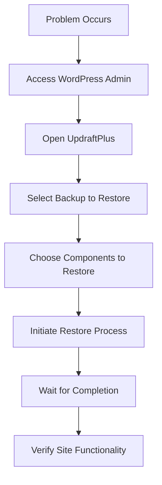

# WordPress Backup Plugins

## Introduction

Your WordPress website represents countless hours of work and potentially your livelihood. Yet all that hard work can vanish in an instant due to server failures, hacking attempts, failed updates, or simple human error. This is why **backups are absolutely critical** for any WordPress website.

In this guide, we'll explore WordPress backup plugins, which provide an automated way to create, manage, and restore backups of your website. By the end, you'll understand how these plugins work, how to choose the right one for your needs, and how to implement a solid backup strategy for your WordPress site.

## Why You Need a Backup Plugin

Before diving into specific plugins, let's understand why dedicated backup solutions are important:

1. **Protection against data loss**: Websites can fail for many reasons - server issues, malware, bad updates, or accidental deletions.
2. **Peace of mind**: Knowing you can restore your site quickly if something goes wrong.
3. **Easy migration**: Many backup plugins make it simple to move your site to a new host.
4. **Scheduled automation**: Set it up once and let the plugin handle recurring backups.
5. **Selective recovery**: Restore specific parts of your site without affecting others.

## Popular WordPress Backup Plugins

Let's explore some of the most widely-used and trusted backup plugins available:

### 1. UpdraftPlus

**UpdraftPlus** is the most popular backup plugin with over 3 million active installations. It offers both free and premium versions.

**Key Features:**
- Scheduled automatic backups
- Cloud storage options (Google Drive, Dropbox, S3, etc.)
- Complete or partial restores
- Migration between sites
- Database and file backups

### 2. BackupBuddy

**BackupBuddy** is a premium-only solution that's been trusted for years.

**Key Features:**
- Complete WordPress backups
- Scheduled backups
- Off-site storage
- Easy migration tools
- Malware scanning (with add-on)

### 3. Jetpack Backup

**Jetpack Backup** is developed by Automattic, the company behind WordPress.com.

**Key Features:**
- Real-time backups (on higher plans)
- One-click restores
- Activity log
- 30-day archive
- Off-site storage

### 4. All-in-One WP Migration

This plugin is primarily focused on site migration but provides excellent backup functionality as well.

**Key Features:**
- Simple interface
- Export site to a file
- Import from backup file
- Handles large sites with extensions

## Setting Up a Backup Plugin

Let's walk through setting up UpdraftPlus, one of the most popular options:

### Step 1: Installation

1. Navigate to your WordPress dashboard
2. Go to Plugins → Add New
3. Search for "UpdraftPlus"
4. Click "Install Now" and then "Activate"

### Step 2: Initial Configuration

After activation, you'll find UpdraftPlus in your dashboard menu. Here's how to set up your first backup:

1. Go to Settings → UpdraftPlus Backups
2. Click the "Settings" tab
3. Configure backup contents and schedule:

```
Files backup schedule: Weekly
Database backup schedule: Daily
Retention setting: Keep 4 backups
```

### Step 3: Configure Remote Storage (Recommended)

Storing backups on the same server as your website defeats much of the purpose of backups. Here's how to set up Google Drive as a remote storage option:

1. In the UpdraftPlus settings, find the "Remote Storage" section
2. Select "Google Drive"
3. Click "Authenticate with Google"
4. Follow the prompts to allow UpdraftPlus access to your Google Drive
5. Return to WordPress and save your settings

### Step 4: Run Your First Backup

1. Go to the UpdraftPlus Backups page
2. Click "Backup Now"
3. Ensure both files and database are selected
4. Click "Backup Now" button

The process will begin and show you progress as it completes.

## Restoring from a Backup

The real value of backups comes when you need to restore your site. Here's how to restore using UpdraftPlus:

1. Go to Settings → UpdraftPlus Backups
2. Under the "Existing Backups" section, find the backup you want to restore
3. Click "Restore"
4. Select what you want to restore (files, database, plugins, themes, etc.)
5. Click "Restore" again and wait for the process to complete



## Best Practices for WordPress Backups

Follow these guidelines to ensure your backup strategy is effective:

### 1. Multiple Backup Locations

Don't rely on a single backup location. Configure your plugin to send backups to multiple destinations:

```
Primary: Google Drive
Secondary: Dropbox
Tertiary: Local download (monthly)
```

### 2. Appropriate Backup Frequency

Match your backup schedule to your site's update frequency:

- **High-traffic, frequently updated sites**: Daily database backups, weekly file backups
- **E-commerce sites**: Daily complete backups
- **Static sites with infrequent updates**: Weekly backups may be sufficient

### 3. Test Your Backups

A backup is only useful if it can be successfully restored. Periodically:

1. Create a staging environment or local development setup
2. Attempt to restore your site from a backup
3. Verify functionality

### 4. Backup Before Major Changes

Always create a manual backup before:
- Updating WordPress core
- Installing new plugins or themes
- Making significant design changes
- Modifying custom code

## Advanced: Creating Custom Backup Scripts

While plugins are convenient, you might want more control. Here's a simple bash script example for backing up WordPress:

```bash
#!/bin/bash

# Set variables
NOW=$(date +"%Y-%m-%d_%H-%M")
BACKUP_DIR="/path/to/backups"
SITE_DIR="/path/to/wordpress"
DB_USER="database_username"
DB_PASS="database_password"
DB_NAME="database_name"

# Create backup directory if it doesn't exist
mkdir -p $BACKUP_DIR

# Backup database
mysqldump -u$DB_USER -p$DB_PASS $DB_NAME > $BACKUP_DIR/$DB_NAME-$NOW.sql

# Backup files
tar -czf $BACKUP_DIR/files-$NOW.tar.gz $SITE_DIR

# Remove backups older than 30 days
find $BACKUP_DIR -type f -mtime +30 -delete
```

This script could be scheduled via cron to run automatically.

## Troubleshooting Common Issues

### Large Site Backup Failures

If you have a large site and backups fail:

1. Try increasing PHP memory limits in your `wp-config.php` file:

```php
define('WP_MEMORY_LIMIT', '256M');
define('WP_MAX_MEMORY_LIMIT', '512M');
```

2. Enable incremental backups if your plugin supports them
3. Split backups into smaller components

### Access Issues with Remote Storage

If your backups aren't reaching cloud storage:

1. Re-authenticate your cloud service
2. Check for firewall issues on your server
3. Verify API permissions

### Incomplete Restorations

If restoration fails or is incomplete:

1. Check server error logs
2. Verify PHP timeout settings
3. Consider restoring in stages (database first, then files)

## Comparing Backup Options

| Feature | UpdraftPlus Free | UpdraftPlus Premium | BackupBuddy | Jetpack Backup |
|---------|-----------------|---------------------|-------------|---------------|
| Price | Free | $70+ | $80+ | $84+ per year |
| Auto Backups | ✅ | ✅ | ✅ | ✅ |
| Cloud Storage | Limited options | Many options | Included | Included |
| Migration | Basic | Advanced | Advanced | Limited |
| Support | Forums | Direct | Direct | Direct |
| Incremental Backups | ❌ | ✅ | ✅ | ✅ |
| Real-time Backups | ❌ | ❌ | ❌ | ✅ |

## Summary

WordPress backup plugins are essential tools for website maintenance and security. They provide automated ways to create, store, and restore complete copies of your WordPress website, protecting against data loss, hacking, and other disasters.

In this guide, we've explored:
- Why backups are critical for WordPress sites
- Popular backup plugin options
- Step-by-step setup instructions
- Restoration procedures
- Best practices for backup strategies
- Troubleshooting common issues

Remember that the best backup is the one you have when you need it. Don't wait until disaster strikes - implement a solid backup strategy today.

## Additional Resources

- [WordPress Codex: Backing Up Your Database](https://wordpress.org/support/article/backing-up-your-database/)
- [WordPress Codex: WordPress Backups](https://wordpress.org/support/article/wordpress-backups/)
- [Web Hosting Best Practices for Backups](https://wordpress.org/support/article/backing-up-your-wordpress-site/)

## Exercises

1. Install a free backup plugin like UpdraftPlus and configure it to create weekly backups.
2. Set up a remote storage option for your backups using Google Drive or Dropbox.
3. Create a manual backup and practice restoring it on a staging environment.
4. Research and create a backup strategy document for your WordPress site that includes frequency, retention, and storage locations.
5. If you have the technical ability, try creating and scheduling a custom backup script that runs without a plugin.