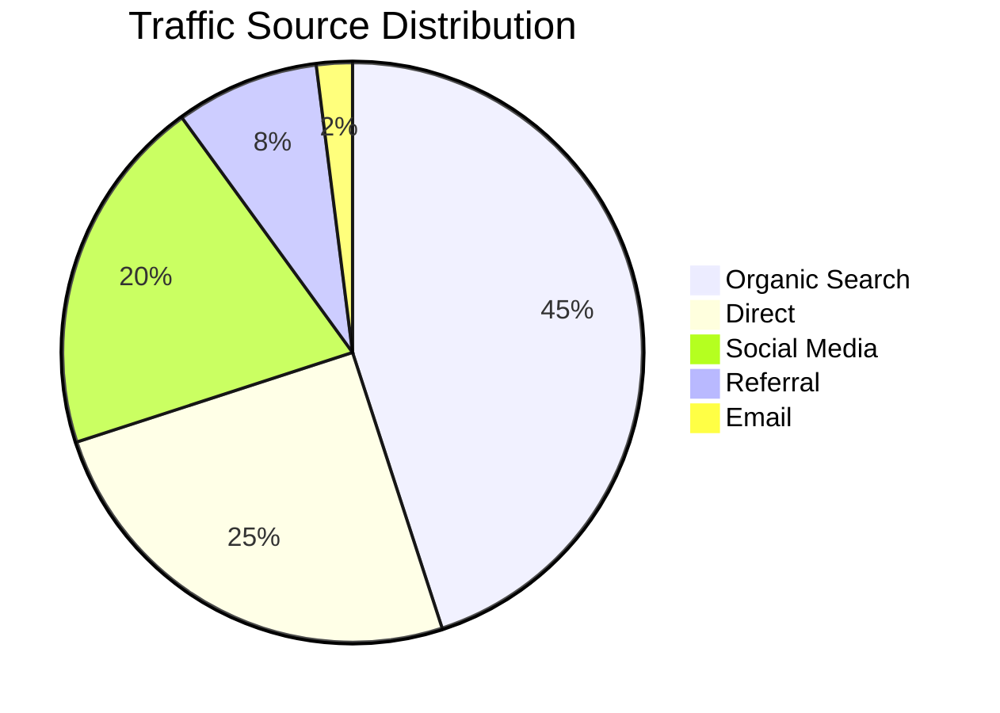
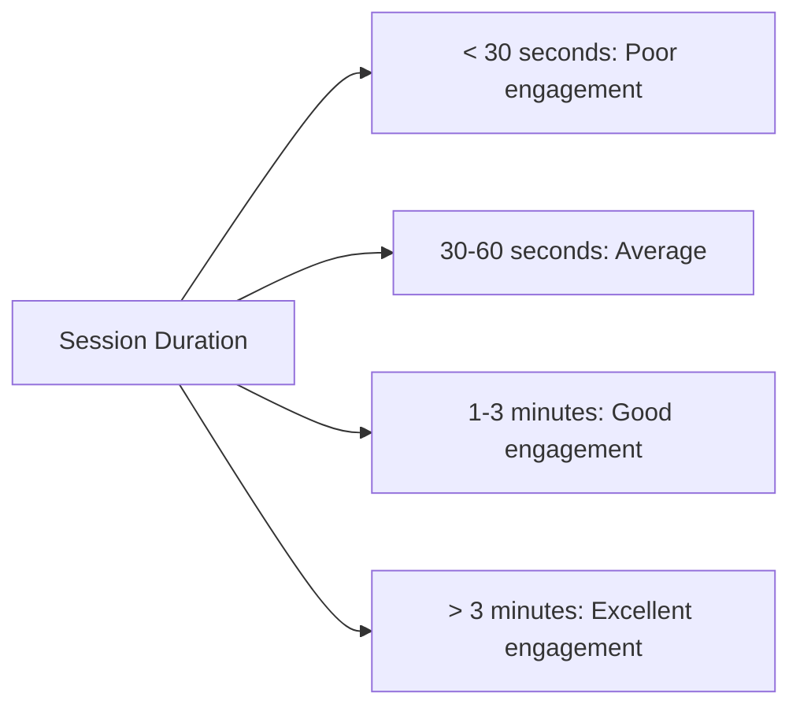

# WordPress Analytics Plugins

## Introduction

Analytics is the backbone of any successful website strategy. By collecting and analyzing data about your website visitors, you can make informed decisions about content, design, and marketing strategies. For WordPress users, analytics plugins serve as powerful tools that integrate tracking capabilities into your site without requiring extensive coding knowledge.

In this guide, we'll explore various WordPress analytics plugins, how they work, how to set them up, and how to use the data they provide to improve your website's performance.

## Why You Need Analytics for Your WordPress Site

Before diving into specific plugins, let's understand why analytics are essential:

- **Traffic Insights**: Understand where your visitors come from, which pages they view, and how long they stay
- **User Behavior Analysis**: Track how users navigate through your site and identify potential usability issues
- **Content Performance**: Determine which content resonates most with your audience
- **Goal Tracking**: Measure conversions and other important user actions
- **Technical Insights**: Monitor page load times and other performance metrics

## Popular WordPress Analytics Plugins

### 1. Google Analytics for WordPress by MonsterInsights

MonsterInsights is the most popular Google Analytics plugin for WordPress, with both free and premium versions available.

#### Key Features:
- Easy Google Analytics connection
- Real-time stats
- Enhanced eCommerce tracking
- Form conversion tracking
- Custom dimension tracking

#### Installation and Setup

1. Install the plugin from the WordPress repository:
   
```php
// Go to WordPress Dashboard > Plugins > Add New
// Search for "MonsterInsights"
// Click "Install Now" and then "Activate"
```

2. Connect to Google Analytics:

```
After activation, go to Insights > Settings
Click "Connect MonsterInsights" and follow the authentication steps
Select the Google Analytics property you want to connect to
```

3. Configure tracking settings:

```jsx
// Example settings configuration (accessible through MonsterInsights Settings)
{
  "trackOutboundLinks": true,
  "trackDownloads": true,
  "trackHashLinks": false,
  "trackMailtoLinks": true,
  "trackTelLinks": true
}
```

### 2. Jetpack by WordPress.com

Jetpack offers a suite of tools including basic analytics features in its free version.

#### Key Features:
- Site stats dashboard
- Top posts and pages tracking
- Referrer tracking
- Search terms tracking
- Export stats data

#### Enabling Jetpack Analytics

```php
// After installing and activating Jetpack
// Connect to WordPress.com account
// Go to Jetpack > Settings > Traffic
// Enable "Site Stats"
```

### 3. Matomo Analytics (formerly Piwik)

Matomo is a privacy-focused alternative to Google Analytics that you can self-host or use as a cloud service.

#### Key Features:
- Complete data ownership
- No data sampling
- GDPR compliant
- Heatmaps and session recordings
- Goal conversion tracking

#### Installation of Matomo Plugin

```php
// Go to WordPress Dashboard > Plugins > Add New
// Search for "Matomo Analytics"
// Click "Install Now" and then "Activate"
// Follow configuration wizard in Matomo settings
```

Configuration example:

```jsx
// Example Matomo setup configuration
{
  "trackingMethod": "javascript",
  "enableEcommerce": true,
  "trackingConsent": "opt-in",
  "cookieLifetime": 30, // days
  "excludedUserRoles": ["admin", "editor"]
}
```

### 4. WP Statistics

WP Statistics is a comprehensive analytics tool that works without external services, storing all data in your WordPress database.

#### Key Features:
- No external service dependency
- Real-time stats
- GeoIP location data
- Search engine referral tracking
- Exclusion of specific users

#### Example Dashboard Widget

After installation, WP Statistics adds widgets to your WordPress dashboard:

```jsx
// Example of data structure returned by WP Statistics
const wpStatsData = {
  visitors: {
    today: 1254,
    yesterday: 1189,
    lastWeek: 8745,
    lastMonth: 34621
  },
  pageViews: {
    today: 3827,
    yesterday: 3542,
    lastWeek: 26832,
    lastMonth: 103845
  },
  topReferrers: [
    { site: "google.com", visits: 623 },
    { site: "facebook.com", visits: 418 },
    { site: "twitter.com", visits: 215 }
  ]
}
```

## Setting Up Custom Analytics Tracking

Beyond basic installation, you might want to track specific events or goals. Here's how to implement custom tracking with Google Analytics via MonsterInsights:

### Tracking Button Clicks

```javascript
// Add this code to your theme's JavaScript file or in a Custom HTML block
document.addEventListener('DOMContentLoaded', function() {
  const button = document.getElementById('download-button');
  
  if (button) {
    button.addEventListener('click', function() {
      // Check if MonsterInsights is available
      if (typeof window.ga !== 'undefined') {
        window.ga('send', {
          hitType: 'event',
          eventCategory: 'Downloads',
          eventAction: 'click',
          eventLabel: 'Resource PDF'
        });
      }
    });
  }
});
```

### Tracking Form Submissions

MonsterInsights Pro automatically tracks forms, but here's how you can manually track form submissions:

```javascript
// Add this code to your theme's JavaScript file
document.addEventListener('DOMContentLoaded', function() {
  const contactForm = document.querySelector('.contact-form');
  
  if (contactForm) {
    contactForm.addEventListener('submit', function() {
      // Check if MonsterInsights is available
      if (typeof window.ga !== 'undefined') {
        window.ga('send', {
          hitType: 'event',
          eventCategory: 'Forms',
          eventAction: 'submit',
          eventLabel: 'Contact Form'
        });
      }
    });
  }
});
```

## Analyzing Analytics Data

Having analytics data is only valuable if you know how to interpret and act on it. Here are some key metrics to monitor and what they mean:

### Traffic Sources

Understanding where your visitors come from helps focus your marketing efforts:



### Bounce Rate

Bounce rate is the percentage of visitors who leave your site after viewing only one page:

- **Below 40%**: Excellent
- **41-55%**: Average
- **56-70%**: Higher than average
- **Above 70%**: Concerning (unless you're running a blog or news site)

### Average Session Duration

This metric shows how long users spend on your site:



## Privacy Considerations and GDPR Compliance

When implementing analytics, it's crucial to consider privacy regulations:

1. **Include analytics in your privacy policy**:

```html
<h3>Analytics</h3>
<p>We use [Plugin Name] to analyze the use of our website. This analytics service may collect information about your visit including:</p>
<ul>
  <li>Pages you view</li>
  <li>How long you spend on each page</li>
  <li>How you got to the site</li>
  <li>What you click on while visiting the site</li>
</ul>
```

2. **Add a cookie consent banner** if your analytics plugin uses cookies:

Most analytics plugins include cookie consent functionality or integrate with cookie consent plugins like Cookie Notice or GDPR Cookie Compliance.

3. **Configure analytics for data anonymization**:

```jsx
// MonsterInsights anonymization configuration
{
  "anonymizeIp": true,
  "disableUserData": true,
  "disableDemographics": true
}
```

## Comparing Analytics Plugins

When choosing an analytics plugin, consider these factors:

| Plugin | Ease of Setup | Cost | Data Ownership | Features | Server Load |
|--------|--------------|------|---------------|----------|------------|
| MonsterInsights | ⭐⭐⭐⭐⭐ | Free - $399/yr | Google owns | ⭐⭐⭐⭐⭐ | Low |
| Jetpack | ⭐⭐⭐⭐ | Free - $299/yr | WordPress.com | ⭐⭐⭐ | Low |
| Matomo | ⭐⭐⭐ | Free - $29/mo | You own | ⭐⭐⭐⭐⭐ | Medium-High |
| WP Statistics | ⭐⭐⭐⭐ | Free - $99/yr | You own | ⭐⭐⭐⭐ | High |

## Troubleshooting Common Issues

### Tracking Code Not Working

If your analytics aren't recording data:

1. Check if the tracking code is properly installed:

```php
// For MonsterInsights, verify in source code that this appears in your site header
// View Page Source and look for:
// ga('create', 'UA-XXXXXXXX-X', 'auto');
```

2. Check for plugin conflicts:

```
Temporarily disable other plugins to see if tracking starts working
Particularly check for caching plugins or other performance optimization tools
```

3. Verify tracking exclusions:

```php
// Make sure you haven't excluded your IP or user role from tracking
// In MonsterInsights: Insights > Settings > Advanced
```

### Data Discrepancies

If you see different numbers between your WordPress dashboard and the analytics service:

```
- Different tracking methods may count visitors differently
- Caching can affect real-time stats
- Some users may have JavaScript disabled
- Ad blockers can prevent analytics from loading
```

## Advanced Analytics Integration

For developers who want deeper analytics integration, you can use custom code:

### Adding Server-Side Tracking

```php
<?php
// Example of server-side tracking with Measurement Protocol
function track_download_server_side($file_path) {
    $url = 'https://www.google-analytics.com/collect';
    $data = array(
        'v' => '1',
        'tid' => 'UA-XXXXXXXX-X',  // Your tracking ID
        'cid' => '555',            // Client ID (should be unique)
        't' => 'event',            // Hit type
        'ec' => 'Downloads',       // Event Category
        'ea' => 'download',        // Event Action
        'el' => basename($file_path)  // Event Label
    );
    
    wp_remote_post($url, array(
        'body' => $data,
        'blocking' => false
    ));
}

// Usage example in a download function
function process_download($file_path) {
    track_download_server_side($file_path);
    // Continue with download process
}
?>
```

### Creating Custom Analytics Dashboard Widgets

```php
<?php
// Add a custom analytics widget to WordPress dashboard
function custom_analytics_dashboard_widget() {
    wp_add_dashboard_widget(
        'custom_analytics_widget',
        'Key Analytics',
        'display_custom_analytics_widget'
    );
}
add_action('wp_dashboard_setup', 'custom_analytics_dashboard_widget');

function display_custom_analytics_widget() {
    // Get analytics data via API
    $analytics_data = get_analytics_data();
    
    // Display data
    echo '<div class="analytics-widget">';
    echo '<p><strong>Visitors today:</strong> ' . esc_html($analytics_data['visitors_today']) . '</p>';
    echo '<p><strong>Popular page:</strong> ' . esc_html($analytics_data['top_page']) . '</p>';
    echo '</div>';
}

function get_analytics_data() {
    // This function would connect to your analytics service API
    // and retrieve the necessary data
    
    // Simplified example:
    return array(
        'visitors_today' => 125,
        'top_page' => 'Home Page'
    );
}
?>
```

## Real-World Applications

Let's see how analytics can drive decision-making for different types of WordPress sites:

### For a Blog

1. **Content Strategy**: Analyze which topics get the most engagement and create more similar content
2. **Publishing Schedule**: Determine when readers are most active and publish at those times
3. **Reader Journey**: Track how readers move through your site and optimize internal linking

### For an E-commerce Site

1. **Sales Funnel Analysis**: Track the journey from landing page to purchase completion
2. **Cart Abandonment**: Identify at which step customers leave without purchasing
3. **Product Performance**: Analyze which products get the most views vs. actual sales

### For a Business Website

1. **Lead Generation**: Track form submissions and contact page visits
2. **Service Interest**: Monitor which service pages get the most attention
3. **Call-to-Action Effectiveness**: Compare different CTAs to see which generates more clicks

## Summary

WordPress analytics plugins provide invaluable insights into your website's performance and visitor behavior. Whether you choose Google Analytics via MonsterInsights, Jetpack's built-in stats, privacy-focused Matomo, or self-contained WP Statistics, the data you collect will help you make informed decisions about your site's content, design, and marketing strategy.

Remember that analytics implementation should balance your need for data with user privacy considerations. Always be transparent about data collection and ensure compliance with privacy regulations like GDPR.

## Additional Resources

- [Google Analytics Academy](https://analytics.google.com/analytics/academy/) - Free courses on using Google Analytics
- [MonsterInsights Knowledge Base](https://www.monsterinsights.com/docs/) - Detailed guides for using MonsterInsights
- [Matomo Learning Center](https://matomo.org/guides/) - Resources for getting the most out of Matomo
- [WordPress.org Plugin Directory](https://wordpress.org/plugins/tags/analytics/) - Explore more analytics plugins for specific needs

## Exercise: Setting Up Basic Analytics Goal Tracking

1. Install one of the analytics plugins discussed in this guide
2. Set up a goal to track when users visit your contact or signup page
3. Create an event to monitor clicks on important buttons (like "Download" or "Learn More")
4. After a week, analyze the data to identify one area of your site that could be improved
5. Implement a change based on your analysis and continue monitoring to see if metrics improve

By following this guide and implementing analytics on your WordPress site, you'll gain valuable insights that can help you create a better user experience and achieve your website goals more effectively.