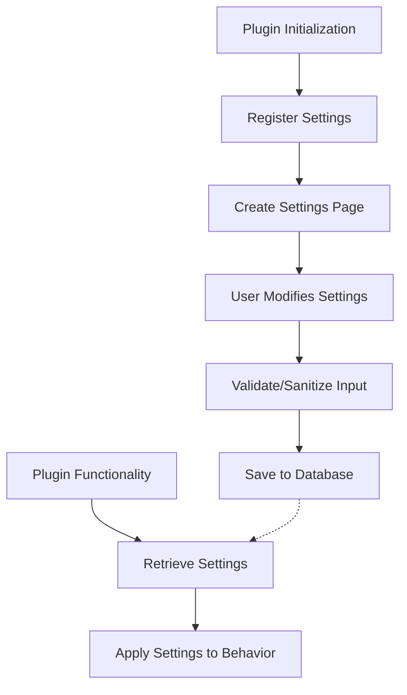

# WordPress Plugin Settings

## Introduction

Settings are a crucial part of WordPress plugins, allowing users to customize the plugin's behavior without modifying code. Well-designed plugin settings enhance user experience, improve plugin flexibility, and enable users to tailor functionality to their specific needs.

In this tutorial, you'll learn how to:

- Create and organize plugin settings
- Use the WordPress Settings API
- Build user-friendly options pages
- Store and retrieve setting values securely
- Implement validation and sanitization

Whether you're building your first plugin or looking to improve your existing ones, understanding how to implement settings properly will make your plugins more professional and user-friendly.

## Understanding WordPress Plugin Settings

### What Are Plugin Settings?

Plugin settings are configurable options that allow users to change how your plugin functions. These might include:

- Feature toggles (enable/disable specific functionality)
- Visual customizations (colors, sizes, positions)
- Default behaviors
- API keys and external service connections
- Content and text customizations

### How Settings Are Stored in WordPress

WordPress provides several ways to store settings:

1. **Options API**: The most common method, storing values in the `wp_options` table
2. **Settings API**: A framework that uses the Options API but provides additional structure and security
3. **Custom tables**: For more complex data structures (less common for simple settings)

Let's focus on the most widely used approaches - the Options API and Settings API.

## The WordPress Options API

The Options API provides a simple way to store and retrieve settings.

### Basic Operations

#### Adding an Option

```php
// Add an option if it doesn't exist
add_option('my_plugin_version', '1.0.0');
```

#### Getting an Option

```php
// Retrieve an option (with a default value as fallback)
$version = get_option('my_plugin_version', '1.0.0');
echo $version; // Output: 1.0.0
```

#### Updating an Option

```php
// Update an existing option (or create it if it doesn't exist)
update_option('my_plugin_version', '1.0.1');
```

#### Deleting an Option

```php
// Remove an option
delete_option('my_plugin_version');
```

### Storing Arrays of Settings

Most plugins store multiple settings in a single option as an associative array:

```php
// Define default settings
$defaults = array(
    'enable_feature_x' => true,
    'api_key' => '',
    'color_scheme' => 'blue',
    'max_items' => 10
);

// Get plugin options with defaults for any missing values
$options = get_option('my_plugin_options', $defaults);

// Update a single setting
$options['max_items'] = 20;
update_option('my_plugin_options', $options);
```

This approach reduces database queries and keeps your plugin settings organized.

## The WordPress Settings API

The Settings API provides a structured framework for creating and managing settings, including automatically handling form generation, data validation, and security.

### The Components of the Settings API

1. **Settings Sections**: Groups of related settings
2. **Settings Fields**: Individual settings within a section
3. **Settings Pages**: Admin pages to display settings

### Basic Implementation Steps

Here's a complete example of implementing the Settings API:

```php
class MyPluginSettings {

    private $options;

    public function __construct() {
        add_action('admin_menu', array($this, 'add_plugin_page'));
        add_action('admin_init', array($this, 'page_init'));
        $this->options = get_option('my_plugin_options', array());
    }

    // Add options page
    public function add_plugin_page() {
        add_options_page(
            'My Plugin Settings', // Page title
            'My Plugin', // Menu title
            'manage_options', // Capability
            'my-plugin-settings', // Menu slug
            array($this, 'create_admin_page') // Function
        );
    }

    // Options page callback
    public function create_admin_page() {
        ?>
        <div class="wrap">
            <h1>My Plugin Settings</h1>
            <form method="post" action="options.php">
            <?php
                settings_fields('my_plugin_option_group');
                do_settings_sections('my-plugin-settings');
                submit_button();
            ?>
            </form>
        </div>
        <?php
    }

    // Register and add settings
    public function page_init() {
        // Register the setting
        register_setting(
            'my_plugin_option_group', // Option group
            'my_plugin_options', // Option name
            array($this, 'sanitize') // Sanitize callback
        );

        // Add settings section
        add_settings_section(
            'general_section_id', // ID
            'General Settings', // Title
            array($this, 'print_section_info'), // Callback
            'my-plugin-settings' // Page
        );  

        // Add settings field
        add_settings_field(
            'api_key', // ID
            'API Key', // Title 
            array($this, 'api_key_callback'), // Callback
            'my-plugin-settings', // Page
            'general_section_id' // Section           
        );
        
        add_settings_field(
            'enable_feature', 
            'Enable Feature X', 
            array($this, 'checkbox_callback'),
            'my-plugin-settings',
            'general_section_id',
            array('label_for' => 'enable_feature')
        );
    }

    // Sanitize inputs
    public function sanitize($input) {
        $sanitized_input = array();
        
        if(isset($input['api_key']))
            $sanitized_input['api_key'] = sanitize_text_field($input['api_key']);
            
        if(isset($input['enable_feature']))
            $sanitized_input['enable_feature'] = (bool)$input['enable_feature'];
        else
            $sanitized_input['enable_feature'] = false;
            
        return $sanitized_input;
    }

    // Section text
    public function print_section_info() {
        print 'Enter your settings below:';
    }

    // Field callbacks
    public function api_key_callback() {
        $value = isset($this->options['api_key']) ? esc_attr($this->options['api_key']) : '';
        echo '<input type="text" id="api_key" name="my_plugin_options[api_key]" value="' . $value . '" class="regular-text" />';
        echo '<p class="description">Enter your API key from the service provider</p>';
    }
    
    public function checkbox_callback() {
        $checked = isset($this->options['enable_feature']) && $this->options['enable_feature'] ? 'checked' : '';
        echo '<input type="checkbox" id="enable_feature" name="my_plugin_options[enable_feature]" ' . $checked . ' />';
        echo '<label for="enable_feature">Enable this amazing feature</label>';
    }
}

// Initialize settings
if(is_admin())
    $my_settings_page = new MyPluginSettings();
```

This example creates a settings page under Settings → My Plugin in the WordPress admin, with API key and feature toggle options.

## Best Practices for Plugin Settings

### Organization

1. **Group related settings:** Keep similar options together in logical sections.
2. **Use tabs for complex plugins:** If you have many settings, organize them into tabs.

```php
// Example of creating tabbed settings
function my_plugin_settings_tabs( $current = 'general' ) {
    $tabs = array(
        'general' => 'General Settings',
        'advanced' => 'Advanced Options',
        'api' => 'API Configuration'
    );
    
    echo '<div class="nav-tab-wrapper">';
    foreach( $tabs as $tab => $name ) {
        $class = ( $tab == $current ) ? ' nav-tab-active' : '';
        echo "<a class='nav-tab$class' href='?page=my-plugin-settings&tab=$tab'>$name</a>";
    }
    echo '</div>';
}
```

### Usability

1. **Provide clear descriptions:** Explain what each setting does and its implications.
2. **Use appropriate input types:** Choose the right form element for each setting (checkboxes for toggles, select for limited options, etc.).
3. **Implement sensible defaults:** Make sure your plugin works well with default settings.

### Security

1. **Always sanitize input:** Remove or escape potentially harmful content.
2. **Use nonces:** Prevent CSRF attacks with WordPress nonces.

```php
// Adding a nonce to settings form
settings_fields('my_plugin_option_group'); // This function adds nonces automatically

// Manual nonce creation and verification
wp_nonce_field('my_plugin_action', 'my_plugin_nonce');

// Verification
if (!isset($_POST['my_plugin_nonce']) || !wp_verify_nonce($_POST['my_plugin_nonce'], 'my_plugin_action')) {
    wp_die('Security check failed');
}
```

3. **Check user capabilities:** Ensure users have proper permissions.

```php
if (!current_user_can('manage_options')) {
    wp_die('You do not have sufficient permissions to access this page.');
}
```

## Practical Examples

### Example 1: Creating a Simple Settings Page

Here's a complete, practical example of a plugin with a simple settings page:

```php
/**
 * Plugin Name: Demo Settings Plugin
 * Description: A demonstration of WordPress settings API
 * Version: 1.0
 */

// Exit if accessed directly
if (!defined('ABSPATH')) exit;

class DemoSettingsPlugin {

    private $options;

    public function __construct() {
        // Initialize hooks
        add_action('admin_menu', array($this, 'add_settings_page'));
        add_action('admin_init', array($this, 'register_settings'));
        
        // Get plugin options
        $this->options = get_option('demo_plugin_options', array(
            'text_field' => '',
            'checkbox_field' => false,
            'radio_field' => 'option1',
            'select_field' => 'default'
        ));
    }

    public function add_settings_page() {
        add_options_page(
            'Demo Plugin Settings',
            'Demo Settings',
            'manage_options',
            'demo-plugin-settings',
            array($this, 'render_settings_page')
        );
    }

    public function register_settings() {
        register_setting(
            'demo_plugin_options_group',
            'demo_plugin_options',
            array($this, 'validate_options')
        );

        add_settings_section(
            'demo_general_section',
            'General Settings',
            array($this, 'general_section_callback'),
            'demo-plugin-settings'
        );

        add_settings_field(
            'text_field',
            'Text Field',
            array($this, 'text_field_callback'),
            'demo-plugin-settings',
            'demo_general_section'
        );

        add_settings_field(
            'checkbox_field',
            'Checkbox Field',
            array($this, 'checkbox_field_callback'),
            'demo-plugin-settings',
            'demo_general_section'
        );

        add_settings_field(
            'radio_field',
            'Radio Field',
            array($this, 'radio_field_callback'),
            'demo-plugin-settings',
            'demo_general_section'
        );

        add_settings_field(
            'select_field',
            'Select Field',
            array($this, 'select_field_callback'),
            'demo-plugin-settings',
            'demo_general_section'
        );
    }

    public function general_section_callback() {
        echo '<p>Configure the plugin settings below:</p>';
    }

    public function text_field_callback() {
        echo '<input type="text" id="text_field" name="demo_plugin_options[text_field]" value="' . esc_attr($this->options['text_field']) . '" class="regular-text" />';
        echo '<p class="description">This is a demonstration text field</p>';
    }

    public function checkbox_field_callback() {
        $checked = isset($this->options['checkbox_field']) && $this->options['checkbox_field'] ? 'checked' : '';
        echo '<input type="checkbox" id="checkbox_field" name="demo_plugin_options[checkbox_field]" ' . $checked . ' />';
        echo '<label for="checkbox_field">Enable this feature</label>';
    }

    public function radio_field_callback() {
        $options = array(
            'option1' => 'Option 1',
            'option2' => 'Option 2',
            'option3' => 'Option 3'
        );
        
        foreach($options as $key => $label) {
            $checked = ($this->options['radio_field'] == $key) ? 'checked' : '';
            echo '<label><input type="radio" name="demo_plugin_options[radio_field]" value="' . esc_attr($key) . '" ' . $checked . ' /> ' . $label . '</label><br />';
        }
    }

    public function select_field_callback() {
        $options = array(
            'default' => 'Default Option',
            'option1' => 'Option 1',
            'option2' => 'Option 2',
            'option3' => 'Option 3'
        );
        
        echo '<select id="select_field" name="demo_plugin_options[select_field]">';
        foreach($options as $key => $label) {
            $selected = ($this->options['select_field'] == $key) ? 'selected' : '';
            echo '<option value="' . esc_attr($key) . '" ' . $selected . '>' . $label . '</option>';
        }
        echo '</select>';
    }

    public function validate_options($input) {
        $validated = array();
        
        // Text field
        $validated['text_field'] = sanitize_text_field($input['text_field']);
        
        // Checkbox
        $validated['checkbox_field'] = isset($input['checkbox_field']) ? true : false;
        
        // Radio buttons
        $valid_radio_values = array('option1', 'option2', 'option3');
        $validated['radio_field'] = in_array($input['radio_field'], $valid_radio_values) ? $input['radio_field'] : 'option1';
        
        // Select field
        $valid_select_values = array('default', 'option1', 'option2', 'option3');
        $validated['select_field'] = in_array($input['select_field'], $valid_select_values) ? $input['select_field'] : 'default';
        
        return $validated;
    }

    public function render_settings_page() {
        if (!current_user_can('manage_options')) {
            wp_die('You do not have sufficient permissions to access this page.');
        }
        ?>
        <div class="wrap">
            <h1>Demo Plugin Settings</h1>
            <form method="post" action="options.php">
                <?php
                    settings_fields('demo_plugin_options_group');
                    do_settings_sections('demo-plugin-settings');
                    submit_button();
                ?>
            </form>
        </div>
        <?php
    }
}

// Initialize the plugin
$demo_settings_plugin = new DemoSettingsPlugin();
```

### Example 2: Using Settings in the Frontend

Once you have settings, you'll typically use them in your plugin's functionality:

```php
// Using settings in a shortcode
function featured_content_shortcode($atts) {
    // Get plugin options
    $options = get_option('demo_plugin_options');
    
    // Set defaults if options aren't set
    $max_items = isset($options['max_items']) ? intval($options['max_items']) : 5;
    $show_excerpt = isset($options['checkbox_field']) && $options['checkbox_field'];
    
    // Get posts based on settings
    $args = array(
        'posts_per_page' => $max_items,
        'post_type' => 'post',
        'post_status' => 'publish'
    );
    
    $posts = get_posts($args);
    
    // Build output
    $output = '<div class="featured-content">';
    
    foreach($posts as $post) {
        $output .= '<div class="featured-item">';
        $output .= '<h3>' . esc_html($post->post_title) . '</h3>';
        
        if ($show_excerpt) {
            $output .= '<div class="excerpt">' . get_the_excerpt($post) . '</div>';
        }
        
        $output .= '</div>';
    }
    
    $output .= '</div>';
    
    return $output;
}
add_shortcode('featured_content', 'featured_content_shortcode');
```

## Settings Workflow Diagram

Here's a visual representation of how settings typically work in a WordPress plugin:



## Summary

WordPress plugin settings are essential for creating customizable, flexible plugins. In this tutorial, you've learned:

1. How to use the WordPress Options API for simple settings storage
2. How to implement the Settings API for more structured settings management
3. Best practices for organizing, validating, and securing plugin settings
4. Practical examples of creating settings pages and using settings in your plugin

By implementing settings properly, you make your plugins more versatile and user-friendly, allowing site administrators to tailor your plugin to their specific needs without modifying code.

## Additional Resources

To deepen your understanding of WordPress plugin settings:

1. [WordPress Codex: Options API](https://developer.wordpress.org/plugins/settings/options-api/)
2. [WordPress Codex: Settings API](https://developer.wordpress.org/plugins/settings/settings-api/)

## Exercises

1. Create a plugin with a settings page that includes at least three different types of inputs (text, checkbox, select, etc.)
2. Implement tabbed settings for a plugin with multiple categories of options
3. Create a plugin that stores user-specific settings (using user meta) alongside global plugin settings
4. Enhance an existing plugin by adding a settings export/import feature
5. Create a plugin that uses AJAX to save settings without page refresh

By working through these exercises, you'll gain practical experience with WordPress plugin settings and improve your plugin development skills.