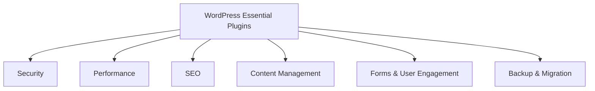

# WordPress Essential Plugins

## Introduction

WordPress powers over 43% of all websites on the internet, and one of its greatest strengths is the extensive plugin ecosystem. Plugins are add-ons that extend WordPress functionality, allowing you to transform a basic website into a powerful, feature-rich platform without writing code.

In this guide, we'll explore essential WordPress plugins that every beginner should consider. These plugins address critical website needs such as security, performance optimization, search engine optimization (SEO), content management, and more.

## Why Plugins Matter

Plugins are to WordPress what apps are to smartphones—they add functionality and features to your website. Here's why plugins are crucial:

- They extend WordPress core capabilities
- They solve specific problems without coding
- They save time and development costs
- They allow customization based on your unique needs

## Categories of Essential Plugins

Let's organize our essential plugins by category:



## Security Plugins

### Wordfence Security

Wordfence is a comprehensive security plugin that includes:

- Firewall protection
- Malware scanning
- Login security features
- Real-time traffic monitoring

**Installation Process:**

1. Go to **Plugins** > **Add New** in your WordPress dashboard
2. Search for "Wordfence Security"
3. Click **Install Now**, then **Activate**
4. Follow the setup wizard to configure basic settings

**Basic Configuration:**

```php
// Example of how Wordfence protects your login page
// The plugin adds code similar to this to your site's functionality
function wordfence_check_login_attempt($user, $password) {
    // Check if the IP has been blocked
    if (wfBlock::isIPBlocked()) {
        return new WP_Error('blocked_ip', 'This IP address has been blocked due to security concerns.');
    }
    
    // Check if this is a brute force attempt
    if (wfCredentialsController::isBruteForceAttempt()) {
        return new WP_Error('too_many_attempts', 'Too many failed login attempts.');
    }
    
    return $user;
}
add_filter('authenticate', 'wordfence_check_login_attempt', 30, 3);
```

### Sucuri Security

Sucuri offers another layer of protection with:

- File integrity monitoring
- Security activity auditing
- Blacklist monitoring
- Post-hack security actions

## Performance Plugins

### WP Rocket

WP Rocket is a premium caching plugin that improves site speed through:

- Page caching
- Browser caching
- GZIP compression
- Image lazy loading
- Minification of HTML, CSS, and JavaScript

**Example Configuration:**

```php
// WP Rocket typically adds code like this to your .htaccess file
# BEGIN WP Rocket v3.9.1
# Use UTF-8 encoding for anything served text/plain or text/html
AddDefaultCharset UTF-8
# Force UTF-8 for a number of file formats
<IfModule mod_mime.c>
    AddCharset UTF-8 .atom .css .js .json .rss .vtt .xml
</IfModule>

# FileETag None is not enough for every server.
<IfModule mod_headers.c>
    Header unset ETag
</IfModule>

# Since we're sending far-future expires, we don't need ETags for static content.
# developer.yahoo.com/performance/rules.html#etags
FileETag None

<IfModule mod_alias.c>
    <FilesMatch "\.(html|htm|rtf|rtx|txt|xsd|xsl|xml)$">
        <IfModule mod_headers.c>
            Header set X-Powered-By "WP Rocket/3.9.1"
            Header unset Pragma
            Header append Cache-Control "public"
            Header unset Last-Modified
        </IfModule>
    </FilesMatch>
    
    # More configuration rules...
</IfModule>
# END WP Rocket
```

### WP Super Cache

A free alternative for speed optimization that offers:

- Static HTML file generation
- Compression options
- Scheduled cache clearing
- CDN support

### Smush

Smush optimizes your images for faster loading:

- Image compression without quality loss
- Lazy loading
- Incorrect image size detection
- WebP conversion

**Example Impact:**

Before optimization: `image.jpg` - 1.2MB
After Smush optimization: `image.jpg` - 350KB (70% reduction)

## SEO Plugins

### Yoast SEO

The most popular SEO plugin offers:

- Content analysis for readability and SEO
- XML sitemap generation
- Meta title and description management
- Social media integration

**Example of Yoast Analysis:**

```jsx
// This is how Yoast evaluates your content with specific metrics
const yoastAnalysis = {
  readability: {
    score: 70, // Good
    improvements: [
      "Some sentences are too long. Try to keep sentences shorter than 20 words.",
      "19.2% of the sentences contain passive voice, which is more than the recommended maximum of 10%."
    ]
  },
  seo: {
    score: 85, // Good
    improvements: [
      "Consider adding your focus keyphrase to more subheadings.",
      "The meta description could use the keyphrase more often."
    ],
    goodResults: [
      "The keyword density is 2.1%, which is great.",
      "The focus keyphrase appears in the first paragraph of the copy."
    ]
  }
};
```

### Rank Math

A newer SEO plugin gaining popularity for its:

- 404 monitor
- Rich snippet support
- Multiple keyword optimization
- Google Search Console integration

## Content Management Plugins

### Elementor Page Builder

Elementor turns WordPress into a visual drag-and-drop builder:

- 90+ design elements
- Responsive design editing
- Template library
- Custom CSS options

**Example Usage:**

1. Create a new page in WordPress
2. Click "Edit with Elementor"
3. Drag elements from the sidebar to your page
4. Customize content, styles, and layout visually

```php
// Behind the scenes, Elementor stores your designs in a structured data format
// This is a simplified example of what Elementor might save
$elementor_data = [
  [
    'id' => 'section1',
    'elType' => 'section',
    'elements' => [
      [
        'id' => 'column1',
        'elType' => 'column',
        'elements' => [
          [
            'id' => 'widget1',
            'elType' => 'widget',
            'widgetType' => 'heading',
            'settings' => [
              'title' => 'Welcome to my website',
              'size' => 'h1',
              'align' => 'center'
            ]
          ],
          [
            'id' => 'widget2',
            'elType' => 'widget',
            'widgetType' => 'text-editor',
            'settings' => [
              'editor' => '<p>This is my awesome content built with Elementor</p>'
            ]
          ]
        ]
      ]
    ]
  ]
];
```

### Advanced Custom Fields (ACF)

ACF allows you to create custom content structures:

- Custom field types (text, image, relationship, etc.)
- Flexible content areas
- Options pages
- Display location rules

**Example Use Case:**

```php
// Define custom fields in ACF
$fields = [
    'key' => 'group_product_details',
    'title' => 'Product Details',
    'fields' => [
        [
            'key' => 'field_price',
            'label' => 'Price',
            'name' => 'price',
            'type' => 'number',
            'prefix' => '$',
        ],
        [
            'key' => 'field_features',
            'label' => 'Key Features',
            'name' => 'features',
            'type' => 'repeater',
            'sub_fields' => [
                [
                    'key' => 'field_feature_name',
                    'label' => 'Feature',
                    'name' => 'feature',
                    'type' => 'text',
                ]
            ]
        ]
    ],
    'location' => [
        [
            [
                'param' => 'post_type',
                'operator' => '==',
                'value' => 'product',
            ],
        ],
    ],
];

// Display custom fields in a template
$price = get_field('price');
echo '<p class="price">$' . $price . '</p>';

if (have_rows('features')) {
    echo '<ul class="features">';
    while (have_rows('features')) {
        the_row();
        echo '<li>' . get_sub_field('feature') . '</li>';
    }
    echo '</ul>';
}
```

## Forms & User Engagement Plugins

### WPForms

WPForms makes creating various forms simple:

- Contact forms
- Subscription forms
- Payment forms
- Survey and polls

**Example Implementation:**

```php
// This shortcode embeds a form created with WPForms
echo do_shortcode('[wpforms id="123"]');

// Processing form submission (handled automatically by WPForms)
function process_contact_form($fields, $entry, $form_data) {
    // Send email notification
    $to = 'admin@example.com';
    $subject = 'New Contact Form Submission';
    
    $name = $fields['name']['value'];
    $email = $fields['email']['value'];
    $message = $fields['message']['value'];
    
    $body = "You received a new contact form submission:\n\n";
    $body .= "Name: $name\n";
    $body .= "Email: $email\n";
    $body .= "Message: $message";
    
    wp_mail($to, $subject, $body);
    
    // Additional processing like saving to database, etc.
}
add_action('wpforms_process_complete', 'process_contact_form', 10, 3);
```

### Tidio Live Chat

Add live chat functionality to engage with visitors:

- Real-time chat
- Chatbots for automation
- Mobile app for responding on the go
- Visitor monitoring and statistics

## Backup & Migration Plugins

### UpdraftPlus

Protect your website data with:

- Scheduled automatic backups
- Cloud storage options (Google Drive, Dropbox, etc.)
- Complete restoration capabilities
- Site migration tools

**Example Backup Schedule:**

```php
// UpdraftPlus sets up WordPress cron jobs like this
wp_schedule_event(time(), 'daily', 'updraft_backup');

// The backup function (simplified)
function updraft_backup_function() {
    // Backup database
    updraft_backup_database();
    
    // Backup files
    updraft_backup_files();
    
    // Send to remote storage
    updraft_upload_to_remote_storage();
}
add_action('updraft_backup', 'updraft_backup_function');
```

### WP Migrate DB

Simplifies database migration between environments:

- Find and replace URL/paths
- Save migration profiles
- Exclude tables
- Push and pull database changes between environments

## E-commerce Plugins

### WooCommerce

If you want to sell products online, WooCommerce is essential:

- Product catalog
- Shopping cart functionality
- Payment gateway integration
- Order management

**Basic Configuration:**

```php
// Register a custom product type in WooCommerce
function register_digital_product_type() {
    class WC_Product_Digital extends WC_Product {
        public function __construct($product) {
            $this->product_type = 'digital';
            parent::__construct($product);
        }
        
        public function is_downloadable() {
            return true;
        }
        
        public function is_virtual() {
            return true;
        }
    }
}
add_action('init', 'register_digital_product_type');

// Add digital product to product types dropdown
function add_digital_product_type($types) {
    $types['digital'] = 'Digital Product';
    return $types;
}
add_filter('product_type_selector', 'add_digital_product_type');
```

## Plugin Management Best Practices

When working with WordPress plugins, follow these important guidelines:

1. **Minimize Plugin Count**: Only install what you truly need
2. **Update Regularly**: Keep plugins updated for security and performance
3. **Check Compatibility**: Ensure plugins work with your WordPress version
4. **Review Plugin Quality**:
   - Look for recent updates
   - Check ratings and reviews
   - Verify support responsiveness
   - Examine documentation quality
5. **Test Before Production**: Always test new plugins on a staging site first

## Common Plugin Issues and Solutions

| Issue | Solution |
|-------|----------|
| Plugin conflicts | Deactivate all plugins and reactivate one by one to identify conflicts |
| Performance slowdowns | Use a performance analysis tool like Query Monitor to identify slow plugins |
| Security vulnerabilities | Keep plugins updated and remove unused ones |
| Database bloat | Use plugins like WP-Optimize to clean up your database |

## Summary

The right combination of WordPress plugins can transform a basic website into a powerful, secure, and efficient platform. We've covered essential plugins across key categories:

- **Security**: Wordfence, Sucuri
- **Performance**: WP Rocket, WP Super Cache, Smush
- **SEO**: Yoast SEO, Rank Math
- **Content Management**: Elementor, Advanced Custom Fields
- **Forms & Engagement**: WPForms, Tidio Live Chat
- **Backup & Migration**: UpdraftPlus, WP Migrate DB
- **E-commerce**: WooCommerce

Remember to follow plugin management best practices to keep your WordPress site running smoothly. Start with the essentials, then expand as your needs grow.

## Additional Resources

To further your WordPress plugin knowledge, explore these resources:

- [WordPress Plugin Directory](https://wordpress.org/plugins/)
- [WPBeginner Plugin Guides](https://www.wpbeginner.com/category/plugins/)
- [WordPress Developer Documentation on Plugin Development](https://developer.wordpress.org/plugins/)

## Practice Exercises

1. **Plugin Evaluation**: Select a website niche (e.g., photography portfolio, business site, blog) and create a list of 5-7 essential plugins specifically for that niche.

2. **Performance Testing**: Install a performance testing plugin like Query Monitor, then analyze your site with and without a caching plugin active. Document the differences in load time.

3. **Security Audit**: Use a security plugin to perform a comprehensive scan of your WordPress site, then address any vulnerabilities found.

4. **Custom Form Creation**: Using WPForms or Contact Form 7, create a customized form with conditional logic (e.g., show certain fields only when specific options are selected).

5. **Plugin Alternatives Research**: For any three plugins mentioned in this guide, research alternative plugins that offer similar functionality and compare their features.