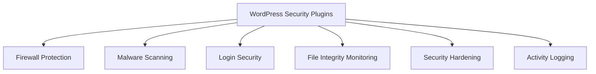

# WordPress Security Plugins

## Introduction

Security is one of the most critical aspects of maintaining a WordPress website. With WordPress powering more than 40% of all websites on the internet, it has become a prime target for hackers and malicious attacks. WordPress security plugins help fortify your website against these threats by adding layers of protection that the core WordPress installation may not provide.

In this guide, we'll explore why security plugins are essential, how they work, and which plugins are recommended for beginners to protect their WordPress websites effectively.

## Why Your WordPress Site Needs Security Plugins

WordPress core is generally secure, but several factors can make your site vulnerable:

1. **Outdated software**: WordPress, themes, and plugins need regular updates
2. **Weak passwords**: Easy-to-guess passwords are an invitation to hackers
3. **Vulnerable plugins**: Poorly coded plugins can introduce security holes
4. **Brute force attacks**: Automated login attempts to guess your credentials
5. **Malware and injections**: Code inserted to compromise your site's functionality

Security plugins address these vulnerabilities and provide tools to monitor, prevent, and recover from security incidents.

## How WordPress Security Plugins Work

Most security plugins operate by implementing several protective measures:



## Essential Features to Look For

When choosing a security plugin, consider these key features:

1. **Firewall protection**: Blocks malicious traffic before it reaches your site
2. **Login security**: Limits login attempts and adds two-factor authentication
3. **Regular scanning**: Detects malware and suspicious code
4. **File monitoring**: Alerts you to unauthorized file changes
5. **Database security**: Protects your database from SQL injections
6. **Backup integration**: Makes recovery possible if something goes wrong

## Popular WordPress Security Plugins for Beginners

### 1. Wordfence Security

Wordfence is one of the most comprehensive security plugins available, offering both free and premium versions.

#### Key Features:
- Endpoint firewall and malware scanner
- Live traffic monitoring
- Login security features
- Block traffic by country, IP, or user agent
- File comparisons with WordPress repository

#### How to Install Wordfence:

1. Navigate to your WordPress dashboard
2. Go to Plugins > Add New
3. Search for "Wordfence Security"
4. Click "Install Now"
5. After installation, click "Activate"

#### Basic Configuration:

```php
// Example Wordfence configuration - this would be done through the UI, not code
// These are the recommended settings for beginners:

$wordfenceConfig = [
    'liveTrafficEnabled' => true,
    'loginSecurityEnabled' => true,
    'scheduledScans' => [
        'frequency' => 'daily',
        'startTime' => '02:00',
    ],
    'firewallRules' => 'automatic',
];
```

### 2. Sucuri Security

Sucuri offers a free plugin with basic security features and a premium service with an advanced firewall.

#### Key Features:
- Security activity auditing
- File integrity monitoring
- Remote malware scanning
- Blacklist monitoring
- Post-hack security actions

### 3. iThemes Security (formerly Better WP Security)

iThemes Security offers over 30 ways to secure your WordPress site.

#### Key Features:
- Two-factor authentication
- Strong password enforcement
- Brute force protection
- File change detection
- Database backups

#### Example Configuration:

After installation, iThemes provides a security dashboard with recommended settings. Here's how to implement basic hardening:

1. Navigate to Security > Settings
2. Enable "File Change Detection"
3. Set up "Brute Force Protection"
4. Configure "Strong Passwords"

## Implementing Basic Security Measures

Beyond installing a security plugin, here are some fundamental steps to secure your WordPress installation:

### 1. Update Regularly

```jsx
// This isn't actual code but demonstrates the importance of keeping WordPress updated
function keepWordPressSecure() {
  // ✅ Do this regularly
  updateWordPressCore();
  updateAllPlugins();
  updateThemes();
  
  // ❌ Don't do this
  ignoreUpdatesForMonths();
}
```

### 2. Implement Strong Password Policies

For additional password protection, you could add this code to your theme's `functions.php` file:

```php
// Force strong passwords for all users
function force_strong_passwords($errors, $update, $user) {
    $password = isset($_POST['pass1']) && trim($_POST['pass1']) ? $_POST['pass1'] : false;
    
    // Skip if password field is empty (like on profile update)
    if (!$password) {
        return $errors;
    }
    
    // At least one uppercase letter, one lowercase letter, one number, and 8+ characters
    if (!preg_match('/^(?=.*[a-z])(?=.*[A-Z])(?=.*\d).{8,}$/', $password)) {
        $errors->add('password_error', 'Password must contain at least 8 characters including an uppercase letter, a lowercase letter, and a number.');
    }
    
    return $errors;
}
add_action('user_profile_update_errors', 'force_strong_passwords', 10, 3);
```

### 3. Setting Up Two-Factor Authentication

Most security plugins include two-factor authentication (2FA). Once activated, the login process will look like:

1. User enters username and password
2. If correct, they're prompted for a second authentication factor
3. After verifying the second factor, access is granted

This significantly reduces the risk of unauthorized access even if passwords are compromised.

## Configuring Your Security Plugin

### Essential Security Settings

After installing your chosen security plugin, follow these steps:

1. **Run an initial scan**: Detect any existing threats
2. **Configure the firewall**: Block malicious traffic patterns
3. **Set up login protection**: Limit login attempts and add CAPTCHA
4. **Enable file monitoring**: Get alerts about unauthorized changes
5. **Schedule regular scans**: Automate security checks

### Example Security Policy for Wordfence

Here's a basic security policy configuration using Wordfence:

```jsx
// Wordfence recommended settings (configured via UI)
const securitySettings = {
  // Basic options
  firewallProtection: 'enabled',
  blockHighSensitivityAttacks: true,
  preventXMLRPCAttacks: true,
  limitLoginAttempts: {
    enabled: true,
    threshold: 5,
    lockoutDuration: 30, // minutes
  },
  
  // Scanning options
  scanFrequency: 'daily',
  scanOptions: {
    checkCore: true,
    checkPlugins: true,
    checkThemes: true,
    checkMalware: true
  },
  
  // Notifications
  alertEmail: 'admin@yoursite.com',
  alertOnCriticalIssues: true
};
```

## Real-World Security Scenarios

### Scenario 1: Handling Brute Force Attacks

Brute force attacks attempt to guess your login credentials by trying numerous combinations:

1. **Detection**: Your security plugin notices multiple failed login attempts from the same IP
2. **Response**: The plugin temporarily blocks that IP address
3. **Protection**: You receive an email notification about the blocked attack

### Scenario 2: Dealing with a Malware Infection

If your site gets infected with malware:

1. **Detection**: Regular security scan finds suspicious code in a theme file
2. **Analysis**: The plugin identifies it as known malware
3. **Cleaning**: The malicious code is removed or quarantined
4. **Prevention**: Plugin identifies the vulnerability that was exploited and recommends fixes

## Best Practices for WordPress Security

1. **Use reputable plugins and themes**: Download from trusted sources
2. **Implement the principle of least privilege**: Give users only the permissions they need
3. **Keep regular backups**: Ensure you can restore if something goes wrong
4. **Use SSL encryption**: Install an SSL certificate for your domain
5. **Hide WordPress version information**: Prevents attackers from targeting known vulnerabilities

### Implementing Security Headers

Adding security headers to your `.htaccess` file can further protect your site:

```apache
# Example security headers for WordPress
<IfModule mod_headers.c>
  # Protect against XSS attacks
  Header set X-XSS-Protection "1; mode=block"
  
  # Prevent MIME-type sniffing
  Header set X-Content-Type-Options "nosniff"
  
  # Prevent clickjacking
  Header set X-Frame-Options "SAMEORIGIN"
  
  # Content Security Policy
  Header set Content-Security-Policy "default-src 'self'; script-src 'self' 'unsafe-inline' 'unsafe-eval' *.googleapis.com *.gstatic.com; img-src 'self' data: *.googleapis.com *.gstatic.com; style-src 'self' 'unsafe-inline' *.googleapis.com;"
</IfModule>
```

## Monitoring and Maintaining Security

Security isn't a one-time setup but an ongoing process:

1. **Review security logs regularly**: Look for suspicious activity
2. **Keep your security plugin updated**: Ensure it has the latest threat definitions
3. **Test your security**: Consider running penetration tests
4. **Stay informed**: Follow WordPress security news and updates

### Setting Up Security Monitoring

Most security plugins provide activity logs. Here's what to look for:

1. Failed login attempts from multiple IP addresses
2. Unusual admin activities at odd hours
3. Unexpected file changes
4. Plugin or theme modifications
5. Database queries from unauthorized sources

## Summary

WordPress security plugins are essential tools for protecting your website from the numerous threats that target WordPress sites. By implementing a security plugin along with following security best practices, you can significantly reduce the risk of your site being compromised.

Remember that security is an ongoing process, not a one-time setup. Regular maintenance, monitoring, and staying informed about security issues are crucial to keeping your WordPress site secure.

## Additional Resources

- [WordPress Security Codex](https://wordpress.org/support/article/hardening-wordpress/)
- [OWASP Top Ten Web Application Security Risks](https://owasp.org/www-project-top-ten/)
- [WordPress Security White Paper](https://wordpress.org/about/security/)

## Exercises

1. Install a security plugin of your choice and perform an initial security scan.
2. Configure two-factor authentication on your WordPress admin account.
3. Create a security policy document outlining how you'll respond to different security incidents.
4. Review your current plugins and themes for security updates and apply them.
5. Implement a strong password policy for all users on your WordPress site.

By prioritizing security and implementing these recommendations, you'll create a much more secure WordPress environment and significantly reduce the risk of your site being compromised.