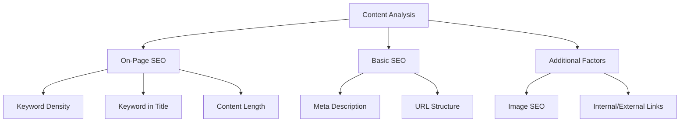

# WordPress SEO Plugins

## Introduction

Search Engine Optimization (SEO) is crucial for any website to gain visibility in search engines like Google, Bing, and Yahoo. For WordPress users, implementing SEO best practices can be simplified with the help of dedicated plugins. These plugins provide tools and features that help optimize your content, improve site structure, and enhance overall search performance without requiring extensive technical knowledge.

In this guide, we'll explore the best WordPress SEO plugins available, their key features, how to set them up, and how they can help improve your site's search engine visibility.

## Why Use WordPress SEO Plugins?

Before diving into specific plugins, let's understand why they're important:

1. **Simplified Optimization**: SEO plugins provide user-friendly interfaces to implement complex SEO techniques
2. **Time-saving**: Automate repetitive SEO tasks
3. **Guidance**: Offer recommendations for improving content quality
4. **Technical SEO**: Handle technical aspects like XML sitemaps and schema markup
5. **Analysis**: Provide insights about your content's SEO performance

## Top WordPress SEO Plugins

### 1. Yoast SEO

Yoast SEO is arguably the most popular WordPress SEO plugin with over 5 million active installations.

#### Key Features:
- Content analysis (readability and SEO checks)
- XML sitemaps
- Title and meta description templates
- Social media integration
- Schema markup
- Breadcrumb navigation
- Canonical URLs

#### Installation and Setup

1. Install Yoast SEO from the WordPress plugin repository:

```bash
# Navigate to your WordPress installation
cd /path/to/wordpress

# Alternative: Use WP-CLI to install Yoast SEO
wp plugin install wordpress-seo --activate
```

2. After installation, navigate to the Yoast SEO configuration wizard:

```
WordPress Dashboard > Yoast SEO > General > Configuration Wizard
```

3. Follow the step-by-step configuration wizard to set up the plugin according to your website needs.

#### Using Yoast SEO for Post Optimization

When creating or editing a post, Yoast SEO adds a meta box below the editor:

1. Set your focus keyphrase (main keyword)
2. Update your SEO title and meta description
3. Check the content analysis for improvement suggestions

Yoast provides a color-coded system for feedback:
- Green: Good
- Orange: Improvements possible
- Red: Needs attention

Example optimization process:

```jsx
// This represents the Yoast SEO meta box interface functionality, not actual code
const YoastAnalysis = {
  focusKeyphrase: "wordpress seo plugins",
  contentScore: analyzeContent(postContent, focusKeyphrase),
  suggestions: [
    "Add your keyphrase to the first paragraph",
    "Increase the keyphrase density slightly",
    "Add more internal links"
  ],
  displayTrafficLight: contentScore > 70 ? "green" : "orange"
};
```

### 2. Rank Math

Rank Math is a newer but rapidly growing SEO plugin known for its feature-rich free version.

#### Key Features:
- Multiple keyword optimization
- Google Search Console integration
- Advanced schema markup options
- SEO analysis and recommendations
- 404 monitoring
- Redirections
- Local SEO and rich snippets

#### Installation and Basic Setup

1. Install Rank Math from the WordPress plugin repository
2. After activation, you'll be prompted to start the setup wizard
3. Choose between "Easy" or "Advanced" mode based on your SEO knowledge

#### Content Optimization with Rank Math

Rank Math allows you to optimize for multiple keywords in the free version:

1. Add your primary and secondary keywords
2. Review the 30-point checklist of optimization suggestions
3. Get real-time feedback as you update your content

Example of Rank Math's analysis structure:



### 3. All in One SEO Pack (AIOSEO)

One of the original WordPress SEO plugins, recently revamped with modern features.

#### Key Features:
- TruSEO on-page analysis
- Smart XML sitemaps
- Advanced schema markups
- Social media integration
- SEO for custom post types
- WooCommerce SEO integration
- Local SEO features

#### Implementation Example

Here's how to implement basic schema markup using AIOSEO:

```javascript
// This illustrates the concept, not actual implementation code
const aioseoSchema = {
  "@context": "https://schema.org",
  "@type": "Article",
  "headline": "WordPress SEO Plugins Guide",
  "author": {
    "@type": "Person",
    "name": "Your Name"
  },
  "publisher": {
    "@type": "Organization",
    "name": "Your Website",
    "logo": {
      "@type": "ImageObject",
      "url": "https://yourwebsite.com/logo.png"
    }
  },
  "datePublished": "2023-10-28",
  "image": "https://yourwebsite.com/featured-image.jpg"
};
```

## Comparing the Major SEO Plugins

Let's compare the three major plugins to help you choose the right one:

| Feature | Yoast SEO | Rank Math | AIOSEO |
|---------|----------|-----------|--------|
| Free Plan Features | Good | Excellent | Good |
| Keyword Analysis | Single (free) | Multiple (free) | Single (free) |
| Schema Options | Basic (free) | Advanced (free) | Advanced (free) |
| Ease of Use | Very Easy | Moderate | Easy |
| Content Analysis | Comprehensive | Comprehensive | Comprehensive |
| Redirections | Premium | Free | Premium |
| Support | Good | Good | Good |

## SEO Plugin Best Practices

Regardless of which plugin you choose, follow these best practices:

1. **Don't over-optimize**: Focus on creating quality content first
2. **Don't install multiple SEO plugins**: They can conflict with each other
3. **Regularly update your SEO plugins**: For security and new features
4. **Follow the recommendations**: But use your judgment based on your audience
5. **Monitor performance**: Track how changes affect your rankings

## Implementation Guide: Setting Up Basic SEO

Follow this step-by-step guide for implementing basic SEO using any of the above plugins:

### 1. Configure Site-Wide SEO Settings

```
Plugin Dashboard > General Settings
```

Set your default title format:
- Homepage: `{site_title} | {site_tagline}`
- Posts: `{post_title} | {site_title}`
- Pages: `{page_title} | {site_title}`

### 2. Set Up XML Sitemaps

Enable XML sitemaps to help search engines discover and index your content:

```
Plugin Dashboard > Sitemap Settings > Enable XML Sitemaps
```

### 3. Connect to Google Search Console

Connect your SEO plugin to Google Search Console for insights:

```
Plugin Dashboard > Search Console > Connect
```

### 4. Implement Schema Markup

Basic schema markup for a blog post:

```html
<!-- This is an example of how schema might be implemented in your theme -->
<script type="application/ld+json">
{
  "@context": "https://schema.org",
  "@type": "BlogPosting",
  "headline": "Your Post Title",
  "author": {
    "@type": "Person",
    "name": "Your Name"
  },
  "datePublished": "2023-10-28",
  "image": "https://yourwebsite.com/image.jpg"
}
</script>
```

All the plugins mentioned will generate this automatically, but understanding the structure helps.

## Common SEO Mistakes to Avoid

When using SEO plugins, be aware of these common mistakes:

1. **Keyword stuffing**: Adding too many keywords unnaturally
2. **Ignoring readability**: Focusing only on SEO scores
3. **Not customizing meta descriptions**: Using auto-generated descriptions
4. **Overlooking image optimization**: Forgetting to add alt text
5. **Neglecting mobile optimization**: Not checking how your site appears on mobile

## Advanced SEO Techniques with Plugins

Once you're comfortable with basic SEO, explore these advanced techniques:

### Content Gap Analysis

Use your SEO plugin to identify topics you haven't covered:

```
Rank Math > Analytics > Content Gap Analysis
```

### Schema Markup for Rich Results

Implement advanced schema for rich results in search:

- How-to schema
- FAQ schema
- Review schema
- Recipe schema

Example FAQ schema implementation:

```javascript
// This represents the structure, your SEO plugin generates this
const faqSchema = {
  "@context": "https://schema.org",
  "@type": "FAQPage",
  "mainEntity": [
    {
      "@type": "Question",
      "name": "What is the best WordPress SEO plugin?",
      "acceptedAnswer": {
        "@type": "Answer",
        "text": "The best plugin depends on your needs. Yoast SEO is popular and beginner-friendly, Rank Math offers more features in its free version, and All in One SEO provides a balance of both."
      }
    }
  ]
};
```

## Summary

WordPress SEO plugins provide essential tools to optimize your website for search engines without requiring extensive technical knowledge. The three most popular options—Yoast SEO, Rank Math, and All in One SEO Pack—offer similar core features with different approaches and interfaces.

When choosing an SEO plugin, consider:

- Your technical comfort level
- Specific features you need
- Budget constraints (free vs. premium)
- User interface preferences

Remember that plugins are tools to assist your SEO efforts—they don't replace the need for quality content, good site structure, and a positive user experience, which remain the foundations of effective SEO.

## Additional Resources

To further enhance your WordPress SEO knowledge:

1. Google's [SEO Starter Guide](https://developers.google.com/search/docs/fundamentals/seo-starter-guide)
2. [WordPress SEO Documentation](https://wordpress.org/support/article/search-engine-optimization/)
3. Individual plugin documentation:
   - [Yoast SEO Knowledge Base](https://yoast.com/help/)
   - [Rank Math Knowledge Base](https://rankmath.com/kb/)
   - [All in One SEO Documentation](https://aioseo.com/docs/)

## Practice Exercise

Apply what you've learned by completing this exercise:

1. Install one of the SEO plugins discussed
2. Configure the basic settings for your site
3. Optimize an existing post using the plugin's content analysis
4. Create a new post implementing all the SEO best practices
5. Monitor the performance over time using the plugin's analysis tools

This hands-on experience will help solidify your understanding of WordPress SEO plugins and their practical application.