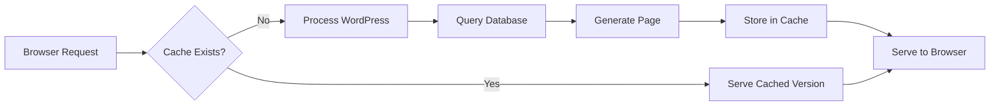

# WordPress Caching Plugins

## Introduction

Website performance is a critical factor in user experience and SEO rankings. A slow website can drive visitors away and negatively impact your search engine position. WordPress, while powerful and versatile, can sometimes be resource-intensive, leading to slower load times. This is where caching plugins come to the rescue.

Caching is the process of storing frequently accessed data in a temporary storage location (cache) so that future requests for that data can be served faster. In WordPress terms, caching plugins create static versions of your dynamic content, reducing the processing time needed to generate pages and ultimately speeding up your website.

In this guide, we'll explore:
- What caching is and how it works in WordPress
- Popular WordPress caching plugins and their features
- How to set up and configure caching plugins
- Best practices for implementing caching on your WordPress site

## What is WordPress Caching?

### The Basics of Caching

When a visitor accesses your WordPress site, several processes occur:

1. The browser sends a request to your server
2. PHP executes WordPress code
3. WordPress queries the MySQL database
4. The server processes this information
5. The server returns HTML to the browser for display

This process happens every time someone visits your site, which can be resource-intensive and slow, especially with complex themes, numerous plugins, or high traffic.

Caching creates a shortcut in this process by:



### Types of Caching

WordPress sites can benefit from several types of caching:

1. **Page Caching**: Stores the final HTML output of a page
2. **Browser Caching**: Tells browsers to store certain files locally for a set period
3. **Object Caching**: Stores database query results in memory
4. **Opcode Caching**: Stores compiled PHP code to avoid repeated compilation
5. **CDN Caching**: Stores assets on servers distributed globally

## Popular WordPress Caching Plugins

Let's explore some of the most widely used caching plugins for WordPress:

### 1. WP Super Cache

**Overview**: A free plugin developed by Automattic (the company behind WordPress), WP Super Cache is a simple yet effective solution for beginners.

**Key Features**:
- Generates static HTML files
- Three caching modes (Simple, Expert, WP-Cache)
- Compression of pages
- CDN support
- Cache preloading

**Setup Example**:

1. Install and activate the plugin
2. Navigate to Settings > WP Super Cache
3. Enable caching by clicking "Turn On Caching"

```php
// Example of how WP Super Cache can be configured in wp-config.php
define('WP_CACHE', true); // Required for WP Super Cache to function
```

### 2. W3 Total Cache

**Overview**: A comprehensive caching solution with extensive customization options.

**Key Features**:
- Page, object, database, and browser caching
- Minification of HTML, CSS, and JavaScript
- CDN integration
- Lazy loading of images
- Database and object caching

**Configuration Example**:

For browser caching, W3 Total Cache modifies your `.htaccess` file to add rules like:

```apache
<IfModule mod_expires.c>
  ExpiresActive On
  ExpiresByType image/jpg "access plus 1 year"
  ExpiresByType image/jpeg "access plus 1 year"
  ExpiresByType image/gif "access plus 1 year"
  ExpiresByType image/png "access plus 1 year"
  ExpiresByType text/css "access plus 1 month"
  ExpiresByType application/pdf "access plus 1 month"
  ExpiresByType text/javascript "access plus 1 month"
  ExpiresByType application/javascript "access plus 1 month"
  ExpiresByType application/x-javascript "access plus 1 month"
  ExpiresByType application/x-shockwave-flash "access plus 1 month"
  ExpiresByType image/x-icon "access plus 1 year"
  ExpiresDefault "access plus 2 days"
</IfModule>
```

### 3. LiteSpeed Cache

**Overview**: Designed specifically for servers running LiteSpeed Web Server, but works on all server types.

**Key Features**:
- Server-level caching
- Image optimization
- CSS/JS minification and combination
- Database optimization
- Lazy loading
- Critical CSS generation

### 4. WP Rocket (Premium)

**Overview**: A premium, user-friendly caching plugin designed for simplicity and effectiveness.

**Key Features**:
- Page caching
- Cache preloading
- Browser caching
- GZIP compression
- Database optimization
- Lazy loading of images
- Defer JavaScript loading
- CDN integration

## Implementing Caching on Your WordPress Site

### Step 1: Choose the Right Plugin

Consider the following factors when selecting a caching plugin:

- **Server Environment**: Some plugins work better with specific server configurations
- **Technical Expertise**: More complex plugins offer greater customization but require more knowledge
- **Budget**: While many good free options exist, premium plugins like WP Rocket offer additional features
- **Other Plugins**: Ensure compatibility with your existing WordPress plugins

### Step 2: Basic Configuration

Most caching plugins require minimal setup to start working:

1. Install and activate the plugin
2. Enable page caching
3. Enable browser caching
4. Configure expiration times

Here's an example of configuring WP Super Cache:

1. Go to Settings > WP Super Cache
2. On the "Easy" tab, click "Turn Caching On"
3. Under "Advanced," check:
   - Cache hits to this website for quick access
   - Use mod_rewrite to serve cache files
4. Click "Update Status"

### Step 3: Advanced Optimization

Once basic caching is working, consider these additional optimizations:

#### Minification

Minification removes unnecessary characters from your code without changing its functionality:

```javascript
// Before minification
function sayHello() {
    console.log("Hello, World!");  // This is a greeting
}

// After minification
function sayHello(){console.log("Hello, World!")}
```

Most caching plugins offer minification settings for CSS, JavaScript, and HTML.

#### Database Optimization

WordPress databases accumulate post revisions, trashed items, and transients. Regular optimization helps maintain performance:

```sql
-- Example of what database optimization might do
DELETE FROM wp_posts WHERE post_type = 'revision';
DELETE FROM wp_options WHERE option_name LIKE '%\_transient\_%';
OPTIMIZE TABLE wp_posts, wp_options, wp_comments;
```

#### Image Optimization

Large images can significantly slow down your site. Caching plugins often include:
- Image compression
- Lazy loading (loading images only as they come into view)
- WebP conversion

## Best Practices for WordPress Caching

### 1. Clear Cache After Updates

Always clear your cache after:
- WordPress core updates
- Theme updates
- Plugin updates
- Content changes

Most caching plugins provide a "Purge Cache" button:

```php
// Programmatic way to clear WP Super Cache
if ( function_exists( 'wp_cache_clear_cache' ) ) {
    wp_cache_clear_cache();
}
```

### 2. Exclude Dynamic Content

Some pages should not be cached, such as:
- Checkout pages
- User account pages
- Pages with forms
- Personalized content

Example exclusion in W3 Total Cache:

```
// In W3TC settings, you might exclude:
/checkout/*, /my-account/*, /cart/*
```

### 3. Test Your Site After Caching Implementation

Verify your site works correctly after implementing caching:
- Test forms submissions
- Check user login/logout functionality
- Verify that content updates appear correctly
- Test on multiple devices and browsers

### 4. Monitor Performance Improvements

Measure your results using tools like:
- Google PageSpeed Insights
- GTmetrix
- Pingdom
- WebPageTest

## Troubleshooting Common Caching Issues

### White Screen of Death

**Cause**: Cache plugin conflicts with themes or other plugins.

**Solution**:
1. Access your site via FTP
2. Rename the plugin folder (e.g., change `wp-content/plugins/wp-super-cache` to `wp-content/plugins/wp-super-cache-disabled`)
3. Access your admin panel and properly disable the plugin

### Cached Content Not Updating

**Cause**: Cache not clearing after content changes.

**Solution**:
1. Manually clear the cache in your plugin settings
2. Configure cache expiration times
3. Set up automatic cache purging for content updates

```php
// Hook to clear cache when content is updated
add_action('save_post', function($post_id) {
    if (function_exists('wp_cache_clear_cache')) {
        wp_cache_clear_cache();
    }
});
```

### Login Issues After Enabling Caching

**Cause**: Session data or cookies being cached.

**Solution**:
1. Exclude login pages from caching
2. Configure cookie/session handling in your caching plugin

## Real-World Example: Setting Up WP Super Cache for a Blog

Let's walk through setting up WP Super Cache for a typical WordPress blog:

### Step 1: Installation and Basic Setup

1. Install and activate WP Super Cache
2. Go to Settings > WP Super Cache
3. Click "Turn caching on"
4. Select "Use mod_rewrite to serve cache files" (if your server supports it)
5. Click "Update Status"

### Step 2: Configure Advanced Settings

1. Go to the "Advanced" tab
2. Enable:
   - Cache Rebuild
   - Compress pages
   - 304 Not Modified browser caching
3. Set "Expiry Time & Garbage Collection" to 1800 seconds (30 minutes)

### Step 3: Set Up Cache Preloading

1. Go to the "Preload" tab
2. Enable "Preload mode"
3. Set it to update all posts and pages when a post is published or updated

### Step 4: Configure CDN (if applicable)

1. Go to the "CDN" tab
2. Enter your CDN details for off-server file storage

### Step 5: Exclude Dynamic Content

1. Go to the "Advanced" tab
2. In "Rejected URLs," add:
   ```
   wp-.*\.php
   index\.php
   /cart/.*
   /checkout/.*
   /my-account/.*
   ```

This setup provides a balance between strong caching performance and compatibility with dynamic features of a typical blog.

## Summary

WordPress caching plugins are powerful tools for improving your site's performance. By implementing caching correctly, you can:

- Reduce server load
- Decrease page load times
- Improve user experience
- Potentially boost SEO rankings
- Handle traffic spikes more efficiently

Remember that caching is just one aspect of WordPress optimization. For best results, combine it with other performance techniques like image optimization, quality hosting, and minimizing plugin usage.

## Additional Resources

To continue learning about WordPress caching and performance optimization:

1. Explore the documentation for your chosen caching plugin
2. Learn about server-level caching options (Redis, Memcached)
3. Understand how CDNs complement caching plugins
4. Study WordPress database optimization techniques

## Exercises

1. **Compare Caching Plugins**: Install and test two different caching plugins on a test WordPress site. Document the performance differences using tools like PageSpeed Insights.

2. **Optimize a Slow Page**: Identify a slow-loading page on your WordPress site and apply appropriate caching techniques to improve its performance.

3. **Create a Caching Strategy**: Develop a comprehensive caching strategy for a WordPress site, including which pages to cache, which to exclude, and how often to refresh the cache.

4. **Troubleshoot Caching Issues**: Intentionally create a caching conflict (e.g., by enabling incompatible features) and practice resolving it.

With the right caching strategy in place, your WordPress site will be well-equipped to deliver a fast, responsive experience to your visitors.