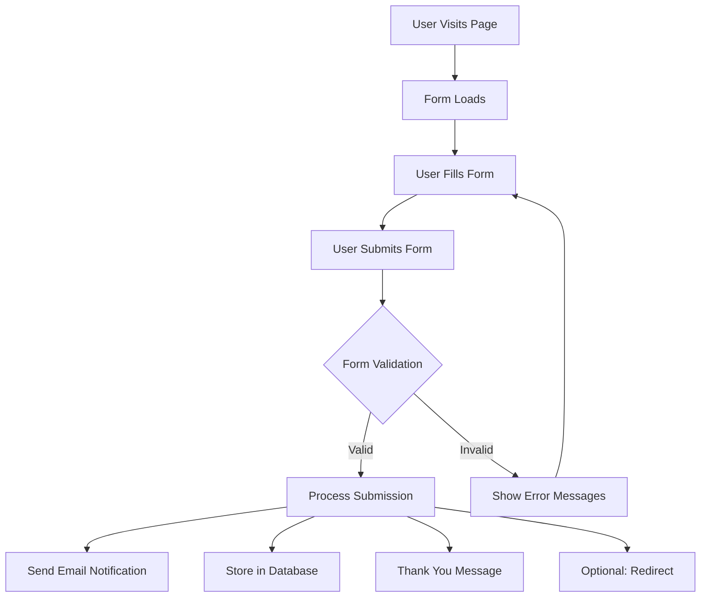

# WordPress Form Plugins

## Introduction

Forms are an essential part of any interactive website, allowing visitors to contact you, submit information, place orders, register for events, or provide feedback. While WordPress itself doesn't include a robust form building system out of the box, there are numerous plugins available that make it easy to create and manage forms on your WordPress site.

In this guide, we'll explore WordPress form plugins in depth, covering:

- What form plugins are and why you need them
- Popular form plugins and their features
- How to set up and configure a form plugin
- Building your first form
- Form validation and security
- Processing form submissions
- Best practices for WordPress forms

## What Are WordPress Form Plugins?

WordPress form plugins are extensions that add form building capabilities to your WordPress website. They typically provide:

1. A drag-and-drop form builder interface
2. Various field types (text, email, dropdown, etc.)
3. Validation and spam protection
4. Submission management
5. Email notifications
6. Integration with other services (CRM, email marketing, etc.)

## Popular WordPress Form Plugins

Let's look at some of the most popular form plugins available for WordPress:

### 1. Contact Form 7

Contact Form 7 is one of the oldest and most widely used form plugins, known for its simplicity and reliability.

**Key Features:**
- Free to use
- Simple HTML-based form creation
- Email notifications
- Basic spam filtering
- Extensible with add-ons

### 2. WPForms

WPForms is a beginner-friendly form builder with a drag-and-drop interface.

**Key Features:**
- Drag-and-drop form builder
- Pre-built form templates
- Entry management
- Conditional logic
- Payment integrations
- Multi-page forms
- Free lite version and premium version

### 3. Gravity Forms

Gravity Forms is a premium plugin known for its advanced features and extensive add-on ecosystem.

**Key Features:**
- Powerful form builder
- Advanced conditional logic
- File uploads
- User-generated content
- Extensive API
- Many third-party integrations

### 4. Ninja Forms

Ninja Forms offers a balance of simplicity and power with its modular approach.

**Key Features:**
- User-friendly builder
- Add-on system for extended functionality
- Multi-part forms
- Conditional logic
- Free core plugin with premium add-ons

### 5. Formidable Forms

Formidable Forms can create advanced forms and even data-driven applications.

**Key Features:**
- Advanced form builder
- View builder for displaying form data
- Calculations and graphs
- Repeater fields
- Integration with major services
- Free and premium versions

## Setting Up a Form Plugin

Let's go through the process of setting up and using a form plugin, using Contact Form 7 as an example since it's free and widely used.

### Step 1: Installation

1. Go to your WordPress dashboard
2. Navigate to Plugins > Add New
3. Search for "Contact Form 7"
4. Click "Install Now" and then "Activate"

### Step 2: Creating Your First Form

Once installed, Contact Form 7 adds a new menu item to your WordPress dashboard. Here's how to create a basic contact form:

1. Go to Contact > Add New
2. You'll see a default form template that includes basic fields:
   - Name
   - Email
   - Subject
   - Message

The form is defined using a simple markup language. Here's what the default form typically looks like:

```
<label>Your Name (required)
    [text* your-name]
</label>

<label>Your Email (required)
    [email* your-email]
</label>

<label>Subject
    [text your-subject]
</label>

<label>Your Message
    [textarea your-message]
</label>

[submit "Send"]
```

### Step 3: Customizing Your Form

You can modify the form by adding, removing, or changing fields. Contact Form 7 uses shortcode-style tags to define form elements.

Here's how you can add different types of fields:

**Text field:**
```
[text your-field-name "Default value"]
```

**Required text field:**
```
[text* your-field-name "Default value"]
```

**Email field:**
```
[email your-email]
```

**Telephone field:**
```
[tel your-phone]
```

**URL field:**
```
[url your-website]
```

**Dropdown menu:**
```
[select your-menu "Option 1" "Option 2" "Option 3"]
```

**Checkboxes:**
```
[checkbox your-interests "Web Design" "Development" "SEO"]
```

**Radio buttons:**
```
[radio your-choice "Yes" "No" "Maybe"]
```

### Step 4: Configuring Form Settings

Contact Form 7 allows you to configure:

1. **Mail settings** - Control where form submissions are sent
2. **Messages** - Customize success, error, and other user feedback messages
3. **Additional settings** - Advanced configuration options

### Step 5: Adding the Form to Your Website

Once your form is ready, Contact Form 7 gives you a shortcode that you can place anywhere on your site:

```
[contact-form-7 id="123" title="Contact form 1"]
```

You can add this shortcode to:
- Posts
- Pages
- Widgets
- Template files (using the `do_shortcode()` function)

For example, to add the form to a template file, you would use:

```php
<?php echo do_shortcode('[contact-form-7 id="123" title="Contact form 1"]'); ?>
```

## Building a More Complex Form

Let's create a more complex event registration form using Contact Form 7:

```
<h3>Personal Information</h3>

<label>Full Name (required)
    [text* full-name]
</label>

<label>Email Address (required)
    [email* your-email]
</label>

<label>Phone Number
    [tel your-phone]
</label>

<h3>Event Selection</h3>

<label>Which event are you registering for?
    [select event-choice "Web Development Workshop" "WordPress Basics" "Advanced SEO Techniques" "E-commerce Solutions"]
</label>

<label>Number of Tickets
    [number tickets min:1 max:5 "1"]
</label>

<h3>Preferences</h3>

<label>Dietary Restrictions
    [checkbox dietary "Vegetarian" "Vegan" "Gluten-free" "None"]
</label>

<label>Would you like to receive updates about future events?
    [radio future-updates "Yes" "No"]
</label>

<label>Additional Comments
    [textarea comments]
</label>

[submit "Register Now"]
```

## Form Validation and Security

### Basic Validation

Most form plugins provide built-in validation for:

- Required fields
- Email format
- Number ranges
- URL formats

For example, in Contact Form 7, the asterisk (*) marks a field as required:
```
[text* required-field]
```

### Advanced Validation

For more complex validation rules, you might need custom code. Here's an example of adding custom JavaScript validation to ensure a phone number follows a specific format:

```javascript
document.addEventListener( 'wpcf7submit', function( event ) {
    const phoneInput = document.querySelector('input[name="your-phone"]');
    const phonePattern = /^\d{3}-\d{3}-\d{4}$/;
    
    if (!phonePattern.test(phoneInput.value)) {
        const errorMessage = document.createElement('span');
        errorMessage.className = 'wpcf7-not-valid-tip';
        errorMessage.textContent = 'Please enter a valid phone number (e.g., 555-123-4567)';
        
        phoneInput.parentNode.appendChild(errorMessage);
        event.preventDefault();
    }
}, false );
```

### Spam Protection

Form plugins typically offer several ways to combat spam:

1. **CAPTCHA/reCAPTCHA** - Visual or invisible challenges to verify human users
2. **Honeypot fields** - Hidden fields that bots fill out but humans don't
3. **Rate limiting** - Preventing too many submissions in a short time
4. **Akismet integration** - Using WordPress's spam detection service

To add reCAPTCHA to a Contact Form 7 form:

```
[recaptcha]
```

## Processing Form Submissions

### Email Notifications

Most form plugins will send email notifications when forms are submitted. In Contact Form 7, you can configure these settings under the "Mail" tab.

A typical mail configuration looks like:

```
To: admin@example.com
From: [your-name] <wordpress@yourdomain.com>
Subject: Website Contact: [your-subject]
Message Body:
From: [your-name] <[your-email]>
Subject: [your-subject]

Message:
[your-message]

-- 
This email was sent from a contact form on Your Website (https://www.example.com)
```

### Storing Submissions in the Database

While Contact Form 7 doesn't store submissions by default, plugins like WPForms and Gravity Forms do. Alternatively, you can add submission storage to Contact Form 7 using add-on plugins like "Flamingo" or "Contact Form 7 Database".

### Integration with Other Services

Modern form plugins can integrate with various third-party services:

- Email marketing services (Mailchimp, ConvertKit)
- CRM systems (Salesforce, HubSpot)
- Payment processors (PayPal, Stripe)
- Project management tools (Trello, Asana)
- Google services (Sheets, Calendar)

## Form Styling and Design

### Basic CSS Styling

You can style your forms using CSS. Most form plugins add specific classes that you can target.

For example, to style Contact Form 7 inputs:

```css
.wpcf7 input[type="text"],
.wpcf7 input[type="email"],
.wpcf7 textarea {
    width: 100%;
    padding: 12px;
    border: 1px solid #ccc;
    border-radius: 4px;
    margin-top: 6px;
    margin-bottom: 16px;
}

.wpcf7 input[type="submit"] {
    background-color: #4CAF50;
    color: white;
    padding: 12px 20px;
    border: none;
    border-radius: 4px;
    cursor: pointer;
}

.wpcf7 input[type="submit"]:hover {
    background-color: #45a049;
}
```

### Responsive Forms

Ensure your forms work well on all devices by using responsive design principles:

```css
@media screen and (max-width: 600px) {
    .wpcf7 .name-field,
    .wpcf7 .email-field {
        width: 100%;
        display: block;
        margin-right: 0;
    }
}
```

## Form Plugin Workflows

Let's visualize a typical form submission workflow:



## Best Practices for WordPress Forms

1. **Keep forms simple** - Only ask for information you truly need
2. **Use clear labels** - Make sure users understand what to enter
3. **Provide helpful error messages** - Guide users to fix mistakes
4. **Implement proper validation** - Ensure data integrity
5. **Add spam protection** - Protect your site from form spam
6. **Make forms accessible** - Follow accessibility guidelines
7. **Test thoroughly** - Check forms on different devices and browsers
8. **Confirm submissions** - Always let users know their form was submitted
9. **Secure sensitive data** - Consider encrypting sensitive form data
10. **Optimize for mobile** - Ensure forms work well on small screens

## Building a Multi-step Form

Advanced form plugins like WPForms, Gravity Forms, and Formidable Forms allow you to create multi-step forms. These break longer forms into manageable chunks, improving the user experience.

Here's how a multi-step form typically works:

1. The form is divided into sections or "pages"
2. Users complete one section before moving to the next
3. Progress indicators show how far along the user is
4. Previous sections can often be revisited to edit responses
5. Final submission happens at the last step

## Form Analytics and Tracking

Understanding how users interact with your forms can help you optimize them. You can:

1. Track form views vs. submissions
2. Identify fields where users commonly abandon forms
3. Test different form layouts to increase completion rates

A simple way to track form submissions in Google Analytics is to set up event tracking:

```javascript
document.addEventListener('wpcf7mailsent', function(event) {
    if (typeof ga === 'function') {
        ga('send', 'event', 'Contact Form', 'Submit', 'Contact Form ' + event.detail.contactFormId);
    }
}, false);
```

## Summary

WordPress form plugins are essential tools for creating interactive websites that collect user input. They range from simple contact forms to complex multi-step applications with conditional logic and integrations.

Key points to remember:

1. Choose a form plugin that matches your needs and skill level
2. Start with simple forms and gradually explore advanced features
3. Always include proper validation and spam protection
4. Make your forms user-friendly and accessible
5. Test thoroughly across different devices and browsers
6. Consider the user experience when designing forms
7. Use styling to make forms match your website design
8. Follow data protection regulations when collecting personal information

## Additional Resources

To continue learning about WordPress forms:

1. **Practice exercise**: Create a contact form with name, email, subject, and message fields
2. **Challenge**: Build a multi-step event registration form with conditional logic
3. **Advanced exercise**: Create a form that calculates values based on user input

## Next Steps

Now that you understand WordPress form plugins, consider learning about:

- Form accessibility best practices
- GDPR compliance for contact forms
- Creating custom form templates
- Integrating forms with email marketing services
- Building advanced applications with form data

With the right form plugin and a good understanding of best practices, you can create professional, user-friendly forms for any purpose on your WordPress website.