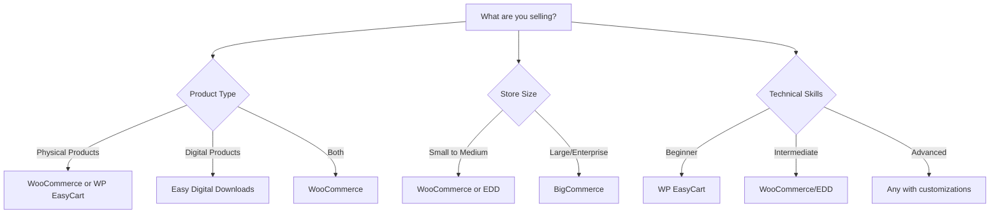

# WordPress E-commerce Plugins

## Introduction

E-commerce plugins transform your WordPress website into a fully functional online store, allowing you to sell physical products, digital downloads, services, or subscriptions. Whether you're a small business owner looking to establish an online presence or a developer building stores for clients, understanding WordPress e-commerce plugins is essential in today's digital marketplace.

In this guide, we'll explore the most popular e-commerce solutions for WordPress, compare their features, and walk through the setup process for beginners. By the end, you'll have the knowledge to choose the right plugin for your specific needs and start selling online.

## Why Use WordPress for E-commerce?

Before diving into specific plugins, let's understand why WordPress is an excellent platform for e-commerce:

1. **Cost-effective**: Many e-commerce plugins offer free core functionality with premium extensions
2. **Flexibility**: Customize your store with thousands of themes and plugins
3. **Scalability**: Grow from a small shop to an enterprise-level store
4. **SEO-friendly**: WordPress is optimized for search engines out of the box
5. **Community support**: Access a vast community of developers and resources

## Popular WordPress E-commerce Plugins

### 1. WooCommerce

WooCommerce is the most popular e-commerce plugin for WordPress, powering approximately 30% of all online stores worldwide. Owned by Automattic (the company behind WordPress.com), it offers robust functionality while maintaining the flexibility WordPress is known for.

#### Key Features:

- Sell physical and digital products
- Flexible shipping options
- Extensive payment gateway integrations
- Product variations and inventory management
- Tax calculation and reporting
- Mobile-responsive designs
- Extendable with thousands of add-ons

#### Basic Setup

Let's walk through the basic setup of WooCommerce:

1. **Installation**:

```php
// You can install WooCommerce through the WordPress dashboard:
// Plugins > Add New > Search for "WooCommerce" > Install > Activate

// Or you can use WP-CLI with this command:
wp plugin install woocommerce --activate
```

2. **Setup Wizard**:

After activation, WooCommerce launches a setup wizard that guides you through:
- Store location and currency
- Payment methods configuration
- Shipping options
- Recommended extensions

3. **Adding Your First Product**:

Navigate to **Products > Add New** and you'll see a familiar WordPress editor with additional product data fields:

```php
// Example structure of a WooCommerce product in code
$product = array(
    'name' => 'Blue T-Shirt',
    'regular_price' => '19.99',
    'description' => 'A comfortable cotton t-shirt available in multiple sizes.',
    'short_description' => 'Comfortable cotton t-shirt',
    'categories' => array('Clothing', 'T-Shirts'),
    'images' => array('main.jpg', 'back.jpg', 'side.jpg'),
    'attributes' => array(
        'Size' => array('Small', 'Medium', 'Large'),
        'Color' => array('Blue')
    ),
    'stock_quantity' => 100,
    'manage_stock' => true
);
```

4. **Configuring Payment Gateways**:

```php
// WooCommerce comes with several payment gateways pre-installed
// Navigate to: WooCommerce > Settings > Payments

// Available by default:
// - Direct Bank Transfer
// - Check Payments
// - Cash on Delivery
// - PayPal Standard

// For Stripe integration, install the free Stripe plugin:
wp plugin install woocommerce-gateway-stripe --activate
```

### 2. Easy Digital Downloads (EDD)

If you're selling digital products like e-books, software, music, or other downloadable items, Easy Digital Downloads is specifically designed for this purpose.

#### Key Features:

- Optimized for digital products
- File download protection
- Licensing system for software
- Frontend user dashboard
- Discount codes and promotional tools
- Detailed sales reports
- Integration with email marketing services

#### Basic Setup for Digital Products

```php
// After installing and activating EDD, create a new download:
// Downloads > Add New

// Set up download files in the "Download Files" metabox:
$download_files = array(
    array(
        'name' => 'Main PDF',
        'file' => 'https://example.com/secure/path/to/ebook.pdf',
        'condition' => 'all' // Available to all customers who purchase
    ),
    array(
        'name' => 'Bonus Worksheets',
        'file' => 'https://example.com/secure/path/to/worksheets.zip',
        'condition' => 'all'
    )
);

// Set purchase button display options
$purchase_options = array(
    'price' => '29.99',
    'button_text' => 'Buy Now',
    'variable_pricing' => false // Set to true for multiple pricing options
);
```

### 3. WP EasyCart

WP EasyCart is a user-friendly option that focuses on simplicity while still offering essential e-commerce features.

#### Key Features:

- Simple interface ideal for beginners
- Physical and digital products
- Basic inventory management
- Product options and variants
- Tax and shipping calculators
- Responsive design
- Payment gateway integrations

### 4. BigCommerce for WordPress

For those looking for a headless commerce solution, BigCommerce offers a WordPress plugin that connects your site to their powerful e-commerce platform.

#### Key Features:

- Separates commerce functionality from your WordPress site
- Enterprise-level scalability and security
- Reduced server load (product catalog hosted by BigCommerce)
- Multichannel selling capabilities
- Advanced product filtering
- Abandoned cart recovery

## Choosing the Right E-commerce Plugin

To select the best plugin for your needs, consider these factors:



## Extending Your E-commerce Store

Once you have the basic store functioning, you might want to add these common extensions:

### Analytics and Reporting

```php
// WooCommerce includes basic reports, but for advanced analytics:
// Install WooCommerce Google Analytics integration
wp plugin install woocommerce-google-analytics-integration --activate

// Configure with your Google Analytics tracking ID
$tracking_options = array(
    'ga_id' => 'UA-XXXXXXXX-X',
    'enable_standard_tracking' => true,
    'enable_enhanced_ecommerce' => true,
    'anonymize_ip' => true
);
```

### Email Marketing Integration

Many e-commerce stores benefit from email marketing integrations to follow up with customers and increase sales:

```php
// Example: Connecting WooCommerce to Mailchimp
wp plugin install mailchimp-for-woocommerce --activate

// Configuration settings
$mailchimp_settings = array(
    'api_key' => 'your-mailchimp-api-key',
    'store_name' => 'Your Store Name',
    'store_prefix' => 'your_store',
    'list_id' => 'your-audience-id',
    'enable_opt_in' => true
);
```

## Optimizing Your E-commerce Store

### Performance Optimization

E-commerce sites can become slow due to product images and database queries. Here are some tips:

1. **Image Optimization**:

```php
// Install an image optimization plugin
wp plugin install imagify --activate

// Or optimize with WP-CLI
wp media regenerate --yes
```

2. **Caching**:

```php
// Install a caching plugin compatible with e-commerce
wp plugin install wp-rocket --activate

// Configure to exclude cart, checkout, and account pages from cache
$excluded_pages = array(
    '/cart/',
    '/checkout/',
    '/my-account/'
);
```

### Security Measures

E-commerce sites handle sensitive data and need extra security:

```php
// Install a security plugin
wp plugin install wordfence --activate

// Enable SSL (HTTPS) for your site
// Add to wp-config.php:
define('FORCE_SSL_ADMIN', true);

// Using WP-CLI to search/replace HTTP with HTTPS URLs in the database
wp search-replace 'http://yoursite.com' 'https://yoursite.com' --all-tables
```

## Practical Example: Setting Up a Complete WooCommerce Store

Let's walk through a practical example of setting up a t-shirt store with WooCommerce:

### 1. Initial Setup

```php
// After installing WooCommerce and completing the setup wizard:
// Configure business information
$store_info = array(
    'address' => '123 Main Street',
    'city' => 'Anytown',
    'state' => 'CA',
    'zip' => '12345',
    'country' => 'US'
);

// Set up tax rules
$tax_settings = array(
    'enable_taxes' => true,
    'prices_include_tax' => false,
    'tax_based_on' => 'shipping', // Options: 'shipping', 'billing', or 'base'
    'shipping_tax_class' => 'standard'
);

// Configure shipping zones
$shipping_zones = array(
    array(
        'name' => 'United States',
        'regions' => array('US'),
        'methods' => array(
            'flat_rate' => array(
                'cost' => '5.99',
                'title' => 'Standard Shipping (3-5 days)'
            ),
            'free_shipping' => array(
                'requires' => 'min_amount',
                'min_amount' => '50.00'
            )
        )
    ),
    array(
        'name' => 'International',
        'regions' => array('rest_of_world'),
        'methods' => array(
            'flat_rate' => array(
                'cost' => '15.99',
                'title' => 'International Shipping (7-14 days)'
            )
        )
    )
);
```

### 2. Creating Product Categories

```php
// Create logical category structure
$categories = array(
    'Men' => array(
        'T-Shirts',
        'Hoodies',
        'Accessories'
    ),
    'Women' => array(
        'T-Shirts',
        'Tank Tops',
        'Accessories'
    ),
    'Collections' => array(
        'Summer',
        'Vintage',
        'Graphic'
    )
);

// In the WordPress dashboard:
// Products > Categories
```

### 3. Adding Variable Products (T-shirts with different sizes and colors)

```php
// Create global attributes first
// Products > Attributes > Add new
$attributes = array(
    'Size' => array('S', 'M', 'L', 'XL'),
    'Color' => array('Black', 'White', 'Blue', 'Red')
);

// Then create a variable product
// Products > Add New
$tshirt_product = array(
    'name' => 'Classic Logo T-Shirt',
    'type' => 'variable', // Important!
    'description' => 'Our bestselling t-shirt with the classic company logo...',
    'regular_price' => '', // Prices set at variation level
    'attributes' => array(
        'size' => array(
            'name' => 'Size',
            'options' => array('S', 'M', 'L', 'XL'),
            'visible' => true,
            'variation' => true
        ),
        'color' => array(
            'name' => 'Color',
            'options' => array('Black', 'White', 'Red'),
            'visible' => true,
            'variation' => true
        )
    ),
    'variations' => array(
        array(
            'attributes' => array(
                'size' => 'S',
                'color' => 'Black'
            ),
            'regular_price' => '19.99',
            'stock_quantity' => 10
        ),
        array(
            'attributes' => array(
                'size' => 'M',
                'color' => 'Black'
            ),
            'regular_price' => '19.99',
            'stock_quantity' => 15
        ),
        // And so on for all combinations...
    )
);
```

### 4. Setting Up the Store Pages

WooCommerce creates several essential pages automatically:

- Shop (product listing)
- Cart
- Checkout
- My Account

You may want to customize these pages or add additional content:

```php
// Add a shortcode to display featured products on the homepage
add_shortcode('featured_products', function($atts) {
    $atts = shortcode_atts(array(
        'per_page' => '4',
        'columns' => '4',
    ), $atts);
    
    return do_shortcode('[products featured="true" limit="' . $atts['per_page'] . '" columns="' . $atts['columns'] . '"]');
});

// Usage on any page:
// [featured_products per_page="3" columns="3"]
```

## Troubleshooting Common Issues

Even with the best setup, you might encounter these common e-commerce issues:

### 1. Payment Gateway Errors

```php
// Enable logging for payment gateways
// WooCommerce > Settings > Advanced > Logging
// Check logs at WooCommerce > Status > Logs

// Common fix for PayPal issues - force TLS v1.2
add_filter('https_ssl_verify', '__return_true');
add_filter('https_local_ssl_verify', '__return_true');
```

### 2. Inventory Management Issues

```php
// Check for products with inconsistent stock status
$query = new WP_Query(array(
    'post_type' => 'product',
    'posts_per_page' => -1,
    'meta_query' => array(
        'relation' => 'AND',
        array(
            'key' => '_manage_stock',
            'value' => 'yes'
        ),
        array(
            'key' => '_stock',
            'value' => '0',
            'compare' => '<=',
            'type' => 'NUMERIC'
        ),
        array(
            'key' => '_stock_status',
            'value' => 'instock'
        )
    )
));

// These products have zero or negative stock but are marked as in stock
```

## Summary

WordPress e-commerce plugins provide powerful solutions for selling products and services online. In this guide, we've covered:

- The main WordPress e-commerce plugins available (WooCommerce, Easy Digital Downloads, WP EasyCart, and BigCommerce)
- How to choose the right plugin based on your specific needs
- Basic setup and configuration steps for the most popular options
- Product creation and management
- Extensions to enhance your store functionality
- Performance and security optimization
- A practical example of setting up a complete online store
- Common troubleshooting tips

Each e-commerce plugin has its own strengths and ideal use cases. WooCommerce remains the most versatile option with the largest ecosystem of extensions, while Easy Digital Downloads excels specifically for digital products.

## Additional Resources

To continue learning about WordPress e-commerce:

1. **Official Documentation**:
   - [WooCommerce Documentation](https://docs.woocommerce.com/)
   - [Easy Digital Downloads Documentation](https://docs.easydigitaldownloads.com/)

2. **Advanced Tutorials**:
   - Complete the WooCommerce REST API tutorial to learn how to integrate your store with other applications
   - Explore WooCommerce Subscriptions for recurring revenue models

3. **Exercises**:

   - Set up a test store with 5 products, including both simple and variable products
   - Configure multiple payment gateways and test the checkout process
   - Create a coupon code with specific usage restrictions
   - Set up a free shipping option that activates when order total exceeds $50
   - Configure tax rates for different countries or states

By mastering WordPress e-commerce plugins, you'll have the skills to create powerful online stores for yourself or clients, opening up numerous business opportunities in the digital economy.