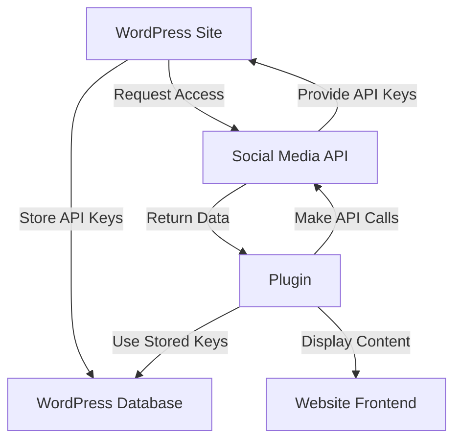

# WordPress Social Media Plugins

## Introduction

In today's digital landscape, social media integration is essential for any successful website. WordPress, being one of the most popular content management systems, offers numerous plugins to seamlessly connect your website with various social media platforms. These plugins can help you share content automatically, display social feeds, add social share buttons, and much more.

Social media plugins for WordPress serve several important purposes:

- Increasing content visibility and reach
- Driving traffic from social networks to your website
- Encouraging visitors to share your content
- Displaying your social media activity on your website
- Building social proof through follower counts and engagement metrics

In this guide, we'll explore different types of WordPress social media plugins, how to select the right ones for your needs, and how to implement them effectively.

## Types of Social Media Plugins

### Social Sharing Plugins

Social sharing plugins allow visitors to share your content across various social media platforms with a single click.

#### Key Features:

- Share buttons for multiple platforms (Facebook, Twitter, LinkedIn, Pinterest, etc.)
- Share count displays
- Floating/sticky share bars
- Custom positioning options
- Mobile-responsive designs

### Social Feed Plugins

These plugins display your social media feeds directly on your WordPress website.

#### Key Features:

- Integration with multiple platforms
- Customizable display layouts
- Filtering options for content
- Automatic updates when you post new content
- Responsive design for all devices

### Social Login Plugins

Social login plugins allow users to register and log in to your WordPress site using their existing social media credentials.

#### Key Features:

- Multiple social network integrations
- Customizable login buttons
- User profile data syncing
- Registration workflows
- Privacy controls

### Auto-Posting Plugins

These plugins automatically share your WordPress content to your social media accounts when you publish.

#### Key Features:

- Scheduled posting
- Custom message formatting
- Image handling
- Multiple account support
- Post type filtering

## Popular WordPress Social Media Plugins

### 1. Shared Counts

Shared Counts is a lightweight plugin that adds social share buttons to your posts and pages.

#### Installation and Setup:

1. Navigate to Plugins > Add New in your WordPress dashboard
2. Search for "Shared Counts"
3. Click "Install Now" and then "Activate"
4. Go to Settings > Shared Counts to configure

#### Basic Configuration Example:

```php
// Adding Shared Counts buttons to a custom location in your theme
if (function_exists('shared_counts_display')) {
    echo shared_counts_display();
}
```

### 2. Social Wall

Social Wall allows you to display feeds from multiple social networks in a unified layout.

#### Installation and Setup:

1. Install and activate the plugin
2. Navigate to Social Wall > Settings
3. Connect your social media accounts
4. Create a new wall and configure display options
5. Use the provided shortcode to display your social wall

#### Shortcode Example:

```
[social_wall id="123"]
```

This shortcode can be placed in any post, page, or widget area to display your social media feed.

### 3. OneClick Social Login

This plugin allows users to register and log in using their social media accounts.

#### Adding Social Login to Your Site:

```php
// Check if OneClick Social Login function exists before using
if (function_exists('oneclick_social_login_buttons')) {
    // Display social login buttons
    echo oneclick_social_login_buttons();
}
```

## Implementing Social Media Plugins: Step-by-Step Guide

### Step 1: Determine Your Social Media Strategy

Before installing any plugins, define what you want to achieve:

- Increase social shares of your content
- Display your social media activity on your website
- Enable social login for easier user registration
- Automatically post your content to social media

### Step 2: Select the Right Plugin

Research plugins that meet your requirements, considering:

- Features and functionality
- User ratings and reviews
- Update frequency and compatibility
- Support availability
- Performance impact

### Step 3: Installation and Configuration

Let's walk through installing and configuring a social sharing plugin:

1. In your WordPress Dashboard, go to Plugins > Add New
2. Search for your chosen plugin (e.g., "Social Warfare")
3. Click "Install Now" and then "Activate"
4. Navigate to the plugin's settings page
5. Connect your social media accounts (if required)
6. Configure display options, button styles, and positions
7. Save your settings

### Step 4: Customizing Display and Integration

Most social media plugins allow customization. Let's look at how to customize social share buttons:

```php
// Example: Adding filter to modify social share button appearance
add_filter('social_warfare_option_defaults', 'my_social_warfare_defaults');

function my_social_warfare_defaults($defaults) {
    // Change the default button shape to rounded
    $defaults['button_shape'] = 'rounded';
    
    // Change default color for Twitter button
    $defaults['twitter_color'] = '#1DA1F2';
    
    return $defaults;
}
```

### Step 5: Testing and Optimization

After implementing your social media plugins:

1. Test on different devices and browsers
2. Check loading times and performance impact
3. Verify social sharing functionality
4. Ensure feeds display correctly
5. Make adjustments based on user behavior and performance data

## Working with APIs and Authentication

Many social media plugins require authentication with the respective social platforms. Here's how this typically works:



### Setting Up API Authentication

1. Create a developer account on the social media platform
2. Create a new app to get API keys/credentials
3. Configure the app with proper redirect URLs
4. Enter the API keys in your WordPress plugin settings

Example configuration for Facebook API integration:

```php
// Example: Securely storing Facebook API credentials
function my_social_plugin_api_setup() {
    // Never hardcode API keys in your theme/plugin files
    // Instead, use the WordPress options API
    update_option('my_social_plugin_facebook_app_id', 'YOUR_APP_ID');
    update_option('my_social_plugin_facebook_app_secret', 'YOUR_APP_SECRET');
}
```

## Real-World Applications

### Case Study 1: Blog with Enhanced Social Sharing

A food blog implemented social sharing buttons with:
- Pinterest buttons overlaying recipe images
- Share counts to display popularity
- Click-to-tweet quotes within recipes
- Automatic Open Graph tags for better social media previews

This implementation resulted in a 45% increase in social sharing and a 30% increase in traffic from social media platforms.

### Case Study 2: E-commerce Site with Social Proof

An online store integrated:
- Social login to simplify checkout
- Product reviews with social verification
- Social sharing buttons on product pages
- Instagram feed displaying customer photos with products

These integrations led to higher conversion rates and increased user-generated content.

### Case Study 3: Membership Site with Social Integration

A membership website implemented:
- Social login to streamline registration
- Member activity sharing options
- Automated social posting of new content
- Community features linked to social profiles

This approach reduced registration abandonment by 35% and increased member engagement.

## Best Practices for Social Media Plugins

1. **Don't Overdo It**: Choose only the social networks that are relevant to your audience.

2. **Consider Performance**: Social plugins can slow down your site. Use lightweight options and consider lazy loading.

3. **Mobile Optimization**: Ensure social elements display correctly on mobile devices.

4. **Regular Updates**: Keep your plugins updated for security and compatibility.

5. **Privacy Compliance**: Ensure your social plugins comply with GDPR and other privacy regulations.

6. **Custom Styling**: Adapt plugin styles to match your website design.

Example of styling social buttons with CSS:

```css
/* Example: Custom styling for social share buttons */
.social-share-buttons {
    display: flex;
    justify-content: center;
    margin: 2rem 0;
}

.social-share-buttons .share-button {
    margin: 0 5px;
    border-radius: 50%;
    width: 40px;
    height: 40px;
    display: flex;
    align-items: center;
    justify-content: center;
    transition: transform 0.3s ease;
}

.social-share-buttons .share-button:hover {
    transform: scale(1.1);
}
```

## Troubleshooting Common Issues

### Issue: Social Share Counts Not Displaying

**Solution:**
```php
// Force refresh of share counts
add_action('wp', 'refresh_my_share_counts');

function refresh_my_share_counts() {
    if (is_single() && function_exists('my_social_plugin_refresh_counts')) {
        my_social_plugin_refresh_counts(get_the_ID());
    }
}
```

### Issue: Social Feed Not Updating

**Solution:** Check API rate limits and authentication status. Most social platforms limit how often you can fetch data.

### Issue: Conflicts with Caching Plugins

**Solution:** Configure your caching plugin to exclude social API JavaScript or dynamic content areas.

## Summary

Social media plugins are essential tools for connecting your WordPress website with social networks, increasing engagement, and extending your content's reach. We've covered:

- Different types of social media plugins
- How to choose the right plugins for your needs
- Implementation and customization techniques
- Best practices for optimizing social integration
- Troubleshooting common issues

By implementing the right social media plugins and following best practices, you can significantly enhance your WordPress website's social presence and user engagement.

## Additional Resources

- WordPress.org Plugin Directory: Search for "social media" to discover new plugins
- Social media platform developer documentation for API integration details
- WordPress developer resources for custom social integrations

## Exercises

1. **Beginner:** Install a social sharing plugin and configure it to display buttons at the bottom of posts.

2. **Intermediate:** Implement a social feed that displays your latest Instagram posts in the sidebar of your WordPress site.

3. **Advanced:** Create a custom shortcode that displays different social sharing buttons depending on the post category.

4. **Project:** Build a social media dashboard page on your WordPress site that aggregates multiple social feeds and displays analytics from your social accounts.