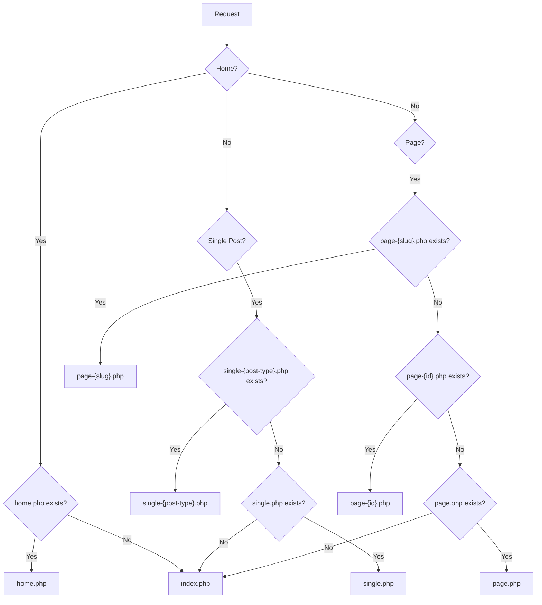

# WordPress Theme Structure

## Introduction

Every WordPress theme follows a specific structure that determines how content is displayed and how WordPress interacts with the theme files. Understanding this structure is fundamental for anyone looking to develop or customize WordPress themes.

In this tutorial, we'll explore the essential files and directories that make up a WordPress theme, the template hierarchy that WordPress follows to display content, and best practices for organizing your theme files. Whether you're creating a theme from scratch or modifying an existing one, this knowledge will help you build more efficient and maintainable WordPress themes.

## Essential Theme Files

Every WordPress theme requires at least two files to function:

1. `style.css` - Contains theme metadata and CSS styles
2. `index.php` - The main template file

Let's look at each of these in detail.

### style.css

The `style.css` file serves two purposes:
- It contains your theme's metadata in a comment block at the top
- It includes CSS styling for your theme

Here's an example of a properly formatted `style.css` file:

```css
/*
Theme Name: My Awesome Theme
Theme URI: https://example.com/my-awesome-theme
Author: Your Name
Author URI: https://example.com
Description: A clean, modern WordPress theme for beginners.
Version: 1.0
Requires at least: 5.0
Tested up to: 6.2
Requires PHP: 7.4
License: GNU General Public License v2 or later
License URI: http://www.gnu.org/licenses/gpl-2.0.html
Text Domain: my-awesome-theme
Tags: blog, one-column, custom-background, custom-colors, custom-logo, custom-menu
*/

/* CSS styles go here */
body {
  font-family: 'Arial', sans-serif;
  line-height: 1.6;
  color: #333;
}

/* More styles... */
```

### index.php

The `index.php` file is the main template file. WordPress will use this file if it can't find a more specific template file for the requested content. At minimum, it should include the WordPress Loop to display content.

```php
<?php get_header(); ?>

<main id="main" class="site-main">
  <?php
  if (have_posts()) :
    while (have_posts()) :
      the_post();
      ?>
      <article id="post-<?php the_ID(); ?>" <?php post_class(); ?>>
        <header class="entry-header">
          <h2 class="entry-title">
            <a href="<?php the_permalink(); ?>"><?php the_title(); ?></a>
          </h2>
        </header>

        <div class="entry-content">
          <?php the_excerpt(); ?>
        </div>

        <footer class="entry-footer">
          <span class="posted-on"><?php echo get_the_date(); ?></span>
        </footer>
      </article>
      <?php
    endwhile;
    
    // Pagination
    the_posts_pagination();
    
  else :
    ?>
    <p><?php esc_html_e('No posts found.', 'my-awesome-theme'); ?></p>
    <?php
  endif;
  ?>
</main>

<?php get_footer(); ?>
```

## Complete Theme Structure

A more comprehensive WordPress theme typically includes the following files and directories:

```
theme-name/
│
├── style.css              # Theme metadata and styles
├── index.php              # Main template file
├── functions.php          # Theme functions and features
├── header.php             # Header template
├── footer.php             # Footer template
├── sidebar.php            # Sidebar template
├── screenshot.png         # Theme thumbnail (880×660 px)
│
├── template-parts/        # Reusable template parts
│   ├── content.php        # Default content template
│   ├── content-page.php   # Page content template
│   └── content-single.php # Single post content template
│
├── inc/                   # Theme functionality
│   ├── customizer.php     # Theme customizer settings
│   └── template-tags.php  # Custom template tags
│
├── assets/                # Theme assets
│   ├── css/               # CSS files
│   ├── js/                # JavaScript files
│   ├── images/            # Theme images
│   └── fonts/             # Font files
│
└── languages/             # Translation files
```

Let's look at some of the other important files:

### functions.php

The `functions.php` file acts as a plugin specifically for your theme. It's where you add features and functionality specific to your theme.

```php
<?php
/**
 * My Awesome Theme functions and definitions
 */

// Theme setup
function my_awesome_theme_setup() {
    // Add theme support for various features
    add_theme_support('title-tag');
    add_theme_support('post-thumbnails');
    add_theme_support('automatic-feed-links');
    add_theme_support('html5', array(
        'search-form',
        'comment-form',
        'comment-list',
        'gallery',
        'caption',
    ));

    // Register navigation menus
    register_nav_menus(array(
        'primary' => esc_html__('Primary Menu', 'my-awesome-theme'),
        'footer' => esc_html__('Footer Menu', 'my-awesome-theme'),
    ));
}
add_action('after_setup_theme', 'my_awesome_theme_setup');

// Enqueue scripts and styles
function my_awesome_theme_scripts() {
    wp_enqueue_style('my-awesome-theme-style', get_stylesheet_uri(), array(), '1.0.0');
    wp_enqueue_script('my-awesome-theme-navigation', get_template_directory_uri() . '/assets/js/navigation.js', array(), '1.0.0', true);
}
add_action('wp_enqueue_scripts', 'my_awesome_theme_scripts');

// Register widget area
function my_awesome_theme_widgets_init() {
    register_sidebar(array(
        'name'          => esc_html__('Sidebar', 'my-awesome-theme'),
        'id'            => 'sidebar-1',
        'description'   => esc_html__('Add widgets here.', 'my-awesome-theme'),
        'before_widget' => '<section id="%1$s" class="widget %2$s">',
        'after_widget'  => '</section>',
        'before_title'  => '<h2 class="widget-title">',
        'after_title'   => '</h2>',
    ));
}
add_action('widgets_init', 'my_awesome_theme_widgets_init');
```

### header.php and footer.php

These files contain the HTML markup for the header and footer sections of your theme.

**header.php example:**

```php
<!DOCTYPE html>
<html <?php language_attributes(); ?>>
<head>
    <meta charset="<?php bloginfo('charset'); ?>">
    <meta name="viewport" content="width=device-width, initial-scale=1">
    <link rel="profile" href="https://gmpg.org/xfn/11">
    <?php wp_head(); ?>
</head>

<body <?php body_class(); ?>>
<?php wp_body_open(); ?>
<div id="page" class="site">
    <header id="masthead" class="site-header">
        <div class="site-branding">
            <?php
            if (has_custom_logo()) :
                the_custom_logo();
            else :
                ?>
                <h1 class="site-title"><a href="<?php echo esc_url(home_url('/')); ?>"><?php bloginfo('name'); ?></a></h1>
                <?php
                $description = get_bloginfo('description', 'display');
                if ($description) :
                    ?>
                    <p class="site-description"><?php echo $description; ?></p>
                <?php endif; ?>
            <?php endif; ?>
        </div>

        <nav id="site-navigation" class="main-navigation">
            <?php
            wp_nav_menu(array(
                'theme_location' => 'primary',
                'menu_id'        => 'primary-menu',
            ));
            ?>
        </nav>
    </header>
```

**footer.php example:**

```php
    <footer id="colophon" class="site-footer">
        <div class="site-info">
            <?php
            printf(
                esc_html__('© %d %s. All rights reserved.', 'my-awesome-theme'),
                date('Y'),
                get_bloginfo('name')
            );
            ?>
        </div>
        <?php
        wp_nav_menu(array(
            'theme_location' => 'footer',
            'menu_id'        => 'footer-menu',
            'depth'          => 1,
        ));
        ?>
    </footer>
</div><!-- #page -->

<?php wp_footer(); ?>
</body>
</html>
```

## WordPress Template Hierarchy

WordPress uses a template hierarchy to determine which template file to use for a given request. This allows you to create specific templates for different types of content.



Here's a simplified version of the WordPress template hierarchy:

1. **Front Page**: `front-page.php` → `home.php` → `index.php`
2. **Single Post**: `single-{post-type}-{slug}.php` → `single-{post-type}.php` → `single.php` → `index.php`
3. **Page**: `page-{slug}.php` → `page-{id}.php` → `page.php` → `index.php`
4. **Category Archive**: `category-{slug}.php` → `category-{id}.php` → `category.php` → `archive.php` → `index.php`
5. **Tag Archive**: `tag-{slug}.php` → `tag-{id}.php` → `tag.php` → `archive.php` → `index.php`
6. **Author Archive**: `author-{nicename}.php` → `author-{id}.php` → `author.php` → `archive.php` → `index.php`
7. **Date Archive**: `date.php` → `archive.php` → `index.php`
8. **Search Results**: `search.php` → `index.php`
9. **404 Not Found**: `404.php` → `index.php`

## Creating a Custom Page Template

You can create custom page templates that users can select when creating pages in WordPress. Here's how:

1. Create a new file in your theme directory, e.g., `template-full-width.php`.
2. Add the template information in a comment at the top:

```php
<?php
/**
 * Template Name: Full Width
 * Description: A full-width template with no sidebar
 */

get_header();
?>

<main id="main" class="site-main full-width">
    <?php
    while (have_posts()) :
        the_post();
        ?>
        <article id="post-<?php the_ID(); ?>" <?php post_class(); ?>>
            <header class="entry-header">
                <?php the_title('<h1 class="entry-title">', '</h1>'); ?>
            </header>

            <div class="entry-content">
                <?php
                the_content();
                
                wp_link_pages(array(
                    'before' => '<div class="page-links">' . esc_html__('Pages:', 'my-awesome-theme'),
                    'after'  => '</div>',
                ));
                ?>
            </div>
        </article>
        <?php
        // If comments are open or we have at least one comment, load up the comment template
        if (comments_open() || get_comments_number()) :
            comments_template();
        endif;
    endwhile;
    ?>
</main>

<?php
get_footer();
```

When creating or editing a page in WordPress, you can now select "Full Width" from the Page Attributes > Template dropdown.

## Child Themes

Child themes allow you to customize an existing theme without modifying its files directly. This ensures your customizations won't be lost when the parent theme is updated.

Here's how to create a child theme:

1. Create a new folder in your `wp-content/themes` directory, e.g., `my-theme-child`.
2. Create a `style.css` file with the proper theme headers:

```css
/*
Theme Name: My Theme Child
Template: my-theme
Description: A child theme of My Theme
Author: Your Name
Version: 1.0
*/

/* Import parent theme styles */
@import url("../my-theme/style.css");

/* Custom styles go here */
.site-header {
    background-color: #f5f5f5;
}
```

3. Create a `functions.php` file to add custom functionality:

```php
<?php
/**
 * My Theme Child functions and definitions
 */

// Enqueue parent and child theme stylesheets
function my_theme_child_enqueue_styles() {
    $parent_style = 'parent-style';
    
    wp_enqueue_style($parent_style, get_template_directory_uri() . '/style.css');
    wp_enqueue_style('child-style',
        get_stylesheet_directory_uri() . '/style.css',
        array($parent_style),
        wp_get_theme()->get('Version')
    );
}
add_action('wp_enqueue_scripts', 'my_theme_child_enqueue_styles');

// Add additional functionality here
```

## Best Practices for Theme Structure

1. **Follow the WordPress Coding Standards**: Maintain clean, well-documented code by following the [WordPress Coding Standards](https://developer.wordpress.org/coding-standards/).

2. **Use Template Parts**: Break your templates into reusable components with the `get_template_part()` function:

```php
<?php
// In single.php
get_template_part('template-parts/content', 'single');

// This will look for template-parts/content-single.php
// If not found, it falls back to template-parts/content.php
```

3. **Proper Function Prefixing**: Prefix all your functions with your theme name to avoid conflicts:

```php
function my_awesome_theme_custom_function() {
    // Function code
}
```

4. **Use Translation Functions**: Make your theme translation-ready:

```php
// Instead of:
echo "Read More";

// Use:
echo esc_html__('Read More', 'my-awesome-theme');
```

5. **Properly Enqueue Scripts and Styles**: Always use WordPress's enqueue functions rather than directly including them:

```php
function my_awesome_theme_scripts() {
    wp_enqueue_style('my-style', get_template_directory_uri() . '/assets/css/style.css');
    wp_enqueue_script('my-script', get_template_directory_uri() . '/assets/js/script.js', array('jquery'), '1.0.0', true);
}
add_action('wp_enqueue_scripts', 'my_awesome_theme_scripts');
```

6. **Organize Your Code**: Keep different aspects of your theme in separate files and directories for better maintainability.

## Summary

In this tutorial, we've explored the essential structure of WordPress themes, including:

- Required files: `style.css` and `index.php`
- Common theme files and their purpose
- The WordPress template hierarchy
- Creating custom page templates
- Child theme structure
- Best practices for theme organization

Understanding the WordPress theme structure is fundamental to creating well-organized, maintainable themes that follow WordPress standards. By following these principles, you'll be able to develop themes that are easy to maintain, update, and extend.

## Further Learning Resources

1. [WordPress Theme Developer Handbook](https://developer.wordpress.org/themes/)
2. [Template Hierarchy in Detail](https://developer.wordpress.org/themes/basics/template-hierarchy/)
3. [Theme Development Standards](https://developer.wordpress.org/themes/basics/theme-functions/)

## Exercises

1. **Create a Basic Theme**: Build a minimal WordPress theme with just `style.css` and `index.php`.
2. **Expand Your Theme**: Add `header.php`, `footer.php`, and `functions.php` to your theme.
3. **Create a Custom Template**: Add a custom page template that displays content in a different layout.
4. **Build a Child Theme**: Create a child theme based on Twenty Twenty-Three (or any other theme) and customize its appearance.
5. **Implement Template Parts**: Refactor your theme to use template parts for different types of content (posts, pages, etc.).