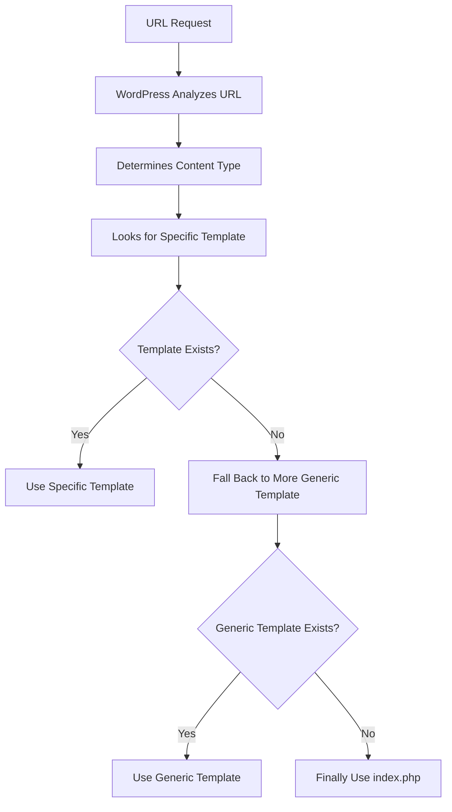
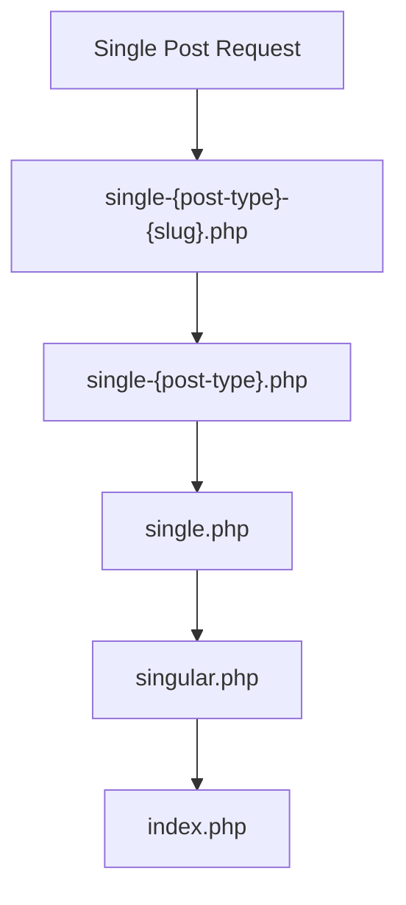
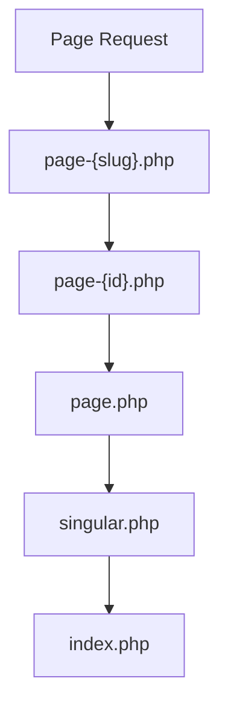
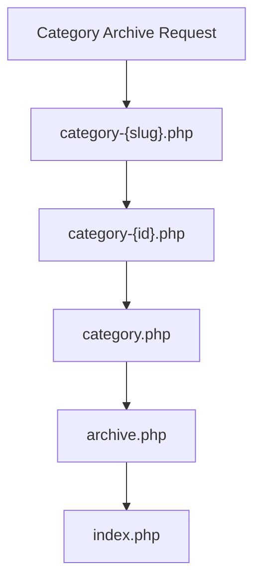

# WordPress Template Hierarchy

## Introduction

The WordPress Template Hierarchy is one of the most powerful and fundamental concepts in WordPress theme development. It's essentially a decision tree that WordPress follows to determine which template file to use when displaying different types of content. Understanding this hierarchy empowers you to create dynamic, flexible themes that respond appropriately to different content types and user requests.

When a visitor lands on your WordPress site, the system determines what content to display based on the URL. WordPress then looks for template files in your theme to render that content. The template hierarchy defines which files WordPress will look for, and in what order, to display the requested content.

## Why Template Hierarchy Matters

Before diving into the specifics, let's understand why this concept is crucial for theme developers:

1. **Flexibility**: You can create specific templates for different content types or use generic templates that handle multiple content types
2. **Customization**: You can override default templates with your own custom versions
3. **Organization**: It provides a structured approach to theme development
4. **Fallbacks**: WordPress has a sensible fallback system if specific templates are missing

## The Basic Template Hierarchy Flow

At its core, the template hierarchy follows this general pattern:



WordPress always starts by looking for the most specific template file for the current request. If that file doesn't exist, it "falls back" to more generic templates until it finds one that exists. If none of the specified templates exist, WordPress ultimately uses `index.php`, which must be present in every theme.

## Common Template Files

Here are some of the most commonly used template files in WordPress themes:

1. `index.php` - The main fallback template
2. `single.php` - For single posts
3. `page.php` - For individual pages
4. `archive.php` - For archive pages (categories, tags, etc.)
5. `search.php` - For search results
6. `404.php` - For "Not Found" pages
7. `home.php` - For the blog posts index
8. `front-page.php` - For the site's front page
9. `singular.php` - For single posts and pages (WordPress 4.3+)

## Detailed Template Hierarchy Examples

Let's look at some examples of how the template hierarchy works for different content types.

### Single Post Display

When a visitor views a single blog post, WordPress looks for templates in this order:



For example, for a post with the slug "hello-world" in the "post" post type:

1. `single-post-hello-world.php`
2. `single-post.php`
3. `single.php`
4. `singular.php`
5. `index.php`

### Page Display

For a WordPress page, the hierarchy looks like:



For a page titled "About Us" with an ID of 42 and slug "about-us":

1. `page-about-us.php`
2. `page-42.php`
3. `page.php`
4. `singular.php`
5. `index.php`

### Category Archive Display

For a category archive page:



## Creating Custom Template Files

Now, let's create some custom template files to leverage the WordPress template hierarchy.

### Creating a Custom Single Post Template

Create a file called `single.php` in your theme directory:

```php
<?php get_header(); ?>

<main id="main" class="site-main">
    <?php
    while ( have_posts() ) :
        the_post();
    ?>
        <article id="post-<?php the_ID(); ?>" <?php post_class(); ?>>
            <header class="entry-header">
                <?php the_title( '<h1 class="entry-title">', '</h1>' ); ?>
                <div class="entry-meta">
                    <?php echo 'Posted on ' . get_the_date(); ?>
                </div>
            </header>

            <div class="entry-content">
                <?php the_content(); ?>
            </div>

            <footer class="entry-footer">
                <?php
                    // Display categories and tags
                    $categories_list = get_the_category_list( ', ' );
                    if ( $categories_list ) {
                        echo '<span class="cat-links">Categories: ' . $categories_list . '</span>';
                    }
                    
                    $tags_list = get_the_tag_list( '', ', ' );
                    if ( $tags_list ) {
                        echo '<span class="tags-links"> Tags: ' . $tags_list . '</span>';
                    }
                ?>
            </footer>
            
            <?php comments_template(); ?>
        </article>
    <?php
    endwhile;
    ?>
</main>

<?php get_sidebar(); ?>
<?php get_footer(); ?>
```

### Creating a Custom Template for a Specific Category

If you want to create a custom template for posts in a category called "Tutorials" with a slug of "tutorials", create a file called `category-tutorials.php`:

```php
<?php get_header(); ?>

<main id="main" class="site-main">
    <header class="page-header">
        <h1 class="page-title">
            <?php single_cat_title( 'Tutorials: ' ); ?>
        </h1>
        <?php the_archive_description( '<div class="archive-description">', '</div>' ); ?>
    </header>

    <?php if ( have_posts() ) : ?>
        <div class="tutorials-grid">
            <?php while ( have_posts() ) : the_post(); ?>
                <div class="tutorial-card">
                    <?php if ( has_post_thumbnail() ) : ?>
                        <div class="tutorial-thumbnail">
                            <?php the_post_thumbnail( 'medium' ); ?>
                        </div>
                    <?php endif; ?>
                    
                    <div class="tutorial-content">
                        <h2><a href="<?php the_permalink(); ?>"><?php the_title(); ?></a></h2>
                        <div class="tutorial-excerpt">
                            <?php the_excerpt(); ?>
                        </div>
                        <a href="<?php the_permalink(); ?>" class="read-more-button">Read Tutorial</a>
                    </div>
                </div>
            <?php endwhile; ?>
        </div>
        
        <?php the_posts_pagination(); ?>
    <?php else : ?>
        <p>No tutorials found.</p>
    <?php endif; ?>
</main>

<?php get_sidebar(); ?>
<?php get_footer(); ?>
```

## Template Parts and Code Reuse

WordPress provides functions like `get_template_part()` to help you reuse code across multiple template files.

### Creating Reusable Content Blocks

Create a file called `template-parts/content.php`:

```php
<article id="post-<?php the_ID(); ?>" <?php post_class(); ?>>
    <header class="entry-header">
        <?php
        if ( is_singular() ) :
            the_title( '<h1 class="entry-title">', '</h1>' );
        else :
            the_title( '<h2 class="entry-title"><a href="' . esc_url( get_permalink() ) . '" rel="bookmark">', '</a></h2>' );
        endif;
        ?>
    </header>

    <?php if ( has_post_thumbnail() && !is_singular() ) : ?>
        <div class="post-thumbnail">
            <a href="<?php the_permalink(); ?>">
                <?php the_post_thumbnail( 'medium' ); ?>
            </a>
        </div>
    <?php endif; ?>

    <div class="entry-content">
        <?php
        if ( is_singular() ) :
            the_content();
        else :
            the_excerpt();
            echo '<a href="' . esc_url( get_permalink() ) . '" class="more-link">Continue reading &raquo;</a>';
        endif;
        ?>
    </div>
</article>
```

Then in your `index.php` or other templates, you can include this file:

```php
<?php get_header(); ?>

<main id="main" class="site-main">
    <?php
    if ( have_posts() ) :
        while ( have_posts() ) :
            the_post();
            get_template_part( 'template-parts/content' );
        endwhile;
        
        the_posts_pagination();
    else :
        echo '<p>No posts found.</p>';
    endif;
    ?>
</main>

<?php get_sidebar(); ?>
<?php get_footer(); ?>
```

### Using Template Parts for Different Post Formats

You can create specific template parts for different post formats and conditionally include them:

```php
<?php
// In index.php or archive.php
while ( have_posts() ) :
    the_post();
    
    // Get post format
    $format = get_post_format() ?: 'standard';
    
    // Include the template part for this format
    get_template_part( 'template-parts/content', $format );
endwhile;
?>
```

Then create files like `template-parts/content-video.php`, `template-parts/content-gallery.php`, etc.

## Template Hierarchy for Custom Post Types

WordPress extends the template hierarchy to support custom post types:

1. `single-{post_type}-{slug}.php` - For a specific custom post type post
2. `single-{post_type}.php` - For any post in that custom post type
3. `single.php` - For any single post
4. `singular.php` - For any single content
5. `index.php` - Fallback template

### Example: Custom Post Type Template

For a custom post type called "product":

```php
<?php
// File: single-product.php

get_header();
?>

<main id="main" class="site-main">
    <?php
    while ( have_posts() ) :
        the_post();
    ?>
        <article id="product-<?php the_ID(); ?>" <?php post_class(); ?>>
            <header class="product-header">
                <?php the_title( '<h1 class="product-title">', '</h1>' ); ?>
                
                <div class="product-meta">
                    <span class="product-price">
                        <?php echo get_post_meta( get_the_ID(), 'price', true ); ?>
                    </span>
                </div>
            </header>

            <?php if ( has_post_thumbnail() ) : ?>
                <div class="product-image">
                    <?php the_post_thumbnail( 'large' ); ?>
                </div>
            <?php endif; ?>
            
            <div class="product-content">
                <?php the_content(); ?>
            </div>
            
            <div class="product-features">
                <h3>Product Features</h3>
                <?php
                $features = get_post_meta( get_the_ID(), 'features', true );
                if ( $features ) :
                    echo '<ul>';
                    foreach ( explode( "\n", $features ) as $feature ) {
                        echo '<li>' . esc_html( $feature ) . '</li>';
                    }
                    echo '</ul>';
                endif;
                ?>
            </div>
        </article>
    <?php
    endwhile;
    ?>
</main>

<?php get_sidebar(); ?>
<?php get_footer(); ?>
```

## Template Hierarchy Filters

WordPress provides filters to customize the template hierarchy:

```php
/**
 * Modify single post template hierarchy
 */
function custom_single_template_hierarchy( $templates ) {
    $post = get_queried_object();
    
    // Add template based on post author
    if ( $post && isset( $post->post_author ) ) {
        $author = get_userdata( $post->post_author );
        if ( $author ) {
            array_splice( $templates, 1, 0, 'single-author-' . $author->user_nicename . '.php' );
        }
    }
    
    return $templates;
}
add_filter( 'single_template_hierarchy', 'custom_single_template_hierarchy' );
```

This code adds a new template option based on the post author's username, allowing you to create author-specific post templates.

## Using Page Templates

WordPress allows you to create custom page templates that can be selected from the page editor.

```php
<?php
/**
 * Template Name: Full Width Layout
 * Template Post Type: page, post
 */

get_header();
?>

<main id="main" class="site-main full-width">
    <?php
    while ( have_posts() ) :
        the_post();
        the_content();
    endwhile;
    ?>
</main>

<?php get_footer(); ?>
```

This template will appear in the "Template" dropdown in the WordPress page or post editor, allowing content creators to select it for specific content.

## Summary

The WordPress Template Hierarchy is a powerful system that gives theme developers precise control over how different content types are displayed. Understanding this concept allows you to:

1. Create highly customized layouts for different content types
2. Reuse code efficiently using template parts
3. Create special templates for specific posts, categories, authors, or custom post types
4. Provide fallback templates for a consistent user experience
5. Build flexible themes that can be easily extended

By leveraging the template hierarchy, you can create WordPress themes that are both robust and maintainable, providing a great user experience while keeping your code organized and DRY (Don't Repeat Yourself).

## Additional Resources

To further develop your understanding of the WordPress Template Hierarchy:

1. [WordPress Developer Documentation on Template Hierarchy](https://developer.wordpress.org/themes/basics/template-hierarchy/)
2. [WordPress Template Hierarchy Diagram](https://wphierarchy.com/) - A visual reference for template hierarchy
3. [WordPress Theme Developer Handbook](https://developer.wordpress.org/themes/)

## Practice Exercises

1. Create a custom template for a specific category in your theme
2. Build a template part that can be reused in multiple templates
3. Develop a custom page template with a unique layout
4. Create a post type specific template for a custom post type
5. Use template hierarchy filters to add custom template options based on post meta data

By practicing these exercises, you'll gain a deeper understanding of WordPress template hierarchy and how to leverage it in your theme development projects.