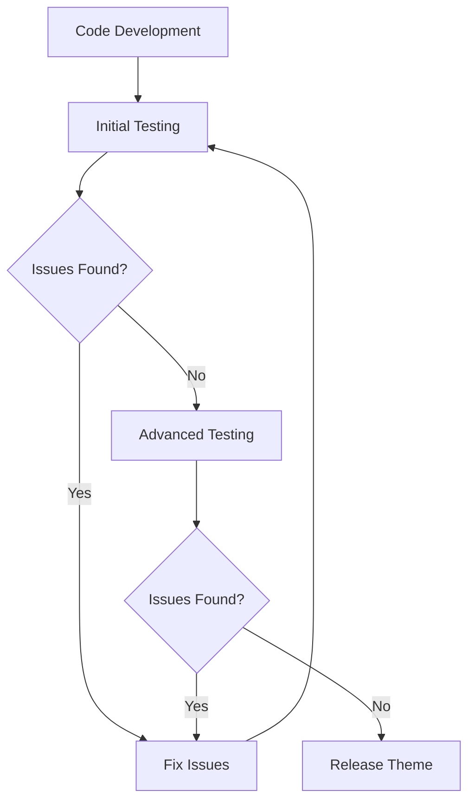

# WordPress Theme Testing

## Introduction

WordPress theme testing is a critical phase in theme development that ensures your theme functions properly, looks great across different devices, and provides a seamless user experience. In this guide, we'll explore comprehensive approaches to testing WordPress themes before releasing them to the public or submitting them to the WordPress theme directory.

Proper testing helps you:

- Identify and fix bugs before users encounter them
- Ensure compatibility across different browsers and devices
- Verify compliance with WordPress coding standards
- Optimize performance and user experience
- Build a reputation for quality and reliability

## Why Testing Matters

Even the most carefully coded WordPress theme can have unexpected issues when used in different environments or with various plugins. A systematic testing process protects your reputation as a developer and provides a better experience for your users.



## Setting Up a Test Environment

### Local Development Environment

Before testing your theme widely, set up a local development environment that mimics a typical WordPress installation.

#### Using Local Tools

Popular options include:

- **LocalWP**: Fast, easy local WordPress development
- **DevKinsta**: Local development tool by Kinsta
- **XAMPP/MAMP/WAMP**: Traditional local server setups

#### Example Setup with LocalWP

1. Download and install LocalWP
2. Create a new site
3. Install your theme
4. Add common plugins for testing compatibility

### Using WordPress Theme Unit Test Data

The WordPress Theme Unit Test is a standardized XML file containing a variety of content that helps test how your theme handles different content scenarios.

```bash
# Download the Theme Unit Test XML file
wget https://raw.githubusercontent.com/WPTT/theme-unit-test/master/themeunittestdata.wordpress.xml
```

To import the test data:

1. Go to Tools > Import in your WordPress dashboard
2. Select "WordPress" and install the importer if prompted
3. Upload the XML file and import the content

## Essential Testing Checklist

### 1. Functionality Testing

#### Core WordPress Features

Test how your theme handles:

```jsx
// Example of a theme function that might need testing
function mytheme_custom_header_setup() {
    $args = array(
        'default-image'      => get_template_directory_uri() . '/images/header.jpg',
        'width'              => 1000,
        'height'             => 250,
        'flex-width'         => true,
        'flex-height'        => true,
        'uploads'            => true,
        'random-default'     => false,
        'header-text'        => true,
        'default-text-color' => 'fff',
    );
    add_theme_support('custom-header', $args);
}
add_action('after_setup_theme', 'mytheme_custom_header_setup');
```

Test the following functionality:

- Custom headers and backgrounds
- Featured images
- Widgets and sidebars
- Navigation menus
- Post formats
- Comments
- Custom logo

#### Template Hierarchy

Verify that all template files work correctly:

- Single posts (`single.php`)
- Pages (`page.php`)
- Archives (`archive.php`)
- Category pages (`category.php`)
- Search results (`search.php`)
- 404 pages (`404.php`)
- Home page (`front-page.php`, `home.php`)

### 2. Visual Testing

#### Cross-Browser Testing

Test your theme in the following browsers:

- Chrome
- Firefox
- Safari
- Edge
- Mobile browsers (Chrome for Android, Safari for iOS)

#### Responsive Design

Check how your theme displays at different viewport sizes:

- Desktop (1920×1080, 1366×768)
- Tablet (768×1024)
- Mobile (375×667, 360×640)

Use developer tools to simulate different screen sizes:

```jsx
// Example of media query in your theme's CSS
@media only screen and (max-width: 768px) {
  .site-header {
    padding: 10px;
  }
  
  .main-navigation {
    display: none;
  }
  
  .mobile-menu-toggle {
    display: block;
  }
}
```

### 3. WordPress Standards Compliance

#### Theme Check Plugin

The Theme Check plugin ensures your theme complies with WordPress.org standards.

After installation:

1. Go to Appearance > Theme Check
2. Select your theme
3. Run the test
4. Review and fix any warnings or errors

#### Common Issues to Fix

```php
// BAD: Direct database queries
$results = $wpdb->get_results("SELECT * FROM $wpdb->posts WHERE post_type = 'post'");

// GOOD: Using WordPress functions
$results = get_posts(array('post_type' => 'post'));
```

```php
// BAD: Hardcoded paths
include('/home/user/public_html/wp-content/themes/my-theme/functions.php');

// GOOD: Using WordPress path functions
include(get_template_directory() . '/functions.php');
```

### 4. Performance Testing

#### Page Speed

Use tools like:

- Google PageSpeed Insights
- GTmetrix
- WebPageTest

Common performance optimizations:

```php
// Properly enqueue scripts with dependencies
function mytheme_enqueue_scripts() {
    wp_enqueue_style('mytheme-style', get_stylesheet_uri(), array(), '1.0.0');
    
    // Load jQuery from WordPress core
    wp_enqueue_script('jquery');
    
    // Add custom script with jQuery dependency
    wp_enqueue_script(
        'mytheme-script', 
        get_template_directory_uri() . '/js/script.min.js', 
        array('jquery'), 
        '1.0.0', 
        true // Load in footer
    );
}
add_action('wp_enqueue_scripts', 'mytheme_enqueue_scripts');
```

#### Loading Time

Optimize images and assets:

```php
// Add theme support for responsive images
add_theme_support('responsive-embeds');
add_theme_support('wp-block-styles');
add_theme_support('align-wide');
```

### 5. Accessibility Testing

#### WAVE Tool and Keyboard Navigation

Use the WAVE (Web Accessibility Evaluation Tool) browser extension to find accessibility issues.

Common accessibility requirements:

```html
<!-- BAD: Missing alt text -->


<!-- GOOD: Proper alt text -->

```

```html
<!-- BAD: Color contrast issues -->
<p style="color: #aaa; background-color: #fff;">Hard to read text</p>

<!-- GOOD: Sufficient contrast -->
<p style="color: #444; background-color: #fff;">Easy to read text</p>
```

## Automated Testing Tools

### Theme Unit Test

We covered Theme Unit Test earlier, but here's an example of what it helps test:

- Very long titles
- Posts with no title
- Sticky posts
- Posts with comments disabled
- Posts with threaded comments
- Password-protected posts
- Special formatting and content

### WordPress Coding Standards

Use PHP_CodeSniffer with WordPress Coding Standards to automatically check your code:

```bash
# Install PHP_CodeSniffer
composer global require squizlabs/php_codesniffer

# Install WordPress Coding Standards
git clone https://github.com/WordPress/WordPress-Coding-Standards.git wpcs
phpcs --config-set installed_paths /path/to/wpcs

# Run the check
phpcs --standard=WordPress your-theme-directory/
```

## Plugin Compatibility Testing

### Essential Plugins to Test With

Test your theme with popular plugins like:

1. WooCommerce
2. Contact Form 7
3. Yoast SEO
4. Elementor/Gutenberg
5. WP Super Cache or other caching plugins

### Testing Process

1. Install each plugin individually
2. Test basic functionality
3. Check for visual conflicts
4. Test with multiple plugins activated simultaneously

## Real-world Examples

### Example 1: Testing Theme Customizer Options

```php
// Example theme customizer code to test
function mytheme_customize_register($wp_customize) {
    $wp_customize->add_section('mytheme_colors', array(
        'title' => __('Theme Colors', 'mytheme'),
        'priority' => 30,
    ));
    
    $wp_customize->add_setting('header_color', array(
        'default' => '#ffffff',
        'transport' => 'refresh',
        'sanitize_callback' => 'sanitize_hex_color',
    ));
    
    $wp_customize->add_control(new WP_Customize_Color_Control($wp_customize, 'header_color', array(
        'label' => __('Header Color', 'mytheme'),
        'section' => 'mytheme_colors',
        'settings' => 'header_color',
    )));
}
add_action('customize_register', 'mytheme_customize_register');
```

**Test Cases:**
1. Check if color picker displays correctly
2. Verify color changes apply in real-time with 'transport' => 'refresh'
3. Test with 'transport' => 'postMessage' for JavaScript-based instant preview
4. Confirm that default values work correctly

### Example 2: Navigation Menu Testing

Test how your theme handles different menu scenarios:

1. No menu assigned
2. Menu with multiple levels of dropdown
3. Menu with many items causing wrapping
4. Menu with custom links, category links, and page links

```php
// Example of registering menu locations to test
function mytheme_register_menus() {
    register_nav_menus(array(
        'primary' => __('Primary Menu', 'mytheme'),
        'footer' => __('Footer Menu', 'mytheme'),
        'social' => __('Social Links Menu', 'mytheme'),
    ));
}
add_action('init', 'mytheme_register_menus');
```

### Example 3: Content Layout Testing

Test how your theme handles different content layouts:

```html
<!-- Test very wide images -->
<figure class="wp-block-image alignfull">
    
</figure>

<!-- Test content with no images -->
<p>Lorem ipsum dolor sit amet, consectetur adipiscing elit. Nullam auctor, 
nisl eget ultricies tincidunt, nisl nisl aliquam nisl, eget ultricies nisl 
nisl eget nisl. Nullam auctor, nisl eget ultricies tincidunt, nisl nisl 
aliquam nisl, eget ultricies nisl nisl eget nisl.</p>

<!-- Test content with many short paragraphs -->
<p>Short paragraph 1.</p>
<p>Short paragraph 2.</p>
<p>Short paragraph 3.</p>
```

## Debugging Common Issues

### CSS Conflicts

When you find CSS conflicts, use browser developer tools to identify the source:

1. Inspect the element with issues
2. Check which CSS rules are being applied and from which files
3. Use more specific selectors in your theme to override plugin styles

```css
/* More specific selectors to override plugin styles */
body.theme-mytheme .plugin-class {
    background-color: transparent !important;
}
```

### JavaScript Errors

Use the browser console to identify JavaScript errors:

```javascript
// Safer jQuery usage with noConflict mode
(function($) {
    // Your code here
    $(document).ready(function() {
        $('.menu-toggle').on('click', function(e) {
            e.preventDefault();
            $('.main-navigation').toggleClass('toggled');
        });
    });
})(jQuery);
```

## User Testing

After technical testing, gather feedback from real users:

1. Create a testing group or beta testers
2. Provide specific tasks for testers to complete
3. Ask for screenshots from different devices
4. Collect feedback systematically using forms or surveys

## Theme Documentation and Support

Prepare documentation that helps users test your theme:

1. Installation instructions
2. Required and recommended plugins
3. Setup of demo content
4. Customization options
5. FAQs and troubleshooting guides

## Summary

Comprehensive WordPress theme testing is essential for delivering a quality product. By systematically testing functionality, appearance, compatibility, performance, and accessibility, you can ensure your theme provides an excellent user experience across different scenarios.

Remember that testing is not a one-time task but should be repeated throughout the development process and after any significant updates. A well-tested theme reduces support requests and builds trust with your users.

## Additional Resources

- **WordPress Theme Review Requirements**: The official guidelines for themes submitted to the WordPress.org theme directory
- **Theme Check Plugin**: https://wordpress.org/plugins/theme-check/
- **WordPress Coding Standards**: https://developer.wordpress.org/coding-standards/
- **WordPress Theme Unit Test Data**: https://github.com/WPTT/theme-unit-test

## Exercises

1. Set up a local development environment with the Theme Unit Test data
2. Run the Theme Check plugin on your theme and fix any issues
3. Test your theme with a popular page builder plugin and document any conflicts
4. Create a checklist for your specific theme's features that need testing
5. Perform accessibility testing and make necessary improvements

By following these testing procedures, you'll create more robust, user-friendly WordPress themes that stand out in the marketplace and provide value to your users.