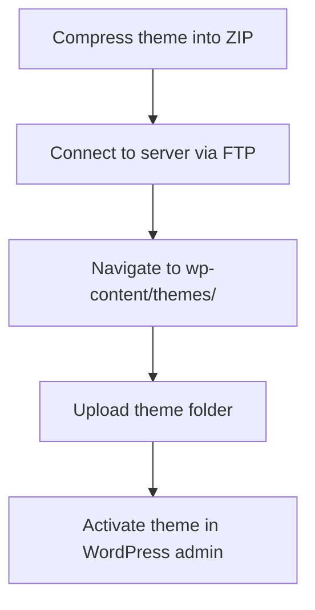

# WordPress Theme Deployment

After spending hours designing and developing your custom WordPress theme, it's time to deploy it to a live site. Proper deployment ensures your theme works correctly in a production environment and delivers the best performance for end users.

## Introduction to WordPress Theme Deployment

Theme deployment is the process of taking your locally developed WordPress theme and making it available on a live WordPress site. This involves several steps, from preparing your theme files to optimizing them for production and finally transferring them to your web server.

In this guide, we'll cover:
- Preparing your theme for deployment
- Various deployment methods
- Best practices for deployment
- Post-deployment testing and maintenance

## Preparing Your Theme for Production

Before deploying your theme, you need to ensure it's ready for a production environment.

### 1. Theme Optimization

#### Minify CSS and JavaScript

Minifying your CSS and JavaScript files reduces file size by removing unnecessary characters like whitespace and comments.

```js
// Before minification
function toggleMobileMenu() {
    // This function toggles the mobile menu visibility
    const mobileMenu = document.getElementById('mobile-menu');
    mobileMenu.classList.toggle('active');
}

// After minification
function toggleMobileMenu(){const mobileMenu=document.getElementById('mobile-menu');mobileMenu.classList.toggle('active')}
```

You can use tools like Gulp or Webpack to automate this process in your development workflow.

#### Optimize Images

Large images can significantly slow down your site. Compress all images in your theme using tools like TinyPNG or ImageOptim.

### 2. Theme Testing

Before deployment, test your theme thoroughly:

- Check for PHP errors and warnings
- Ensure responsive design works across devices
- Validate HTML and CSS
- Test with popular plugins
- Verify browser compatibility

### 3. Create a Theme Package

Organize your theme files according to WordPress standards:

```
my-theme/
├── style.css           # Main stylesheet with theme information
├── index.php           # Main template file
├── functions.php       # Theme functions
├── header.php          # Header template
├── footer.php          # Footer template
├── screenshot.png      # Theme thumbnail (1200×900px recommended)
├── assets/             # CSS, JS, images, etc.
│   ├── css/
│   ├── js/
│   └── images/
└── template-parts/     # Reusable template parts
```

Update your theme's version number in `style.css`:

```css
/*
Theme Name: My Custom Theme
Theme URI: https://example.com/my-theme
Author: Your Name
Author URI: https://example.com
Description: A custom WordPress theme
Version: 1.0.0
License: GNU General Public License v2 or later
License URI: http://www.gnu.org/licenses/gpl-2.0.html
Text Domain: my-theme
*/
```

## Deployment Methods

There are several ways to deploy your WordPress theme to a live site.

### 1. Manual Deployment via FTP

FTP (File Transfer Protocol) is the most straightforward method for beginners.

#### Step-by-Step FTP Deployment:

1. **Compress your theme folder** into a ZIP file
2. **Connect to your server** using an FTP client like FileZilla or Cyberduck
3. **Navigate to** `wp-content/themes/` on your server
4. **Upload your theme folder** to this directory



#### Through WordPress Admin:

Alternatively, you can upload through the WordPress dashboard:

1. Navigate to **Appearance > Themes**
2. Click **Add New**
3. Click **Upload Theme**
4. Choose your theme ZIP file
5. Click **Install Now**
6. Click **Activate** once installed

### 2. Git-Based Deployment

For more advanced developers, Git offers a more efficient workflow.

#### Using Git for Deployment:

1. **Initialize Git** in your theme folder:

```bash
cd my-theme
git init
git add .
git commit -m "Initial theme commit"
```

2. **Connect to a repository** (GitHub, Bitbucket, etc.):

```bash
git remote add origin https://github.com/username/my-theme.git
git push -u origin main
```

3. **Deploy using Git** on your server:

```bash
# On your server
cd wp-content/themes/
git clone https://github.com/username/my-theme.git
```

For automated deployments, consider services like DeployHQ or tools like Capistrano.

### 3. Using WP-CLI

WordPress Command Line Interface (WP-CLI) offers a powerful way to manage WordPress from the command line.

```bash
# Install your theme from a ZIP file
wp theme install path/to/my-theme.zip --activate

# Update an existing theme
wp theme update my-theme
```

## Best Practices for Theme Deployment

### Version Control

Always use version control for your theme development. It helps track changes and facilitates easier deployments.

```bash
# Create a new branch for changes
git checkout -b feature/new-header-design

# After testing, merge back to main branch
git checkout main
git merge feature/new-header-design
git push origin main
```

### Environment Configuration

Use different configurations for development and production environments:

```php
// functions.php
function my_theme_scripts() {
    // In development, use unminified versions with source maps
    if (defined('WP_DEBUG') && WP_DEBUG) {
        wp_enqueue_style('my-theme-style', get_template_directory_uri() . '/assets/css/style.css', [], '1.0.0');
        wp_enqueue_script('my-theme-script', get_template_directory_uri() . '/assets/js/main.js', ['jquery'], '1.0.0', true);
    } 
    // In production, use minified versions
    else {
        wp_enqueue_style('my-theme-style', get_template_directory_uri() . '/assets/css/style.min.css', [], '1.0.0');
        wp_enqueue_script('my-theme-script', get_template_directory_uri() . '/assets/js/main.min.js', ['jquery'], '1.0.0', true);
    }
}
add_action('wp_enqueue_scripts', 'my_theme_scripts');
```

### Deployment Checklist

Create a deployment checklist to ensure you don't miss crucial steps:

- Update theme version number
- Minify CSS/JS files
- Remove development comments/code
- Optimize images
- Test on staging server
- Check for PHP errors
- Verify theme meets WordPress standards
- Back up the existing site before deployment

## Post-Deployment Tasks

After deploying your theme, perform these essential tasks:

### 1. Activate Your Theme

Navigate to **Appearance > Themes** in the WordPress admin and activate your theme.

### 2. Configure Theme Settings

Set up any theme options, menus, widgets, and customizer settings.

### 3. Testing in Production

Even after thorough development testing, always verify these aspects in production:

- Page load speed (using tools like Google PageSpeed Insights)
- Cross-browser compatibility
- Mobile responsiveness
- Forms and interactive elements
- Plugin compatibility

### 4. Monitoring and Maintenance

Set up monitoring for your site to detect issues early:

```php
// Add this to functions.php for basic error logging
function my_theme_error_logging() {
    if (defined('WP_DEBUG') && WP_DEBUG) {
        error_reporting(E_ALL);
        ini_set('display_errors', 1);
        ini_set('log_errors', 1);
        ini_set('error_log', get_template_directory() . '/theme-errors.log');
    }
}
add_action('after_setup_theme', 'my_theme_error_logging');
```

## Real-World Deployment Example

Let's walk through a complete deployment scenario for a client website:

### Scenario: E-commerce Site Theme Deployment

**Client Requirements:**
- Custom WooCommerce theme
- Fast loading speed
- Mobile-first design

**Deployment Steps:**

1. **Prepare the theme:**

```php
// Optimize WooCommerce for production in functions.php
function my_theme_woocommerce_optimization() {
    // Only load WooCommerce styles on WooCommerce pages
    if (!is_woocommerce() && !is_cart() && !is_checkout()) {
        wp_dequeue_style('woocommerce-general');
        wp_dequeue_style('woocommerce-layout');
        wp_dequeue_style('woocommerce-smallscreen');
    }
}
add_action('wp_enqueue_scripts', 'my_theme_woocommerce_optimization', 99);
```

2. **Create deployment package:**
   - Minify all CSS/JS files
   - Compile and optimize SASS files
   - Set caching headers for static assets

3. **Staging deployment:**
   - Deploy to staging site
   - Test checkout process
   - Verify responsive design
   - Run performance tests

4. **Production deployment:**
   - Schedule deployment during low-traffic hours
   - Back up the live site
   - Deploy using Git or SFTP
   - Implement CDN for static assets
   
5. **Post-deployment:**
   - Clear cache
   - Test critical user flows
   - Enable monitoring
   - Document theme structure for client

## Common Deployment Issues and Solutions

| Issue | Solution |
|-------|----------|
| Missing files | Compare local and server directories with FTP sync tool |
| Style issues after deployment | Clear browser and server caches |
| Plugin conflicts | Test theme with plugins before deployment |
| 500 server errors | Check PHP version compatibility and error logs |
| Slow loading | Implement proper caching and optimize assets |

## Summary

WordPress theme deployment is the critical final step in your theme development process. By following best practices for preparation, transfer, and post-deployment verification, you can ensure your theme provides an optimal user experience and maintains performance in a production environment.

Whether you choose FTP, Git, or other deployment methods, the key is to establish a consistent, repeatable workflow that includes thorough testing and optimization.

## Additional Resources and Exercises

### Resources

- [WordPress Theme Developer Handbook](https://developer.wordpress.org/themes/)
- [WordPress Coding Standards](https://developer.wordpress.org/coding-standards/)
- [WP-CLI Documentation](https://wp-cli.org/)

### Exercises

1. **Practice Exercise:** Create a deployment checklist for your next theme project.

2. **Automation Challenge:** Set up a basic deployment automation script using Git hooks or a tool like GitHub Actions.

3. **Testing Framework:** Implement a simple testing routine that checks for common theme issues before deployment.

4. **Version Control Practice:** Create a branching strategy for your theme development that separates features, bugfixes, and releases.

By mastering theme deployment, you'll ensure that all your hard work in theme development translates into a successful, high-performing WordPress site.