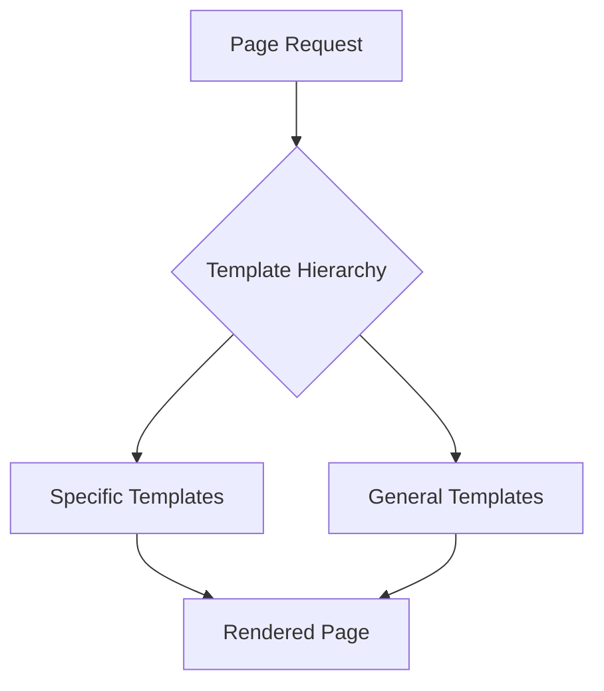
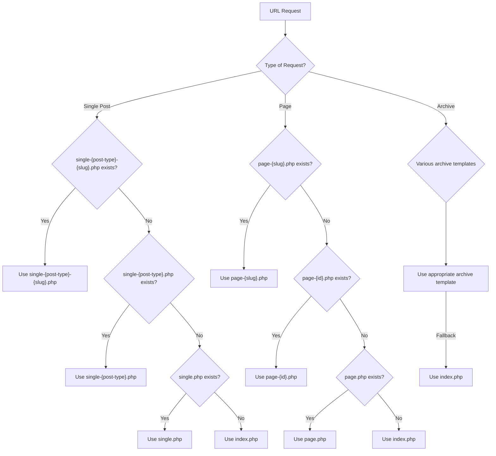

# WordPress Template Files

## Introduction

WordPress themes are made up of template files that control how different parts of your website look and function. These PHP files work together to generate the HTML that's sent to the browser. Understanding template files is crucial for WordPress theme development because they determine how your content is displayed across various parts of your site.

In this guide, we'll explore WordPress template files in depth, learning what they are, how they work, and how to create your own.

## What Are WordPress Template Files?

Template files are PHP files that contain a mixture of HTML, PHP, WordPress template tags, and functions. Each template file serves a specific purpose in displaying content on different parts of your website.

WordPress follows a template hierarchy system that determines which template file to use for a specific page request. This system allows for both general and specific template files, providing flexibility in your theme design.



## Core Template Files

Here are the essential template files that most WordPress themes include:

### 1. `index.php`

The most important template file in a WordPress theme. It's the fallback template when WordPress can't find a more specific template file.

```php
<?php get_header(); ?>

<div id="primary" class="content-area">
    <main id="main" class="site-main">
        <?php
        if (have_posts()) :
            while (have_posts()) : the_post();
                get_template_part('template-parts/content', get_post_format());
            endwhile;
            
            the_posts_pagination();
        else :
            get_template_part('template-parts/content', 'none');
        endif;
        ?>
    </main>
</div>

<?php get_sidebar(); ?>
<?php get_footer(); ?>
```

### 2. `header.php`

Contains the opening HTML, `<head>` section, and typically the site header and navigation menus.

```php
<!DOCTYPE html>
<html <?php language_attributes(); ?>>
<head>
    <meta charset="<?php bloginfo('charset'); ?>">
    <meta name="viewport" content="width=device-width, initial-scale=1">
    <?php wp_head(); ?>
</head>

<body <?php body_class(); ?>>
<?php wp_body_open(); ?>

<header id="masthead" class="site-header">
    <div class="site-branding">
        <?php the_custom_logo(); ?>
        <h1 class="site-title">
            <a href="<?php echo esc_url(home_url('/')); ?>">
                <?php bloginfo('name'); ?>
            </a>
        </h1>
    </div>

    <nav id="site-navigation" class="main-navigation">
        <?php
        wp_nav_menu([
            'theme_location' => 'primary',
            'menu_id'        => 'primary-menu',
        ]);
        ?>
    </nav>
</header>
```

### 3. `footer.php`

Contains the footer content and closing HTML tags.

```php
    <footer id="colophon" class="site-footer">
        <div class="site-info">
            &copy; <?php echo date('Y'); ?> <?php bloginfo('name'); ?>
        </div>
    </footer>

    <?php wp_footer(); ?>
</body>
</html>
```

### 4. `sidebar.php`

Contains the sidebar content, typically used for widgets.

```php
<aside id="secondary" class="widget-area">
    <?php if (is_active_sidebar('sidebar-1')) : ?>
        <?php dynamic_sidebar('sidebar-1'); ?>
    <?php else : ?>
        <!-- Fallback content if no widgets are activated -->
        <div class="widget">
            <h2 class="widget-title">Default Sidebar</h2>
            <p>Add widgets to the sidebar from the WordPress admin area.</p>
        </div>
    <?php endif; ?>
</aside>
```

### 5. `single.php`

Displays a single post.

```php
<?php get_header(); ?>

<div id="primary" class="content-area">
    <main id="main" class="site-main">
        <?php
        while (have_posts()) :
            the_post();
            ?>
            
            <article id="post-<?php the_ID(); ?>" <?php post_class(); ?>>
                <header class="entry-header">
                    <?php the_title('<h1 class="entry-title">', '</h1>'); ?>
                    
                    <div class="entry-meta">
                        <?php
                        printf(
                            'Posted on %s by %s',
                            get_the_date(),
                            get_the_author()
                        );
                        ?>
                    </div>
                </header>

                <div class="entry-content">
                    <?php the_content(); ?>
                </div>

                <footer class="entry-footer">
                    <?php
                    // Display categories, tags, etc.
                    $categories_list = get_the_category_list(', ');
                    if ($categories_list) {
                        echo '<span class="cat-links">Categories: ' . $categories_list . '</span>';
                    }
                    
                    $tags_list = get_the_tag_list('', ', ');
                    if ($tags_list) {
                        echo '<span class="tags-links">Tags: ' . $tags_list . '</span>';
                    }
                    ?>
                </footer>
            </article>
            
            <?php
            // If comments are open or there's at least one comment
            if (comments_open() || get_comments_number()) :
                comments_template();
            endif;
            
        endwhile;
        ?>
    </main>
</div>

<?php get_sidebar(); ?>
<?php get_footer(); ?>
```

### 6. `page.php`

Displays a static page.

```php
<?php get_header(); ?>

<div id="primary" class="content-area">
    <main id="main" class="site-main">
        <?php
        while (have_posts()) :
            the_post();
            ?>
            
            <article id="page-<?php the_ID(); ?>" <?php post_class(); ?>>
                <header class="entry-header">
                    <?php the_title('<h1 class="entry-title">', '</h1>'); ?>
                </header>

                <div class="entry-content">
                    <?php the_content(); ?>
                </div>
            </article>
            
        <?php endwhile; ?>
    </main>
</div>

<?php get_sidebar(); ?>
<?php get_footer(); ?>
```

### 7. `archive.php`

Displays archive pages, including category, tag, author, and date-based archives.

```php
<?php get_header(); ?>

<div id="primary" class="content-area">
    <main id="main" class="site-main">
        
        <?php if (have_posts()) : ?>
            <header class="page-header">
                <?php
                the_archive_title('<h1 class="page-title">', '</h1>');
                the_archive_description('<div class="archive-description">', '</div>');
                ?>
            </header>

            <?php
            while (have_posts()) :
                the_post();
                get_template_part('template-parts/content', 'archive');
            endwhile;

            the_posts_pagination();
        else :
            get_template_part('template-parts/content', 'none');
        endif;
        ?>
        
    </main>
</div>

<?php get_sidebar(); ?>
<?php get_footer(); ?>
```

## Template Hierarchy

WordPress follows a specific hierarchy when choosing which template file to use. This allows for both general and specific template files.

Here's a simplified view of the template hierarchy:



This hierarchy provides flexibility for theme developers to create specific templates for different types of content.

## Template Parts

WordPress themes often use template parts to make code more modular and reusable. Template parts are small chunks of code that can be reused across multiple template files.

Here's how to use the `get_template_part()` function:

```php
<?php get_template_part('template-parts/content', 'single'); ?>
```

This looks for `template-parts/content-single.php`. If that doesn't exist, it falls back to `template-parts/content.php`.

## Creating Custom Template Files

Let's create a custom template for a portfolio page:

1. First, create a file named `template-portfolio.php` in your theme folder:

```php
<?php
/**
 * Template Name: Portfolio
 *
 * @package YourThemeName
 */

get_header();
?>

<div id="primary" class="content-area">
    <main id="main" class="site-main portfolio-page">
        
        <header class="entry-header">
            <?php the_title('<h1 class="entry-title">', '</h1>'); ?>
        </header>
        
        <div class="entry-content">
            <?php the_content(); ?>
        </div>

        <div class="portfolio-items">
            <?php
            $portfolio_query = new WP_Query([
                'post_type' => 'portfolio',
                'posts_per_page' => -1,
            ]);

            if ($portfolio_query->have_posts()) :
                while ($portfolio_query->have_posts()) :
                    $portfolio_query->the_post();
                    ?>
                    <div class="portfolio-item">
                        <?php if (has_post_thumbnail()) : ?>
                            <div class="portfolio-thumbnail">
                                <?php the_post_thumbnail('medium'); ?>
                            </div>
                        <?php endif; ?>
                        
                        <h2 class="portfolio-title">
                            <a href="<?php the_permalink(); ?>"><?php the_title(); ?></a>
                        </h2>
                        
                        <div class="portfolio-excerpt">
                            <?php the_excerpt(); ?>
                        </div>
                    </div>
                <?php
                endwhile;
                wp_reset_postdata();
            else :
                echo '<p>No portfolio items found.</p>';
            endif;
            ?>
        </div>
    </main>
</div>

<?php
get_sidebar();
get_footer();
```

2. To use this template, create a page in WordPress and select "Portfolio" from the Template dropdown in the Page Attributes section.

## Custom Post Type Templates

WordPress allows you to create custom templates for specific post types. For example, if you have a "Portfolio" custom post type, you can create `single-portfolio.php` to control how single portfolio items are displayed:

```php
<?php
/**
 * The template for displaying single portfolio items
 *
 * @package YourThemeName
 */

get_header();
?>

<div id="primary" class="content-area">
    <main id="main" class="site-main single-portfolio">
        
        <?php while (have_posts()) : the_post(); ?>
            
            <article id="post-<?php the_ID(); ?>" <?php post_class(); ?>>
                <header class="entry-header">
                    <?php the_title('<h1 class="entry-title">', '</h1>'); ?>
                    
                    <?php if (has_post_thumbnail()) : ?>
                        <div class="portfolio-featured-image">
                            <?php the_post_thumbnail('large'); ?>
                        </div>
                    <?php endif; ?>
                </header>

                <div class="entry-content">
                    <?php the_content(); ?>
                </div>

                <footer class="entry-footer">
                    <?php
                    // Display portfolio categories if they exist
                    $terms = get_the_terms(get_the_ID(), 'portfolio_category');
                    if ($terms && !is_wp_error($terms)) :
                        echo '<div class="portfolio-categories">';
                        echo '<span>Categories: </span>';
                        $term_links = [];
                        foreach ($terms as $term) {
                            $term_links[] = '<a href="' . esc_url(get_term_link($term)) . '">' . $term->name . '</a>';
                        }
                        echo implode(', ', $term_links);
                        echo '</div>';
                    endif;
                    ?>
                    
                    <div class="portfolio-navigation">
                        <?php
                        $prev_post = get_previous_post();
                        $next_post = get_next_post();
                        
                        if ($prev_post) :
                            echo '<div class="nav-previous">';
                            echo '<a href="' . get_permalink($prev_post) . '">&larr; Previous Project</a>';
                            echo '</div>';
                        endif;
                        
                        if ($next_post) :
                            echo '<div class="nav-next">';
                            echo '<a href="' . get_permalink($next_post) . '">Next Project &rarr;</a>';
                            echo '</div>';
                        endif;
                        ?>
                    </div>
                </footer>
            </article>
            
        <?php endwhile; ?>
        
    </main>
</div>

<?php
get_sidebar();
get_footer();
```

## Real-world Application: Building a Blog Theme

Let's put everything together to build a simple blog theme structure:

### File Structure

```
mytheme/
├── style.css
├── functions.php
├── index.php
├── header.php
├── footer.php
├── sidebar.php
├── single.php
├── page.php
├── archive.php
├── search.php
├── 404.php
└── template-parts/
    ├── content.php
    ├── content-single.php
    ├── content-page.php
    └── content-search.php
```

### Using Template Parts

In your `index.php`:

```php
<?php get_header(); ?>

<div id="primary" class="content-area">
    <main id="main" class="site-main">
        <?php
        if (have_posts()) :
            while (have_posts()) :
                the_post();
                // Load different content templates based on post type
                get_template_part('template-parts/content', get_post_type());
            endwhile;
            
            the_posts_pagination();
        else :
            get_template_part('template-parts/content', 'none');
        endif;
        ?>
    </main>
</div>

<?php 
get_sidebar();
get_footer();
```

And in `template-parts/content.php`:

```php
<article id="post-<?php the_ID(); ?>" <?php post_class(); ?>>
    <header class="entry-header">
        <?php
        if (is_singular()) :
            the_title('<h1 class="entry-title">', '</h1>');
        else :
            the_title('<h2 class="entry-title"><a href="' . esc_url(get_permalink()) . '" rel="bookmark">', '</a></h2>');
        endif;

        if ('post' === get_post_type()) :
            ?>
            <div class="entry-meta">
                <?php
                printf(
                    'Posted on %s by %s',
                    '<a href="' . esc_url(get_permalink()) . '">' . get_the_date() . '</a>',
                    '<a href="' . esc_url(get_author_posts_url(get_the_author_meta('ID'))) . '">' . get_the_author() . '</a>'
                );
                ?>
            </div>
        <?php endif; ?>
    </header>

    <?php if (has_post_thumbnail() && !is_singular()) : ?>
        <div class="post-thumbnail">
            <a href="<?php the_permalink(); ?>">
                <?php the_post_thumbnail('medium'); ?>
            </a>
        </div>
    <?php endif; ?>

    <div class="entry-content">
        <?php
        if (is_singular()) :
            the_content();
        else :
            the_excerpt();
            ?>
            <a href="<?php the_permalink(); ?>" class="read-more">
                Continue reading 
                <span class="screen-reader-text"><?php the_title(); ?></span>
            </a>
        <?php endif; ?>
    </div>

    <footer class="entry-footer">
        <?php
        if ('post' === get_post_type()) :
            $categories_list = get_the_category_list(', ');
            if ($categories_list) :
                echo '<span class="cat-links">Posted in ' . $categories_list . '</span>';
            endif;

            $tags_list = get_the_tag_list('', ', ');
            if ($tags_list) :
                echo '<span class="tags-links">Tagged ' . $tags_list . '</span>';
            endif;
        endif;
        ?>
    </footer>
</article>
```

## Advanced Template Features

### Conditional Tags

WordPress provides conditional tags to check what type of page is being displayed:

```php
<?php
if (is_front_page()) {
    echo 'This is the front page';
} elseif (is_home()) {
    echo 'This is the blog page';
} elseif (is_single()) {
    echo 'This is a single post';
} elseif (is_page()) {
    echo 'This is a static page';
} elseif (is_archive()) {
    echo 'This is an archive page';
} elseif (is_search()) {
    echo 'This is a search results page';
} elseif (is_404()) {
    echo 'This is a 404 error page';
}
?>
```

### Template Functions

WordPress provides many functions to help with template development:

```php
<?php
// Display the site title
bloginfo('name');

// Display the site description
bloginfo('description');

// Display the site URL
echo home_url();

// Display the WordPress version
bloginfo('version');

// Get the template directory URL
echo get_template_directory_uri();

// Get the stylesheet directory URL
echo get_stylesheet_directory_uri();
?>
```

## Summary

WordPress template files are the building blocks of theme development. They control how your content is displayed across different parts of your website. Understanding the template hierarchy is crucial for creating flexible themes that can handle various content types.

Key takeaways:

1. WordPress uses a template hierarchy to determine which template file to use for a particular page request.
2. Core template files include `index.php`, `header.php`, `footer.php`, `sidebar.php`, `single.php`, `page.php`, and `archive.php`.
3. `get_template_part()` allows you to create modular, reusable template components.
4. Custom templates can be created for specific post types, pages, or other content.
5. Conditional tags help you determine what type of page is being displayed.

## Further Resources

To continue learning about WordPress template files:

1. Explore the [WordPress Template Hierarchy](https://developer.wordpress.org/themes/basics/template-hierarchy/) in the official WordPress developer documentation.
2. Study the [Template Tags](https://developer.wordpress.org/themes/basics/template-tags/) used in WordPress theme development.
3. Analyze popular WordPress themes like Twenty Twenty-One to understand how they use template files.

## Exercises

1. Create a basic theme with `index.php`, `header.php`, `footer.php`, and `sidebar.php`.
2. Build a custom page template that displays content in a two-column layout.
3. Create a custom template part for displaying featured posts.
4. Build a category-specific template (e.g., `category-news.php`) that displays posts differently from other categories.
5. Create a custom author template (`author.php`) to display author information and their posts.

By mastering template files, you'll be able to create sophisticated WordPress themes that provide the exact layout and functionality your projects require.