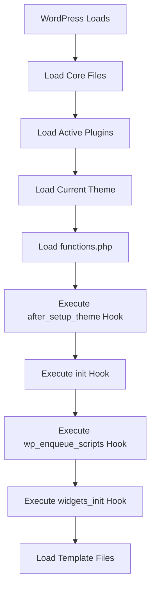

# WordPress Functions.php

## Introduction

The `functions.php` file is one of the most powerful components of a WordPress theme. Think of it as your theme's control center—a place where you can add functionality, customize WordPress behavior, and integrate with WordPress core features. Unlike other template files that primarily focus on displaying content, the `functions.php` file works behind the scenes to enhance your theme's capabilities.

In this comprehensive guide, we'll explore what the `functions.php` file is, how it works, and how you can leverage it to create powerful, customized WordPress themes.

## What is the functions.php File?

The `functions.php` file is a special PHP file included in WordPress themes that automatically loads during the WordPress initialization process. It essentially serves as a plugin specific to your theme, allowing you to:

- Register and enqueue stylesheets and JavaScript files
- Create custom post types and taxonomies
- Add theme support for various WordPress features
- Register widget areas and navigation menus
- Define theme-specific functions
- Modify WordPress behavior through hooks and filters

The file is located in the root directory of your theme, alongside other theme files like `header.php`, `footer.php`, and `style.css`.

## Basic Structure of functions.php

Let's start with a simple example of a `functions.php` file:

```php
<?php
/**
 * Theme functions and definitions
 *
 * @package MyAwesomeTheme
 */

// Theme setup function
function myawesometheme_setup() {
    // Add default posts and comments RSS feed links to head
    add_theme_support('automatic-feed-links');
    
    // Let WordPress manage the document title
    add_theme_support('title-tag');
    
    // Enable support for Post Thumbnails on posts and pages
    add_theme_support('post-thumbnails');
}
add_action('after_setup_theme', 'myawesometheme_setup');

// Enqueue scripts and styles
function myawesometheme_scripts() {
    wp_enqueue_style('myawesometheme-style', get_stylesheet_uri());
    wp_enqueue_script('myawesometheme-navigation', get_template_directory_uri() . '/js/navigation.js', array(), '20151215', true);
}
add_action('wp_enqueue_scripts', 'myawesometheme_scripts');
```

This basic structure sets up essential theme features and enqueues the theme's stylesheets and scripts.

## Key Concepts in functions.php

### 1. WordPress Hooks - Actions and Filters

The WordPress hook system allows you to "hook" your custom code to specific points in WordPress execution. There are two types of hooks:

#### Actions

Actions allow you to add custom functionality at specific points in WordPress execution.

```php
// Action hook syntax
add_action('hook_name', 'your_function_name', priority, accepted_args);

// Example: Add custom footer text
function custom_footer_text() {
    echo '<p>This site is powered by my awesome theme.</p>';
}
add_action('wp_footer', 'custom_footer_text');
```

#### Filters

Filters allow you to modify data before it's displayed or saved.

```php
// Filter hook syntax
add_filter('hook_name', 'your_function_name', priority, accepted_args);

// Example: Modify the excerpt length
function custom_excerpt_length($length) {
    return 30; // Changes excerpt length to 30 words
}
add_filter('excerpt_length', 'custom_excerpt_length');
```

### 2. Enqueuing Styles and Scripts

WordPress provides a proper way to include JavaScript and CSS files using the `wp_enqueue_script()` and `wp_enqueue_style()` functions:

```php
function theme_enqueue_assets() {
    // Enqueue CSS
    wp_enqueue_style(
        'main-style',                                      // Handle
        get_template_directory_uri() . '/css/style.css',  // Source
        array(),                                          // Dependencies
        '1.0.0'                                           // Version
    );
    
    // Enqueue JavaScript
    wp_enqueue_script(
        'main-script',                                     // Handle
        get_template_directory_uri() . '/js/script.js',   // Source
        array('jquery'),                                  // Dependencies
        '1.0.0',                                          // Version
        true                                             // Load in footer
    );
    
    // Add localized data to script
    wp_localize_script(
        'main-script',
        'themeData',
        array(
            'ajaxUrl' => admin_url('admin-ajax.php'),
            'nonce' => wp_create_nonce('theme-nonce')
        )
    );
}
add_action('wp_enqueue_scripts', 'theme_enqueue_assets');
```

### 3. Theme Support

WordPress offers various built-in features that themes can opt into:

```php
function theme_setup() {
    // Add theme support for various features
    add_theme_support('title-tag');               // Let WordPress handle the title tag
    add_theme_support('post-thumbnails');         // Enable featured images
    add_theme_support('automatic-feed-links');    // Add RSS feed links
    add_theme_support('html5', array(             // Use HTML5 markup
        'search-form',
        'comment-form',
        'comment-list',
        'gallery',
        'caption',
    ));
    add_theme_support('custom-logo', array(       // Add custom logo support
        'height'      => 100,
        'width'       => 400,
        'flex-height' => true,
        'flex-width'  => true,
    ));
    
    // Add theme support for post formats
    add_theme_support('post-formats', array(
        'aside', 'image', 'video', 'quote', 'link', 'gallery', 'audio'
    ));
}
add_action('after_setup_theme', 'theme_setup');
```

### 4. Navigation Menus

Register navigation menus to allow users to create and manage menus from the WordPress admin:

```php
function register_theme_menus() {
    register_nav_menus(array(
        'primary' => __('Primary Menu', 'theme-domain'),
        'footer'  => __('Footer Menu', 'theme-domain'),
        'social'  => __('Social Links', 'theme-domain'),
    ));
}
add_action('after_setup_theme', 'register_theme_menus');
```

Later, you can display these menus in your template files:

```php
<?php
if (has_nav_menu('primary')) {
    wp_nav_menu(array(
        'theme_location' => 'primary',
        'container'      => 'nav',
        'container_class'=> 'main-navigation',
        'menu_class'     => 'nav-menu',
        'depth'          => 2,
    ));
}
?>
```

### 5. Widget Areas (Sidebars)

Register widget areas to allow users to add and manage widgets:

```php
function theme_widgets_init() {
    register_sidebar(array(
        'name'          => __('Main Sidebar', 'theme-domain'),
        'id'            => 'sidebar-1',
        'description'   => __('Add widgets here to appear in the main sidebar.', 'theme-domain'),
        'before_widget' => '<div id="%1$s" class="widget %2$s">',
        'after_widget'  => '</div>',
        'before_title'  => '<h2 class="widget-title">',
        'after_title'   => '</h2>',
    ));
    
    register_sidebar(array(
        'name'          => __('Footer Widget Area', 'theme-domain'),
        'id'            => 'footer-widgets',
        'description'   => __('Appears in the footer section of the site.', 'theme-domain'),
        'before_widget' => '<div id="%1$s" class="widget %2$s">',
        'after_widget'  => '</div>',
        'before_title'  => '<h3 class="widget-title">',
        'after_title'   => '</h3>',
    ));
}
add_action('widgets_init', 'theme_widgets_init');
```

To display these widget areas in your templates:

```php
<?php if (is_active_sidebar('sidebar-1')) : ?>
    <aside id="secondary" class="widget-area">
        <?php dynamic_sidebar('sidebar-1'); ?>
    </aside>
<?php endif; ?>
```

## Real-World Examples

### Example 1: Creating a Custom Post Type

```php
function create_portfolio_post_type() {
    register_post_type('portfolio',
        array(
            'labels' => array(
                'name'               => __('Portfolio Items', 'theme-domain'),
                'singular_name'      => __('Portfolio Item', 'theme-domain'),
                'add_new'            => __('Add New', 'theme-domain'),
                'add_new_item'       => __('Add New Portfolio Item', 'theme-domain'),
                'edit_item'          => __('Edit Portfolio Item', 'theme-domain'),
                'view_item'          => __('View Portfolio Item', 'theme-domain'),
                'search_items'       => __('Search Portfolio Items', 'theme-domain'),
                'not_found'          => __('No portfolio items found', 'theme-domain'),
                'not_found_in_trash' => __('No portfolio items found in Trash', 'theme-domain')
            ),
            'public'        => true,
            'has_archive'   => true,
            'menu_icon'     => 'dashicons-format-gallery',
            'menu_position' => 5,
            'supports'      => array('title', 'editor', 'thumbnail', 'excerpt'),
            'rewrite'       => array('slug' => 'portfolio'),
            'show_in_rest'  => true, // Enable Gutenberg editor
        )
    );
    
    // Add taxonomy for portfolio categories
    register_taxonomy('portfolio_category', 'portfolio', array(
        'label'        => __('Portfolio Categories', 'theme-domain'),
        'hierarchical' => true,
        'show_in_rest' => true,
    ));
}
add_action('init', 'create_portfolio_post_type');
```

### Example 2: Adding Custom Shortcodes

```php
function button_shortcode($atts, $content = null) {
    // Extract and define default values for shortcode attributes
    $attributes = shortcode_atts(array(
        'url'   => '#',
        'color' => 'blue',
        'size'  => 'medium',
        'class' => '',
    ), $atts);
    
    // Build the button HTML
    $html = sprintf(
        '<a href="%1$s" class="btn btn-%2$s btn-%3$s %4$s">%5$s</a>',
        esc_url($attributes['url']),
        esc_attr($attributes['color']),
        esc_attr($attributes['size']),
        esc_attr($attributes['class']),
        esc_html($content)
    );
    
    return $html;
}
add_shortcode('button', 'button_shortcode');
```

Usage in WordPress content:

```
[button url="https://example.com" color="red" size="large"]Click Me![/button]
```

Output:
```html
<a href="https://example.com" class="btn btn-red btn-large">Click Me!</a>
```

### Example 3: Creating a Custom Comments Template

```php
function better_comment_template($comment, $args, $depth) {
    $GLOBALS['comment'] = $comment; ?>
    
    <li <?php comment_class(); ?> id="comment-<?php comment_ID(); ?>">
        <article class="comment-body">
            <footer class="comment-meta">
                <div class="comment-author vcard">
                    <?php echo get_avatar($comment, 60); ?>
                    <?php printf('<cite class="fn">%s</cite>', get_comment_author_link()); ?>
                </div>
                
                <div class="comment-metadata">
                    <time datetime="<?php comment_time('c'); ?>">
                        <?php printf(_x('%1$s at %2$s', '1: date, 2: time', 'theme-domain'), get_comment_date(), get_comment_time()); ?>
                    </time>
                    <?php edit_comment_link(__('Edit', 'theme-domain'), '<span class="edit-link">', '</span>'); ?>
                </div>
                
                <?php if ('0' == $comment->comment_approved) : ?>
                    <p class="comment-awaiting-moderation"><?php _e('Your comment is awaiting moderation.', 'theme-domain'); ?></p>
                <?php endif; ?>
            </footer>
            
            <div class="comment-content">
                <?php comment_text(); ?>
            </div>
            
            <div class="reply">
                <?php comment_reply_link(array_merge($args, array(
                    'add_below' => 'div-comment',
                    'depth'     => $depth,
                    'max_depth' => $args['max_depth'],
                    'before'    => '<span class="reply-link">',
                    'after'     => '</span>',
                ))); ?>
            </div>
        </article>
<?php
    // No need to close the </li> tag, WordPress does this automatically
}
```

To use this custom comment template:

```php
<?php
wp_list_comments(array(
    'style'       => 'ol',
    'short_ping'  => true,
    'avatar_size' => 60,
    'callback'    => 'better_comment_template',
));
?>
```

## Best Practices for functions.php

### 1. Namespace Your Functions

Avoid conflicts with plugins and WordPress core by prefixing your function names with your theme name:

```php
// Good
function mytheme_custom_function() {
    // Function code
}

// Bad
function custom_function() {
    // This could conflict with plugins or other themes
}
```

### 2. Check If Functions Exist

When defining functions that might be defined elsewhere, use function_exists():

```php
if (!function_exists('mytheme_custom_function')) {
    function mytheme_custom_function() {
        // Function code
    }
}
```

### 3. Use Child Themes for Customization

Instead of directly modifying your parent theme's functions.php, create a child theme:

```php
<?php
// In child theme's functions.php
function child_theme_enqueue_styles() {
    $parent_style = 'parent-style';
    
    wp_enqueue_style($parent_style, get_template_directory_uri() . '/style.css');
    wp_enqueue_style('child-style',
        get_stylesheet_directory_uri() . '/style.css',
        array($parent_style),
        wp_get_theme()->get('Version')
    );
}
add_action('wp_enqueue_scripts', 'child_theme_enqueue_styles');
```

### 4. Organize Your Code

For larger themes, consider using an include system to organize your functions.php file:

```php
<?php
// Main functions.php file
require_once get_template_directory() . '/inc/theme-setup.php';
require_once get_template_directory() . '/inc/enqueue-assets.php';
require_once get_template_directory() . '/inc/custom-post-types.php';
require_once get_template_directory() . '/inc/widgets.php';
require_once get_template_directory() . '/inc/template-functions.php';
require_once get_template_directory() . '/inc/customizer.php';
```

### 5. Security Considerations

Always validate and sanitize user input:

```php
// Bad
function unsafe_form_handler() {
    $name = $_POST['name']; // Unsanitized direct input
    update_option('user_name', $name);
}

// Good
function safe_form_handler() {
    // Check for nonce
    if (!isset($_POST['my_nonce']) || !wp_verify_nonce($_POST['my_nonce'], 'my_action')) {
        wp_die('Security check failed');
    }
    
    // Sanitize input
    $name = isset($_POST['name']) ? sanitize_text_field($_POST['name']) : '';
    update_option('user_name', $name);
}
```

## Common Mistakes to Avoid

1. **Direct Database Queries**: Use WordPress functions instead of direct SQL queries when possible.
2. **Hardcoding Paths**: Use WordPress functions like `get_template_directory()` instead of hardcoded paths.
3. **Overriding Core Functionality**: Modify core functionality using hooks rather than overriding it directly.
4. **Not Checking Permissions**: Always verify user capabilities before performing privileged actions.
5. **Ignoring WordPress Coding Standards**: Follow the [WordPress Coding Standards](https://developer.wordpress.org/coding-standards/wordpress-coding-standards/) for consistent, maintainable code.

## Workflow Diagram



## Summary

The `functions.php` file is a central component of WordPress theme development that allows you to:

- Add features and functionality to your theme
- Customize WordPress behavior through hooks and filters
- Register scripts, styles, navigation menus, and widget areas
- Create custom post types and taxonomies
- Define theme-specific functions

By understanding how to effectively use the `functions.php` file, you can create powerful, feature-rich WordPress themes that provide an excellent user experience.

## Additional Resources

For further learning about WordPress theme development and the functions.php file:

1. [WordPress Theme Developer Handbook](https://developer.wordpress.org/themes/)
2. [WordPress Code Reference](https://developer.wordpress.org/reference/)
3. [WordPress Hooks Reference](https://developer.wordpress.org/reference/hooks/)
4. [WordPress Best Practices](https://developer.wordpress.org/themes/best-practices/)

## Exercises

1. Create a custom shortcode that displays a responsive image gallery from a folder of images.
2. Implement a custom widget that displays the most recent posts from a specific category.
3. Create a function that adds a custom meta box to the post edit screen for entering additional information.
4. Build a simple theme options page using the WordPress Settings API.
5. Create a custom pagination function that replaces the default WordPress pagination.

By diving into these exercises, you'll gain practical experience working with the `functions.php` file and enhance your WordPress theme development skills.