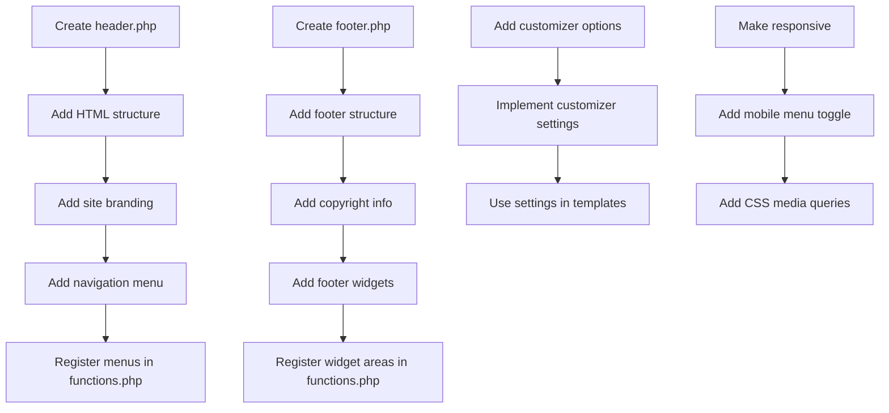

# WordPress Header and Footer

Headers and footers are critical components of any WordPress theme. They provide consistent structure, navigation, branding, and essential information across your entire website. In this comprehensive guide, we'll explore how to develop custom header and footer templates for WordPress themes.

## Introduction to WordPress Headers and Footers

In WordPress theme development, headers typically contain the site's logo, primary navigation menu, search functionality, and often social media links. Footers usually include copyright information, secondary navigation, contact details, and widgets.

WordPress uses specific template files for these components:
- `header.php` - Contains the top portion of your website
- `footer.php` - Contains the bottom portion of your website

These files are included in other template files using WordPress template tags:
- `get_header()` - Includes the header.php file
- `get_footer()` - Includes the footer.php file

## Basic Header Structure

Let's start by creating a basic `header.php` template:

```php
<!DOCTYPE html>
<html <?php language_attributes(); ?>>
<head>
    <meta charset="<?php bloginfo('charset'); ?>">
    <meta name="viewport" content="width=device-width, initial-scale=1">
    <?php wp_head(); ?>
</head>

<body <?php body_class(); ?>>
<?php wp_body_open(); ?>
    <header id="masthead" class="site-header">
        <div class="container">
            <div class="site-branding">
                <?php
                if (has_custom_logo()) {
                    the_custom_logo();
                } else {
                    ?>
                    <h1 class="site-title">
                        <a href="<?php echo esc_url(home_url('/')); ?>">
                            <?php bloginfo('name'); ?>
                        </a>
                    </h1>
                    <p class="site-description"><?php bloginfo('description'); ?></p>
                    <?php
                }
                ?>
            </div><!-- .site-branding -->

            <nav id="site-navigation" class="main-navigation">
                <?php
                wp_nav_menu(array(
                    'theme_location' => 'primary',
                    'menu_id'        => 'primary-menu',
                ));
                ?>
            </nav><!-- #site-navigation -->
        </div><!-- .container -->
    </header><!-- #masthead -->

    <div id="content" class="site-content">
```

### Key Components of the Header Template

1. **Document Type and HTML Tag**: The template starts with the DOCTYPE declaration and HTML tag with `language_attributes()` function that outputs language attributes for the HTML tag.

2. **Head Section**: Contains meta information, character set, viewport settings, and the `wp_head()` function that hooks into WordPress and allows plugins to add their scripts, styles, and other functionality.

3. **Body Tag**: Uses `body_class()` to add important classes to the body element based on the current page.

4. **wp_body_open()**: A hook introduced in WordPress 5.2 that allows plugins to output content right after the body tag opens.

5. **Site Branding**: Displays either the custom logo (if set) or the site title and description.

6. **Navigation Menu**: Displays the primary navigation menu using `wp_nav_menu()`.

## Basic Footer Structure

Now let's create a basic `footer.php` template:

```php
    </div><!-- #content -->

    <footer id="colophon" class="site-footer">
        <div class="container">
            <div class="site-info">
                <span class="copyright">
                    © <?php echo date('Y'); ?> <?php bloginfo('name'); ?>
                </span>
                
                <nav class="footer-navigation">
                    <?php
                    wp_nav_menu(array(
                        'theme_location' => 'footer',
                        'menu_id'        => 'footer-menu',
                        'depth'          => 1,
                    ));
                    ?>
                </nav><!-- .footer-navigation -->
            </div><!-- .site-info -->
            
            <div class="footer-widgets">
                <?php if (is_active_sidebar('footer-1')) : ?>
                    <div class="footer-widget-area">
                        <?php dynamic_sidebar('footer-1'); ?>
                    </div>
                <?php endif; ?>
            </div><!-- .footer-widgets -->
        </div><!-- .container -->
    </footer><!-- #colophon -->
</body>
<?php wp_footer(); ?>
</html>
```

### Key Components of the Footer Template

1. **Closing Content Div**: Closes the content div that was opened in the header.

2. **Footer Container**: Contains all footer elements.

3. **Site Info**: Displays copyright information and the site name.

4. **Footer Navigation**: A secondary navigation menu for the footer.

5. **Footer Widgets**: An area to display widgets in the footer.

6. **wp_footer()**: Essential WordPress hook that allows plugins to add their scripts and functionality at the end of the page.

7. **Closing HTML Tags**: Closes the body and HTML tags.

## Registering Navigation Menus

To make the navigation menus work in both header and footer, you need to register them in your theme's `functions.php` file:

```php
function mytheme_register_menus() {
    register_nav_menus(array(
        'primary' => __('Primary Menu', 'mytheme'),
        'footer'  => __('Footer Menu', 'mytheme'),
    ));
}
add_action('after_setup_theme', 'mytheme_register_menus');
```

## Registering Widget Areas

For the footer widget area, add this code to your `functions.php`:

```php
function mytheme_widgets_init() {
    register_sidebar(array(
        'name'          => __('Footer Widget Area', 'mytheme'),
        'id'            => 'footer-1',
        'description'   => __('Add widgets here to appear in your footer.', 'mytheme'),
        'before_widget' => '<section id="%1$s" class="widget %2$s">',
        'after_widget'  => '</section>',
        'before_title'  => '<h2 class="widget-title">',
        'after_title'   => '</h2>',
    ));
}
add_action('widgets_init', 'mytheme_widgets_init');
```

## Advanced Header Features

Let's enhance our header with additional features:

### Adding a Search Form

```php
<div class="header-search">
    <?php get_search_form(); ?>
</div>
```

### Mobile Menu Toggle Button

```php
<button class="menu-toggle" aria-controls="primary-menu" aria-expanded="false">
    <span class="menu-toggle-icon"></span>
    <span class="screen-reader-text"><?php _e('Menu', 'mytheme'); ?></span>
</button>
```

### Sticky Header with JavaScript

Add this JavaScript to your theme's JS file:

```javascript
document.addEventListener('DOMContentLoaded', function() {
    const header = document.getElementById('masthead');
    const headerHeight = header.offsetHeight;
    
    window.addEventListener('scroll', function() {
        if (window.pageYOffset > headerHeight) {
            header.classList.add('sticky');
        } else {
            header.classList.remove('sticky');
        }
    });
});
```

With corresponding CSS:

```css
.sticky {
    position: fixed;
    top: 0;
    width: 100%;
    z-index: 100;
    box-shadow: 0 2px 5px rgba(0,0,0,0.1);
    animation: slideDown 0.3s ease;
}

@keyframes slideDown {
    from {
        transform: translateY(-100%);
    }
    to {
        transform: translateY(0);
    }
}
```

## Advanced Footer Features

### Back to Top Button

Add this to your footer:

```php
<a href="#" id="back-to-top" title="<?php _e('Back to top', 'mytheme'); ?>">
    <span class="screen-reader-text"><?php _e('Back to top', 'mytheme'); ?></span>
    <span class="back-to-top-icon">↑</span>
</a>
```

With JavaScript:

```javascript
document.addEventListener('DOMContentLoaded', function() {
    const backToTopButton = document.getElementById('back-to-top');
    
    window.addEventListener('scroll', function() {
        if (window.pageYOffset > 300) {
            backToTopButton.style.display = 'block';
        } else {
            backToTopButton.style.display = 'none';
        }
    });
    
    backToTopButton.addEventListener('click', function(e) {
        e.preventDefault();
        window.scrollTo({ top: 0, behavior: 'smooth' });
    });
});
```

### Multi-Column Footer Widgets

Update your footer widget registration:

```php
function mytheme_widgets_init() {
    register_sidebar(array(
        'name'          => __('Footer Widget Area 1', 'mytheme'),
        'id'            => 'footer-1',
        'description'   => __('First footer column', 'mytheme'),
        'before_widget' => '<section id="%1$s" class="widget %2$s">',
        'after_widget'  => '</section>',
        'before_title'  => '<h2 class="widget-title">',
        'after_title'   => '</h2>',
    ));
    
    register_sidebar(array(
        'name'          => __('Footer Widget Area 2', 'mytheme'),
        'id'            => 'footer-2',
        'description'   => __('Second footer column', 'mytheme'),
        'before_widget' => '<section id="%1$s" class="widget %2$s">',
        'after_widget'  => '</section>',
        'before_title'  => '<h2 class="widget-title">',
        'after_title'   => '</h2>',
    ));
    
    register_sidebar(array(
        'name'          => __('Footer Widget Area 3', 'mytheme'),
        'id'            => 'footer-3',
        'description'   => __('Third footer column', 'mytheme'),
        'before_widget' => '<section id="%1$s" class="widget %2$s">',
        'after_widget'  => '</section>',
        'before_title'  => '<h2 class="widget-title">',
        'after_title'   => '</h2>',
    ));
}
add_action('widgets_init', 'mytheme_widgets_init');
```

And update your `footer.php`:

```php
<div class="footer-widgets">
    <div class="container">
        <div class="footer-widgets-grid">
            <?php if (is_active_sidebar('footer-1')) : ?>
                <div class="footer-widget-area">
                    <?php dynamic_sidebar('footer-1'); ?>
                </div>
            <?php endif; ?>
            
            <?php if (is_active_sidebar('footer-2')) : ?>
                <div class="footer-widget-area">
                    <?php dynamic_sidebar('footer-2'); ?>
                </div>
            <?php endif; ?>
            
            <?php if (is_active_sidebar('footer-3')) : ?>
                <div class="footer-widget-area">
                    <?php dynamic_sidebar('footer-3'); ?>
                </div>
            <?php endif; ?>
        </div>
    </div>
</div>
```

## Alternative Header and Footer Templates

WordPress allows you to create multiple header and footer templates for different purposes:

### Multiple Header Templates

Create additional header files like `header-landing.php`:

```php
<!DOCTYPE html>
<html <?php language_attributes(); ?>>
<head>
    <meta charset="<?php bloginfo('charset'); ?>">
    <meta name="viewport" content="width=device-width, initial-scale=1">
    <?php wp_head(); ?>
</head>

<body <?php body_class(); ?>>
<?php wp_body_open(); ?>
    <header id="masthead" class="site-header landing-header">
        <!-- Simplified header for landing pages -->
        <div class="container">
            <div class="site-branding">
                <?php the_custom_logo(); ?>
            </div>
        </div>
    </header>

    <div id="content" class="site-content">
```

Then use it in your landing page template:

```php
<?php get_header('landing'); ?>
<!-- Landing page content here -->
<?php get_footer('landing'); ?>
```

## Responsive Header and Footer

Make your header and footer responsive with CSS media queries:

```css
@media screen and (max-width: 768px) {
    .main-navigation {
        display: none;
    }
    
    .menu-toggle {
        display: block;
    }
    
    .menu-active .main-navigation {
        display: block;
        position: absolute;
        top: 100%;
        left: 0;
        width: 100%;
        background: #fff;
        z-index: 100;
    }
    
    .main-navigation ul {
        flex-direction: column;
    }
    
    .footer-widgets-grid {
        grid-template-columns: 1fr;
    }
}
```

## Header and Footer Hooks

WordPress provides hooks that allow you to add content to the header and footer without modifying the template files directly:

```php
function mytheme_add_header_content() {
    if (is_front_page()) {
        echo '<div class="header-announcement">Welcome to our website!</div>';
    }
}
add_action('wp_body_open', 'mytheme_add_header_content');

function mytheme_add_footer_content() {
    echo '<div class="cookie-notice">This site uses cookies. <button class="accept-cookies">Accept</button></div>';
}
add_action('wp_footer', 'mytheme_add_footer_content', 20);
```

## Theme Customizer Integration

Enable header and footer customization through the WordPress Customizer:

```php
function mytheme_customizer_settings($wp_customize) {
    // Add section for header options
    $wp_customize->add_section('header_options', array(
        'title'    => __('Header Options', 'mytheme'),
        'priority' => 30,
    ));
    
    // Add setting for sticky header
    $wp_customize->add_setting('sticky_header', array(
        'default'           => true,
        'sanitize_callback' => 'mytheme_sanitize_checkbox',
    ));
    
    $wp_customize->add_control('sticky_header', array(
        'label'    => __('Enable sticky header', 'mytheme'),
        'section'  => 'header_options',
        'type'     => 'checkbox',
    ));
    
    // Add footer copyright text
    $wp_customize->add_section('footer_options', array(
        'title'    => __('Footer Options', 'mytheme'),
        'priority' => 90,
    ));
    
    $wp_customize->add_setting('footer_copyright', array(
        'default'           => '© ' . date('Y') . ' ' . get_bloginfo('name'),
        'sanitize_callback' => 'sanitize_text_field',
    ));
    
    $wp_customize->add_control('footer_copyright', array(
        'label'    => __('Copyright Text', 'mytheme'),
        'section'  => 'footer_options',
        'type'     => 'text',
    ));
}
add_action('customize_register', 'mytheme_customizer_settings');

// Sanitization function
function mytheme_sanitize_checkbox($input) {
    return ( isset($input) && true == $input ) ? true : false;
}
```

Then use the settings in your templates:

```php
// In header.php
if (get_theme_mod('sticky_header', true)) {
    $header_class = 'site-header sticky-enabled';
} else {
    $header_class = 'site-header';
}
echo '<header id="masthead" class="' . esc_attr($header_class) . '">';

// In footer.php
echo '<div class="copyright">';
echo wp_kses_post(get_theme_mod('footer_copyright', '© ' . date('Y') . ' ' . get_bloginfo('name')));
echo '</div>';
```

## Workflow Diagram for Header and Footer Development



## Common Header and Footer Mistakes to Avoid

1. **Forgetting `wp_head()` or `wp_footer()`**: These functions are essential for plugins and WordPress core to work properly.

2. **Not making menus and widgets dynamic**: Hard-coding elements instead of using WordPress functions.

3. **Poor mobile responsiveness**: Not accounting for different screen sizes.

4. **Heavy headers**: Adding too many elements that slow down page load time.

5. **Inconsistent branding**: Header and footer should maintain consistent branding across the site.

## Summary

Headers and footers are foundational components of WordPress theme development. A well-structured header.php and footer.php provide consistency across your WordPress site while allowing for customization and responsiveness.

In this guide, we've covered:
- Basic structure of header.php and footer.php
- How to register and display navigation menus
- Adding widget areas to the footer
- Advanced features like sticky headers and back-to-top buttons
- Creating alternative templates for different page types
- Making headers and footers responsive
- Integrating with the WordPress Customizer

By following these guidelines, you can create professional, functional, and user-friendly headers and footers for your WordPress themes.

## Additional Resources

- [WordPress Template Hierarchy](https://developer.wordpress.org/themes/basics/template-hierarchy/)
- [WordPress Theme Development Documentation](https://developer.wordpress.org/themes/)
- [WordPress Customizer API](https://developer.wordpress.org/themes/customize-api/)

## Practice Exercises

1. Create a header with a transparent background that becomes solid when scrolling down.
2. Implement a "mega menu" dropdown for your main navigation.
3. Build a footer with a newsletter signup form and social media icons.
4. Create different header styles that can be selected from the WordPress Customizer.
5. Add animation effects to your header and footer elements using CSS transitions.